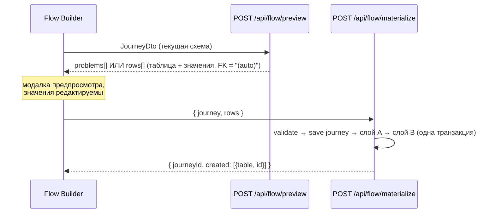

# REST API

Полный справочник HTTP-интерфейса crm-admin. Все контроллеры лежат в `src/main/java/ru/banki/crm/web/` — по одному на подсистему:

| Контроллер | Префикс | Подсистема |
|---|---|---|
| `AuthController` | `/api/me` | Профиль текущего пользователя |
| `EnvController` | `/api/env` | Среда инстанса |
| `TemplateController` | `/api/templates` | Шаблоны коммуникаций ([[Шаблоны и мастер коммуникаций]]) |
| `DictionaryController` | `/api/dictionaries` | Справочники для форм |
| `JourneyController` | `/api/journeys` | Цепочки-схемы, **только ADMIN** ([[Цепочки (Journeys)]]) |
| `FlowController` | `/api/flow` | Материализация цепочек, **только ADMIN** ([[Материализация (Flow)]]) |
| `AdminUserController` | `/api/admin` | Пользователи и разделы ([[Пользователи и доступ]]) |
| `PanelSettingsController` | `/api/panel-settings` | Настройки панели key → jsonb (настроечная админка `/settings`) |

Плюс два «сервисных» урла Spring Security (не контроллеры): `POST /api/login` и `POST /logout` — см. ниже.

## Общие сведения

- **Формат** — JSON (`Content-Type: application/json`) везде, кроме `POST /api/login` (form-urlencoded).
- **Аутентификация** — сессионная кука + remember-me кука; никаких токенов в заголовках. Фронтовый слой `src/main/resources/static/api.js` шлёт все запросы с `credentials: "same-origin"`.
- **CSRF отключён** (внутренний инструмент за аутентификацией) — см. комментарий в `SecurityConfig.filterChain` (`src/main/java/ru/banki/crm/security/SecurityConfig.java`).
- **Swagger** — подключён `springdoc-openapi-starter-webmvc-ui` (см. `pom.xml`): интерактивный UI на **`/swagger-ui.html`**, машинное описание на `/v3/api-docs`. Оба урла НЕ входят в публичный список, то есть требуют залогиненной сессии.
- Подробно о ролях и разделах — [[Безопасность и RBAC]]; об устройстве серверного слоя — [[Обзор бэкенда]].

### Модель прав: два независимых измерения

Каждый эндпоинт защищён комбинацией из двух проверок (обе описаны в [[Безопасность и RBAC]]):

1. **Роль** (`READER` / `EDITOR` / `ADMIN`) — «что можно делать». Мутации помечены `@PreAuthorize("hasAnyRole('EDITOR','ADMIN')")`; нарушение → `403`.
2. **Раздел** (section ACL) — «что видно». Проверяется вызовом `AccessGuard.requireAnySection(...)` (`src/main/java/ru/banki/crm/security/AccessGuard.java`): если у пользователя нет ни одного из перечисленных разделов → `403 «Нет доступа к разделу»`. **ADMIN обходит проверку разделов полностью.**

Канонический список разделов — `ru.banki.crm.service.Sections`: `home`, `deviations`, `onelink`, `admin` (Мастер коммуникаций), `templates` (Список шаблонов), `dashboard`, `journeys` (Цепочки), `access` (Управление доступом). Клиентские разделы оболочки (Конструктор source, Тепловая карта, Мониторинг, Загруженные инструменты) серверных секций не имеют — они не фильтруются ACL (`data-no-acl`), а «Просмотр настроек» (`viewer`) следует правам раздела `admin`.

Дополнительно на уровне `SecurityFilterChain`: `/api/admin/**` и `/settings/**` (настроечная админка) требуют роли `ADMIN`, всё остальное — просто аутентификации. `JourneyController` и `FlowController` целиком закрыты `@PreAuthorize("hasRole('ADMIN')")` на уровне класса.

### Формат ошибок

Используется стандартный error-ответ Spring Boot; в `application.yml` включены `server.error.include-message: always` и `include-binding-errors: always`, поэтому `message` (и `errors` при ошибках валидации `@Valid`) всегда присутствуют:

```json
{
  "timestamp": "2026-07-16T10:00:00.000+03:00",
  "status": 404,
  "error": "Not Found",
  "message": "Шаблон не найден: sms/999",
  "path": "/api/templates/sms/999"
}
```

Клиент (`api.js`, функция `req()`) показывает пользователю именно поле `message`. Общие коды:

| Код | Когда |
|---|---|
| `401` | Нет сессии. XHR к `/api/**` получает чистый 401 без редиректа (`HttpStatusEntryPoint` в `SecurityConfig`); браузерная навигация уводится на `/login.html`. Фронт по 401 сам делает `location.href = "login.html"`. |
| `403` | Роль не позволяет мутацию, или нет нужного раздела (`AccessGuard`). |
| `400` | Ошибка валидации `@Valid` или бизнес-проверки (тексты — по-русски, см. ниже по эндпоинтам). |
| `404` | Сущность не найдена. |
| `409` | Конфликт (дубль пользователя, удаление последнего админа). |

---

## Аутентификация (Spring Security, без контроллера)

Эти два урла обрабатывает не код приложения, а `formLogin`/`logout` из `SecurityConfig`. Публичные пути (`permitAll`): `/login.html`, `/api/login`, `/logout`, `/favicon.ico`, `/error`.

### POST /api/login

Единственный **не**-JSON эндпоинт: `application/x-www-form-urlencoded` (так его и зовёт `login.html` через `URLSearchParams`).

| Параметр | Значение |
|---|---|
| `email` | почта пользователя (кастомный `usernameParameter`) |
| `password` | пароль |

Ответы: `200` с пустым телом при успехе (кастомный `successHandler`); `401` при неверной паре. Успешный вход ставит:

- сессионную куку (имя из `server.servlet.session.cookie.name`, по умолчанию `JSESSIONID`; на каждой среде своё — см. [[Среды и деплой]]);
- remember-me куку (по умолчанию `crm-remember`, `alwaysRemember: true`, срок `app.remember-me.days` = 30 дней) — она автоматически восстанавливает вход после таймаута сессии и рестарта сервера. Настройки — в [[Конфигурация]].

### POST /logout

Ответ `200`, удаляет обе куки (`deleteCookies(rememberCookie, sessionCookie)`). Фронт после этого сам уходит на `login.html` (`CRM.logout` в `api.js`).

---

## Профиль и среда: /api/me, /api/env

### GET /api/me — кто я

`AuthController.me`. Права: любой аутентифицированный. Ответ — `MeDto` (`src/main/java/ru/banki/crm/dto/MeDto.java`):

```json
{
  "email": "ivan@banki.ru",
  "displayName": "Иван",
  "role": "EDITOR",
  "canEdit": true,
  "isAdmin": false,
  "sections": ["templates", "admin", "journeys"]
}
```

- `role` — `READER | EDITOR | ADMIN`; `canEdit` = EDITOR или ADMIN; `isAdmin` = ADMIN.
- `sections` — персональный ACL разделов. **Две особенности** (обе — комментарии прямо в `AuthController`): админу отдаётся весь `Sections.ALL`, а не содержимое его `user_sections` — чтобы новые разделы появлялись у админов без правки БД; **не-админу раздел `journeys` не отдаётся никогда**, даже если назначен в `user_sections` — «Цепочки» только админам.
- По этому ответу фронт строит NAV и прячет кнопки редактирования — см. [[Управление доступом и вход]] и [[Обзор фронтенда]].
- `401 «Не авторизован»`, если сессии нет.

### PUT /api/me/password — сменить свой пароль

`AuthController.changePassword` → `UserService.changeOwnPassword`. Права: любой аутентифицированный (меняет только себе).

```json
{ "currentPassword": "старый", "newPassword": "новый-минимум-8" }
```

Ответ: `200` без тела. Ошибки: `400 «Текущий пароль неверен»`; `400` валидации (`newPassword` — `@Size(min = 8)`, оба поля `@NotBlank`).

### GET /api/env — среда инстанса

`EnvController.env`. Права: любой аутентифицированный. Отдаёт имя среды и флаг dev-разделов (из `app.env.name` / `app.features.dev`, см. [[Конфигурация]] и [[Среды и деплой]]):

```json
{ "name": "test", "devFeatures": true }
```

Фронт красит бейдж среды и прячет разделы, помеченные `data-envs`, на средах, где они не разрешены.

---

## Шаблоны: /api/templates

`TemplateController` → `TemplateService`. Канал всегда в пути: `push | email | sms | cc` (регистр нормализуется, неизвестный канал → `400 «Неизвестный канал: …»`). `code` — бизнес-идентификатор строкой: у push/sms это `code`, у email — `id`, у cc — номер сегмента. Подробно о доменной логике — [[Шаблоны и мастер коммуникаций]], о таблицах — [[Справочники шаблонов]].

Права: **все** эндпоинты требуют раздела `templates` ИЛИ `admin` (мастер и список — одна подсистема); мутации дополнительно требуют роли EDITOR/ADMIN.

### GET /api/templates — единый список

Зеркало v2-запроса FetchAllTemplates (UNION четырёх канальных таблиц). Query-фильтры, все опциональны:

| Параметр | Смысл |
|---|---|
| `channel` | точное совпадение: `push`/`email`/`sms`/`cc` |
| `product` | вхождение в массив `productType` |
| `touch` | точное совпадение `touchPoint` |
| `trigger` | точное совпадение `triggerType` |
| `active` | строка `active` → только активные; любая другая непустая (фронт шлёт `inactive`) → только неактивные |

Ответ — массив `TemplateListItemDto`:

```json
[{
  "channel": "sms",
  "code": "482",
  "communicationName": "Напоминание о заявке",
  "productType": ["credits"],
  "touchPoint": "form",
  "triggerType": "event",
  "partnerName": null,
  "active": true,
  "letterosId": null
}]
```

Сортировка: по каналу, затем по коду. Фильтрация выполняется в памяти после `findAll()` всех четырёх репозиториев (`TemplateService.list`).

### GET /api/templates/{channel}/{code}

Полная карточка — `TemplateDto` (`src/main/java/ru/banki/crm/dto/TemplateDto.java`). Это единый DTO на все каналы: заполнены только поля своего канала.

Группы полей (типы — как в JSON):

- **Общее ядро:** `channel`, `code` (string), `productType` (string[]), `sourceType`, `communicationType`, `source`, `triggerType`, `sendingDay` (string; в БД это число — день отправки), `partnerName`, `affSub3`, `active` (bool), `communicationName`, `touchPoint`, `businessCommunicationType`, `selectionWizardService` (string — служебный тег, НЕ boolean), флаги `nationalRating`/`marketplace`/`mobileApp`/`loyalty`/`dialog`/`news` (bool).
- **push/sms:** `msgText`, `title`, `brief`, `name`, `deepLink`, `webviewUrl`, `senderName`, `nightSend` (bool).
- **email:** `letterosId`, `subject`, `emailFrom`, `serviceFlag`, `infoFlag`, `preheader`, `utmCustom`.
- **cc:** `sourceSystem`, `segmentDescr`, `hostId` (number), `mlCheckProbability` (bool), `mlProbabilityRequired` (number), `cutpercent`, `nocutpercent` (number), `kvintCampaignId`.

Ошибки: `404 «Шаблон не найден: {channel}/{code}»`, `400 «Неизвестный канал»`.

### POST /api/templates/{channel} — создать

Роль EDITOR/ADMIN. Тело — `TemplateDto` (поле `channel` в теле игнорируется — перезаписывается из пути). Ответ:

```json
{ "code": "483" }
```

Генерация кода по каналам (см. `TemplateService.create`): push/sms — `max(code)+1`; email — сгенерированный `id`; **cc — код НЕ генерируется**, номер сегмента обязателен в `dto.code`, иначе `400 «Для КЦ обязателен номер сегмента»`. Каждая вставка журналируется в `t_admin_log` той же транзакцией — см. [[Аудит и журналирование]].

### POST /api/templates/{channel}/chain — цепочка шаблонов

Роль EDITOR/ADMIN. Создаёт N шаблонов из одной базы, различающихся только `sendingDay` — одной транзакцией (v2 крутила цикл INSERT-ов на клиенте). Тело — `ChainRequest`:

```json
{ "base": { /* TemplateDto без sendingDay */ }, "days": ["0", "3", "7"] }
```

Ответ: `{ "codes": ["484", "485", "486"] }`. Ошибка: `400 «Нужны base и непустой список days»`.

### PUT /api/templates/{channel}/{code} — обновить

Роль EDITOR/ADMIN. Тело — `TemplateDto`. Ответ `200` без тела. Перед изменением в `t_admin_log` пишется состояние строки **до** правки (`old_row`).

### DELETE /api/templates/{channel}/{code} — удалить

Роль EDITOR/ADMIN. Ответ `200` без тела; удаляемая строка тоже уходит в `t_admin_log`. `404`, если шаблона нет.

---

## Справочники: /api/dictionaries

`DictionaryController` → `DictionaryService`. Права: только аутентификация — ни роль, ни разделы не проверяются (данные нужны формам нескольких разделов).

| Метод и путь | Ответ |
|---|---|
| `GET /api/dictionaries/partners` | `["Альфа", "ВТБ", …]` — distinct `partner_name` по всем 4 канальным таблицам, отсортировано (v2 AllPartnerName) |
| `GET /api/dictionaries/cc-segments` | массив сущностей `CcSegment` целиком (v2 FetchCCSegments) |
| `GET /api/dictionaries/comm-names?channel=sms` | `["…"]` — distinct `communication_name` канала; без `channel` (или с неизвестным) — по всем каналам. Подсказки для editable-combobox в мастере |

`cc-segments` сериализует JPA-сущность как есть: `id`, `segment`, `sourceSystem`, `segmentDescr`, `hostId`, `mlCheckProbability`, `mlProbabilityRequired`, `cutpercent`, `nocutpercent`, `abGroup`, `placement`, `kvintCampaignId` + все поля `TemplateBase` (`sourceType`, `productType`, `communicationType`, `triggerType`, `sendingDay` (number), `partnerName`, `affSub3`, `activeFlag`, `communicationName`, `touchPoint`, `businessCommunicationType`, `selectionWizardService`, `nationalRating`, `marketplace`, `mobileApp`, `loyalty`, `dialog`, `news`).

**Важно:** справочники значений для селектов Flow Builder (`notify_channel` капсом: `SMS`/`EMAIL`/`PUSH`/`CC`/`FA`/`VK`/`WA`/`WEBPUSH`/`ROBOT`; 6 значений `definition_key`, включая прод-опечатку `smsChannelProccessV2`; 7 значений `business_key_prefix`; `database`: `crmdb` (default) | `greenplum`) — это **клиентские константы** в `src/main/resources/static/journeys.js`, а не эндпоинты API. См. [[Flow Builder (цепочки)]].

---

## Цепочки-схемы: /api/journeys

`JourneyController` → интерфейс `JourneyService` (реализация по умолчанию `DbJourneyService` — хранение в `app.journeys` jsonb; мок в памяти включается флагом `app.journeys.mock=true`, см. [[Конфигурация]]). Права: **контроллер целиком под `@PreAuthorize("hasRole('ADMIN')")` на уровне класса** — все эндпоинты только для ADMIN; каждый метод дополнительно проверяет раздел `journeys` (аннотации `hasAnyRole('EDITOR','ADMIN')` на мутациях сохранились, но класс-гард строже, так что EDITOR доступа не имеет).

### Модель данных (JourneyDtos.java)

`JourneyDto`:

```json
{
  "id": "a1b2c3d4",
  "name": "Реанимация заявок",
  "kind": "offline",
  "continuesJourneyId": null,
  "nodes": [ /* JourneyNode */ ],
  "edges": [ { "from": "n1", "to": "n2", "fromPort": "output_1" } ]
}
```

- `id` — 8 символов UUID, генерируется сервером при создании (`null` в POST).
- `kind` — `online | offline`; всё, что не `offline`, нормализуется в `online` при сохранении (`DbJourneyService.save`). У старых данных `null` = online.
- `continuesJourneyId` — информационная метка «продолжение какой online-цепочки»; хранится только у offline, у online принудительно `null`.
- `nodes`/`edges` — `@NotNull`; `name` — `@NotBlank`.

`JourneyNode` (все поля узла):

| Поле | Тип | Смысл |
|---|---|---|
| `id` | string, `@NotBlank` | клиентский id узла, стабилен внутри цепочки |
| `type` | string | `comm` (или `null` у старых данных) \| `startIncome` \| `startTime` \| `assignment` \| `decision` \| `pause` \| `loop` \| `createRecords` \| `updateRecords` \| `getRecords` \| `deleteRecords` \| `subflow` |
| `day` | int | день отправки (для comm; автоподставляется из `sending_day` шаблона, поле в UI readonly) |
| `channel` | string | `sms \| push \| email \| cc` (для comm) |
| `templateCode` | string | код существующего шаблона (для comm; поля `title` у comm-ноды в UI больше нет) |
| `title`, `note` | string | подпись и комментарий |
| `active` | bool | |
| `posX`, `posY` | double | позиция на канве (Drawflow) |
| `props` | map string→string | типоспецифичные поля: у `startIncome`/`startTime` — `event_name`, `system`, `notify_channel`, `send_delay`, `life_time`, `allow_ml`, `definition_key`, `business_key_prefix`…; у `startTime` дополнительно `crontab` (один текстовый crontab — без старых `time_start`/`period_unit`/`period_q`), `process_name` (одно поле, оно же `selection`), `database`, `sql_steps` (JSON-массив строк; легаси-ключ `sql` — одиночный шаг); у `subflow` — `journey` (id вложенной цепочки) |

`JourneyEdge`: `from`, `to` (`@NotBlank`), `fromPort` — какой выход узла (`output_1`/`output_2` у Decision/Loop).

**Замечание о движке:** узлы Pause/Decision/Assignment/Loop/Data-операций пока чисто визуальные — движок исполнения (runs/steps) не реализован, при материализации учитываются только старт + comm (+ развёрнутые subflow). Задержки в проде задаются `sending_day` шаблонов. См. [[Материализация (Flow)]].

### Эндпоинты

| Метод и путь | Роль | Ответ / ошибки |
|---|---|---|
| `GET /api/journeys` | ADMIN + раздел | `[{ "id": "a1b2c3d4", "name": "…", "nodeCount": 5, "kind": "online" }]`, сортировка по имени |
| `GET /api/journeys/{id}` | ADMIN + раздел | `JourneyDto`; `404 «Цепочка не найдена: {id}»`; `500 «Повреждён JSON цепочки …»`, если jsonb в БД не парсится |
| `POST /api/journeys` | ADMIN | тело `JourneyDto` без `id` → сохранённый `JourneyDto` с `id`; `400` валидации |
| `PUT /api/journeys/{id}` | ADMIN | полная замена схемы → сохранённый `JourneyDto`; `404` |
| `DELETE /api/journeys/{id}` | ADMIN | `200` без тела; `404` |

Сохранение фиксирует `updatedBy` (email из сессии) и `updatedAt`. Цепочка **без стартового узла** сохраняется без ошибок — это легальная вложенная цепочка (subflow, autolaunched-модель); ограничение «нет старта» проявится только при попытке материализовать её саму (см. ниже).

---

## Материализация: /api/flow

`FlowController` → `MaterializationService` (`src/main/java/ru/banki/crm/service/flow/MaterializationService.java`). Права: **контроллер целиком `@PreAuthorize("hasRole('ADMIN')")`** (как и `/api/journeys`) + раздел `journeys` в каждом методе. Что именно и куда вставляется — [[Материализация (Flow)]], [[Слой A (flow)]], [[Слой B (процессные таблицы)]].



### POST /api/flow/preview

Тело — `JourneyDto` (несохранённый черновик допустим). Ответ — `PreviewResult`:

```json
{
  "problems": [],
  "rows": [
    { "table": "scheduler.t_get_event",
      "values": { "selection": "resurrect_apps", "event_name": "resurrect_apps",
                  "system": "CRM", "send_delay": 2, "is_deferred": false,
                  "source": "f_application", "allow_ml": false,
                  "notify_channel": "SMS", "is_active": true, "life_time": 1000 } },
    { "table": "scheduler.t_launch_settings",
      "values": { "selection": "resurrect_apps", "time_start": "now()",
                  "crontab": "0 9 * * *", "database": "crmdb",
                  "description": "Реанимация заявок", "is_active": true, "status": "NEW",
                  "is_batch": true, "max_retry_attempts": 1, "job_group": "CRM" } },
    { "table": "scheduler.t_execution_steps",
      "values": { "t_launch_settings_id": "(auto)", "process_name": "resurrect_apps",
                  "order_num": 1, "is_active": true, "returns_result_set": true,
                  "sql_text": "SELECT …" } }
  ]
}
```

- Если `problems` непуст — `rows` пуст: сначала чинишь схему. HTTP-код при этом всё равно `200` (проблемы — данные, не ошибка).
- Спецзначение `"(auto)"` — FK, который сервер подставит сам после вставки родителя (`id_comm_creation` ← `tracker.d_comm_creation`, `t_launch_settings_id` ← `scheduler.t_launch_settings`, `get_event_id`/`event_id` ← `scheduler.t_get_event`; см. `resolveAuto`).
- SQL-шагов Time event столько, сколько элементов в `props.sql_steps` — на каждый своя строка `scheduler.t_execution_steps` с `order_num` 1..N (`sqlSteps`).
- `source` в `t_get_event` пользователь не вводит: `resolveSource()` берёт его из шаблона **первой** (по дню) comm-ноды; у канала cc колонки `source` нет — такие ноды пропускаются.
- Subflow-ноды рекурсивно разворачиваются в comm-ноды вложенных цепочек (`expandedComms`/`collectComms`); циклы и повторное включение той же цепочки пропускаются молча; невыбранный или не найденный subflow → problem.
- Маппинг шаблонов: одна comm-нода → строка `template.d_template_mapping`; несколько → по строке `template.d_template_mapping_mass` на каждую (в порядке дней).

Проверки `validate()` (тексты возвращаются как `problems`, дословно из кода):

- нет стартового узла → «Нет стартового узла… Цепочка без старта — вложенная (Subflow): сохранить её можно, а материализуется она в составе родительской цепочки»;
- стартовых узлов больше одного;
- online-цепочка должна начинаться с Income event, offline — с Time event;
- у старта не заполнен `event_name`;
- у Time event ни одного SQL-шага;
- нет ни одного Communication Alert;
- у comm-ноды не выбран канал / не указан код шаблона / **шаблон не найден в канальной прод-таблице** (`templateExists`) → «…сначала заведи его в „Мастере коммуникаций"». Это серверная половина гейта: клиентская (missingTemplates, блокировка сохранения) — в [[Flow Builder (цепочки)]].

Отдельного эндпоинта `/api/flow/validate` нет — `validate()` вызывается внутри preview и materialize.

### POST /api/flow/materialize

Роль ADMIN. Тело — `MaterializeRequest`:

```json
{ "journey": { /* JourneyDto */ }, "rows": [ /* PlannedRow из предпросмотра, возможно отредактированные */ ] }
```

Порядок работы (`FlowController.materialize` + `MaterializationService.materialize`, слои A и B — одной транзакцией):

1. Цепочка сохраняется (create при пустом `id`, иначе update) — материализации нужен стабильный `journey_id`.
2. Повторный `validate()` — при проблемах `400` с их перечнем через `«; »`.
3. Whitelist таблиц: каждая `rows[i].table` обязана входить в 8 разрешённых таблиц слоя B (`tracker.d_comm_creation`, `tracker.t_event_comm`, `scheduler.t_get_event`, `scheduler.t_launch_settings`, `scheduler.t_execution_steps`, `template.d_template_mapping`, `template.d_template_mapping_mass`, `commapi.d_definition_mapping`), иначе `400 «Недопустимая таблица: …»`. Имена колонок проверяются регуляркой `[a-z_][a-z0-9_]*` → `400 «Недопустимая колонка: …»` (значения идут только bind-параметрами).
4. **Идемпотентность:** прежние строки слоя B этой цепочки удаляются по журналу `flow.t_materialization`, затем создаются заново.
5. Слой A: upsert `flow.d_event` (в т.ч. `source` из шаблона первой comm-ноды) + пересоздание обвязки `d_event_delivery` / `d_event_schedule` / `d_event_step` (по строке на SQL-шаг) / `d_event_definition` / `d_event_template`; попутно синхронизируется единый справочник `template.d_template` (канальные поля — в `channel_props` jsonb).
6. Каждая вставка слоя B журналируется в `arch.t_admin_log` и `flow.t_materialization` — см. [[Аудит и журналирование]].

Ответ — `MaterializeResponse`:

```json
{
  "journeyId": "a1b2c3d4",
  "created": [
    { "table": "scheduler.t_get_event", "id": 1041 },
    { "table": "scheduler.t_launch_settings", "id": 355 },
    { "table": "scheduler.t_execution_steps", "id": 5210 }
  ]
}
```

---

## Настройки панели: /api/panel-settings

`PanelSettingsController` — хранилище настроек панели «ключ → произвольный jsonb» в таблице `app.panel_settings` (миграция `V7__panel_settings.sql`, см. [[Таблицы приложения]]). Первый потребитель — настроечная админка `/settings`: конфиг «приложение App Launcher → разделы» под ключом **`appSections`**; оболочка SPA читает его при загрузке (`syncAppSections()` в `api.js`) и зеркалит в `localStorage crmpanel:appSections`.

Ключ валидируется регуляркой `[a-zA-Z][a-zA-Z0-9_-]{0,63}` (по ширине колонки) — иначе `400 «Некорректный ключ настройки …»`.

### GET /api/panel-settings/{key}

Права: любой аутентифицированный (конфиг нужен оболочке каждого пользователя). Ответ — `SettingDto`:

```json
{ "key": "appSections", "value": { "Маркетинг": ["home", "comms", "dash"] } }
```

`404 «Настройка не найдена: {key}»`, если ключа нет (сид V7 сразу кладёт `appSections = {}` — пустой объект означает «все разделы всем приложениям»).

### PUT /api/panel-settings/{key}

Права: **только ADMIN** (`@PreAuthorize("hasRole('ADMIN')")`). Тело — произвольный JSON (это и есть `value`); upsert `INSERT … ON CONFLICT (key) DO UPDATE` с обновлением `timestamp_upd`. Ответ — сохранённый `SettingDto`. `400 «Пустое тело запроса»` при отсутствии тела. Каждая запись **журналируется**: строка `app.panel_settings` после изменения снимается `to_jsonb(t)` и уходит в `arch.t_admin_log` через `AdminLogService.logTable("app.panel_settings", "UPDATE", …)` — см. [[Аудит и журналирование]].

---

## Администрирование пользователей: /api/admin

`AdminUserController` → `UserService`. Права: **весь префикс `/api/admin/**` закрыт `hasRole("ADMIN")` на уровне `SecurityFilterChain`** — не-админ получит `403` до входа в контроллер.

### GET /api/admin/sections

Каталог разделов для отрисовки чекбоксов в UI:

```json
["home", "deviations", "onelink", "admin", "templates", "dashboard", "journeys", "access"]
```

### GET /api/admin/users

Массив `UserView`:

```json
[{ "id": 3, "email": "ivan@banki.ru", "displayName": "Иван",
   "role": "EDITOR", "enabled": true, "sections": ["templates", "admin"] }]
```

### POST /api/admin/users — создать

```json
{ "email": "new@banki.ru", "displayName": "Новый", "role": "READER",
  "password": "минимум-8-символов", "sections": ["home", "templates"] }
```

Ответ — созданный `UserView`. Правила (`UserService.create`): email приводится к нижнему регистру; если задан `app.email-domain` — только адреса этого домена (`400 «Разрешены только адреса @…»`); дубль → `409 «Пользователь уже существует: …»`; неизвестная роль → `400 «Некорректная роль: …»`; неизвестный раздел → `400 «Неизвестный раздел: …»`; валидация: `email` — `@Email @NotBlank`, `password` — `@NotBlank @Size(min=8)`, `role` — `@NotBlank`.

### PUT /api/admin/users/{id} — обновить

Частичное обновление: `null`-поля не трогаются.

```json
{ "displayName": "Иван И.", "role": "EDITOR", "enabled": false, "sections": ["templates"] }
```

Ответ — обновлённый `UserView`. `404 «Пользователь не найден»`; те же `400` на роль/разделы. Email и пароль этим эндпоинтом не меняются.

### DELETE /api/admin/users/{id}

`200` без тела. Защита: `409 «Нельзя удалить последнего администратора»`; `404`, если нет.

### PUT /api/admin/users/{id}/password — сброс пароля админом

```json
{ "newPassword": "минимум-8-символов" }
```

Ответ: `{ "status": "ok" }`. Текущий пароль не требуется (в отличие от `PUT /api/me/password`).

---

## Сводная карта прав

| Эндпоинт | Аутентификация | Раздел (`AccessGuard`) | Роль |
|---|---|---|---|
| `POST /api/login`, `POST /logout` | публичные | — | — |
| `GET /api/me`, `PUT /api/me/password`, `GET /api/env` | да | — | любая |
| `GET /api/dictionaries/*` | да | — | любая |
| `GET /api/templates*` | да | `templates` или `admin` | любая |
| `POST/PUT/DELETE /api/templates*` | да | `templates` или `admin` | EDITOR/ADMIN |
| `GET/POST/PUT/DELETE /api/journeys*` | да | `journeys` | **только ADMIN** (класс-гард) |
| `POST /api/flow/preview`, `POST /api/flow/materialize` | да | `journeys` | **только ADMIN** (класс-гард) |
| `GET /api/panel-settings/{key}` | да | — | любая |
| `PUT /api/panel-settings/{key}` | да | — | только ADMIN |
| `/api/admin/**` | да | — (ADMIN обходит) | только ADMIN (фильтр) |
| `/settings/**` (статика настроечной админки) | да | — | только ADMIN (фильтр) |
| `/swagger-ui.html`, `/v3/api-docs` | да | — | любая |

Напоминание: ADMIN обходит проверку разделов везде (`AccessGuard.requireAnySection`), поэтому колонку «Раздел» для него можно читать как «всегда доступно».
