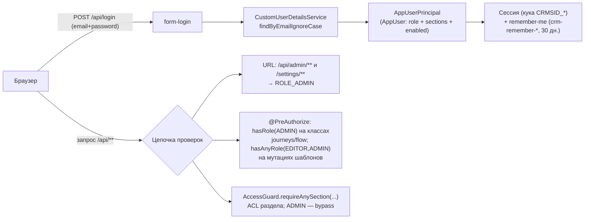

# Безопасность и RBAC

Проверено по `security/SecurityConfig.java`, `security/CustomUserDetailsService.java`, `security/AppUserPrincipal.java`, `security/CurrentUser.java`, `security/AccessGuard.java`, `service/Sections.java`, `service/UserService.java`, `config/AdminBootstrap.java`, `config/WebConfig.java`, `domain/AppUser.java`, `domain/Role.java`, `web/AuthController.java`, `web/AdminUserController.java`, `web/JourneyController.java`, `web/FlowController.java`, `web/PanelSettingsController.java` и миграциям `V2__auth.sql`, `V7__panel_settings.sql`. Пользовательские сценарии — в [[Пользователи и доступ]] и [[Управление доступом и вход]].

## Модель в двух словах

Доступ определяется **двумя ортогональными осями**:

- **Роль** (`Role`: `READER` / `EDITOR` / `ADMIN`) — *что пользователь может делать* (уровень возможностей);
- **Разделы** (`user_sections`) — *что пользователь видит* (персональный ACL по разделам UI).

ADMIN обходит ACL разделов полностью. Логин — корпоративная почта, пароль пользователь задаёт сам (BCrypt).

## SecurityConfig (`security/SecurityConfig`)

Единая `SecurityFilterChain` + `@EnableMethodSecurity` (включает `@PreAuthorize`).

**Публичные URL** (константа `PUBLIC`): `/login.html`, `/api/login`, `/logout`, `/favicon.ico`, `/error`. Далее: `/api/admin/**` → `hasRole("ADMIN")`, **`/settings/**` → `hasRole("ADMIN")`** (настроечная админка — статическая страница `static/settings/index.html`; «красивый» адрес `/settings` форвардит на неё `config/WebConfig`), всё остальное → `authenticated()`.

**Form-login:**
- страница — `/login.html` (статическая, своя форма);
- обработчик — `POST /api/login`, **параметр логина называется `email`** (`usernameParameter("email")`), пароль — `password`; `login.html` шлёт именно `email` через `fetch` с `application/x-www-form-urlencoded`;
- успех → пустой `200 OK` (JS сам делает redirect), неудача → `401`.

**Remember-me** («пользователь не вылетает из ЛК»):
- `alwaysRemember(true)` — токен ставится всегда, без чекбокса;
- срок — `app.remember-me.days` (по умолчанию **30 дней**, env `REMEMBER_ME_DAYS`);
- ключ подписи — `app.remember-me.key` (env `REMEMBER_ME_KEY`); в compose к нему добавляется суффикс среды (`-prod`/`-preprod`/`-test`), поэтому токен одной среды недействителен в другой; ключ обязан быть стабильным между рестартами — иначе куки массово протухнут;
- имя куки — per-env: `crm-remember-prod` / `crm-remember-preprod` / `crm-remember-test` (`app.remember-me.cookie-name`, env `REMEMBER_COOKIE`).

**Сессия:** таймаут `SESSION_TIMEOUT` (по умолчанию `7d`), имя сессионной куки per-env — `CRMSID_PROD` / `CRMSID_PREPROD` / `CRMSID_TEST` (env `SESSION_COOKIE`; без переопределения — `JSESSIONID`). Отдельные имена кук нужны потому, что три среды живут на одном хосте и куки скоупятся без учёта порта (см. [[Среды и деплой]]). После истечения сессии remember-me переавторизует прозрачно.

**Logout:** `POST /logout` удаляет обе куки (remember + session) и возвращает `200`.

**Обработка неавторизованных:** для путей `/api/**` — чистый `401` (`HttpStatusEntryPoint`), чтобы XHR-код в `api.js` сам сделал redirect; обычные навигации браузера уводятся на страницу логина.

**CSRF отключён** — `csrf.disable()` с явным комментарием в коде: внутренний инструмент за аутентификацией; перед внешней публикацией включить `CookieCsrfTokenRepository` + передачу токена заголовком в `api.js`. Это **известный follow-up**, он же зафиксирован в README («Что вне скоупа»).

**Пароли:** `BCryptPasswordEncoder` (bean `passwordEncoder`).

## Аутентификация: цепочка классов

- **`CustomUserDetailsService`** — единственный метод `loadUserByUsername(email)`: ищет `AppUser` через `AppUserRepository.findByEmailIgnoreCase` (регистр почты не важен) и оборачивает в principal; иначе `UsernameNotFoundException`.
- **`AppUserPrincipal`** — `UserDetails` поверх нашей сущности `AppUser`. Даёт: `user()` (сущность целиком), `email()`, `sections()`; authorities — ровно одна, `ROLE_<роль>` (`ROLE_READER`/`ROLE_EDITOR`/`ROLE_ADMIN`); `getPassword()` → `password_hash`; `isEnabled()` → флаг `enabled` (выключенный пользователь не войдёт); expired/locked-проверки всегда `true`.
- **`CurrentUser`** — статические хелперы поверх `SecurityContextHolder`: `principal(): Optional<AppUserPrincipal>` и `email(): String` с фолбэком **`"system"`** (используется аудитом, когда действие идёт вне HTTP-контекста, например `AdminBootstrap`).

Сущность **`AppUser`** (`app.users`, см. [[Таблицы приложения]]): `id bigint`, `email` (unique, not null), `passwordHash`, `displayName`, `role` (enum строкой, default `READER`), `enabled` (default true), `createdAt`, и `sections: Set<String>` — `@ElementCollection` в таблицу `app.user_sections (user_id, section_id)` с EAGER-загрузкой (ACL нужен на каждом запросе).

## Роли (`domain/Role`)

| Роль | Возможности (по javadoc `Role` + фактическим проверкам в контроллерах) |
|---|---|
| **READER** | только чтение в назначенных ему разделах: списки/просмотр шаблонов, справочники, чтение настроек панели |
| **EDITOR** | READER + мутации предметных данных: создание/правка/удаление шаблонов (`POST/PUT/DELETE /api/templates/**`, batch-цепочка) |
| **ADMIN** | EDITOR + управление доступом (`/api/admin/**`), **цепочки и материализация целиком** (`/api/journeys/**`, `/api/flow/**`), настроечная админка (`/settings/**`, `PUT /api/panel-settings/**`); плюс полный обход ACL разделов |

Где какая проверка стоит (проверено по `@PreAuthorize`/`requireAnySection`):

- `TemplateController`: чтение — только секция (`TEMPLATES` или `ADMIN`-раздел «Мастер»); мутации — `@PreAuthorize("hasAnyRole('EDITOR','ADMIN')")` + секция;
- `JourneyController` и `FlowController`: **на уровне класса `@PreAuthorize("hasRole('ADMIN')")`** — «Цепочки» и материализация теперь целиком admin-only (раньше хватало EDITOR + секции; метод-аннотации `hasAnyRole('EDITOR','ADMIN')` на мутациях остались, но класс-гард строже). Дополнительно каждый метод проверяет секцию `JOURNEYS`;
- `PanelSettingsController` (`/api/panel-settings/{key}`): `GET` — любой аутентифицированный (конфиг приложений нужен оболочке при загрузке), `PUT` — `@PreAuthorize("hasRole('ADMIN')")`; каждая запись журналируется в `arch.t_admin_log`;
- `AdminUserController`: без аннотаций — весь префикс `/api/admin/**` закрыт на уровне URL в `SecurityConfig`.

## Разделы и ACL (`service/Sections`, `security/AccessGuard`)

**`Sections`** — канонический список id разделов, обязан совпадать с id пунктов NAV фронта: `home`, `deviations`, `onelink`, `admin` (Мастер коммуникаций), `templates` (Список шаблонов), `dashboard`, `journeys` (Цепочки), `access` (Управление доступом). `Sections.ALL` — порядок для UI-чекбоксов (отдаётся `GET /api/admin/sections`), `Sections.isValid(id)` — валидация при сохранении пользователя.

**`AccessGuard.requireAnySection(String... sectionIds)`** — единственная проверка ACL:
1. нет principal → `401 «Не авторизован»`;
2. роль `ADMIN` → пропуск без проверки (bypass);
3. хотя бы один из перечисленных разделов есть у пользователя → пропуск;
4. иначе → `403 «Нет доступа к разделу»`.

Вызывается явно первой строкой методов контроллеров (а не аннотацией) — принцип «роль задаёт возможности, разделы задают видимость» (javadoc `AccessGuard`).

Фронт получает ту же информацию через `GET /api/me` (`AuthController` → `MeDto`): `email`, `displayName`, `role`, `canEdit` (EDITOR|ADMIN), `isAdmin`, `sections`. Два нюанса `AuthController.me()`: **ADMIN-у в `sections` отдаётся полный `Sections.ALL`**, а не содержимое его `user_sections` — чтобы новые разделы появлялись у админов автоматически; а **не-админу раздел `journeys` не отдаётся вовсе**, даже если он назначен в `user_sections` (фильтр в коде — «Цепочки» только админам). NAV скрывает недоступные пункты (`applyNavAcl` в `api.js` + ACL-контракт оболочки: `data-group`, `data-nav-ref`, `data-no-acl`, `data-acl-section`, `data-admin-only` — см. [[Оболочка панели (shell)]]), но это только UX — сервер проверяет всё сам. Дополнительные, независимые от ACL слои видимости: гейтинг по среде (`envs:["test"]` у «Цепочек», см. [[Среды и деплой]]) и конфиг «приложение → разделы» App Launcher-а (`app.panel_settings`, ключ `appSections`).

## Управление пользователями (`service/UserService`)

CRUD для `/api/admin/**`:

- `create` — email нормализуется (`trim().toLowerCase()`), проверяется доменное ограничение `app.email-domain` (env `APP_EMAIL_DOMAIN` пусто = любой домен; иначе `400 «Разрешены только адреса @<домен>»`), дубликат → `409`; пароль хэшируется BCrypt; разделы валидируются `Sections.isValid` (неизвестный → `400`);
- `update` — частичное обновление: displayName / role / enabled / sections (каждое поле — только если не null);
- `delete` — защита от самоуничтожения доступа: **последнего ADMIN удалить нельзя** (`409 «Нельзя удалить последнего администратора»`);
- `resetPassword` (админом) и `changeOwnPassword` (свой, через `PUT /api/me/password`, с проверкой текущего пароля — иначе `400`).

## Первый супер-админ (`config/AdminBootstrap`)

`CommandLineRunner`, выполняется на каждом старте, **идемпотентен**:

- читает `app.admin.email` / `app.admin.password` (env `ADMIN_EMAIL` / `ADMIN_PASSWORD`); если пусто — предупреждение в лог и пропуск;
- если пользователь с такой почтой уже есть — ничего не делает (пароль существующего НЕ перезаписывается);
- иначе создаёт пользователя: роль `ADMIN`, displayName «Администратор», `enabled=true`, **все разделы** (`Sections.ALL`).

## Аудит как часть модели безопасности

Каждое изменение данных привязывается к личности (`CurrentUser.email()`): прикладной журнал `arch.t_admin_log` (`AdminLogService` — операции с шаблонами и все инсерты материализации) и прод-триггерный аудит `arch.arch_log`, для которого `AuditContext.mark()` выставляет GUC `app.current_user` в транзакции мутации. Подробно — [[Аудит и журналирование]].

## Известные ограничения / follow-ups

1. **CSRF отключён** — включить `CookieCsrfTokenRepository` + токен-заголовок в `api.js` до любой публикации наружу (комментарий в `SecurityConfig`, пункт README).
2. **Нет SSO/LDAP** — аутентификация локальная (README: «архитектура готова к подключению» — точка расширения `CustomUserDetailsService`).
3. **Дефолтный `REMEMBER_ME_KEY`** (`crm-admin-remember-me-key-change-me`) обязателен к замене в проде — иначе remember-me токены подделываемы.
4. Дефолтный пароль супер-админа в `.env.example`/compose (`admin12345`) — сменить при развёртывании.
