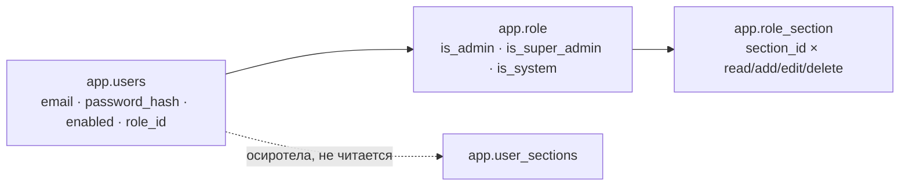

# Безопасность и RBAC

Единственная каноническая заметка про доступ: вход, роли, матрица прав, разделы, супер-админ, серверные проверки. Все остальные заметки ссылаются сюда, а не пересказывают.

Проверено по `security/SecurityConfig.java`, `security/CustomUserDetailsService.java`, `security/AppUserPrincipal.java`, `security/CurrentUser.java`, `security/AccessGuard.java`, `domain/Role.java`, `domain/SectionAccess.java`, `domain/Capability.java`, `domain/AppUser.java`, `service/Sections.java`, `service/RoleService.java`, `service/UserService.java`, `config/AdminBootstrap.java`, всем контроллерам `web/` и миграциям `V2`, `V20`–`V23`, `V29`.

## Главное изменение: роли — это данные

До V21 роль была перечислением (`READER` / `EDITOR` / `ADMIN` / `SUPER_ADMIN`), а видимые разделы — персональным списком в `app.user_sections`.

Сейчас:

- **`app.role`** — справочник ролей: `name`, `is_admin`, `is_super_admin`, `is_system`, `sort_order`;
- **`app.role_section`** — матрица роли: строка на пару «роль × раздел» с флагами `can_read` / `can_add` / `can_edit` / `can_delete`;
- **`app.users.role_id`** — у пользователя только ссылка на роль, персональной матрицы нет.

Права **живые**: они принадлежат роли, все её носители делят один набор — правка роли немедленно меняет доступ всем. Таблица `app.user_sections` осиротела (V21 её намеренно не удалил, оставив резерв под будущие персональные исключения) — **enforcement на неё не смотрит**, `AppUser` её больше не мапит.

## Вход и сессия (`src/main/java/ru/banki/crm/security/SecurityConfig.java:45`)

Одна `SecurityFilterChain` + `@EnableMethodSecurity`.

| Что | Как |
|---|---|
| Публичные URL | `/login.html`, `/api/login`, `/logout`, `/favicon.ico`, `/error` |
| URL-правила | `/api/admin/**` → `hasRole("ADMIN")`, `/settings/**` → `hasRole("ADMIN")`, остальное → `authenticated()` |
| Form-login | страница `/login.html`, обработчик `POST /api/login`, параметр логина — **`email`** (не `username`), пароль — `password`; успех → пустой `200`, неудача → `401` |
| Remember-me | `alwaysRemember(true)` (без чекбокса), срок `REMEMBER_ME_DAYS` (30 дней), ключ `REMEMBER_ME_KEY`, имя куки `REMEMBER_COOKIE` |
| Сессия | таймаут `SESSION_TIMEOUT` (`7d`), имя куки `SESSION_COOKIE` (без переопределения — `JSESSIONID`) |
| Logout | `POST /logout` удаляет обе куки, возвращает `200` |
| Неавторизованный | `/api/**` → чистый `401` (XHR сам редиректит), обычная навигация → `/login.html` |
| Пароли | `BCryptPasswordEncoder` |
| CSRF | **отключён** (`csrf.disable()`) — внутренний инструмент за аутентификацией; см. «Ограничения» |

Имена кук и ключ подписи remember-me — свои на каждом контуре, поэтому сессии и токены сред не пересекаются; почему так и какие именно значения — [[Среды и деплой]].

Цепочка классов: `CustomUserDetailsService.loadUserByUsername(email)` → `AppUserRepository.findByEmailIgnoreCase` → `AppUserPrincipal`. Principal отдаёт `user()`, `email()`, `sections()`, `hasCapability(section, cap)`; `isEnabled()` берётся из флага `enabled` (выключенная учётка не входит). `CurrentUser` — статические хелперы поверх `SecurityContextHolder`, `CurrentUser.email()` с фолбэком `"system"` для действий вне HTTP-контекста.

**Authorities выводятся из флагов роли, а не из её имени** (`AppUserPrincipal.getAuthorities`):

- `is_super_admin` → `ROLE_SUPER_ADMIN` + `ROLE_ADMIN`;
- `is_admin` → `ROLE_ADMIN`;
- прочие → `ROLE_USER`.

Отсюда следствие: аннотаций вида `hasAnyRole('EDITOR','ADMIN')` больше некому удовлетворить кроме админа — роли `EDITOR` в authorities не существует. Такие аннотации, оставшиеся в `JourneyController`, ничего не ослабляют (класс и так под `hasRole('ADMIN')`), но и ничего не дают.

## Встроенные роли

Засеяны миграциями V21 (+ роль «Админ» в V22), у всех `is_system = true` — переименовать и удалить нельзя.

| Роль | `is_admin` | Порядок | Доступ |
|---|---|---|---|
| **Супер админ** | супер | 10 | всё; роль скрыта из UI, привязана к `ADMIN_EMAIL` |
| **Админ** | да | 15 | все разделы полностью; роль-«прикрытие» для супер-админа |
| **Проджект-менеджер** | да | 20 | все разделы полностью |
| **Тимлид аналитики** | нет | 30 | просмотр всех разделов; add/edit (без delete) в `admin`, `templates`, `promo` |
| **Аналитик** | нет | 40 | то же, что тимлид |
| **Маркетолог** | нет | 50 | **только 5 разделов и только просмотр** (V23) |
| **СЕО** | нет | 60 | просмотр всех не-админских разделов |

**Маркетолог (V23 от 30.07.2026)** — сужен: прежний набор секций роли удаляется целиком и заменяется на `promo`, `srcbuilder`, `templates`, `admin`, `reports` с `can_read = true` и без add/edit/delete. Раздел `admin` здесь означает «Просмотр настроек» — та же секция, что и мастер, правка всё равно закрыта. Секция `reports` из этого набора в V29 развёрнута в пять отчётов.

Админ-роли обходят матрицу на сервере; строки в `role_section` им проставляются полностью только ради корректного показа в UI (`RoleService.buildAccess`).

## Разделы (`src/main/java/ru/banki/crm/service/Sections.java:40`)

`Sections.ALL` — 37 канонических id; список обязан совпадать с id пунктов NAV (`js/shell.js`, массив `NAV` — см. [[Оболочка панели (shell)]]) и панелей `/settings` (`PANES`, поле `acl`). Порядок в `ALL` — это порядок строк в матрице прав, поэтому он совпадает с порядком меню.

| id | Раздел UI | Группа | Writable |
|---|---|---|---|
| `home` | Главная | | |
| `onelink` | OneLink Builder | Управление коммуникациями | |
| `admin` | Мастер коммуникаций | Управление коммуникациями | ✔ |
| `viewer` | Просмотр настроек | Управление коммуникациями | |
| `templates` | Список шаблонов | Управление коммуникациями | ✔ |
| `srcbuilder` | Конструктор source | Управление коммуникациями | |
| `promo` | Планирование промо | Управление коммуникациями | ✔ |
| `abtests` | А/Б тесты | Управление коммуникациями | ✔ |
| `heatmap` | Тепловая карта | Управление коммуникациями | |
| `ev-online` | Онлайн-событие | События | ✔ |
| `ev-offline` | Событие по расписанию | События | ✔ |
| `ev-list` | Список событий | События | |
| `entities` | Сущности (все сразу) | | |
| `rep-planfact` | Plan-Fact | Отчёты | |
| `rep-matrix` | CRM Matrix | Отчёты | |
| `rep-leadgen` | CRM Leadgen | Отчёты | |
| `rep-smscheck` | ЧЕК СМС траффик | Отчёты | |
| `rep-demo` | Пример визуализации отчёта | Отчёты | |
| `dashboard` | Общая статистика | Дашборд | |
| `deviations` | Панель отклонений | Дашборд | |
| `mon-campaigns` | Базовая работа кампаний | Мониторинг | |
| `uploads` | Загруженные инструменты | | |
| `journeys` | Цепочки | | ✔ |
| `set-dbconn` | Подключения к БД | Настройки | ✔ |
| `set-procs` | Процессы переливов | Настройки | ✔ |
| `set-sync` | Синхронизация шаблонов | Настройки | ✔ |
| `set-events` | Импорт событий из crmdb | Настройки | ✔ |
| `ev-export` | Перелив событий в прод | Настройки | ✔ |
| `set-scheme` | Scheme Builder | Настройки | ✔ |
| `set-objects` | Сущности (настройка) | Настройки | ✔ |
| `set-dbtree` | Схемы и таблицы | Настройки | |
| `set-apps` | Приложения и разделы | Настройки | ✔ |
| `set-uploads` | Загруженные инструменты (настройка) | Настройки | ✔ |
| `set-mon` | Мониторинг интеграций | Настройки | |
| `set-diag` | Диагностика хранилища | Настройки | |
| `set-general` | Общие параметры | Настройки | |
| `access` | Управление доступом | Настройки | ✔ |

### Секции сущностей — динамические (`ent:<сущность>`)

Отдельная сущность CRM — такая же страница панели, как остальные, и выдаётся там же, в матрице. Но список сущностей задаёт **схема** (`app.schema_model`, Scheme Builder), а не константа в коде: захардкодить их означало бы, что новая сущность в панели появляется, а выдать её нельзя.

Поэтому секций `ent:client`, `ent:lead` в `Sections.ALL` нет. Их собирает `AdminUserController.entitySections()` из текущей схемы и добавляет к ответу `GET /api/admin/sections` отдельным блоком с группой «Сущности» и полем `label` (подписи взять на клиенте неоткуда — в матрице стоял бы сырой `ent:client`). Сущность с готовым серверным экраном (`source`, сейчас «Шаблоны и сегменты») пропускается: у неё своя секция `templates`.

`Sections.isEntity(id)` отличает такую секцию от канонической; `RoleService.buildAccess` проходит по присланной матрице второй раз именно ради них — иначе галка рисовалась бы, а сохранение молча её выбрасывало. Права на запись у них не заводятся: данные сущностей пока живут в localStorage браузера, и обещать их защиту нечестно.

Зонтичная секция `entities` открывает **все** сущности сразу — снимать её у ролей, которым она уже выдана, миграцией нельзя, люди потеряли бы раздел. Сузить доступ = снять зонтик и отметить нужные строки в группе «Сущности» (`entAllowed`, `js/entities.js`).

До этого доступ к сущностям раздавал клиентский реестр `crmpanel:entityAccess` — объект в localStorage браузера, правившийся из консоли: до сервера он не доходил, у каждого браузера был свой, и молча сужал то, что выдано матрицей. Реестр снят.

### Секция — на пункт меню, а не на группу (V29 от 03.08.2026)

Отчёты раньше делили одну секцию `reports`, а мониторинг — секцию `monitoring`. Выдать доступ к **одному** отчёту было нельзя: галка открывала сразу все пять. Теперь секция заведена на каждый лист меню, а зонтичных `reports` / `monitoring` больше нет — группа сайдбара не является секцией и скрывается сама, когда скрыты все её дети (`applyNavAcl`).

Права **перенесены, а не розданы заново**: у кого был доступ к «Отчётам», тот получил все пять отчётов с теми же галками, дальше админ сужает вручную. Роль без `monitoring` (Маркетолог) `mon-campaigns` не получила.

Фильтровать надо не только меню: `GET /api/reports/connections` отдаёт конфиги подключений, и без фильтра по правам спрятанный в меню отчёт открывался бы прямой ссылкой. Поэтому ответ собирается только из тех отчётов, где у роли есть READ (`AccessGuard.can` — проверка ответом, а не исключением).

Тогда же с «Планирования промо» снят флаг `noAcl`: раздел висел в меню мимо матрицы с тех времён, когда таблица лежала в localStorage. Чтобы снятие никого не выбросило, миграция выдала `promo` read всем ролям, у которых его не было.

- **`Sections.WRITABLE`** — разделы, где у не-админа осмысленны add/edit/delete: есть записи и серверные ручки записи (колонка Writable в таблице выше). У остальных значима только видимость: в матрице роли показывается один чекбокс «Просмотр», а `RoleService.buildAccess` гасит лишние флаги при сохранении.
- **`Sections.ADMIN_ONLY`** — набор **пуст**. Раньше в нём были `journeys` и `access`: их закрывал `hasRole("ADMIN")`, и галка в матрице ничего бы не значила. Теперь оба гейтятся секцией, как всё остальное. Осторожно с `access`: выдав его роли, вы разрешаете ей менять права, в том числе свои; признак администратора при этом ставит только супер-админ, так что повысить себя до админа через матрицу нельзя.
- **`Sections.SETTINGS`** — секции страницы `/settings`. По ним `SecurityConfig.anySettings()` решает, пускать ли на страницу вообще; поверх этого каждый контроллер проверяет свою конкретную секцию. Сюда же входит `ev-export`: панель перелива живёт в настройках, и без него держатель одной этой секции на страницу не попал бы.
- `Sections.isValid(id)` — валидация (каноническая секция **или** `ent:*`); `GET /api/admin/sections` отдаёт `{id, writable, adminOnly, group}`, а для сущностей ещё и `label`. `group` — подпись группы сайдбара: строк стало больше тридцати, и матрица рисует их с заголовками групп и переключателем «выдать всю группу».
- `SecurityConfig.schemaRead(...)` — `GET /api/schema` открыт не только настроечным секциям и `entities`, но и **любому держателю `ent:*`**: из модели схемы строится весь раздел «Сущности», и без этой ветки роль с одной выданной сущностью получала бы 403 на модели, а раздел молча исчезал бы из меню.

## Проверки на сервере

`security/AccessGuard` — единственная точка проверки матрицы:

- `requireCapability(cap, sectionIds...)` (`src/main/java/ru/banki/crm/security/AccessGuard.java:38`): нет principal → `401`; роль с `isAdminLevel()` (админ или супер-админ) → пропуск без проверки; есть право `cap` хотя бы в одном из перечисленных разделов → пропуск; иначе `403 «Нет доступа к разделу»`;
- `requireAnySection(sectionIds...)` — то же самое с `Capability.READ`;
- `can(cap, sectionId)` (`src/main/java/ru/banki/crm/security/AccessGuard.java:32`) — тот же вопрос, но ответом, а не исключением: нужен там, где по правам не запрещают запрос целиком, а фильтруют его результат (список подключений отчётов).

Несколько разделов в одном вызове — потому что одни данные бывают за двумя разделами: шаблоны видны и из `admin` (мастер), и из `templates` (список), права достаточно иметь в любом. Гард вызывается явной первой строкой метода, а не аннотацией.

Соответствие «HTTP-глагол → capability»: `GET` → READ, `POST` → ADD, `PUT`/`PATCH` → EDIT, `DELETE` → DELETE.

| Что защищаем | Как |
|---|---|
| `TemplateController` | чтение — READ в `templates`/`admin`; `POST` — ADD; `PUT` — EDIT; `DELETE` — DELETE (в любом из двух разделов) |
| `PromoPlanController` | READ / ADD / EDIT / DELETE в `promo` |
| `AbTestController` | READ / ADD / EDIT / DELETE в `abtests` |
| `DictionaryController` | чтение открыто любому аутентифицированному (справочники нужны формам нескольких разделов); `POST /partners` — ADD в `admin`, `templates` **или** `promo` |
| `SmsCheckReportController` | READ в `rep-smscheck`; смена источника-DWH — дополнительная проверка админа уже в сервисе (`src/main/java/ru/banki/crm/service/SmsCheckReportService.java:165`), потому что READ на секцию у автора правки и так есть |
| `JourneyController`, `FlowController` | `@PreAuthorize("hasRole('ADMIN')")` на классе + `requireAnySection(JOURNEYS)` в каждом методе |
| `SchemaController` | `@PreAuthorize("hasRole('ADMIN')")` на классе (`src/main/java/ru/banki/crm/web/SchemaController.java:29`): ручки лежат вне `/api/admin/**`, и закрыть их аннотацией дешевле, чем править правила URL и задевать чужие маршруты |
| `AdminUserController`, `RoleController`, `ProdSyncController`, `EtlController`, `DbConnectionController` | без аннотаций — весь префикс `/api/admin/**` закрыт правилом URL |
| `PanelSettingsController` | `GET` — любой аутентифицированный (оболочке нужен конфиг приложений), `PUT` — `hasRole('ADMIN')`; ключи с секретами внутри значения обслуживать отказывается |
| `ReportConnectionController` | `GET` — любой аутентифицированный, но токен Tableau уходит только админу (прочим — `hasToken`); `PUT`/`DELETE` — `hasRole('ADMIN')` |
| `/settings/**` | статическая настроечная админка — `hasRole('ADMIN')` |

Пути и права по каждому эндпоинту — [[REST API]].

## Что получает фронт: `GET /api/me`

`AuthController.me()` → `MeDto(email, displayName, role, canEdit, isAdmin, sections, isSuperAdmin, caps)`:

- `sections` — что видно в NAV. Админу отдаётся весь `Sections.ALL` (новые разделы появляются у админов автоматически), не-админу — разделы его роли **минус `journeys`** (цепочки только админам, даже если раздел есть в матрице).
- `caps` — карта «раздел → `{read, add, edit, delete}`»; по ней фронт прячет кнопки. Админу — всё `true` по всем разделам.
- `canEdit` — грубый флаг «может писать хоть где-то», управляет `data-readonly` на `<body>`.
- `role` — имя роли; у супер-админа подменяется на `«Админ»`.

Фильтрация NAV — `applyNavAcl` в `api.js`: пункт скрывается, если его id (или `data-acl-section`) отсутствует в `me.sections`; `data-admin-only` удаляет пункт у не-админа; `data-no-acl` выводит пункт из-под ACL; группа скрывается, когда скрыты все её ACL-дети. Это только UX — сервер проверяет всё сам. Механизм `data-envs` (гейтинг пункта по среде) в коде остался, но сейчас ни один пункт `NAV` его не использует.

Два нюанса, видных по коду:

1. пункт «Главная» фильтруется по ACL наравне с остальными (`renderNav` не ставит ему `data-no-acl`), поэтому роль без секции `home` главную не увидит;
2. «Планирование промо» помечено `noAcl:true` — в NAV не фильтруется, но серверный `PromoPlanController` требует прав на секцию `promo`.

## Супер-админ

Супер-роль — обычная запись справочника с `is_super_admin = true`, но наружу она не видна:

- `RoleService.list()` **исключает** её из списка ролей — никому, включая самого супер-админа;
- `UserService.toView()` показывает носителя супер-роли под именем роли-прикрытия: сначала ищется роль с именем «Админ», иначе первая обычная админ-роль по `sort_order`; `roleId` при этом не отдаётся;
- `AuthController.me()` возвращает такому пользователю `role = "Админ"`; полномочия работают по отдельному флагу `isSuperAdmin`;
- `RoleService.toView()` добавляет супер-админов к счётчику носителей роли-прикрытия, чтобы цифра сходилась со списком пользователей.

**`config/AdminBootstrap`** (`CommandLineRunner`, идемпотентен, на каждом старте):

1. пустые `ADMIN_EMAIL`/`ADMIN_PASSWORD` → предупреждение и выход; отсутствует супер-роль → ошибка в лог (не накатана V21) и выход;
2. любой чужой носитель супер-роли **понижается** до обычной админ-роли;
3. учётка `ADMIN_EMAIL` либо повышается до супер-роли, либо создаётся заново (displayName «Администратор», `enabled = true`, пароль BCrypt). Пароль существующей учётки не перезаписывается.

## Управление пользователями и ролями

Раздел «Управление доступом» переехал в настроечную админку `/settings` (панель `pane-access`) — интерфейс описан в [[Управление доступом и вход]].

**`service/UserService`** (`/api/admin/users`):

- `create` — email `trim().toLowerCase()`; домен проверяется всегда: `APP_EMAIL_DOMAIN`, а при пустом значении — **`banki.ru`** (пустая переменная проверку НЕ отключает), иначе `400 «Разрешены только адреса @…»`; дубль → `409`; роль обязательна (`roleId`), пароль BCrypt;
- `update` — частичный (только non-null поля: displayName, roleId, enabled);
- `delete` — последнего носителя админ-уровня удалить нельзя (`409`);
- `resetPassword` (админом) и `changeOwnPassword` (`PUT /api/me/password`, с проверкой текущего пароля).

Правила вокруг админ-ролей (одинаковый текст отказа `«Недостаточно прав для этой операции»`, чтобы по сообщению нельзя было выяснить расширенные права чужой учётки):

- назначить супер-роль через панель нельзя никому;
- назначить админ-роль может только супер-админ;
- учётку супер-админа через панель не меняют вовсе; учётку с админ-ролью — только супер-админ;
- флаг `manageable` в `UserView` сообщает фронту, что строка недоступна для правки, не раскрывая причину.

**`service/RoleService`** (`/api/admin/roles`): создавать и править обычные роли может любой админ, роли с админ-флагом (и смену самого флага в любую сторону) — только супер-админ; супер-роль неприкосновенна; встроенную (`is_system`) роль нельзя переименовать и удалить; роль, назначенную пользователям, удалить нельзя (`409` с числом носителей).

## Аудит как часть модели

Каждое изменение привязано к личности `CurrentUser.email()`: прикладной журнал `arch.t_admin_log` (`AdminLogService`) и прод-триггерный `arch.arch_log`, для которого `AuditContext` выставляет GUC `app.current_user` в той же транзакции. Подробно — [[Аудит и журналирование]].

## Известные ограничения / follow-ups

1. **CSRF отключён** — включить `CookieCsrfTokenRepository` + токен-заголовок в `api.js` до любой публикации наружу (комментарий в `SecurityConfig`, пункт README).
2. **Нет SSO/LDAP** — аутентификация локальная; точка расширения — `CustomUserDetailsService`.
3. **Дефолтный `REMEMBER_ME_KEY`** (`crm-admin-remember-me-key-change-me`) обязателен к замене в проде, иначе токены подделываемы.
4. Дефолтный пароль супер-админа в `.env.example` / compose (`admin12345`) — сменить при развёртывании.
5. Персональных исключений из прав роли нет: единственный способ дать одному человеку другой набор — завести отдельную роль (таблица `app.user_sections` под это зарезервирована, но не используется).

## Связанные заметки

[[Обзор архитектуры]] · [[Среды и деплой]] · [[Управление доступом и вход]] · [[Оболочка панели (shell)]] · [[Таблицы приложения]] · [[Конфигурация]] · [[REST API]] · [[Аудит и журналирование]]
