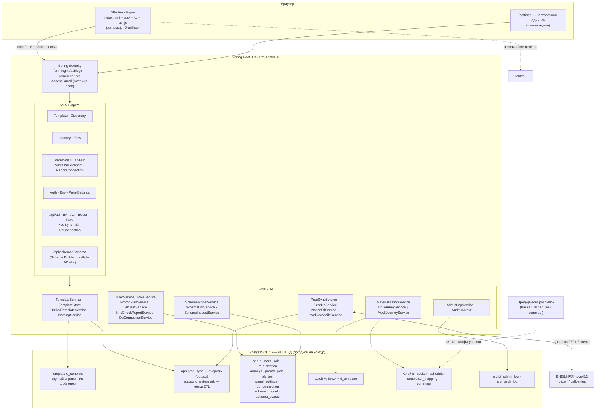
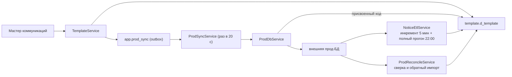

# Обзор архитектуры

**crm-admin** — самописная админ-панель управления CRM-коммуникациями, заменившая low-code-админку на Appsmith (описание в `pom.xml`: «Self-hosted CRM communications admin (replaces Appsmith)»). Один Spring Boot-артефакт `crm-admin.jar` содержит и REST-бэкенд, и статический SPA; работает поверх PostgreSQL и разворачивается в Docker тремя контурами.

Заметка отвечает только на вопрос «как части связаны». Детали — по ссылкам: [[Технологии]], [[Среды и деплой]], [[Безопасность и RBAC]], [[Обзор бэкенда]], [[Обзор фронтенда]], [[Схема БД]], [[Флоу системы]].

## Карта компонентов

## Как связаны части

### Фронтенд

SPA без фреймворков и сборки: `src/main/resources/static/` раздаётся самим Spring Boot. Разметка — в `index.html`, код — в `js/*.js` и `api.js`, стили — в `css/*.css`. С бэкендом общается только через `/api/**` (JSON, cookie-сессия); `api.js` перехватывает `401` и уводит на `login.html`. Состав файлов и разделов — [[Обзор фронтенда]] и [[Оболочка панели (shell)]].

Оболочка при загрузке делает три запроса: `GET /api/me` (личность, разделы, матрица прав), `GET /api/env` (имя контура для бейджа), `GET /api/panel-settings/appSections` (конфиг «приложение App Launcher → разделы»). Первый определяет, что вообще видно в NAV, — см. [[Безопасность и RBAC]].

### Бэкенд

Пакет `ru.banki.crm`: `web/` — контроллеры, `service/` — бизнес-логика, `service/prod/` — всё, что общается с внешней прод-БД, `service/flow/` — материализация, `domain/` + `repo/` — JPA, `security/` — аутентификация и проверки прав, `config/` — бутстрап и MVC. Разбор по классам — [[Обзор бэкенда]].

### Хранилище

Одна PostgreSQL на контур. Ключевой факт: **локальных копий канальных прод-таблиц у нас больше нет** — миграция V12 удалила схемы `notice` и `callcenter` из нашей БД. Эти имена остались только как адреса во **внешней** прод-БД (`UnifiedTemplateService.channelTable`). Полная картина схем — [[Схема БД]].

- `template.d_template` — **единственное наше хранилище шаблонов**: ядро типизированными колонками, канальные поля в `channel_props jsonb` ([[Справочники шаблонов]]);
- `app.*` — собственные таблицы панели: пользователи и роли, цепочки-схемы, план промо, настройки панели, реестр подключений, очередь синка ([[Таблицы приложения]]);
- `flow.*` + `template.d_template` — **слой A**, нормализованная модель процесса ([[Слой A (flow)]]);
- `tracker`, `scheduler`, `template.*_mapping*`, `commapi` — **слой B**, копии прод-таблиц процесса ([[Слой B (процессные таблицы)]]);
- `dictionary.*` — справочники значений форм;
- `arch` — журналы ([[Аудит и журналирование]]).

## Три сквозных потока данных

### 1. Шаблон: панель ↔ прод (двусторонний)

Запись в прод идёт **только через очередь** — операция мастера и постановка в outbox выполняются одной транзакцией, доставка асинхронна; прод может присвоить свой код, и он переписывается у нас. Обратное направление (прод — источник истины для уже существующих шаблонов) закрывает ETL по водяным знакам `app.sync_watermark`. Подробно — [[Синхронизация с прод-БД]] и [[Шаблоны и мастер коммуникаций]].

### 2. Цепочка: схема → конфигурация прод-движков

Пользователь рисует цепочку во Flow Builder → схема сохраняется одним jsonb-документом в `app.journeys` → `POST /api/flow/preview` показывает планируемые строки → `POST /api/flow/materialize` одной транзакцией пишет слой A (upsert `flow.d_event`) и слой B (в FK-порядке). Прод-движки читают слой B и продолжают работать без изменений. Детали и свойства (идемпотентность по `flow.t_materialization`, разворачивание Subflow, `resolveSource`) — [[Материализация (Flow)]] и [[Цепочки (Journeys)]].

**Граница реализации:** собственного движка исполнения цепочек (runs/steps) в панели нет. Ноды Pause / Decision / Assignment / Loop / Data — визуальные; материализуются стартовый узел и Communication Alert'ы. Задержки между шагами задаются полем `sending_day` шаблонов.

### 3. Клиентские разделы и отчёты

Часть разделов не имеет серверной записи и живёт на фронте: OneLink Builder, Конструктор source, Панель отклонений, Тепловая карта, Загруженные инструменты. В RBAC они заведены только ради видимости в NAV (`Sections.WRITABLE` их не включает).

Серверную часть имеют:

- **[[Планирование промо]]** — общая таблица `app.promo_plan` с оптимистической блокировкой по `timestamp_upd` (раньше план лежал в localStorage у каждого свой);
- **[[Отчёты]]** — встраивание Tableau (конфиг общий на панель, токен отдаётся только админу) и выгрузка «ЧЕК СМС траффик» в Excel, которую панель собирает переписыванием XML внутри готового `.xlsx`-шаблона.

## Ключевые дизайн-решения

### Почему Java / Spring Boot, а не low-code

1. **Один артефакт.** Jar со встроенной статикой: нет рантайма Appsmith и отдельного деплоя фронта, аутентификация и статика в одном контуре Spring Security.
2. **Полный контроль над SQL.** Материализация и синк — точные инсерты в прод-структуры; в Appsmith это был хрупкий DO-скрипт, здесь — типизированный сервис с транзакцией, журналом и идемпотентностью.
3. **Своя модель доступа и аудита** — роли-данные, матрица прав, журнал «кто что менял» ([[Безопасность и RBAC]], [[Аудит и журналирование]]).
4. **Стек команды** — Java 21, Flyway, `mvn package` → Docker.

### Почему очередь, а не прямая запись в прод

Прод-БД внешняя и может быть недоступна (канал через бастион, таймауты, права). Outbox `app.prod_sync` делает операцию мастера атомарной у нас, а доставку — отдельной и повторяемой: PENDING → OK / ERROR, до 10 попыток, ручной retry из «Диагностики». Пустая конфигурация приёмника просто выключает синк.

### Почему два слоя, A и B

- Слой B — legacy-структуры под существующие движки: денормализованные, с дублирующимися полями. Строить на них UI неудобно и опасно.
- Слой A — нормализованная модель, которую панель может развивать, не трогая контракт движков.
- Журнал `flow.t_materialization` фиксирует соответствие «наша сущность → прод-строка»: это одновременно идемпотентность, трассировка и будущий путь миграции движков на слой A.

### Прочее

- **Цепочки хранятся jsonb-документом** (`app.journeys.definition`: `{nodes, edges}`) — схема эволюционирует без миграций; реляционная «истина» появляется только при материализации.
- **Scheme Builder правит базу только в своих границах.** Редактор модели схемы из `/settings` умеет выполнять DDL (`POST /api/schema/ddl/apply`, [[REST API]]), и право на изменение объекта даёт не его наличие в `information_schema`, а запись в реестре `app.schema_owned` (`V31`): по каталогу Postgres видно, что таблица существует, но не видно, кем заведена, — а «доводить до модели» чужую таблицу нельзя. Схемы Flyway и копии прод-структур вдобавок перечислены в `app.schema_reserved` и не трогаются ни при каких условиях.
- **Mock/DB-переключатель хранилища цепочек** (`JOURNEYS_MOCK`) — материализация требует FK `flow.d_event.journey_id → app.journeys.id`, поэтому в БД цепочки нужны там, где ей пользуются.
- **Настройки, общие для панели, живут в БД** (`app.panel_settings`), а личные — тема и язык — в браузере у каждой учётки. То, что раньше задавал один админ на всех, стало персональным.
- **Аудит на двух уровнях**: прикладной `arch.t_admin_log` и триггерный `arch.arch_log` с GUC `app.current_user`.
