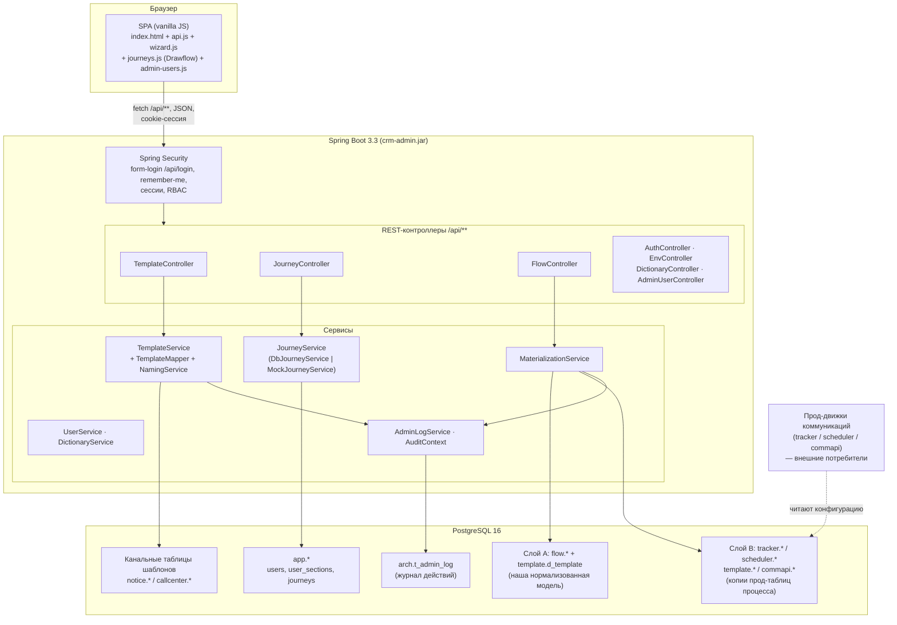

# Обзор архитектуры

**crm-admin** — самописная админ-панель управления CRM-коммуникациями, замена Appsmith (см. описание в `pom.xml`: «Self-hosted CRM communications admin (replaces Appsmith)»). Это один Spring Boot-артефакт (`crm-admin.jar`), внутри которого лежит и REST-бэкенд, и статический SPA-фронтенд. Приложение работает поверх PostgreSQL и разворачивается в Docker в трёх средах (см. [[Среды и деплой]]).

Связанные заметки: [[Технологии]], [[Безопасность и RBAC]], [[Обзор бэкенда]], [[Обзор фронтенда]], [[Схема БД]], [[Флоу системы]].

## Компоненты системы

### Фронтенд (SPA)

Одностраничник без фреймворков и сборки: `src/main/resources/static/` раздаётся самим Spring Boot как статика. Ключевые файлы:

- `index.html` — вся разметка и CSS разделов (NAV, мастер коммуникаций, дашборд, доступ, цепочки);
- `api.js` — обёртка `fetch` над REST, объект `CRM`, применение ACL к NAV (`applyNavAcl`), обработка 401 → редирект на `login.html`;
- `wizard.js` — мастер коммуникаций (формы шаблонов 4 каналов), см. [[Мастер коммуникаций (формы)]];
- `journeys.js` — Flow Builder на вендореной библиотеке Drawflow, см. [[Flow Builder (цепочки)]];
- `admin-users.js` — раздел «Управление доступом», см. [[Управление доступом и вход]];
- `drawflow.min.js` / `drawflow.min.css` — Drawflow, положен локально (без CDN), см. [[Технологии]].

Фронт общается с бэкендом только через `/api/**` (JSON, cookie-сессия). Разделы NAV фильтруются двумя механизмами: персональный ACL (`/api/me` → `sections`) и гейтинг по среде (`/api/env` → `envs:["test"]` у пункта «Цепочки»), подробнее в [[Среды и деплой]] и [[Безопасность и RBAC]].

### Бэкенд (REST → сервисы)

Пакет `src/main/java/ru/banki/crm` (подробно — [[Обзор бэкенда]]):

| Контроллер | Путь | Назначение |
|---|---|---|
| `web/AuthController` | `/api/me`, `/api/me/password` | личность, права, смена своего пароля |
| `web/EnvController` | `/api/env` | имя среды + флаг dev-фич (бейдж и NAV) |
| `web/TemplateController` | `/api/templates/**` | CRUD шаблонов 4 каналов + batch-цепочка |
| `web/DictionaryController` | `/api/dictionaries/**` | справочники (партнёры, сегменты КЦ, имена коммуникаций) |
| `web/JourneyController` | `/api/journeys/**` | CRUD цепочек-схем (JSON-документ) |
| `web/FlowController` | `/api/flow/preview`, `/api/flow/materialize` | предпросмотр и материализация цепочки |
| `web/AdminUserController` | `/api/admin/**` | пользователи/роли/разделы (только ADMIN) |

Сервисный слой: `TemplateService` (CRUD поверх прод-идентичных таблиц + аудит), `JourneyService` — интерфейс с двумя реализациями (`DbJourneyService` — хранение в `app.journeys` jsonb, активна по умолчанию; `MockJourneyService` — in-memory, включается `app.journeys.mock=true`), `MaterializationService` (см. [[Материализация (Flow)]]), `UserService` (см. [[Пользователи и доступ]]), `AdminLogService` + `AuditContext` (см. [[Аудит и журналирование]]).

### База данных

Одна PostgreSQL на среду, несколько схем (полная картина — [[Схема БД]]):

- `notice`, `callcenter` — **прод-идентичные** канальные таблицы шаблонов (push/email/sms/КЦ), их DDL 1:1 с боевым (V1-миграция); физические имена конфигурируются через `app.tables.*` (см. [[Конфигурация]] и [[Справочники шаблонов]]);
- `app` — собственные таблицы приложения: `users`, `user_sections`, `journeys` (см. [[Таблицы приложения]]);
- `flow` + `template.d_template` — **слой A**, наша нормализованная модель процесса (V6, см. [[Слой A (flow)]]);
- `tracker`, `scheduler`, `template`, `commapi` — **слой B**, копии продовых таблиц процесса коммуникаций (V5, см. [[Слой B (процессные таблицы)]]);
- `arch` — журнал действий `arch.t_admin_log` + прод-триггерный `arch.arch_log`.

## Двухслойная модель (A/B) и материализация

Центральное дизайн-решение конструктора цепочек:

- **Слой A (`flow.*`, `template.d_template`)** — «истина» для UI: единый справочник событий `flow.d_event` (вместо разъехавшихся `tracker.t_event_comm` и `scheduler.t_get_event`), обвязка события (`d_event_delivery`, `d_event_schedule`, `d_event_step`, `d_event_template`, `d_event_definition`) и единый справочник шаблонов `template.d_template` (общие колонки типизированы, канальные — в `channel_props jsonb`). Конвенция имён: `d_*` — конфиг, `t_*` — runtime.
- **Слой B (`tracker/scheduler/template/commapi`)** — копии таблиц, которые **уже сегодня** читают боевые движки. Наша админка пишет туда то же самое, что раньше писал DO-скрипт старой Appsmith-админки — поэтому прод-движки продолжают работать без единого изменения. Отличие от прода одно: `id` везде `GENERATED BY DEFAULT AS IDENTITY` вместо `max(id)+1`.

Поток (детали в [[Материализация (Flow)]] и [[Цепочки (Journeys)]]): пользователь рисует цепочку во Flow Builder → схема сохраняется одним jsonb-документом в `app.journeys` → `POST /api/flow/preview` возвращает планируемые инсерты слоя B (редактируемые в модалке) → `POST /api/flow/materialize` одной транзакцией пишет слой A (upsert `flow.d_event` по `(event_name, system)`) и слой B (в правильном FK-порядке, с автоподстановкой `(auto)`-ссылок).

Свойства материализации, проверенные по `service/flow/MaterializationService`:

- **идемпотентность** — каждая созданная строка слоя B фиксируется в журнале `flow.t_materialization`; при повторной материализации той же цепочки прежние строки удаляются по журналу и создаются заново;
- **журналирование** — каждая вставка пишется и в `arch.t_admin_log` (JSON строки, кто и когда);
- **синк единого справочника** — для каждого шаблона цепочки строка канальной прод-таблицы сворачивается upsert-ом в `template.d_template` (ядро — колонками, остальное — в `channel_props`);
- **разворачивание Subflow** — вложенные цепочки рекурсивно раскрываются в comm-ноды родителя (`expandedComms`/`collectComms`); циклы и повторные включения пропускаются молча, пустой или не найденный subflow даёт problem;
- **source из шаблона** — `source` события не вводится руками: `resolveSource()` берёт его из шаблона первой comm-ноды (сортировка по дню; у канала `cc` колонки `source` нет — пропускается).

**Важно про границы реализации:** собственный движок исполнения цепочек (runs/steps) в админке **не реализован**. Ноды Pause/Decision/Assignment/Loop/Data во Flow Builder — пока чисто визуальные; материализуются только стартовый узел и Communication Alert'ы (включая развёрнутые Subflow). Задержки между шагами цепочки в проде задаются полем `sending_day` шаблонов, а исполняют конфигурацию внешние прод-движки, читающие слой B.

## Ключевые дизайн-решения

### Почему Java / Spring Boot, а не low-code

Предшественник — админка на Appsmith. Её заменили самописным приложением, потому что:

1. **Один артефакт без внешних зависимостей.** Jar со встроенной статикой, никакого рантайма Appsmith, CDN и внешних сервисов — критично в корпоративной сети с TLS-инспекцией (по той же причине Drawflow вендорен, см. [[Технологии]]).
2. **Полный контроль над SQL.** Материализация цепочек — это точные инсерты в прод-структуры; в Appsmith это был хрупкий DO-скрипт, здесь — типизированный сервис с транзакцией, журналом и идемпотентностью.
3. **Своя модель доступа.** Роли + персональные ACL разделов + аудит «кто что менял» (см. [[Безопасность и RBAC]], [[Аудит и журналирование]]) — в стеке Spring Security это штатно.
4. **Стек команды** — Java 21, миграции Flyway, обычный CI-путь `mvn package` → Docker.

### Почему свои копии прод-таблиц (а не работа напрямую с продом)

- Профиль `docker` поднимает **прод-идентичную схему с нуля** (Flyway V1–V6 + сиды) — можно разрабатывать и гонять e2e-сценарии на test-среде, не касаясь боевой БД.
- В прод-профиле (`SPRING_PROFILES_ACTIVE=prod`) Flyway выключен — приложение подключается к настоящей корпоративной PostgreSQL, где таблицы уже существуют; код одинаковый, меняется только `DB_URL`.
- DDL копий восстановлен 1:1 (где точного DDL не было — по DO-скрипту старой админки, это помечено в V5), поэтому «то, что заработало на test, работает на проде».

### Почему два слоя, а не сразу писать в прод-таблицы

- Слой B — legacy-структуры под существующие движки: денормализованные, с дублирующимися полями (`event_name`/`system` в четырёх таблицах). Строить на них UI неудобно и опасно.
- Слой A — нормализованная модель, которую админка может развивать (история запусков `flow.t_event_step_run`, единый справочник шаблонов), не трогая контракт движков.
- Журнал `flow.t_materialization` фиксирует соответствие «наша сущность → прод-строка» — это и идемпотентность, и трассировка, и будущий механизм миграции движков на слой A.

### Прочее

- **Цепочки хранятся jsonb-документом** (`app.journeys.definition`: `{nodes, edges}`) — схема свободно эволюционирует без миграций; реляционная «истина» появляется только в момент материализации в слой A.
- **Mock/DB-переключатель хранилища цепочек** (`JOURNEYS_MOCK`): на prod/preprod цепочки пока в памяти (раздел там всё равно скрыт), на test — в БД, потому что материализация требует FK `flow.d_event.journey_id → app.journeys.id`.
- **Аудит на двух уровнях**: прикладной (`arch.t_admin_log` — JSON строки при INSERT/UPDATE/DELETE) и триггерный прод-механизм (`arch.arch_log`), для которого `AuditContext` выставляет GUC `app.current_user` в той же транзакции.
