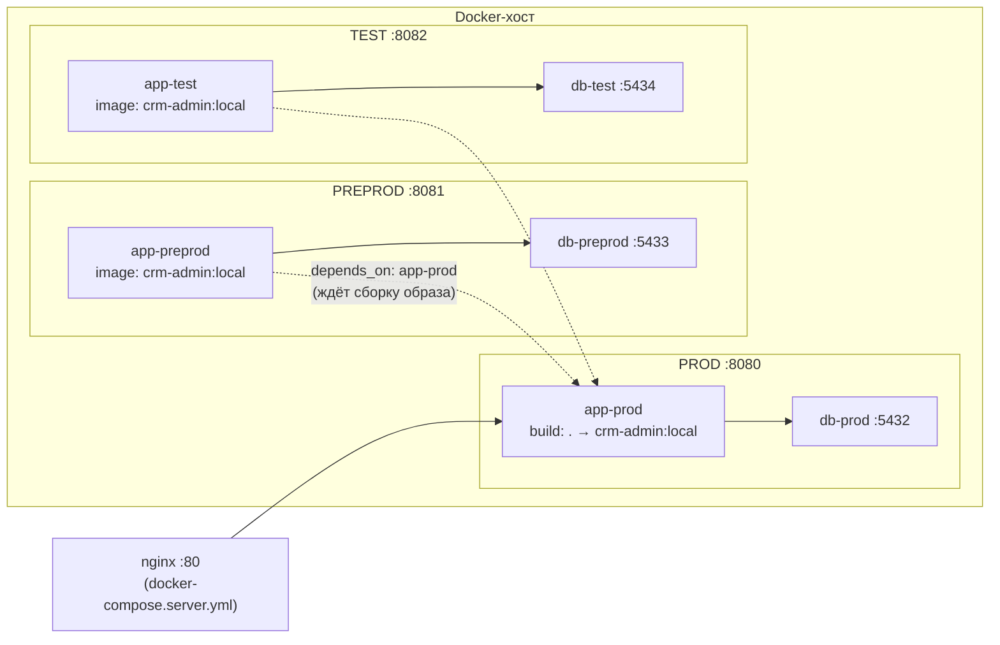

# Среды и деплой

Проверено по `docker-compose.yml`, `docker-compose.server.yml`, `Dockerfile`, `.env.example`, `nginx/crm-admin.conf`, `application.yml`, `web/EnvController.java`, `scripts/` и `DEPLOY.md`. Контекст — [[Обзор архитектуры]], параметры приложения — [[Конфигурация]], быстрые команды — [[Шпаргалка]].

## Три контура на одном хосте

`docker-compose.yml` описывает **три независимых стека** (приложение + своя PostgreSQL) в одном compose-проекте:

| Контур | Приложение | Порт UI | БД | Порт БД | Том |
|---|---|---|---|---|---|
| **prod** | `crm-admin-app-prod` | `${APP_PORT:-8080}` | `crm-admin-db-prod` | `${DB_PORT:-5432}` | `crm_db_data` |
| **preprod** | `crm-admin-app-preprod` | `${APP_PORT_PREPROD:-8081}` | `crm-admin-db-preprod` | `${DB_PORT_PREPROD:-5433}` | `crm_db_preprod` |
| **test** | `crm-admin-app-test` | `${APP_PORT_TEST:-8082}` | `crm-admin-db-test` | `${DB_PORT_TEST:-5434}` | `crm_db_test` |

Все три БД — `postgres:16` с одинаковыми `DB_NAME/DB_USER/DB_PASSWORD` и healthcheck-ом `pg_isready` (5 с, 10 попыток); приложение стартует только после `service_healthy` своей БД. Контуры полностью изолированы: свои данные, свои пользователи, свои шаблоны.



## Один образ — три инстанса

Образ `crm-admin:local` собирает **только** сервис `app-prod` (у него единственного есть `build: .`); `app-preprod` и `app-test` берут готовый образ и потому имеют `depends_on: app-prod (service_started)`. Код и образ у контуров идентичны — различаются только переменные окружения.

## Чем контуры отличаются

| Переменная | prod | preprod | test | Что делает |
|---|---|---|---|---|
| `APP_ENV` | `prod` | `preprod` | `test` | имя контура; отдаётся фронту через `GET /api/env` (бейдж в шапке) |
| `FEATURES_DEV` | `false` | `false` | `true` | флаг dev-фич (`app.features.dev`), в том же `/api/env` |
| `SESSION_COOKIE` | `CRMSID_PROD` | `CRMSID_PREPROD` | `CRMSID_TEST` | имя сессионной куки |
| `REMEMBER_COOKIE` | `crm-remember-prod` | `…-preprod` | `…-test` | имя remember-me куки |
| `REMEMBER_ME_KEY` | `${REMEMBER_ME_KEY}-prod` | `…-preprod` | `…-test` | суффикс контура: токены сред не взаимозаменяемы |
| `JOURNEYS_MOCK` | `${JOURNEYS_MOCK:-false}` | `${JOURNEYS_MOCK:-false}` | жёстко `false` | хранилище цепочек: mock в памяти vs таблица `app.journeys` |
| `PROD_DB_URL` | `${PROD_DB_URL}` | `${PROD_DB_URL_PREPROD}` | `${PROD_DB_URL_TEST}` | адрес внешней прод-БД-приёмника — свой на контур (пусто = синк выключен) |

**Зачем свои имена кук:** три контура живут на одном хосте, а браузер скоупит куки по хосту без учёта порта — с одинаковыми именами вход в один контур затирал бы сессию другого.

**Про `JOURNEYS_MOCK`:** по умолчанию цепочки лежат в БД во всех контурах (материализация требует FK `flow.d_event.journey_id → app.journeys.id`); на test значение зафиксировано в compose и переопределению не поддаётся. Реализация выбирается по `@ConditionalOnProperty`: `DbJourneyService` при `false`/отсутствии, `MockJourneyService` при `true` (см. [[Цепочки (Journeys)]]).

## Env-переменные (`.env`)

Compose читает `.env` (шаблон — `.env.example`; важно: **inline-комментариев в `.env` нет**, всё после `=` считается значением). Группы:

- порты: `APP_PORT`, `APP_PORT_PREPROD`, `APP_PORT_TEST`, `DB_PORT`, `DB_PORT_PREPROD`, `DB_PORT_TEST`;
- привязка: `APP_BIND`, `DB_BIND` — на сервере `127.0.0.1`, наружу смотрит только nginx;
- профиль: `SPRING_PROFILES_ACTIVE` (`docker` = БД в контейнере + Flyway + сиды; `prod` = внешняя корпоративная БД, Flyway выключен);
- супер-админ: `ADMIN_EMAIL`, `ADMIN_PASSWORD`, `APP_EMAIL_DOMAIN` (пусто ≠ «без ограничений», см. [[Безопасность и RBAC]]);
- авторизация: `REMEMBER_ME_KEY`, `REMEMBER_ME_DAYS`, `SESSION_TIMEOUT`;
- БД панели: `DB_NAME`, `DB_USER`, `DB_PASSWORD`, `DB_URL`;
- внешняя прод-БД и синк: `PROD_DB_URL[_PREPROD|_TEST]`, `PROD_DB_USER`, `PROD_DB_PASSWORD`, `PROD_DB_CONNECT_TIMEOUT_MS`;
- ETL «прод → мы»: `ETL_ENABLED` (по умолчанию `false`), `ETL_INTERVAL_MS` (5 мин), `ETL_FULL_CRON` (`0 0 22 * * *`) — см. [[Синхронизация с прод-БД]].

## Серверная раскатка

Репозиторий — **AlexRaisky/crm.banki.ru**, ветка **`admin-panel`**, панель лежит в подкаталоге `crm-admin`.

`docker-compose.server.yml` — надстройка поверх основного файла: добавляет **nginx :80** (домен ведёт **только на прод**, `/nginx-health` для мониторинга) и `restart: unless-stopped` всем контейнерам. Preprod и test наружу не публикуются — доступ с рабочей машины через SSH-туннель.

```bash
# первое развёртывание
git clone -b admin-panel https://github.com/AlexRaisky/crm.banki.ru.git
cd crm.banki.ru/crm-admin
cp .env.example .env && nano .env       # DB_PASSWORD, ADMIN_*, REMEMBER_ME_KEY, APP_BIND=127.0.0.1
docker compose -f docker-compose.yml -f docker-compose.server.yml up -d --build
```

### Обновление версии

```bash
cd crm.banki.ru/crm-admin && git pull
docker compose -f docker-compose.yml -f docker-compose.server.yml build app-prod
docker compose -f docker-compose.yml -f docker-compose.server.yml \
  up -d --no-deps --force-recreate app-prod app-preprod
```

- `build app-prod` пересобирает общий образ `crm-admin:local` — его подхватывают все контуры;
- `--no-deps` обязателен: без него compose перезапустит и зависимости (БД, `app-prod`);
- `--force-recreate` нужен, потому что тег образа не меняется и без него compose счёл бы контейнер актуальным;
- test при необходимости катится тем же способом (`up -d --no-deps app-test`); правило проекта — сначала проверить на test, потом двигать дальше.

Правки только в `.env` пересборки не требуют — достаточно `up -d --force-recreate`. Миграции Flyway накатываются автоматически при старте контейнера.

## Скрипты сопровождения (`scripts/`)

- **`reset-test.sh`** — полный сброс test: `docker compose rm -sf app-test db-test`, удаление тома `crm-admin_crm_db_test`, подъём заново; Flyway пересоздаёт схему и заливает сиды. prod и preprod не затрагиваются.
- **`refresh-preprod.sh`** — обновление preprod копией боевых данных: `pg_dump` из `db-prod` (`--clean --if-exists`) конвейером в `psql` контейнера `db-preprod`, затем `restart app-preprod`. Данные preprod затираются — это её назначение.
- **`promo_import.sql`** — разовый импорт календаря промо.

## Роли контуров

| Контур | Назначение | Данные |
|---|---|---|
| **test** | разработка и e2e-проверки; `FEATURES_DEV=true` | сиды Flyway; сбрасывается `reset-test.sh` |
| **preprod** | проверка на реалистичных данных перед продом | копия прода через `refresh-preprod.sh` |
| **prod** | рабочий контур пользователей; единственный смотрит наружу через nginx | живые данные, том `crm_db_data` |

Отдельно существует **прод-профиль Spring** (`SPRING_PROFILES_ACTIVE=prod`) для подключения к настоящей корпоративной PostgreSQL: Flyway отключается полностью, физическое имя журнала переопределяется через `ADMIN_LOG_TABLE`. Не путать: три compose-контура выше работают с профилем `docker` и своими БД в контейнерах.

## `GET /api/env`

`web/EnvController` отдаёт `{"name": "prod|preprod|test", "devFeatures": true|false}`. Фронт кладёт ответ в `CRM.envInfo` / `window.CRM_ENV` и рисует бейдж контура в шапке. Механизм гейтинга пунктов NAV по контуру (`envs:[…]` → `data-envs` → фильтр в `applyNavAcl`) в коде сохранён, но **сейчас им не пользуется ни один пункт**: «Цепочки» доступны на всех контурах и ограничены ролью, а не средой (см. [[Безопасность и RBAC]]).

## TLS и бэкапы

TLS пока нет: сертификаты кладутся в `nginx/certs/`, в `nginx/crm-admin.conf` добавляется блок `listen 443 ssl` с редиректом с 80, в `docker-compose.server.yml` раскомментируется проброс `443:443`. Перед публикацией за пределы корпоративной сети надо включить CSRF — известный follow-up из [[Безопасность и RBAC]].

Данные живут в томах `crm_db_data`, `crm_db_preprod`, `crm_db_test`; бэкап — `pg_dump` из контейнера БД (команда — в [[Шпаргалка]]).
