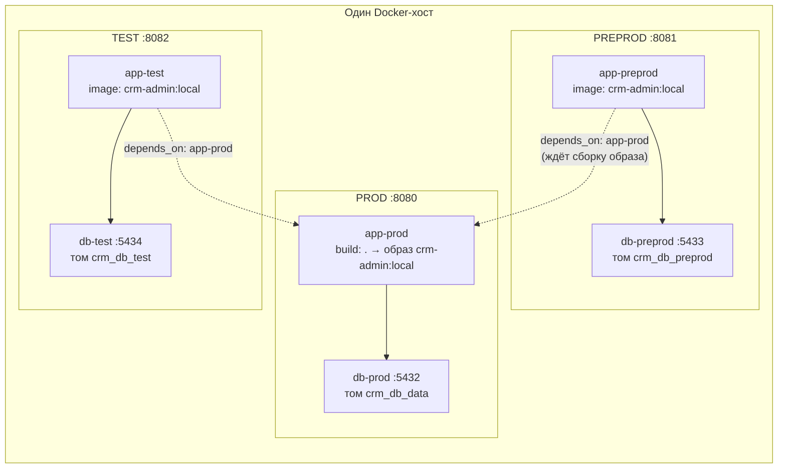

# Среды и деплой

Всё описанное проверено по `docker-compose.yml`, `Dockerfile`, `.env.example`, `application.yml`, `web/EnvController.java`, `static/index.html`, `static/api.js` и `scripts/`. Контекст — [[Обзор архитектуры]], параметры конфигурации — [[Конфигурация]].

## Три среды на одном хосте

`docker-compose.yml` описывает **три независимых стека** (приложение + своя PostgreSQL) в одном compose-проекте:

| Среда | Приложение | Порт UI | БД (контейнер) | Порт БД | Том данных |
|---|---|---|---|---|---|
| **prod** | `crm-admin-app-prod` | `${APP_PORT:-8080}` | `crm-admin-db-prod` | `${DB_PORT:-5432}` | `crm_db_data` (прежнее имя тома — данные прод-контура сохранены) |
| **preprod** | `crm-admin-app-preprod` | `${APP_PORT_PREPROD:-8081}` | `crm-admin-db-preprod` | `${DB_PORT_PREPROD:-5433}` | `crm_db_preprod` |
| **test** | `crm-admin-app-test` | `${APP_PORT_TEST:-8082}` | `crm-admin-db-test` | `${DB_PORT_TEST:-5434}` | `crm_db_test` |

Все три БД — `postgres:16` с одинаковыми `DB_NAME/DB_USER/DB_PASSWORD` (по умолчанию `crm/crm/crm`) и healthcheck-ом `pg_isready` (интервал 5s, 10 попыток); приложение стартует только после `service_healthy` своей БД.



## Один образ — три инстанса

Образ `crm-admin:local` собирается **только** сервисом `app-prod` (у него единственного есть `build: .`); `app-preprod` и `app-test` используют готовый образ и потому имеют `depends_on: app-prod (service_started)` — «ждём сборку образа crm-admin:local» (комментарий в compose). Среды различаются исключительно env-переменными, код и образ идентичны.

`Dockerfile` — multi-stage: сборка в `maven:3.9-eclipse-temurin-21` (кеш зависимостей прогревается по одному `pom.xml`), рантайм `eclipse-temurin:21-jre` под непривилегированным пользователем `app`.

### Промоушен изменений

Правило проекта: **все изменения сначала выкатываются на test**, проверяются там, и только потом доезжают до preprod/prod. Технически выкатка на test выглядит так:

```bash
docker compose build app-prod                 # пересобрать общий образ crm-admin:local
docker compose up -d --no-deps app-test       # перезапустить ТОЛЬКО test на новом образе
```

`--no-deps` обязателен: без него compose перезапустит и зависимости (`db-test`, `app-prod`). Продвижение дальше — те же `up -d --no-deps app-preprod` / `app-prod` после проверки.

## Env-переменные (`.env`)

Compose читает `.env` (шаблон — `.env.example`; важное примечание оттуда: **в `.env` нет inline-комментариев** — всё после `=` считается значением). Ключевые группы:

- порты: `APP_PORT`, `APP_PORT_PREPROD`, `APP_PORT_TEST`, `DB_PORT`, `DB_PORT_PREPROD`, `DB_PORT_TEST`;
- профиль: `SPRING_PROFILES_ACTIVE` (`docker` = встроенная БД + миграции Flyway + сиды; `prod` = внешняя корпоративная БД, Flyway выключен);
- первый супер-админ: `ADMIN_EMAIL`, `ADMIN_PASSWORD` (создаётся идемпотентно на старте, см. [[Безопасность и RBAC]]), `APP_EMAIL_DOMAIN` (ограничение домена почты, пусто = без ограничений);
- постоянная авторизация: `REMEMBER_ME_KEY` (секрет подписи токена; **должен быть заменён и стабилен между рестартами**), `REMEMBER_ME_DAYS` (30), `SESSION_TIMEOUT` (`7d`);
- БД: `DB_NAME`, `DB_USER`, `DB_PASSWORD`, `DB_URL`.

## Чем среды отличаются (переменные per-env в compose)

| Переменная | prod | preprod | test | Что делает |
|---|---|---|---|---|
| `APP_ENV` | `prod` | `preprod` | `test` | имя среды; отдаётся фронту через `GET /api/env` |
| `FEATURES_DEV` | `false` | `false` | `true` | флаг dev-фич (`app.features.dev`), отдаётся в том же `/api/env` |
| `SESSION_COOKIE` | `CRMSID_PROD` | `CRMSID_PREPROD` | `CRMSID_TEST` | имя сессионной куки |
| `REMEMBER_COOKIE` | `crm-remember-prod` | `crm-remember-preprod` | `crm-remember-test` | имя remember-me куки |
| `REMEMBER_ME_KEY` | `${REMEMBER_ME_KEY}-prod` | `…-preprod` | `…-test` | к общему секрету добавляется суффикс среды — токены сред не взаимозаменяемы |
| `JOURNEYS_MOCK` | `true` | `true` | **`false`** | хранилище цепочек: mock в памяти vs таблица `app.journeys` |

**Зачем свои имена кук:** три среды живут на одном хосте (`localhost:8080/8081/8082`), а браузер скоупит куки по хосту без учёта порта — с одинаковыми именами логин в одну среду затирал бы сессию другой (комментарии в `application.yml` и `SecurityConfig`).

**Зачем `JOURNEYS_MOCK=false` только на test:** материализация цепочек требует FK `flow.d_event.journey_id → app.journeys.id`, то есть цепочки должны реально лежать в БД. На prod/preprod раздел «Цепочки» всё равно скрыт, там работает `MockJourneyService` (in-memory, до рестарта). Реализация выбирается по `@ConditionalOnProperty(app.journeys.mock)`: `DbJourneyService` активен при `false`/отсутствии, `MockJourneyService` — при `true`. Подробнее — [[Цепочки (Journeys)]].

## GET /api/env и гейтинг NAV по среде

`web/EnvController` отдаёт `{"name": "prod|preprod|test", "devFeatures": true|false}` (значения из `app.env.name` / `app.features.dev`). Фронт использует это дважды:

1. **Бейдж среды** в шапке (`.env-pill`): `api.js` кладёт ответ в `CRM.envInfo` и `window.CRM_ENV`.
2. **Гейтинг разделов**: в `index.html` пункт NAV «Цепочки» объявлен как `{ id:"journeys", ..., envs:["test"], adminOnly:true }`. Пункт с полем `envs` рендерится скрытым (`display:none`, `data-envs="test"`), и `applyNavAcl` в `api.js` показывает его только если имя текущей среды входит в список — иначе элемент удаляется из DOM. Функция `sectionAllowed()` в `index.html` дублирует ту же проверку при прямом переходе к разделу. Так «Цепочки» видны **только на test и только админам** (`adminOnly` → `data-admin-only`, не-админам пункт удаляется), независимо от ACL разделов.

Это гейтинг видимости, а не безопасности: серверная защита — `JourneyController`/`FlowController` целиком под `@PreAuthorize("hasRole('ADMIN')")`, плюс секция `journeys`, которую `GET /api/me` не-админам больше не отдаёт (см. [[Безопасность и RBAC]]).

## Скрипты сопровождения (`scripts/`)

- **`scripts/reset-test.sh`** — полный сброс test: `docker compose rm -sf app-test db-test`, удаление тома `crm-admin_crm_db_test`, подъём заново. Flyway пересоздаёт схему и заливает сиды. prod и preprod не затрагиваются.
- **`scripts/refresh-preprod.sh`** — обновление preprod копией боевых данных: `pg_dump` из `db-prod` (`--clean --if-exists`) конвейером в `psql` контейнера `db-preprod`, затем `docker compose restart app-preprod`. Данные preprod затираются — это её назначение (реалистичная копия прода).

## Роли сред

| Среда | Назначение | Данные |
|---|---|---|
| **test** | разработка и e2e-проверки; единственная среда с разделом «Цепочки» (и только для ADMIN) и `FEATURES_DEV=true`; цепочки в БД | сиды Flyway; сбрасывается `reset-test.sh` |
| **preprod** | проверка на реалистичных данных перед продом | копия прода через `refresh-preprod.sh` |
| **prod** | рабочая среда пользователей | живые данные, том `crm_db_data` |

Отдельно существует **прод-профиль Spring** (`SPRING_PROFILES_ACTIVE=prod`) для подключения к настоящей корпоративной PostgreSQL: Flyway отключается полностью, физические имена таблиц при необходимости переопределяются через `app.tables.*` / `ADMIN_LOG_TABLE` (см. [[Конфигурация]]). Не путать: три compose-среды выше все работают с профилем `docker` (встроенные БД).
