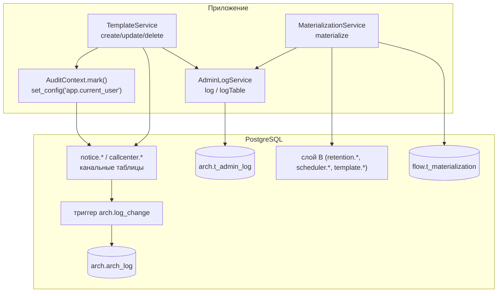

# Аудит и журналирование

В системе два независимых журнала изменений, оба в схеме `arch`. Они дублируют друг друга по назначению, но отвечают на разные вопросы и живут по-разному:

| | `arch.arch_log` | `arch.t_admin_log` |
|---|---|---|
| Кто пишет | **триггер БД** (`arch.log_change`) — приложение только помечает актора | **приложение** (`AdminLogService`) явным INSERT-ом |
| Что фиксирует | факт операции: таблица, операция, PK строки, актор | полный слепок строки (`old_row jsonb`) |
| Стиль | как в v2 (Appsmith): `set_config('app.current_user', ...)` + прод-триггер | прод-спецификация `t_admin_log` |
| Область | канальные таблицы шаблонов | шаблоны + все вставки материализации (слой B) |
| Отключаемость | `app.audit.enabled` (дефолт `true`) | всегда включён |

## Журнал 1: arch.arch_log (триггерный, v2-стиль)

### Таблица и триггер

Создаются миграцией `src/main/resources/db/migration/V1__template_schema.sql` (в docker-профиле; на проде существуют заранее — там Flyway выключен, см. [[Конфигурация]]):

```sql
arch.arch_log (
    id          bigserial PRIMARY KEY,
    table_name  text NOT NULL,       -- 'schema.table'
    operation   text NOT NULL,       -- INSERT | UPDATE | DELETE (TG_OP)
    row_pk      text,                -- code / id / segment — что нашлось
    changed_by  text,                -- current_setting('app.current_user', true)
    changed_at  timestamptz NOT NULL DEFAULT now()
)
```

Функция `arch.log_change()` вычисляет `row_pk` каскадом `COALESCE` по jsonb NEW/OLD: сначала `code`, потом `id`, потом `segment` — то есть для push/sms в лог попадает бизнес-код, для email — id, для cc — приоритетно id (колонки `code` там нет, а `id` идёт раньше `segment` в каскаде). Актора берёт из GUC `current_setting('app.current_user', true)` — второй аргумент `true` означает «не падать, если переменная не установлена» (тогда `changed_by` = NULL/пусто).

Триггеры `trg_audit_push` / `trg_audit_email` / `trg_audit_sms` / `trg_audit_cc` — `AFTER INSERT OR UPDATE OR DELETE ... FOR EACH ROW` на четырёх канальных таблицах (`notice.push_template`, `notice.email_template`, `notice.d_com_sms_template`, `callcenter.d_segment_properties`).

Важно: триггер ловит **любые** изменения таблиц (в т.ч. ручные UPDATE из psql), но `changed_by` заполнится только если сессия выставила GUC.

### AuditContext — проброс актора

`src/main/java/ru/banki/crm/service/AuditContext.java`, `@Component`. Повторяет приём v2: перед мутацией выполняется

```sql
select set_config('app.current_user', :email, true)
```

Третий аргумент `true` = `is_local`: значение живёт **до конца текущей транзакции**. Отсюда ключевое требование — `mark()` должен вызываться **внутри той же транзакции** (и значит на том же connection), что и сама мутация; иначе триггер увидит пустой GUC. Email берётся из `CurrentUser.email()` (principal текущего запроса; вне контекста аутентификации — строка `"system"`).

Флаг `app.audit.enabled` (`@Value`, дефолт `true`) позволяет выключить установку GUC (например, на стенде без триггера); сам триггер при этом продолжит писать строки, но без актора.

Вызывается из `TemplateService` первым действием в `create` / `update` / `delete` (строки 79, 151, 163). Материализация цепочек GUC не выставляет — она пишет не в канальные таблицы, а в слой B, где триггеров arch_log нет.

## Журнал 2: arch.t_admin_log (прикладной)

### Таблица

Миграция `src/main/resources/db/migration/V4__admin_log.sql`; структура 1:1 по прод-спецификации `t_admin_log`:

```sql
arch.t_admin_log (
    id           bigint GENERATED BY DEFAULT AS IDENTITY PRIMARY KEY,
    table_name   varchar,     -- физическое имя таблицы ('notice.push_template', ...)
    operation    varchar,     -- INSERT | UPDATE | DELETE
    old_row      jsonb,       -- слепок строки (см. семантику ниже)
    action_user  varchar,     -- email актора
    timestamp_cr timestamp NOT NULL DEFAULT now()
)
```

### AdminLogService

`src/main/java/ru/banki/crm/service/AdminLogService.java`, `@Service`, работает через `EntityManager.createNativeQuery`. Конфигурация через `@Value`:

- `app.tables.admin-log` (env **`ADMIN_LOG_TABLE`**, дефолт `arch.t_admin_log`) — физическое имя таблицы журнала: на проде реальное расположение может отличаться, меняется env-переменной без правки кода;
- `app.tables.push|email|sms|cc` — физические имена канальных таблиц (дефолты: `notice.push_template`, `notice.email_template`, `notice.d_com_sms_template`, `callcenter.d_segment_properties`).

Методы:

- **`tableFor(channel)`** — канал (`push`/`email`/`sms`/`cc`) → физическое имя таблицы; неизвестная строка возвращается как есть (позволяет передавать готовое имя).
- **`rowJson(channel, id)`** — слепок строки как jsonb-текст: сначала `em.flush()` (чтобы native-запрос увидел только что сохранённую/изменённую managed-сущность), затем `SELECT to_jsonb(t)::text FROM <таблица> t WHERE t.id = :id`. Имена ключей — точные имена колонок БД. `id` — всегда **суррогатный** PK (у всех четырёх таблиц есть колонка `id`; в `TemplateService` его достаёт хелпер `idOf`). Строка не найдена → `null`.
- **`log(channel, operation, rowJsonText)`** — шорткат `logTable(tableFor(channel), ...)`.
- **`logTable(physicalTable, operation, rowJsonText)`** — собственно INSERT в журнал: `(table_name, operation, old_row=CAST(:r AS jsonb), action_user=CurrentUser.email(), timestamp_cr=now())`. Публичный, потому что материализация логирует таблицы слоя B по их физическим именам напрямую.

### Семантика old_row по операциям

Определена вызывающим кодом (`TemplateService`):

| Операция | Что в `old_row` | Почему |
|---|---|---|
| `INSERT` | **созданная** строка (слепок после сохранения) | иначе о факте заведения не осталось бы никаких данных |
| `UPDATE` | строка **до** изменения (rowJson снимается до `mapper.apply`) | классическое «что было» |
| `DELETE` | удаляемая строка (до `delete`) | «что удалили» |

Запись идёт **в той же транзакции**, что и операция: откат операции откатывает и журнальную запись — журнал не может разойтись с данными.

### Кто пишет в t_admin_log

1. **`TemplateService`** — каждый create/update/delete шаблона (см. [[Шаблоны и мастер коммуникаций]]).
2. **`MaterializationService`** (`src/main/java/ru/banki/crm/service/flow/MaterializationService.java`, строка 281) — каждая вставка строки слоя B при материализации цепочки: `adminLog.logTable(r.table(), "INSERT", rowJson)`, где rowJson — фактически вставленные значения плюс полученный id. Параллельно та же вставка регистрируется в собственном журнале материализации `flow.t_materialization` (our_entity/our_id → prod_table/prod_id + materialized_by) — он обеспечивает идемпотентность повторной материализации; детали в [[Материализация (Flow)]] и [[Слой B (процессные таблицы)]].

Действия над **пользователями** (create/update/delete в `UserService`) ни в один журнал не пишутся — см. [[Пользователи и доступ]].

## Сводная картина



## Практические заметки

- Чтобы найти «кто изменил шаблон», удобнее `t_admin_log` (там полный слепок); `arch_log` полезен как независимый контроль, ловящий и ручные правки в БД.
- `rowJson` использует native `to_jsonb`, поэтому в журнале лежат **имена колонок БД** (`msg_text`, `active_flag`), а не имена Java-полей.
- GUC `app.current_user` транзакционный: пул соединений не «протекает» актором между запросами.
- Обе таблицы append-only; чистка/ротация на стороне приложения не реализована.

## Связанные заметки

[[Обзор бэкенда]] · [[Шаблоны и мастер коммуникаций]] · [[Материализация (Flow)]] · [[Схема БД]] · [[Конфигурация]] · [[Безопасность и RBAC]]
