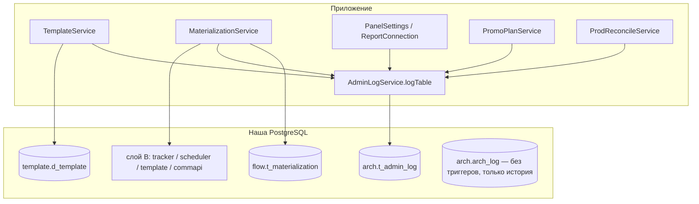

# Аудит и журналирование

Два журнала изменений, оба в схеме `arch`. Рабочий сегодня — **`arch.t_admin_log`**; `arch.arch_log` остался от прежней архитектуры и в нашей БД больше не наполняется.

| | `arch.t_admin_log` | `arch.arch_log` |
|---|---|---|
| Кто пишет | приложение (`AdminLogService`) явным INSERT-ом | триггер БД `arch.log_change` |
| Что фиксирует | полный слепок строки (`old_row jsonb`) | факт операции: таблица, операция, PK строки, актор |
| Область | шаблоны, материализация, настройки панели, промо-план, импорт из прода | канальные таблицы `notice.*` / `callcenter.*` |
| Статус | активен | **триггеров нет** — таблицы, на которых они висели, выпилены миграцией `V12` |

## arch.t_admin_log — прикладной журнал

Миграция `V4__admin_log.sql`, структура 1:1 по прод-спецификации:

```sql
arch.t_admin_log (
    id           bigint GENERATED BY DEFAULT AS IDENTITY PRIMARY KEY,
    table_name   varchar,     -- логическое имя таблицы ('template.d_template', ...)
    operation    varchar,     -- INSERT | UPDATE | DELETE | IMPORT | IMPORT_ALL
    old_row      jsonb,       -- слепок строки (семантика ниже)
    action_user  varchar,     -- email актора
    timestamp_cr timestamp NOT NULL DEFAULT now()
)
```

### AdminLogService

`src/main/java/ru/banki/crm/service/AdminLogService.java` — один публичный метод:

```java
void logTable(String physicalTable, String operation, String rowJsonText)
```

INSERT через `EntityManager.createNativeQuery`: `(table_name, operation, old_row = CAST(:r AS jsonb), action_user = CurrentUser.email(), timestamp_cr = now())`. Имя **самой таблицы журнала** берётся из `@Value("${app.tables.admin-log:arch.t_admin_log}")` (env `ADMIN_LOG_TABLE`) — на проде реальное расположение может отличаться, меняется без правки кода. Снимок строки готовит вызывающий: у шаблонов это `TemplateStore.rowJson(channel, code)` (`SELECT to_jsonb(t)::text`), у материализации — фактически вставленные значения плюс полученный id.

Прежний метод-шорткат `log(channel, …)` и маппинг «канал → физическая таблица» ушли вместе с канальными сущностями: теперь таблица передаётся строкой.

### Семантика old_row

| Операция | Что в `old_row` | Почему |
|---|---|---|
| `INSERT` | **созданная** строка (снимок после сохранения) | иначе о факте заведения не осталось бы данных |
| `UPDATE` | строка **до** изменения | классическое «что было» |
| `DELETE` | удаляемая строка (до удаления) | «что удалили» |

Запись идёт **в той же транзакции**, что и сама операция: откат операции откатывает и журнальную запись — журнал не может разойтись с данными.

### Кто пишет в t_admin_log

| Источник | `table_name` | Операции |
|---|---|---|
| `TemplateService` | `template.d_template` | INSERT / UPDATE / DELETE — каждая операция мастера ([[Шаблоны и мастер коммуникаций]]) |
| `MaterializationService` | таблицы слоя B | INSERT на каждую вставленную строку ([[Материализация (Flow)]]) |
| `PanelSettingsController` | `app.panel_settings` | UPDATE, строка **после** изменения |
| `ReportConnectionController` | `app.panel_settings` | UPDATE, **только факт правки и состав отчётов** |
| `PromoPlanService` | `app.promo_plan` | INSERT / UPDATE / DELETE ([[Планирование промо]]) |
| `AbTestService` | `app.ab_test` | INSERT / UPDATE / DELETE ([[АБ тесты]]) |
| `ProdReconcileService` | `template.d_template` | `IMPORT` (построчный импорт из прода) и `IMPORT_ALL` (массовый, с числом строк) ([[Синхронизация с прод-БД]]) |

Два отступления от общего правила:

- **`ReportConnectionController` пишет не всю строку.** В значении настройки лежит токен Tableau, а `t_admin_log` доступен шире, чем сам конфиг — в журнал уходит только `{key, reports}`. См. [[Отчёты]].
- **`PromoPlanService` глушит ошибку журнала** (`writeLog` в try/catch): журнал не должен ронять саму правку плана.

Действия над **пользователями и ролями** (`UserService`, `RoleService`) ни в один журнал не пишутся — см. [[Безопасность и RBAC]].

## arch.arch_log — триггерный журнал (наследие)

Таблица и функция создаются миграцией `V1__template_schema.sql`:

```sql
arch.arch_log (id, table_name, operation, row_pk, changed_by, changed_at)
```

`arch.log_change()` вычисляет `row_pk` каскадом `COALESCE` по jsonb NEW/OLD (`code` → `id` → `segment`), а актора берёт из GUC `current_setting('app.current_user', true)` (второй аргумент `true` = «не падать, если переменная не установлена»). Триггеры `trg_audit_push` / `trg_audit_email` / `trg_audit_sms` / `trg_audit_cc` вешались на четыре канальные таблицы.

**Этих таблиц в нашей БД больше нет.** Миграция `V12__drop_local_channel_staging.sql` удалила локальные staging-копии `notice.*` / `callcenter.*` с `CASCADE`, а вместе с ними и триггеры. Функция `arch.log_change()` и таблица `arch.arch_log` остались на месте — исторические записи не потеряны, новых не появляется. Настоящие канальные таблицы живут во внешней прод-БД, куда мы пишем отдельным соединением (`ProdDbService`), GUC там не выставляется.

### AuditContext

`src/main/java/ru/banki/crm/service/AuditContext.java` — выполняет

```sql
select set_config('app.current_user', :email, true)
```

Третий аргумент `true` = `is_local`: значение живёт **до конца текущей транзакции**, поэтому пул соединений не «протекает» актором между запросами. Email — из `CurrentUser.email()` (вне контекста аутентификации — строка `"system"`). Выключается флагом `app.audit.enabled` (дефолт `true`).

`mark()` по-прежнему вызывается первым действием в `TemplateService.create/update/delete`, но в текущей схеме это **рудимент**: триггеров на `template.d_template` нет, и GUC никто не читает. Вызов сохранён как дешёвая страховка на случай, если аудит-триггер заведут на нашей стороне.

## Сводная картина



## Журнал материализации

Помимо `t_admin_log` каждая вставка слоя B регистрируется в **`flow.t_materialization`** (`our_entity='app.journeys'`, `our_id` = id цепочки, `prod_table`, `prod_id`, `materialized_by`). Это не аудит, а рабочая структура: по ней повторная материализация удаляет прежние строки. Подробно — [[Материализация (Flow)]] и [[Слой A (flow)]].

## Практические заметки

- Слепки снимаются native-запросом `to_jsonb`, поэтому в журнале лежат **имена колонок БД** (`msg_text`, `active_flag`), а не имена Java-полей.
- `arch.t_admin_log` append-only; чистка и ротация на стороне приложения не реализованы.
- Автора всегда проставляет `AdminLogService`; вызывающему передавать его не нужно и нельзя.

## Связанные заметки

[[Обзор бэкенда]] · [[Шаблоны и мастер коммуникаций]] · [[Материализация (Flow)]] · [[Синхронизация с прод-БД]] · [[Схема БД]] · [[Конфигурация]] · [[Безопасность и RBAC]]
