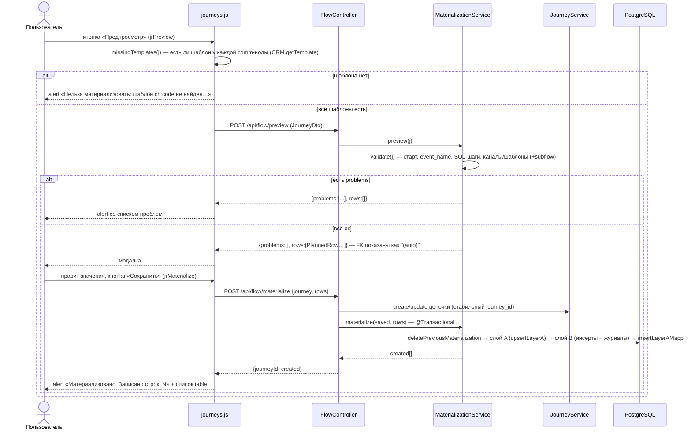

# Материализация (Flow)

Материализация — превращение нарисованной в [[Flow Builder (цепочки)]] схемы (см. [[Цепочки (Journeys)]]) в **реальные строки конфигурационных таблиц**, которые читают существующие движки прода. Пишется два слоя:

- **Слой A** (`flow.*` + единый справочник `template.d_template`) — наша нормализованная модель, «истина» для UI; см. [[Слой A (flow)]].
- **Слой B** (`tracker.*`, `scheduler.*`, `template.*`, `commapi.*`) — копии продовых таблиц 1:1 по DDL, их читают движки; см. [[Слой B (процессные таблицы)]].

Делается это по образцу DO-скрипта старой Appsmith-админки, но с принципиальными отличиями: id через sequences (никаких `max(id)+1`), FK между таблицами слоя B подставляются автоматически (в предпросмотре показываются как `"(auto)"`), каждая вставка журналируется (в `arch.t_admin_log` и `flow.t_materialization`), а повторная материализация той же цепочки **идемпотентна** — старые строки слоя B удаляются по журналу и создаются заново.

Компоненты (пути от корня repo):

| Компонент | Файл |
|---|---|
| `FlowController` | `src/main/java/ru/banki/crm/web/FlowController.java` |
| `MaterializationService` | `src/main/java/ru/banki/crm/service/flow/MaterializationService.java` |
| журналирование | `src/main/java/ru/banki/crm/service/AdminLogService.java` (`logTable`) |
| DDL слоя B | `src/main/resources/db/migration/V5__process_layer_b.sql` |
| DDL слоя A | `src/main/resources/db/migration/V6__flow_layer_a.sql` |
| фронт | `src/main/resources/static/journeys.js` (`jrPreview`, `renderModal`, `jrMaterialize`, `missingTemplates`) |

## FlowController — API

`@RestController`, базовый путь `/api/flow` (сводка — [[REST API]]). Оба метода требуют раздел `journeys` (`guard.requireAnySection(Sections.JOURNEYS)`, см. [[Безопасность и RBAC]]).

| Метод | Путь | Роль | Тело | Ответ |
|---|---|---|---|---|
| `POST` | `/api/flow/preview` | любой с разделом | `JourneyDto` | `PreviewResult { problems: [строки], rows: [PlannedRow] }` |
| `POST` | `/api/flow/materialize` | **EDITOR/ADMIN** (`@PreAuthorize`) | `MaterializeRequest { journey: JourneyDto, rows: [PlannedRow] }` | `MaterializeResponse { journeyId, created: [CreatedRow] }` |

Важный порядок в `materialize`: **сначала сохраняется сама цепочка** — `journeys.create(...)`, если `journey.id` пуст, иначе `journeys.update(id, ...)` — чтобы у материализации был стабильный `journey_id` (он пишется в `flow.d_event.journey_id` и в журнал `flow.t_materialization`). Только затем вызывается `materialization.materialize(saved, rows)`; `rows == null` трактуется как пустой список.

Record-типы: `PlannedRow(String table, Map<String,Object> values)` — планируемая вставка слоя B (значения редактируются пользователем в модалке); `CreatedRow(String table, long id)` — фактически созданная строка.

## Сквозной поток: предпросмотр → модалка → материализация

## MaterializationService

`@Service`, работает голым `EntityManager` (native SQL) — таблицы слоёв A/B не имеют JPA-сущностей. Зависимости: `AdminLogService` (журнал), `ObjectMapper` (JSON строк для лога и парсинг `sql_steps`), `JourneyService` (загрузка вложенных цепочек Subflow).

Константы:

- `AUTO = "(auto)"` — маркер «FK подставится автоматически» в предпросмотре;
- `LAYER_B_TABLES` — белый список из 8 разрешённых целевых таблиц слоя B (`tracker.d_comm_creation`, `tracker.t_event_comm`, `scheduler.t_get_event`, `scheduler.t_launch_settings`, `scheduler.t_execution_steps`, `template.d_template_mapping`, `template.d_template_mapping_mass`, `commapi.d_definition_mapping`) — защита `materialize` от вставки в произвольные таблицы, даже если клиент пришлёт свои `rows`.

### validate(j) — все проверки

Возвращает `List<String>` проблем (пустой = можно материализовать). Тексты — дословно из кода:

1. **Стартовый узел** (тип `startIncome`/`startTime`):
   - нет ни одного → «Нет стартового узла (Income event или Time event). Цепочка без старта — вложенная (Subflow): сохранить её можно, а материализуется она в составе родительской цепочки» (сохранение через `/api/journeys` при этом не блокируется — это осознанная модель autolaunched-subflow);
   - больше одного → «Стартовый узел должен быть один, найдено: N»;
   - ровно один: online-цепочка обязана начинаться с Income event, offline — с Time event (kind нормализуется: не-"offline" = online); тексты «Онлайн-цепочка должна начинаться с Income event» / «Оффлайн-цепочка должна начинаться с Time event»;
   - пустое `props.event_name` → «У стартового узла не заполнено имя события (event_name)»;
   - `startTime` без единого SQL-шага (`sqlSteps(s)` пуст) → «У Time event не заполнен ни один SQL-шаг выборки».
2. **Comm-ноды — с учётом Subflow**: `expandedComms(j, problems)` рекурсивно разворачивает вложенные цепочки (см. ниже), попутно добавляя проблемы subflow. Если comm-нод в итоге нет → «Нет ни одного узла Communication Alert — нечего материализовать». Для каждой comm-ноды:
   - не выбран канал → `У Communication Alert «{title|id}» не выбран канал`;
   - нет кода шаблона → `У Communication Alert ({channel}) не указан код шаблона`;
   - шаблона нет в канальном справочнике (`templateExists`) → `Шаблон {channel}:{code} не найден — сначала заведи его в «Мастере коммуникаций»`.

Эта серверная проверка шаблонов дублирует клиентскую `missingTemplates` из `journeys.js` (клиент блокирует и сохранение, и предпросмотр ещё до запроса) — защита с двух сторон.

### expandedComms / collectComms — разворачивание Subflow

`expandedComms(j, problems)` возвращает **все comm-ноды цепочки, включая ноды вложенных цепочек**, рекурсивно:

- comm-нодой считается узел с `type == "comm"` **или `type == null`** (старые данные);
- узел `subflow`: id вложенной цепочки берётся из `props.journey`; пустой → проблема «У узла Subflow не выбрана вложенная цепочка»; сама цепочка грузится через `journeys.get(subId)`, не найдена → «Вложенная цепочка Subflow ({id}) не найдена»;
- **циклы и повторные включения** отслеживаются множеством `visited` (в него сразу кладётся id самой корневой цепочки): вторая встреча того же id **молча пропускается** — ни ошибки, ни повторного разворачивания;
- вложенность любой глубины: subflow внутри subflow тоже разворачивается.

Следствие: вложенная цепочка не имеет собственного события — её шаблоны становятся шаблонами **родительского** события. Отдельно материализовать subflow нельзя (нет старта), см. [[Цепочки (Journeys)]].

### preview(j) — план вставок слоя B

Сначала `validate`; при проблемах возвращает `PreviewResult(problems, [])` — модалка не открывается. Дальше строится список `PlannedRow` (LinkedHashMap — порядок колонок сохраняется для модалки). Все значения бизнес-полей пользователь может править в модалке; поля `"(auto)"` задизейблены.

**Для `startIncome` (online):**

| Таблица | Колонки |
|---|---|
| `tracker.d_comm_creation` | `allow_ml` (bool из props), `send_delay` (int, дефолт 2), `lifetime` (из `props.life_time`, дефолт 1000), `notify_channel` |
| `tracker.t_event_comm` | `event_name`, `system`, `id_comm_creation` = **(auto)**, `is_active` = true, `sub_channel`, `platform`, `group_event_descr`, `is_chain` = (comm-нод > 1) |

**Для `startTime` (offline):** `selection` = `props.process_name`, при пустом — `event_name` (**selection и process_name — одно и то же имя процесса выборки, одно поле в UI**).

| Таблица | Колонки |
|---|---|
| `scheduler.t_get_event` | `selection`, `event_name`, `system`, `send_delay` (дефолт 2), `is_deferred` = false, **`source` = `resolveSource(j)`** (из шаблона первой comm-ноды, руками не вводится), `allow_ml`, `notify_channel`, `is_active` = true, `life_time` (дефолт 1000) |
| `scheduler.t_launch_settings` | `selection`, `time_start` = строка `"now()"` (спецзначение, см. insertReturningId), `crontab` = `props.crontab` (один текст, например `0 9 * * *`; полей time_start/period_unit/period_q в UI нет), `database` = `props.database` или `"crmdb"`, `description` = имя цепочки, `is_active` = true, `status` = `"NEW"`, `is_batch` = true, `max_retry_attempts` = 1, `job_group` = `"CRM"` |
| `scheduler.t_execution_steps` — **по строке на каждый SQL-шаг** из `props.sql_steps` | `t_launch_settings_id` = **(auto)**, `process_name` = selection, `order_num` = 1..N, `is_active` = true, `returns_result_set` = true, `sql_text` |

**Маппинг шаблонов** (comm-ноды после разворачивания subflow):

- одна comm-нода → `template.d_template_mapping`: `get_event_id` = (auto) для startTime / null для startIncome, `event_name`, `system`, `notify_channel` = канал ноды, `template_id` = код шаблона (int);
- несколько → `template.d_template_mapping_mass` **построчно, в порядке возрастания `day`**: `event_id` = (auto)/null, `event_name`, `template_id`, `channel`.

**Всегда** — `commapi.d_definition_mapping`: `get_event_id` = (auto)/null, `event_name`, `system`, `notify_channel`, `definition_key`, `business_key_prefix` (значения выбираются в UI из прод-справочников: definition_key — 6 значений, включая `smsChannelProccessV2` с опечаткой, как в проде; business_key_prefix — 7 значений; notify_channel — КАПСОМ), `is_correlation` = false.

### materialize(j, rows) — транзакция

`@Transactional`, одна транзакция на всё. Шаги:

1. **Повторная валидация** `validate(j)` — проблемы → 400 с текстами через «; » (клиент мог прислать что угодно).
2. **Белый список таблиц**: каждая `PlannedRow.table` обязана быть в `LAYER_B_TABLES`, иначе 400 «Недопустимая таблица: …».
3. **`deletePreviousMaterialization(j.id())`** — идемпотентность: из журнала `flow.t_materialization` выбираются все строки `our_entity='app.journeys' AND our_id=:jid` (ORDER BY id DESC — дети удаляются раньше родителей, FK не мешают), каждая прод-строка удаляется `DELETE FROM {table} WHERE id=…` (таблица снова проверяется по белому списку), затем чистится сам журнал по этой цепочке.
4. **Слой A**: `upsertLayerA(j)` → `eventId` (см. ниже).
5. **Слой B**: строки сортируются `orderForInsert` (родители до детей по фиксированному порядку: d_comm_creation → t_event_comm → t_get_event → t_launch_settings → t_execution_steps → d_template_mapping → d_template_mapping_mass → d_definition_mapping). Для каждой:
   - `resolveAuto` заменяет `"(auto)"` на id уже вставленного родителя из карты `autoIds` (`id_comm_creation` ← `tracker.d_comm_creation`; `t_launch_settings_id` ← `scheduler.t_launch_settings`; `get_event_id`/`event_id` ← `scheduler.t_get_event`); неизвестная auto-колонка → null;
   - `insertReturningId` вставляет и возвращает id;
   - id запоминается в `autoIds` (ключ — имя таблицы: для `t_execution_steps` с несколькими шагами в карте остаётся id последнего, но на него никто не ссылается);
   - вставка журналируется: `adminLog.logTable(table, "INSERT", rowJson)` → `arch.t_admin_log` (колонки table_name, operation, old_row jsonb, action_user, timestamp_cr; см. [[Аудит и журналирование]]) **и** строка в `flow.t_materialization` (`our_entity='app.journeys'`, `our_id`=journey id, `prod_table`, `prod_id`, `materialized_by` = e-mail пользователя).
6. **`insertLayerAMappings(j, eventId)`** — маппинги шаблонов слоя A (нужен известный eventId).

Возвращает `List<CreatedRow>` — фронт показывает «Материализовано. Записано строк: N» со списком `table #id`.

### insertReturningId — безопасная сборка INSERT

Native `INSERT INTO {table} ({cols}) VALUES ({params}) RETURNING id`:

- колонка `id` и пустые/null значения выбрасываются (сработают дефолты БД);
- **имена колонок валидируются regex `[a-z_][a-z0-9_]*`** — иначе 400 «Недопустимая колонка: …» (значения передаются только параметрами, SQL-инъекция через имена колонок закрыта; имена оборачиваются в кавычки — важно для колонки `database`);
- **спецкейс `time_start`**: значение-строка `"now()"` инлайнится в SQL как функция `now()` (значение из предпросмотра); любая другая строка в `time_start` конвертируется в `java.sql.Timestamp` (`"2026-07-16T09:00"` → `"2026-07-16 09:00:00"` — поддержан ввод из `<input type=datetime-local>`).

### upsertLayerA — flow.d_event и обвязка

Пишет нормализованную модель события (таблицы — [[Слой A (flow)]]):

1. **`flow.d_event`** — upsert `ON CONFLICT (event_name, system) DO UPDATE ... RETURNING id`: `kind` = `time` (startTime) / `income` (startIncome), `event_name`, `system`, **`source` = `resolveSource(j)`**, `group_event_descr`, `description` = имя цепочки, `journey_id`, `is_active` = true; при обновлении ставится `timestamp_upd = now()`.
2. **Обвязка пересоздаётся** (идемпотентно): DELETE по `event_id` из `d_event_delivery`, `d_event_schedule`, `d_event_step`, `d_event_template`, `d_event_definition`, затем:
   - `flow.d_event_delivery`: `notify_channel`, `sub_channel`, `platform`, `send_delay` (дефолт 2), `life_time` (дефолт 1000), `allow_ml`;
   - только для `kind='time'`: `flow.d_event_schedule` (`crontab`, `database` дефолт `crmdb`, `is_batch` = true) и **`flow.d_event_step` — по строке на каждый SQL-шаг** (`order_num` = 1..N, `process_name`, `sql_text`, `returns_result_set` = true) — зеркало `scheduler.t_execution_steps` в слое A;
   - `flow.d_event_definition`: `notify_channel`, `definition_key`, `business_key_prefix`.
3. **`insertLayerAMappings`** (после слоя B): comm-ноды (включая развёрнутые subflow) в порядке `day` → `flow.d_event_template` (`event_id`, `template_id` = id в едином справочнике через `resolveUnifiedTemplateId`, `step_no` = 1..N при цепочке из нескольких коммуникаций, NULL при одиночной).

### resolveSource — source из шаблона первой comm-ноды

`source` события **не вводится руками**: `resolveSource(j)` берёт развёрнутые comm-ноды, сортирует по `day` и у первой, чей канал имеет колонку `source` в канальной таблице, читает `SELECT source FROM {table} WHERE {codeCol}=:code`. Первое непустое значение → в `scheduler.t_get_event.source` и `flow.d_event.source`. У канала `cc` колонки `source` нет (`hasSource=false`) — cc-ноды пропускаются. Если ни у кого source не нашёлся — `null`.

### ChannelTable / channelTable / templateExists

`record ChannelTable(String table, String codeCol, boolean hasNight, boolean hasSource)` — описание канальной прод-таблицы шаблонов (см. [[Справочники шаблонов]]):

| Канал | Таблица | Колонка кода | night_send | source |
|---|---|---|---|---|
| `sms` | `notice.d_com_sms_template` | `code` | да | да |
| `push` | `notice.push_template` | `code` | да | да |
| `email` | `notice.email_template` | `id` | нет | да |
| `cc` | `callcenter.d_segment_properties` | `segment` | нет | **нет** |
| прочее | `null` | | | |

`templateExists(channel, code)` — `SELECT count(*)` по этой таблице; код обязан парситься в int (иначе false). Это серверный гейт «без шаблона не материализовать».

Замечание: `channelTable` использует захардкоженные имена таблиц, тогда как `AdminLogService`/`TemplateService` берут их из проперти `app.tables.*` — при переопределении имён в [[Конфигурация]] эти места могут разойтись.

### syncUnifiedTemplate + CORE_COLS — синк единого справочника

`resolveUnifiedTemplateId(c)` перед поиском id в `template.d_template` вызывает `syncUnifiedTemplate(channel, code)` — upsert строки канальной прод-таблицы в **единый справочник шаблонов** `template.d_template` (уникальность `(channel, code)`):

- **ядро** — 20 общих колонок `CORE_COLS` (`communication_name, source_type→campaign_name, communication_type, business_communication_type, trigger_type, sending_day, product_type, partner_name, touch_point, aff_sub3, selection_wizard_service, marketplace, dialog, loyalty, national_rating, news, mobile_app, night_send, permanent_exclude, active_flag`) копируется в типизированные колонки; булевы обёрнуты `coalesce(...,false)`, `night_send` у email/cc всегда false (`hasNight`);
- **channel_props jsonb** — всё остальное: `to_jsonb(t) - string_to_array('id,{codeCol},{CORE_COLS без пробелов}', ',')`, то есть JSON всей строки минус id, колонка кода и ядро. Для sms туда попадают `msg_text, sender_name, antispam_check, brief, name`; для push — `title, deep_link, img_ios/android, time_to_live` и т.д.; для email — `letteros_id, subject, email_from…`; для cc — `segment, host_id, ml_check_probability…`;
- `ON CONFLICT (channel, code) DO UPDATE` обновляет все ядровые поля, `channel_props` и `timestamp_upd = now()` — справочник всегда догоняет канальную таблицу на момент материализации.

Полученный `template.d_template.id` пишется в `flow.d_event_template.template_id`.

### Вспомогательные методы

- `sqlSteps(n)` — SQL-шаги Time event: парсит `props.sql_steps` как JSON-массив строк (пустые/null элементы отбрасываются); битый JSON молча трактуется как «шагов нет»; **фолбэк для старых схем** — одиночный `props.sql`;
- `startNode(j)` — первый узел типа startIncome/startTime (после validate он гарантированно один);
- `prop/boolProp/intProp` — чтение `props` (bool: строка "true" без учёта регистра; int: дефолт при пустом/непарсибельном);
- `parseIntOrNull`, `blank`, `nz(v, def)`, `writeJson` (ошибка → `"{}"`).

## Что материализуется, а что нет

Материализуются **только**: стартовый узел (startIncome/startTime) и comm-ноды (включая рекурсивно развёрнутые subflow). Узлы Pause/Decision/Assignment/Loop/Create-Update-Get-DeleteRecords — **визуальные**: движок исполнения (runs/steps) не реализован, эти узлы в инсерты не попадают. Реальные задержки между коммуникациями цепочки в проде задаются полем `sending_day` шаблонов (в UI comm-ноды поле «День» readonly и подтягивается из шаблона). См. также [[Флоу системы]].

## Связанные заметки

- [[Цепочки (Journeys)]] — хранение схем, CRUD, правило subflow
- [[Слой A (flow)]], [[Слой B (процессные таблицы)]], [[Справочники шаблонов]] — целевые таблицы
- [[Flow Builder (цепочки)]] — UX предпросмотра и модалки на фронте
- [[Аудит и журналирование]] — arch.t_admin_log
- [[Шаблоны и мастер коммуникаций]] — откуда берутся шаблоны и sending_day
