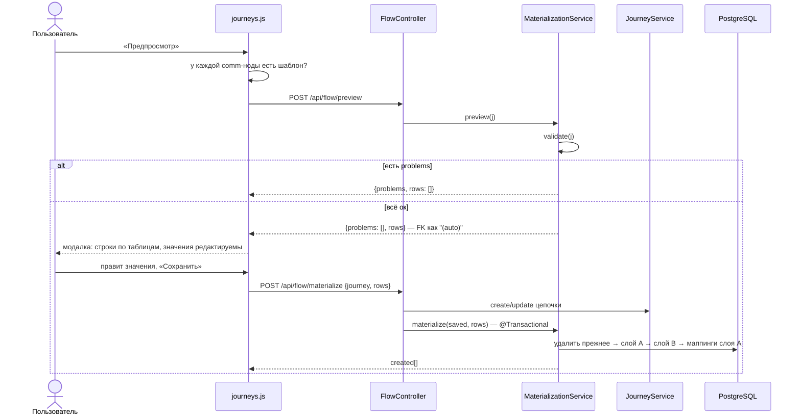

# Материализация (Flow)

Материализация — превращение схемы из [[Flow Builder (цепочки)]] (модель — [[Цепочки (Journeys)]]) в **реальные строки конфигурационных таблиц**, которые читают существующие движки. Пишутся два слоя:

- **слой A** (`flow.*`) — наша нормализованная модель события, «истина» для UI: [[Слой A (flow)]];
- **слой B** (`tracker.*`, `scheduler.*`, `template.*`, `commapi.*`) — копии продовых таблиц 1:1 по DDL: [[Слой B (процессные таблицы)]].

Сделано по образцу DO-скрипта старой Appsmith-админки, но с отличиями: id через sequences (никаких `max(id)+1`), FK между таблицами слоя B подставляются автоматически (в предпросмотре — `"(auto)"`), каждая вставка журналируется, а повторная материализация той же цепочки **идемпотентна** — прежние строки слоя B удаляются по журналу и создаются заново.

| Компонент | Файл |
|---|---|
| `FlowController` | `src/main/java/ru/banki/crm/web/FlowController.java` |
| `MaterializationService` | `src/main/java/ru/banki/crm/service/flow/MaterializationService.java` |
| DDL слоя B | `src/main/resources/db/migration/V5__process_layer_b.sql` |
| DDL слоя A | `src/main/resources/db/migration/V6__flow_layer_a.sql` |
| фронт | `src/main/resources/static/journeys.js` |

## FlowController — `/api/flow`

Класс целиком `@PreAuthorize("hasRole('ADMIN')")`, оба метода дополнительно требуют раздел `journeys`.

| Метод | Путь | Тело | Ответ |
|---|---|---|---|
| POST | `/api/flow/preview` | `JourneyDto` | `PreviewResult { problems, rows }` |
| POST | `/api/flow/materialize` | `MaterializeRequest { journey, rows }` | `MaterializeResponse { journeyId, created }` |

В `materialize` важен порядок: **сначала сохраняется сама цепочка** (`journeys.create(...)`, если id пуст, иначе `journeys.update(...)`) — чтобы у материализации был стабильный `journey_id` (он пишется в `flow.d_event.journey_id` и в журнал `flow.t_materialization`). Только потом вызывается `materialization.materialize(saved, rows)`; `rows == null` трактуется как пустой список.

Record-типы: `PlannedRow(String table, Map<String,Object> values)` — планируемая вставка слоя B (значения редактируются пользователем в модалке); `CreatedRow(String table, long id)` — фактически созданная строка.

## Сквозной поток

## MaterializationService

`@Service`, работает голым `EntityManager` (native SQL) — у таблиц слоёв A/B нет JPA-сущностей. Зависимости: `AdminLogService`, `ObjectMapper`, `JourneyService` (загрузка вложенных цепочек), `UnifiedTemplateService`.

Константы:

- `AUTO = "(auto)"` — маркер «FK подставится автоматически»;
- `LAYER_B_TABLES` — белый список из 8 таблиц (`tracker.d_comm_creation`, `tracker.t_event_comm`, `scheduler.t_get_event`, `scheduler.t_launch_settings`, `scheduler.t_execution_steps`, `template.d_template_mapping`, `template.d_template_mapping_mass`, `commapi.d_definition_mapping`) — защита от вставки в произвольную таблицу, даже если клиент пришлёт свои `rows`.

### validate(j)

Возвращает список проблем (пустой = можно материализовать):

1. **Стартовый узел**: нет ни одного → «Нет стартового узла (Income event или Time event). Цепочка без старта — вложенная (Subflow)…»; больше одного → «Стартовый узел должен быть один, найдено: N»; online обязана начинаться с Income event, offline — с Time event; пустое `props.event_name` → «У стартового узла не заполнено имя события (event_name)»; `startTime` без единого SQL-шага → «У Time event не заполнен ни один SQL-шаг выборки».
2. **Comm-ноды** (после разворачивания Subflow): ни одной → «Нет ни одного узла Communication Alert — нечего материализовать»; не выбран канал / не указан код шаблона / шаблона нет в справочнике → соответствующее сообщение с указанием узла.

`templateExists(channel, code)` бьёт по **единому справочнику**: `SELECT count(*) FROM template.d_template WHERE channel = ? AND code = ?`. Код обязан парситься в int. Это серверный гейт «без шаблона не материализовать», дублирующий клиентскую проверку.

### expandedComms — разворачивание Subflow

`expandedComms(j, problems)` собирает все comm-ноды цепочки, включая ноды вложенных, рекурсивно:

- comm-нодой считается узел с `type == "comm"` **или `type == null`** (старые данные);
- у узла `subflow` id берётся из `props.journey`: пусто → «У узла Subflow не выбрана вложенная цепочка», не найдена → «Вложенная цепочка Subflow ({id}) не найдена»;
- **циклы и повторные включения** отсекаются множеством `visited` (в него сразу кладётся id корневой цепочки): вторая встреча того же id молча пропускается;
- вложенность любой глубины разворачивается.

Следствие: у вложенной цепочки нет собственного события — её шаблоны становятся шаблонами **родительского**.

### preview(j) — план вставок слоя B

Сначала `validate`; при проблемах возвращается `PreviewResult(problems, [])` и модалка не открывается. Дальше строится список `PlannedRow` в `LinkedHashMap` (порядок колонок сохраняется для модалки). Значения бизнес-полей пользователь может править; поля `"(auto)"` задизейблены.

**Online (`startIncome`)**

| Таблица | Колонки |
|---|---|
| `tracker.d_comm_creation` | `allow_ml`, `send_delay` (дефолт 2), `lifetime` (из `props.life_time`, дефолт 1000), `notify_channel` |
| `tracker.t_event_comm` | `event_name`, `system`, `id_comm_creation` = **(auto)**, `is_active` (из узла, дефолт true), `sub_channel`, `platform`, `group_event_descr`, `is_chain` = (comm-нод > 1) |

**Offline (`startTime`)** — `selection` синтезируется из `props.process_name`, при пустом берётся `event_name`: это одно и то же имя процесса выборки, и в UI под него одно поле.

| Таблица | Колонки |
|---|---|
| `scheduler.t_get_event` | `selection`, `event_name`, `system`, `send_delay` (дефолт 2), `is_deferred` = false, `source` = `resolveSource(j)`, `allow_ml`, `notify_channel`, `is_active` (из узла), `life_time` (дефолт 1000) |
| `scheduler.t_launch_settings` | `selection`, `time_start` = `"now()"`, `crontab`, `database` (дефолт `crmdb`), `description` = имя цепочки, `is_active` (из узла), `status` = `"NEW"`, **`is_batch` (из узла, дефолт true)**, `max_retry_attempts` = 1, `job_group` = `"CRM"` |
| `scheduler.t_execution_steps` — по строке на SQL-шаг | `t_launch_settings_id` = **(auto)**, `process_name` = selection, `order_num` = 1..N, **`is_active` = активность конкретного шага**, `returns_result_set` = true, `sql_text` |

**Маппинг шаблонов** (comm-ноды после разворачивания subflow):

- одна нода → `template.d_template_mapping`: `get_event_id` = (auto) для startTime / null для startIncome, `event_name`, `system`, `notify_channel` = канал ноды, `template_id` = код шаблона;
- несколько → `template.d_template_mapping_mass` построчно, **в порядке возрастания `day`**: `event_id`, `event_name`, `template_id`, `channel`.

**Всегда** — `commapi.d_definition_mapping`: `get_event_id`, `event_name`, `system`, `notify_channel`, `definition_key`, `business_key_prefix`, `is_correlation` = false.

### Правка 30.07.2026: is_batch и is_active больше не хардкод

Раньше в слой A и в прод-таблицы всегда уезжало `true` — и признак активности, и массовый метод отправки. Теперь оба берутся из узла цепочки:

| Признак | Откуда | Куда |
|---|---|---|
| `is_active` события | `props.is_active` стартового узла | `flow.d_event.is_active`, `tracker.t_event_comm.is_active`, `scheduler.t_get_event.is_active`, `scheduler.t_launch_settings.is_active` |
| `is_batch` | `props.is_batch` узла `startTime` | `flow.d_event_schedule.is_batch`, `scheduler.t_launch_settings.is_batch` |
| `is_active` шага | флаг `active` элемента `props.sql_steps` | `flow.d_event_step.is_active`, `scheduler.t_execution_steps.is_active` |

Обратная совместимость держится на `boolProp(node, key, def)`: у цепочек, сохранённых до появления полей, ключа в `props` нет, и «пусто» читается как прежнее поведение — `true`, а не `false`.

Формат `props.sql_steps` сменился со списка строк на массив объектов. Разбором занимается `sqlSteps(n)` → `List<SqlStep>`, где `record SqlStep(String sql, boolean active)`:

- элемент-объект: `sql` + `active` (`active` считается true, если поле не равно явному `false`);
- элемент-строка (**старый формат**): активный шаг;
- пустые/null-элементы отбрасываются, битый JSON молча трактуется как «шагов нет»;
- если шагов не набралось — фолбэк на одиночный `props.sql` (легаси-схемы).

### materialize(j, rows)

`@Transactional`, одна транзакция на всё:

1. **Повторная валидация** — проблемы → 400 с текстами через «; » (клиент мог прислать что угодно).
2. **Белый список**: каждая `PlannedRow.table` обязана быть в `LAYER_B_TABLES`, иначе 400 «Недопустимая таблица: …».
3. **`deletePreviousMaterialization(j.id())`** — идемпотентность: из `flow.t_materialization` берутся строки `our_entity='app.journeys' AND our_id=:jid` (`ORDER BY id DESC` — дети раньше родителей, FK не мешают), каждая прод-строка удаляется по id (таблица снова сверяется с белым списком), затем чистится журнал по этой цепочке.
4. **Слой A**: `upsertLayerA(j)` → `eventId`.
5. **Слой B**: строки сортируются `orderForInsert` (фиксированный порядок родители→дети). Для каждой: `resolveAuto` подставляет id уже вставленного родителя (`id_comm_creation` ← `tracker.d_comm_creation`, `t_launch_settings_id` ← `scheduler.t_launch_settings`, `get_event_id`/`event_id` ← `scheduler.t_get_event`; неизвестная auto-колонка → null), `insertReturningId` вставляет, id запоминается, вставка журналируется в `arch.t_admin_log` **и** регистрируется в `flow.t_materialization`.
6. **`insertLayerAMappings(j, eventId)`** — маппинги шаблонов слоя A, когда eventId уже известен.

Возвращает `List<CreatedRow>`; фронт показывает «Материализовано. Записано строк: N».

### insertReturningId — безопасная сборка INSERT

`INSERT INTO {table} ({cols}) VALUES ({params}) RETURNING id`:

- колонка `id` и пустые/null-значения выбрасываются — сработают дефолты БД;
- **имена колонок валидируются regex `[a-z_][a-z0-9_]*`**, иначе 400 «Недопустимая колонка: …»; значения передаются только параметрами; имена оборачиваются в кавычки (важно для колонки `database`);
- **спецкейс `time_start`**: строка `"now()"` инлайнится как SQL-функция; любая другая строка конвертируется в `Timestamp` (поддержан ввод из `<input type=datetime-local>`).

### upsertLayerA — flow.d_event и обвязка

1. **`flow.d_event`** — upsert `ON CONFLICT (event_name, system) DO UPDATE … RETURNING id`: `kind` (`time` / `income`), `event_name`, `system`, `source` = `resolveSource(j)`, `group_event_descr`, `description` = имя цепочки, `journey_id`, `is_active` из узла; при обновлении ставится `timestamp_upd = now()`.
2. **Обвязка пересоздаётся** (идемпотентно): DELETE по `event_id` из `d_event_delivery`, `d_event_schedule`, `d_event_step`, `d_event_template`, `d_event_definition`, затем:
   - `flow.d_event_delivery`: `notify_channel`, `sub_channel`, `platform`, `send_delay` (дефолт 2), `life_time` (дефолт 1000), `allow_ml`;
   - только для `kind='time'`: `flow.d_event_schedule` (`crontab`, `database` дефолт `crmdb`, `is_batch` из узла) и `flow.d_event_step` — по строке на SQL-шаг (`order_num` = 1..N, `process_name`, `sql_text`, `returns_result_set` = true, `is_active` шага);
   - `flow.d_event_definition`: `notify_channel`, `definition_key`, `business_key_prefix`.
3. **`insertLayerAMappings`** (после слоя B): comm-ноды в порядке `day` → `flow.d_event_template` (`event_id`, `template_id` = id строки `template.d_template`, `step_no` = 1..N при цепочке из нескольких коммуникаций, NULL при одиночной).

### resolveSource и resolveUnifiedTemplateId

`source` события руками не вводится. `resolveSource(j)` берёт развёрнутые comm-ноды, сортирует по `day` и у первой читает `coalesce(channel_props->>'source', campaign_name)` из `template.d_template`. Первое непустое значение уходит в `scheduler.t_get_event.source` и `flow.d_event.source`; не нашлось ни у кого — `null`.

`resolveUnifiedTemplateId(c)` возвращает `template.d_template.id` по паре `(channel, code)`; отсутствие строки даёт `null`, но до этого не доходит — `validate` уже потребовал существования шаблона. (Javadoc метода обещает синхронизацию из канальной прод-таблицы — это наследие прежней архитектуры, где шаблоны лежали в четырёх таблицах; сейчас `template.d_template` и есть единственное хранилище, синхронизировать не из чего. См. [[Шаблоны и мастер коммуникаций]].)

### Вспомогательное

`startNode(j)` — первый узел старта (после validate он гарантированно один); `prop` / `boolProp` / `intProp` — чтение `props`; `parseIntOrNull`, `blank`, `nz(v, def)`, `writeJson` (ошибка → `"{}"`).

## Что материализуется, а что нет

Материализуются **только** стартовый узел и comm-ноды (включая рекурсивно развёрнутые subflow). Узлы Pause / Decision / Assignment / Loop / *Records — визуальные: движка исполнения нет, в инсерты они не попадают. Задержки между коммуникациями в проде задаёт `sending_day` шаблонов. Сквозной путь целиком — [[Флоу системы]].

## Известные пробелы (осознанное решение владельца)

Часть полей слоя A **не переносится** в прод-таблицы, а часть прод-колонок в слое A отсутствует вовсе. Это признано минорным: вручную такие поля почти не заполняются, а для редкого случая есть **редактируемая модалка предпросмотра** — значение можно вписать прямо в план вставки перед сохранением.

| Поле | Где есть | Куда не доезжает |
|---|---|---|
| `sub_channel`, `platform` | `flow.d_event_delivery` | `scheduler.t_get_event` (offline-путь) |
| `group_event_descr` | `flow.d_event` | `scheduler.t_get_event` (offline-путь) |
| `comm_decision_tree_id` | `flow.d_event_delivery` | `tracker.d_comm_creation`, `scheduler.t_get_event` |
| `period_unit`, `period_q`, `date_start`, `date_end`, `priority` | `flow.d_event_schedule` | `scheduler.t_launch_settings` |
| `correlation_keys`, `notify_channel_priority` | `flow.d_event_definition` | `commapi.d_definition_mapping` |

Ни в одном из слоёв не заполняются `scheduler.t_get_event.product_id` и `scheduler.t_get_event.params` — соответствия в слое A у них нет.

Отдельно: `selection` — не самостоятельное поле, а синтез из `props.process_name` (с фолбэком на `event_name`).

## Связанные заметки

[[Цепочки (Journeys)]] · [[Слой A (flow)]] · [[Слой B (процессные таблицы)]] · [[Справочники шаблонов]] · [[Flow Builder (цепочки)]] · [[Аудит и журналирование]] · [[Шаблоны и мастер коммуникаций]] · [[Флоу системы]]
