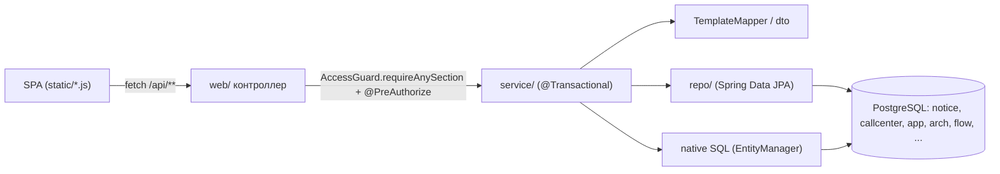

# Обзор бэкенда

Бэкенд админ-панели — одно Spring Boot 3.3-приложение (`ru.banki.crm`, точка входа `src/main/java/ru/banki/crm/CrmAdminApplication.java`, класс `CrmAdminApplication` — голый `@SpringBootApplication` без дополнительной конфигурации). Оно заменяет прежнюю панель на Appsmith: единый CRUD над четырьмя каналами коммуникаций (push / email / sms / call-center), собственная аутентификация с RBAC, конструктор цепочек (journeys) и материализация цепочек в процессные таблицы. Фронтенд — vanilla-JS SPA, которую это же приложение раздаёт как статику из `src/main/resources/static` (см. [[Обзор фронтенда]]).

Общая архитектура и связи с БД описаны в [[Обзор архитектуры]] и [[Схема БД]]; стек — в [[Технологии]]; профили, среды и env-переменные — в [[Конфигурация]] и [[Среды и деплой]].

## Структура пакетов

```
ru.banki.crm
├── CrmAdminApplication.java   — точка входа
├── web/          — REST-контроллеры (тонкие: guard + делегирование в service)
├── service/      — бизнес-логика, транзакции
│   └── flow/     — материализация цепочек (MaterializationService)
├── domain/       — JPA-сущности
├── repo/         — Spring Data JPA репозитории
├── dto/          — payload'ы API (records и @Data-классы)
├── security/     — Spring Security: конфиг, principal, ACL-guard
└── config/       — стартовые раннеры (AdminBootstrap)
```

### web/ — контроллеры

| Класс | Префикс | Назначение |
|---|---|---|
| `TemplateController` | `/api/templates` | CRUD шаблонов 4 каналов + батч «цепочка» — см. [[Шаблоны и мастер коммуникаций]] |
| `DictionaryController` | `/api/dictionaries` | справочники: партнёры, КЦ-сегменты, communication_name |
| `AdminUserController` | `/api/admin` | управление пользователями (только ADMIN) — см. [[Пользователи и доступ]] |
| `AuthController` | `/api/me`, `/api/me/password` | идентичность текущего пользователя, смена своего пароля |
| `EnvController` | `/api/env` | имя среды + флаг dev-фич (бейдж в шапке SPA) — см. [[Конфигурация]] |
| `JourneyController` | `/api/journeys` | CRUD цепочек-схем (класс целиком `hasRole('ADMIN')`) — см. [[Цепочки (Journeys)]] |
| `FlowController` | `/api/flow` | preview/materialize цепочек (класс целиком `hasRole('ADMIN')`) — см. [[Материализация (Flow)]] |
| `PanelSettingsController` | `/api/panel-settings` | настройки панели key → jsonb (`app.panel_settings`, V7): GET — все, PUT — ADMIN, запись в `t_admin_log` |

Полный перечень эндпоинтов с телами запросов — в [[REST API]].

### service/ — сервисы

- `TemplateService` — CRUD-диспетчер по каналам, батч-создание цепочки шаблонов.
- `TemplateMapper` — маппинг `TemplateDto` ↔ четыре сущности (только non-null поля).
- `DictionaryService` — справочники из живых данных (distinct-запросы).
- `NamingService` — суффиксирование A/B-вариантов имён коммуникаций.
- `UserService` — управление пользователями, смена паролей, защита последнего админа.
- `AuditContext` — GUC `app.current_user` для прод-триггера аудита (см. [[Аудит и журналирование]]).
- `AdminLogService` — журнал действий админки `arch.t_admin_log`.
- `Sections` — канонический список id разделов NAV (см. [[Пользователи и доступ]]).
- `JourneyService` (интерфейс) + `MockJourneyService` / `DbJourneyService` — хранилище цепочек.
- `flow/MaterializationService` — «компилятор» цепочки в строки слоёв A и B (см. [[Материализация (Flow)]], [[Слой A (flow)]], [[Слой B (процессные таблицы)]]).

### domain/ — сущности

- `TemplateBase` — `@MappedSuperclass` с общими колонками всех четырёх канальных таблиц (см. [[Справочники шаблонов]]).
- `PushTemplate` (`notice.push_template`), `EmailTemplate` (`notice.email_template`), `SmsTemplate` (`notice.d_com_sms_template`), `CcSegment` (`callcenter.d_segment_properties`).
- `AppUser` (`app.users`) + `Role` (enum READER/EDITOR/ADMIN).
- `Journey` (`app.journeys`) — схема цепочки одним jsonb-документом в колонке `definition`.

### repo/

`PushTemplateRepository`, `EmailTemplateRepository`, `SmsTemplateRepository`, `CcSegmentRepository`, `AppUserRepository`, `JourneyRepository` — Spring Data JPA, плюс несколько `@Query` (maxCode, distinct-справочники).

### dto/

`TemplateDto` (единый payload на все каналы), `TemplateListItemDto` (record, строка объединённого списка), `ChainRequest` (base + days), `UserDtos` (вложенные records UserView/CreateUser/UpdateUser/ResetPassword/ChangeOwnPassword), `MeDto` (record), `JourneyDtos`.

### security/

`SecurityConfig` (filter chain, formLogin `/api/login`, remember-me, logout), `CustomUserDetailsService`, `AppUserPrincipal` (обёртка `AppUser`, отдаёт authority `ROLE_<role>`), `CurrentUser` (статические аксессоры principal/email; без аутентификации `email()` возвращает `"system"`), `AccessGuard` (ACL по разделам). Детали — в [[Безопасность и RBAC]].

### config/

- `AdminBootstrap` — `CommandLineRunner`, идемпотентно создаёт первого супер-админа из `ADMIN_EMAIL`/`ADMIN_PASSWORD` при старте (пропускает, если пусто или пользователь уже есть; выдаёт роль ADMIN и все разделы).
- `WebConfig` — MVC-мелочи: форвард «красивых» адресов `/settings` и `/settings/` на статический `settings/index.html` (настроечная админка; Spring сам не отдаёт index.html для подкаталогов статики).

## Слои и поток запроса



Контроллеры тонкие: проверка доступа и делегирование. Транзакции живут на сервисном слое (`@Transactional` на методах сервисов, читающие — `readOnly = true`). `open-in-view: false`, `ddl-auto: none` — схему БД создаёт только Flyway (или она уже есть в проде).

## Сквозные паттерны

**Двухуровневый RBAC.** Роль = уровень возможностей (гарды `@PreAuthorize("hasAnyRole('EDITOR','ADMIN')")` на мутирующих методах и `hasRole("ADMIN")` на `/api/admin/**` в `SecurityConfig`), разделы = видимость (per-user ACL, проверяется `AccessGuard.requireAnySection(...)`, ADMIN обходит проверку разделов). Подробно — [[Безопасность и RBAC]].

**`@ConditionalOnProperty` для подмены реализации.** Интерфейс `JourneyService` имеет две реализации: `DbJourneyService` (`app.journeys.mock=false`, `matchIfMissing = true` — дефолт) и `MockJourneyService` (in-memory `ConcurrentHashMap`, `app.journeys.mock=true` — dev без БД). Выбор — env-переменной `JOURNEYS_MOCK` без пересборки.

**`@MappedSuperclass` вместо четырёх копий маппинга.** Общие колонки канальных таблиц вынесены в `TemplateBase`; полиморфизм по `channel()` / `businessCode()` позволяет строить объединённый список без UNION в Java-коде.

**Дефолты в сущностях под прод-NOT NULL.** Поля `TemplateBase` инициализированы (`""`, `false`, `0`, пустой список), чтобы вставки из сокращённой формы v1 не падали на прод-ограничениях.

**Единый DTO на все каналы.** `TemplateDto` содержит поля всех каналов; `TemplateMapper.apply` переносит только non-null значения, поэтому один и тот же метод работает и для create, и для частичного update.

**Конфигурируемые физические имена таблиц.** `app.tables.*` (`push`, `email`, `sms`, `cc`, `admin-log`) инжектятся через `@Value` — на проде расположение таблиц можно поменять env-переменными без правки кода.

**Native SQL там, где JPA неудобен.** Журналирование jsonb-строк (`AdminLogService.rowJson` — `to_jsonb(t)`), GUC `set_config` (`AuditContext`), вся материализация слоёв A/B — через `EntityManager.createNativeQuery`.

**Ошибки — `ResponseStatusException`.** Сервисы кидают 400/401/403/404/409 с русским сообщением; `server.error.include-message: always` отдаёт его фронту.

## Что дальше

- Шаблоны и справочники: [[Шаблоны и мастер коммуникаций]]
- Пользователи, роли, вход: [[Пользователи и доступ]], [[Управление доступом и вход]]
- Цепочки и их материализация: [[Цепочки (Journeys)]], [[Материализация (Flow)]]
- Журналы: [[Аудит и журналирование]]
- Конфигурация и профили: [[Конфигурация]]
