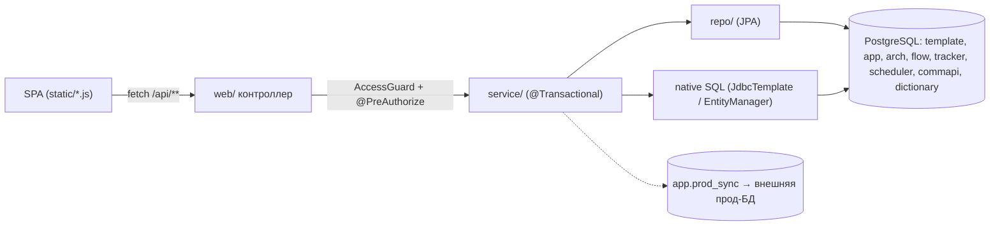

# Обзор бэкенда

Карта серверных классов: что за что отвечает и куда идти за подробностями. Одна строка на класс — детали живут в тематических заметках, здесь только ссылки.

Бэкенд — одно Spring Boot 3.3-приложение (`ru.banki.crm`, точка входа `CrmAdminApplication` — голый `@SpringBootApplication`). Оно же раздаёт vanilla-JS SPA из `src/main/resources/static` (см. [[Обзор фронтенда]]). Архитектура целиком — [[Обзор архитектуры]], стек — [[Технологии]], БД — [[Схема БД]].

## Структура пакетов

```
ru.banki.crm
├── CrmAdminApplication.java   — точка входа
├── web/          — REST-контроллеры (тонкие: гард доступа + делегирование)
├── service/      — бизнес-логика, транзакции
│   ├── flow/     — материализация цепочек
│   ├── prod/     — обмен с внешней прод-БД (синк, ETL, сверка)
│   └── schema/   — Scheme Builder: осмотр базы, планирование и применение DDL
├── domain/       — JPA-сущности
├── repo/         — Spring Data JPA репозитории
├── dto/          — payload'ы API
├── security/     — Spring Security: конфиг, principal, гард прав
└── config/       — стартовые раннеры и MVC-мелочи
```

## web/ — контроллеры

| Класс | Префикс | Назначение |
|---|---|---|
| `TemplateController` | `/api/templates` | CRUD шаблонов + батч «цепочка», фасеты и счётчики списка — [Шаблоны и мастер коммуникаций](Шаблоны%20и%20мастер%20коммуникаций.md) |
| `DictionaryController` | `/api/dictionaries` | справочные значения форм мастера — [Шаблоны и мастер коммуникаций](Шаблоны%20и%20мастер%20коммуникаций.md) |
| `JourneyController` | `/api/journeys` | CRUD цепочек-схем — [Цепочки (Journeys)](Цепочки%20(Journeys).md) |
| `FlowController` | `/api/flow` | preview/materialize цепочек — [Материализация (Flow)](Материализация%20(Flow).md) |
| `AuthController` | `/api/me` | идентичность текущего пользователя и смена своего пароля — [[Безопасность и RBAC]] |
| `AdminUserController` | `/api/admin` | пользователи и их доступы — [[Безопасность и RBAC]] |
| `RoleController` | `/api/admin/roles` | справочник ролей и матрица прав — [[Безопасность и RBAC]] |
| `EnvController` | `/api/env` | имя среды + флаг dev-фич — [Конфигурация](Конфигурация.md) |
| `PanelSettingsController` | `/api/panel-settings` | настройки панели `key → jsonb` в `app.panel_settings`; GET — любой аутентифицированный, PUT — ADMIN, запись в журнал |
| `DbConnectionController` | `/api/admin/db-connections` | реестр подключений к БД для страницы «Диагностика» |
| `ProdSyncController` | `/api/admin/prod-db` | очередь синка и сверка с прод-БД — [Синхронизация с прод-БД](Синхронизация%20с%20прод-БД.md) |
| `EtlController` | `/api/admin/etl` | статус и ручной запуск ETL «прод → мы» — [Синхронизация с прод-БД](Синхронизация%20с%20прод-БД.md) |
| `PromoPlanController` | `/api/promo/plan` | общая таблица планирования промо — [Планирование промо](Планирование%20промо.md) |
| `AbTestController` | `/api/ab-tests` | общая таблица А/Б тестов — [АБ тесты](АБ%20тесты.md) |
| `ReportConnectionController` | `/api/reports/connections` | конфиг подключения раздела «Отчёты» к Tableau — [Отчёты](Отчёты.md) |
| `SmsCheckReportController` | `/api/reports/sms-check` | отчёт «ЧЕК СМС траффик»: лист «по дням», продукты, выгрузка в Excel — [Отчёты](Отчёты.md) |
| `SchemaController` | `/api/schema` | модель Scheme Builder, история версий, осмотр базы и применение DDL; класс целиком `@PreAuthorize("hasRole('ADMIN')")` |

Плюс `ValidationErrorHandler` — не контроллер, а `@RestControllerAdvice` на весь `web/`: превращает `MethodArgumentNotValidException` в читаемое сообщение (см. «Сквозные паттерны»).

Полный список эндпоинтов с телами запросов — в [[REST API]].

## service/ — сервисы

- `TemplateStore` — низкоуровневый доступ к единому справочнику `template.d_template` (native SQL через `JdbcTemplate`), маппинг DTO ↔ колонки и `channel_props`.
- `TemplateService` — CRUD поверх `TemplateStore`: генерация кодов, фильтрация/сортировка/пагинация списка, батч «цепочка».
- `UnifiedTemplateService` — описание внешних прод-таблиц по каналам (`channelTable`) и постановка операций в очередь синка.
- `DictionaryService` — значения для форм мастера из `template.d_template` и схемы `dictionary`.
- `NamingService` — суффиксирование A/B-вариантов имени коммуникации.
- `JourneyService` (интерфейс) + `DbJourneyService` / `MockJourneyService` — хранилище цепочек-схем.
- `flow/MaterializationService` — «компилятор» цепочки в строки слоёв A и B.
- `AuditContext` — GUC `app.current_user` перед мутацией.
- `AdminLogService` — журнал действий админки `arch.t_admin_log`.
- `UserService` — пользователи, пароли, защита последнего админа.
- `RoleService` — роли-справочник и матрица прав по разделам.
- `Sections` — канонический список id разделов NAV.
- `PromoPlanService` — планирование промо с оптимистической блокировкой по `timestamp_upd`.
- `AbTestService` — журнал А/Б тестов, та же схема «правка по ячейке + версия строки».
- `DbConnectionService` — реестр подключений `app.db_connection` + две встроенные строки (наша БД и прод-приёмник) и проверка соединения.
- `SmsCheckReportService` — отчёт «ЧЕК СМС траффик»: запрос к витрине DWH, лист «по дням» данными и сборка Excel-книги.
- `SchemaModelService` — модель Scheme Builder в `app.schema_model`, история версий и собственный журнал `app.schema_audit`.
- `schema/SchemaInspectService` — что реально есть в базе (схемы и таблицы) для обозревателя.
- `schema/DdlPlanner` — план изменений «модель против базы».
- `schema/SchemaDdlService` — применение DDL, но только к своему: право даёт запись в реестре `app.schema_owned`, а не факт наличия объекта.
- `prod/ProdDbService` — собственный Hikari-пул к внешней прод-БД и запись строк туда.
- `prod/ProdSyncService` — обработчик очереди `app.prod_sync`.
- `prod/ProdReconcileService` — сверка нашей копии с продом и обратный импорт.
- `prod/NoticeEtlService` — инкрементальный и полный ETL «прод → мы».

Первые семь — темы заметок [Шаблоны и мастер коммуникаций](Шаблоны%20и%20мастер%20коммуникаций.md), [Цепочки (Journeys)](Цепочки%20(Journeys).md) и [Материализация (Flow)](Материализация%20(Flow).md); журналирующая пара — [Аудит и журналирование](Аудит%20и%20журналирование.md); пользователи, роли и разделы — [[Безопасность и RBAC]]; всё из `service/prod` — [Синхронизация с прод-БД](Синхронизация%20с%20прод-БД.md); промо и А/Б — [Планирование промо](Планирование%20промо.md) и [АБ тесты](АБ%20тесты.md); отчёты — [Отчёты](Отчёты.md).

## domain/ — сущности

- `AppUser` (`app.users`) + `SectionAccess` (`app.user_sections`, `@Embeddable` в `@ElementCollection`).
- `Role` (`app.role`) — роль как запись справочника, не enum; `Capability` — что учётка может делать в разделе. Подробно — [[Безопасность и RBAC]].
- `Journey` (`app.journeys`) — схема цепочки одним jsonb-документом.

**Сущностей шаблонов больше нет.** Канальные таблицы `notice.*` / `callcenter.*` вынесены за пределы приложения (миграция `V12`), шаблоны живут в `template.d_template` и читаются/пишутся native SQL — см. [Шаблоны и мастер коммуникаций](Шаблоны%20и%20мастер%20коммуникаций.md).

## repo/

`AppUserRepository`, `RoleRepository`, `JourneyRepository` — Spring Data JPA. Всё остальное (шаблоны, слои A/B, очередь синка, настройки панели, промо) идёт мимо JPA, native-запросами.

## dto/

`TemplateDto` (единый payload на все каналы), `TemplateListItemDto` (строка списка), `ChainRequest` (base + days), `JourneyDtos` (узел/ребро/схема/строка списка), `UserDtos`, `RoleDtos`, `MeDto`.

## security/ и config/

`SecurityConfig`, `CustomUserDetailsService`, `AppUserPrincipal`, `AccessGuard` (`requireAnySection` / `requireCapability`), `CurrentUser` (статические аксессоры; без аутентификации `email()` возвращает `"system"` — так подписаны фоновые записи в журналах). `config/AdminBootstrap` держит супер-админа привязанным к `ADMIN_EMAIL`, `config/WebConfig` форвардит `/settings` на статический `settings/index.html`. Модель доступа целиком — [[Безопасность и RBAC]].

## Поток запроса



Контроллеры тонкие: проверка доступа и делегирование. Транзакции — на сервисном слое (`@Transactional`, читающие с `readOnly = true`). `open-in-view: false`, `ddl-auto: none` — схему создаёт только Flyway (миграции доросли до **V33**), см. [[Схема БД]].

## Сквозные паттерны

**Одна таблица шаблонов вместо четырёх сущностей.** Ядро — типизированные колонки, всё канальное — `channel_props jsonb`. Новый канал не требует ни миграции, ни JPA-сущности; так добавились `fa`, `vk`, `la` (`V13`). См. [Шаблоны и мастер коммуникаций](Шаблоны%20и%20мастер%20коммуникаций.md).

**Outbox вместо прямой записи в прод.** Мастер пишет только к себе, операция встаёт в очередь `app.prod_sync` и доставляется фоном. См. [Синхронизация с прод-БД](Синхронизация%20с%20прод-БД.md).

**`@ConditionalOnProperty` для подмены реализации.** `JourneyService`: `DbJourneyService` (дефолт, `matchIfMissing = true`) или `MockJourneyService` (`JOURNEYS_MOCK=true`) — выбор env-переменной без пересборки.

**Роли — данные, а не код.** Матрица прав лежит в `app.role` / `app.role_section` (`V21`–`V23`) и правится из UI; `V29` развела отчёты и мониторинг по секции на пункт меню, зонтичных `reports` / `monitoring` больше нет. См. [[Безопасность и RBAC]].

**Native SQL там, где JPA неудобен.** Шаблоны (`jsonb` + `text[]`), материализация слоёв A/B, журналы, очередь синка, настройки панели.

**Ошибки — `ResponseStatusException`.** Сервисы кидают 400/401/403/404/409 с русским сообщением; `server.error.include-message: always` отдаёт его фронту.

**Ошибки валидации тела — тоже по-русски.** `web/ValidationErrorHandler` (`src/main/java/ru/banki/crm/web/ValidationErrorHandler.java:31`) ловит `MethodArgumentNotValidException` и склеивает через «; » сообщения самих ограничений (они заданы по-русски в `UserDtos` и `RoleDtos`), отдавая их тем же полем `message`, что и остальные ошибки. Без него Spring отвечал служебным «Validation failed for object='createUser'. Error count: 1» — какое поле не устроило, не сказано, и починить по такому тексту нельзя: администратор видел его на каждую попытку завести пользователя, а причина (короткий пароль, не выбрана роль, адрес не похож на почту) снаружи выглядела одинаково. Поля собираются в `LinkedHashSet` — порядок формы сохраняется, одинаковые тексты схлопываются.

## Что дальше

- Шаблоны и справочники: [Шаблоны и мастер коммуникаций](Шаблоны%20и%20мастер%20коммуникаций.md)
- Цепочки и материализация: [Цепочки (Journeys)](Цепочки%20(Journeys).md), [Материализация (Flow)](Материализация%20(Flow).md)
- Общие таблицы команды: [Планирование промо](Планирование%20промо.md), [АБ тесты](АБ%20тесты.md)
- Аналитика: [Отчёты](Отчёты.md)
- Доступ, роли, вход: [[Безопасность и RBAC]]
- Обмен с продом: [Синхронизация с прод-БД](Синхронизация%20с%20прод-БД.md)
- Журналы: [Аудит и журналирование](Аудит%20и%20журналирование.md)
- Конфигурация: [Конфигурация](Конфигурация.md) · Среды и деплой: [[Среды и деплой]]
- Сквозной путь запроса от UI до прода: [[Флоу системы]]
