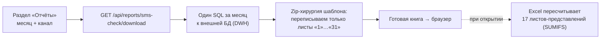

# Отчёты

Раздел «Отчёты» (section id `reports`) — единственное место, где панель отдаёт аналитику. Внутри две независимые части:

| Часть | Что делает | Код |
|---|---|---|
| **Встраивание Tableau** | показывает опубликованные книги Tableau прямо в панели | `web/ReportConnectionController`, `static/js/reports.js` |
| **«ЧЕК СМС траффик»** | помесячная выгрузка `.xlsx` по каналу | `service/SmsCheckReportService`, `web/SmsCheckReportController`, `static/js/smscheck.js` |

Общее у обеих: **настраивает только ADMIN, пользуется любой, у кого есть право READ на раздел `reports`**. Раздел не входит в `Sections.WRITABLE` — в матрице прав у него значима только галка «Просмотр» ([[Безопасность и RBAC]]). Пути и коды ответов — [[REST API]].

## Встраивание Tableau

Панель не считает эти отчёты сама: она вставляет в страницу веб-компонент `<tableau-viz>` и подгружает Tableau Embedding API v3 с указанного сервера (`{server}/javascripts/api/tableau.embedding.3.latest.min.js`). Всё, что нужно панели, — три поля на отчёт: адрес сервера, путь к опубликованной книге/листу (`view`, например `CRMMatrix/Overview`) и, опционально, токен.

Фиксированный набор отчётов задан во фронте (`RP_EMBED_META` в `reports.js`): `planfact` (Plan-Fact), `matrix` (CRM Matrix), `leadgen` (CRM Leadgen). Сервер идентификатор не перечисляет, а валидирует регуляркой `[a-zA-Z][a-zA-Z0-9_-]{0,31}` — новый отчёт добавляется правкой фронта, миграция не нужна.

### Где лежит конфиг

Одна строка `app.panel_settings` с ключом **`tableauReports`** ([[Таблицы приложения]]): jsonb-документ `{ "<report>": {server, view, token} }`. Строка появляется при первом `PUT`, отдельной миграции нет. Конфиг **общий на всю панель** — раньше он жил в `localStorage` каждого пользователя, из-за чего у всех было своё подключение.

### Почему у раздела свой контроллер, а не общий `/api/panel-settings`

В значении лежит токен Tableau (JWT/PAT), а `GET /api/panel-settings/{key}` открыт любому аутентифицированному — оболочка читает конфиг приложений при загрузке. Поэтому:

- ключ `tableauReports` внесён в `RESTRICTED_KEYS` `PanelSettingsController` и через общий эндпоинт **не обслуживается ни на чтение, ни на запись**. Ответ — ровно `404`, а не `403`: по коду не должно быть видно, заведён ли секрет; регистр ключа игнорируется;
- обслуживает его `ReportConnectionController` (`/api/reports/connections`), который умеет резать значение по роли.

### Правила выдачи и записи

- **`GET`** отдаёт `{canEdit, items}`. Не-админу вместо `token` уходит только флаг `hasToken` — интерфейс может сказать «подключение настроено», не раскрывая секрет. Админу токен отдаётся: он же его и задаёт, и `<tableau-viz>` подставляет его в разметку. Прочим ролям отчёт открывается без токена — авторизацию берёт на себя сам Tableau (SSO/гостевой доступ).
- **`PUT`** (ADMIN): `server` и `view` обязательны — без них встраивание показывает ту же заглушку «не настроено», что и при отсутствии подключения (раньше пустые значения сохранялись с `200`, админ считал отчёт настроенным, а у людей он не открывался). Токен НЕ обязателен. **Пустой токен не затирает сохранённый**: пустое поле слишком легко получить случайно, а токен нигде больше не хранится и его пришлось бы перевыпускать.
- **`DELETE`** (ADMIN) — единственный способ удалить сохранённый токен («Очистить»).
- В журнал (`arch.t_admin_log`, [[Аудит и журналирование]]) пишется только факт правки и состав отчётов — строку целиком класть нельзя, в ней токен, а журнал доступен шире, чем сам конфиг.

Пока подключение не задано, раздел показывает демонстрационный макет на плейсхолдер-данных (`RP_DATA` в `reports.js`) — это заглушка, а не отчётность.

## Отчёт «ЧЕК СМС траффик»

Помесячная выгрузка в Excel: пользователь выбирает **месяц** и **канал** (`sms` / `push` / `email`) и скачивает готовую книгу `check-sms-{channel}-{YYYY-MM}.xlsx`. Никакой аналитики панель не считает — она заполняет сырьё, а всё остальное досчитывает Excel.

### Что происходит по нажатию «Скачать»

1. **Один SQL за весь месяц** к витрине `crm.v_crm_matrix_report`: группировка по дню (`report_date`) и разрезам (`communication_name`, `event_name`, `source_type`, `template_id`, `template_text`), фильтр `report_date >= :from AND report_date < :to AND channel_name ilike :channel`. 15 метрик считаются прямо в запросе (`unique_sent`, `unique_delivered`, `ho_clicks_line`, `cr`, `ho_conversions_line`, `ho_issued_line`, `cost`, `revenue_fact`, `revenue_base`, `margin`, `margin_rate`, `epc`, `epl`, `epi`, `epm`). Запрос идёт с `readOnly`-соединением и таймаутом 120 с.
2. Строки раскладываются **по листам сырья «1»…«31»** готового шаблона `src/main/resources/reports/sms-check-template.xlsx` (кэшируется в памяти при первом обращении). Лист дня: строка 1 — шапка, строка 2 — `Grand Total` (считается на нашей стороне), дальше данные; колонки A–E — разрезы, F–T — метрики.
3. **17 листов-представлений** (анкета, каталог, …, свод, карта) панель не трогает — они агрегируют сырьё формулами `SUMIFS` и пересчитываются при открытии книги.
4. **Ключ связки** — `source_type + template_id` **без разделителя**; пишется значением в колонку **V** (плюс копия текста шаблона в колонку **Z** для лукапа «текст» в представлениях). По этому ключу представления и матчат метрики.

### Приём: «хирургия по zip» вместо Apache POI

`.xlsx` — это zip-архив XML-частей. Панель распаковывает шаблон в память, **перезаписывает только XML листов-дней** (путь части находится по `xl/workbook.xml` → `r:id` → `xl/_rels/workbook.xml.rels`), а всё остальное — тяжёлые листы-представления, стили, `sharedStrings`, внешние связи — копирует **байт-в-байт** и собирает архив обратно. Дополнительно:

- в `xl/workbook.xml` проставляется `<calcPr … fullCalcOnLoad="1"/>`;
- удаляется `xl/calcChain.xml` (и упоминания о нём в `[Content_Types].xml` и `workbook.xml.rels`) — Excel пересоберёт цепочку сам.

**Зачем так.** Книга — 4 МБ, 48 листов, ~150 тыс. формул. Полноценная загрузка такого файла в Apache POI и правка ячеек уходили в **минуты** (обслуживание `calcChain` — фактически O(n²)), а за nginx это гарантированный таймаут. Zip-подход даёт **~0.6 с**. POI в зависимости проекта так и **не добавляли**.

### Источник данных

DWH — это **внешнее подключение из реестра `app.db_connection`** (страница «Диагностика» в настроечной админке `/settings`, см. [[Синхронизация с прод-БД]] — тот же реестр). Выбранный id хранится в `app.panel_settings` под ключом **`smsCheckReport`** (`{"connectionId": N}`).

- Выбирает подключение **только ADMIN** (`SmsCheckReportService.configSet` кидает `403 «Менять источник может только администратор.»`); в списке фронт показывает только реальные внешние подключения, встроенные (`builtin`) отсекает.
- `GET /api/reports/sms-check/config` возвращает `{connectionId, connectionName, canEdit, channels}` — по `canEdit` фронт решает, показывать ли форму источника. **Сам коннект (url/логин/пароль) наружу не отдаётся**: при выгрузке он читается из `app.db_connection` на сервере, а не приходит в запросе.
- Скачивать может любой с правом READ на `reports`.
- Источник не выбран → `409` с текстом «Источник данных (DWH) не выбран…»; подключение удалили → `409`; ошибка самого запроса к DWH → `502` с корневым сообщением драйвера.

### Статус

Сделан 28–30.07.2026, лежит на среде test. **Ждёт заведения реального DWH-коннекта** — до этого раздел показывает подсказку «Источник данных ещё не настроен». Перед проверкой на проде нужно завести подключение к витрине в «Диагностике» и выбрать его в форме источника.

## Смежные заметки

- Эндпоинты и коды ответов — [[REST API]]
- Права на разделы и capability-матрица — [[Безопасность и RBAC]]
- `app.panel_settings`, `app.db_connection` — [[Таблицы приложения]]
- Журнал изменений настроек — [[Аудит и журналирование]]
- Реестр подключений и внешние БД — [[Синхронизация с прод-БД]]
- Оболочка, NAV и разделы — [[Оболочка панели (shell)]]
