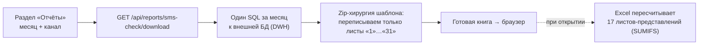

# Отчёты

Группа «Отчёты» — единственное место, где панель отдаёт аналитику. Внутри две независимые части:

| Часть | Что делает | Код |
|---|---|---|
| **Встраивание Tableau** | показывает опубликованные книги Tableau прямо в панели | `web/ReportConnectionController`, `static/js/reports.js` |
| **«ЧЕК СМС траффик»** | помесячный отчёт по каналу: лист «по дням» на странице + выгрузка `.xlsx` | `service/SmsCheckReportService`, `web/SmsCheckReportController`, `static/js/smscheck.js` |

**Зонтичной секции `reports` больше нет.** Миграция `V29` развела отчёты по секции на пункт меню — `rep-planfact`, `rep-matrix`, `rep-leadgen`, `rep-smscheck`, `rep-demo` (`src/main/java/ru/banki/crm/service/Sections.java:29`). Раньше одна галка «Отчёты» открывала сразу все пять, а доступ к ним нужен разный. Группа сайдбара сама скрывается, когда скрыты все её дети. Ни одна из этих секций не входит в `Sections.WRITABLE` — серверных записей у отчётов нет, значима только галка «Просмотр» ([[Безопасность и RBAC]]).

Общее у обеих частей: **настраивает только ADMIN, пользуется любой, у кого есть READ на секцию своего отчёта**. Пути и коды ответов — [[REST API]].

## Встраивание Tableau

Панель не считает эти отчёты сама: она вставляет в страницу веб-компонент `<tableau-viz>` и подгружает Tableau Embedding API v3 с указанного сервера (`{server}/javascripts/api/tableau.embedding.3.latest.min.js`). Всё, что нужно панели, — три поля на отчёт: адрес сервера, путь к опубликованной книге/листу (`view`, например `CRMMatrix/Overview`) и, опционально, токен.

Фиксированный набор отчётов задан во фронте (`RP_EMBED_META` в `reports.js`): `planfact` (Plan-Fact), `matrix` (CRM Matrix), `leadgen` (CRM Leadgen). Сервер идентификатор не перечисляет, а валидирует регуляркой `[a-zA-Z][a-zA-Z0-9_-]{0,31}` — новый отчёт добавляется правкой фронта, миграция не нужна.

### Где лежит конфиг

Одна строка `app.panel_settings` с ключом **`tableauReports`** ([[Таблицы приложения]]): jsonb-документ `{ "<report>": {server, view, token} }`. Строка появляется при первом `PUT`, отдельной миграции нет. Конфиг **общий на всю панель** — раньше он жил в `localStorage` каждого пользователя, из-за чего у всех было своё подключение.

### Почему у раздела свой контроллер, а не общий `/api/panel-settings`

В значении лежит токен Tableau (JWT/PAT), а `GET /api/panel-settings/{key}` открыт любому аутентифицированному — оболочка читает конфиг приложений при загрузке. Поэтому:

- ключ `tableauReports` внесён в `RESTRICTED_KEYS` `PanelSettingsController` и через общий эндпоинт **не обслуживается ни на чтение, ни на запись**. Ответ — ровно `404`, а не `403`: по коду не должно быть видно, заведён ли секрет; регистр ключа игнорируется;
- обслуживает его `ReportConnectionController` (`/api/reports/connections`), который умеет резать значение по роли.

### Правила выдачи и записи

- **`GET`** отдаёт `{canEdit, items}`, и **только те отчёты, на секцию которых у пользователя есть READ** (`rep-<report>`, `ReportConnectionController.sectionOf`): иначе спрятанный в меню пункт всё равно открывался бы прямой ссылкой. Не-админу вместо `token` уходит только флаг `hasToken` — интерфейс может сказать «подключение настроено», не раскрывая секрет. Админу токен отдаётся: он же его и задаёт, и `<tableau-viz>` подставляет его в разметку. Прочим ролям отчёт открывается без токена — авторизацию берёт на себя сам Tableau (SSO/гостевой доступ).
- **`PUT`** (ADMIN): `server` и `view` обязательны — без них встраивание показывает ту же заглушку «не настроено», что и при отсутствии подключения (раньше пустые значения сохранялись с `200`, админ считал отчёт настроенным, а у людей он не открывался). Токен НЕ обязателен. **Пустой токен не затирает сохранённый**: пустое поле слишком легко получить случайно, а токен нигде больше не хранится и его пришлось бы перевыпускать.
- **`DELETE`** (ADMIN) — единственный способ удалить сохранённый токен («Очистить»).
- В журнал (`arch.t_admin_log`, [Аудит и журналирование](Аудит%20и%20журналирование.md)) пишется только факт правки и состав отчётов — строку целиком класть нельзя, в ней токен, а журнал доступен шире, чем сам конфиг.

Пока подключение не задано, раздел показывает демонстрационный макет на плейсхолдер-данных (`RP_DATA` в `reports.js`) — это заглушка, а не отчётность.

## Отчёт «ЧЕК СМС траффик»

Секция `rep-smscheck`. Пользователь выбирает **месяц**, **канал** (`sms` / `push` / `email`) и, если нужно, **продукт**, и либо смотрит сводку прямо на странице, либо скачивает готовую книгу `check-sms-{channel}-{YYYY-MM}.xlsx`. Аналитику панель почти не считает: в Excel она заполняет сырьё, а представления досчитывает сам Excel.

Пять ручек `/api/reports/sms-check/**`, все под `requireCapability(READ, rep-smscheck)` — даже `PUT /config`: право на запись у секции отчёта не значимо, поэтому «только ADMIN» проверяется внутри сервиса, а не гардом.

| Ручка | Что делает |
|---|---|
| `GET /config` | текущий источник-DWH, список каналов, `canEdit` |
| `PUT /config` | задать источник (внутри — проверка «только ADMIN») |
| `GET /daily` | лист «по дням» **данными**, для показа на странице |
| `GET /products` | значения фильтра по продукту |
| `GET /download` | книга `.xlsx` |

### Канал страницы ≠ канал витрины

`sms → sms`, `email → email`, а вот **`push → mobile-push`** (`SmsCheckReportService.java:107`). В витрине пуш записан именно так, и запрос с `channel_name ilike 'push'` молча возвращал пустоту: ошибки нет, просто ни одна строка не подошла. Нейминг тот же, что у `campaign_name` во фронте.

### Что происходит по нажатию «Скачать»

1. **Один SQL за весь месяц** к витрине `crm.v_crm_matrix_report`: группировка по дню (`report_date`) и разрезам (`communication_name`, `event_name`, `source_type`, `template_id`, `template_text`), фильтр `report_date >= :from AND report_date < :to AND channel_name ilike :channel`. 15 метрик считаются прямо в запросе (`unique_sent`, `unique_delivered`, `ho_clicks_line`, `cr`, `ho_conversions_line`, `ho_issued_line`, `cost`, `revenue_fact`, `revenue_base`, `margin`, `margin_rate`, `epc`, `epl`, `epi`, `epm`). Запрос идёт с `readOnly`-соединением и таймаутом 120 с.
2. Строки раскладываются **по листам сырья «1»…«31»** готового шаблона `src/main/resources/reports/sms-check-template.xlsx` (кэшируется в памяти при первом обращении). Лист дня: строка 1 — шапка, строка 2 — `Grand Total` (считается на нашей стороне), дальше данные; колонки A–E — разрезы, F–T — метрики.
3. **17 листов-представлений** (анкета, каталог, …, свод, карта) панель не трогает — они агрегируют сырьё формулами `SUMIFS` и пересчитываются при открытии книги.
4. **Ключ связки** — `source_type + template_id` **без разделителя**; пишется значением в колонку **V** (плюс копия текста шаблона в колонку **Z** для лукапа «текст» в представлениях). По этому ключу представления и матчат метрики.

### Ключ связки нормализуется: префикс `CFE_` снимается

`SmsCheckReportService.key` (`src/main/java/ru/banki/crm/service/SmsCheckReportService.java:477`) срезает с источника префикс `CFE_` (и `CFE_MKP_`). Кампания одна и та же — `CFE_sms_trigger_microloans_issue_10day` и `sms_trigger_microloans_issue_10day` это одна строка отчёта, — но в витрине она теперь идёт с префиксом, а перечни кампаний в листах-категориях составлены без него. Без нормализации `SUMIFS` не находит ничего и все представления показывают нули.

Два частных случая:

- источники `CFE` и `CFE_MKP` — сами по себе значения, а не кампании с префиксом; без исключения `CFE_MKP` обрезался бы до `MKP`, потому что строка начинается с `CFE_`;
- если после префикса ничего не осталось, он не снимается: ключ стал бы голым `template_id` и слипся бы с чужими строками.

**В самом листе-дне источник остаётся как в витрине, с префиксом** — это данные, подменять их нельзя. Нормализуется только ключ сопоставления.

### Приём: «хирургия по zip» вместо Apache POI

`.xlsx` — это zip-архив XML-частей. Панель распаковывает шаблон в память, **перезаписывает только XML листов-дней** (путь части находится по `xl/workbook.xml` → `r:id` → `xl/_rels/workbook.xml.rels`), а всё остальное — тяжёлые листы-представления, стили, `sharedStrings`, внешние связи — копирует **байт-в-байт** и собирает архив обратно. Дополнительно:

- в `xl/workbook.xml` проставляется `<calcPr … fullCalcOnLoad="1"/>`;
- удаляется `xl/calcChain.xml` (и упоминания о нём в `[Content_Types].xml` и `workbook.xml.rels`) — Excel пересоберёт цепочку сам.

**Зачем так.** Книга — 4 МБ, 48 листов, ~150 тыс. формул. Полноценная загрузка такого файла в Apache POI и правка ячеек уходили в **минуты** (обслуживание `calcChain` — фактически O(n²)), а за nginx это гарантированный таймаут. Zip-подход даёт **~0.6 с**. POI в зависимости проекта так и **не добавляли**.

### Лист «по дням» на странице — `daily()`

`GET /api/reports/sms-check/daily` (`SmsCheckReportService.java:227`) отдаёт тот же лист «по дням», но данными и **без скачивания книги**: `{month, channel, product, days, rows}`, где каждая строка — `{key, label, unit, values[], total}`.

Считается ровно то, что в шаблоне считают формулы этого листа: он самодостаточен и берёт из каждого листа-дня только строку Grand Total плюс один `SUMIFS` по сервисному шаблону `template_id = 180` (его косты в шаблоне вынесены отдельной строкой, поэтому константа зашита и у нас). Данные — из того же `query()`, что уезжает в Excel, так что цифры на странице и в книге сходятся по построению.

Тринадцать строк: отправлено, выдач, CR, rew, cost, cost-сервис, cost без сервисных, GM, GM %, динамика отправок, динамика rew, стоимость СМС, EPS. Отношения (`CR`, `GM %`, `EPS`) и по дням, и в итоге считаются **от сумм**, а не усредняются по дням.

Две особенности шаблона намеренно **не** повторяются:

- в строке «выдач» одиннадцатый день там ссылается на лист «10» — опечатка автора, из-за которой десятое число показано дважды;
- динамика первого дня в шаблоне считается к 31-му числу того же месяца; предыдущего дня у первого числа нет, поэтому у нас пусто.

### Фильтр по продукту — `products()`

Колонка продукта в витрине ищется перебором `product_type` → `product_name` → `product` (`SmsCheckReportService.java:631`), и проверяется **пробой самой витрины** (`SELECT <col> FROM view WHERE false`), а не `information_schema.columns`. Каталожный вид показывает только то, на что у текущей роли есть права, и при доступе через представление или групповую выдачу приходит пустым, хотя `SELECT` работает — ровно поэтому фильтр когда-то и не заводился. Проба ничего не читает (планировщик отсекает всё по `WHERE false`) и кэшируется на подключение.

Список значений собирается из двух источников:

- **известный перечень продуктов** (`KNOWN_PRODUCTS`, 21 значение: `autocredits`, `creditcards`, `microloans`, `osago`, …) — он основа, а не подсказка, и показывается всегда;
- **то, что реально нашлось в витрине** за выбранный месяц и канал — добавляется сверху, поэтому новый продукт появляется в фильтре сам.

Запрос за значениями идёт **в фоне**, одним потоком-демоном (`refreshProducts`, `SmsCheckReportService.java:702`): `SELECT DISTINCT` по месяцу на большой витрине занимает столько же, сколько сам отчёт, и синхронно выпадающий список стоял бы пустым, пока не досчитается таблица. Ответ отдаётся сразу с флагом `pending: true`, результат витрины подмешивается к следующему обращению уже из кэша. В кэш кладётся и пустой ответ — значит за этот месяц продуктов нет, и дёргать витрину при каждом открытии раздела незачем.

Ошибка запроса наверх не поднимается: она уходит полем `note` в ответе. Пустой выпадающий список бесполезен, а причин у пустого ответа много — права, тайм-аут на тяжёлом `DISTINCT`, пустой период; фильтр работает и без витрины, а человеку видно, почему список мог не пополниться.

Выбранный продукт добавляет в основной запрос ещё одно условие `AND <колонка> = ?` — запрос для того и разрезан на `SQL_HEAD` / `SQL_TAIL`. Если колонку найти не удалось, фильтр просто не применяется.

### Источник данных

DWH — это **внешнее подключение из реестра `app.db_connection`** (страница «Диагностика» в настроечной админке `/settings`, см. [Синхронизация с прод-БД](Синхронизация%20с%20прод-БД.md) — тот же реестр). Выбранный id хранится в `app.panel_settings` под ключом **`smsCheckReport`** (`{"connectionId": N}`).

- Выбирает подключение **только ADMIN** (`SmsCheckReportService.configSet` кидает `403 «Менять источник может только администратор.»`); в списке фронт показывает только реальные внешние подключения, встроенные (`builtin`) отсекает.
- `GET /api/reports/sms-check/config` возвращает `{connectionId, connectionName, canEdit, channels}` — по `canEdit` фронт решает, показывать ли форму источника. **Сам коннект (url/логин/пароль) наружу не отдаётся**: при выгрузке он читается из `app.db_connection` на сервере, а не приходит в запросе.
- Смотреть и скачивать может любой с правом READ на секцию `rep-smscheck`.
- Источник не выбран → `409` с текстом «Источник данных (DWH) не выбран…»; подключение удалили → `409`; ошибка самого запроса к DWH → `502` с корневым сообщением драйвера; неизвестный канал или месяц не в формате `YYYY-MM` → `400`.

### Статус

Отчёт лежит на среде test и **ждёт заведения реального DWH-коннекта** — до этого раздел показывает подсказку «Источник данных ещё не настроен». Перед проверкой на проде нужно завести подключение к витрине в «Диагностике» и выбрать его в форме источника.

## Смежные заметки

- Эндпоинты и коды ответов — [[REST API]]
- Права на разделы и capability-матрица — [[Безопасность и RBAC]]
- `app.panel_settings`, `app.db_connection` — [[Таблицы приложения]]
- Журнал изменений настроек — [Аудит и журналирование](Аудит%20и%20журналирование.md)
- Реестр подключений и внешние БД — [Синхронизация с прод-БД](Синхронизация%20с%20прод-БД.md)
- Оболочка, NAV и разделы — [[Оболочка панели (shell)]]
