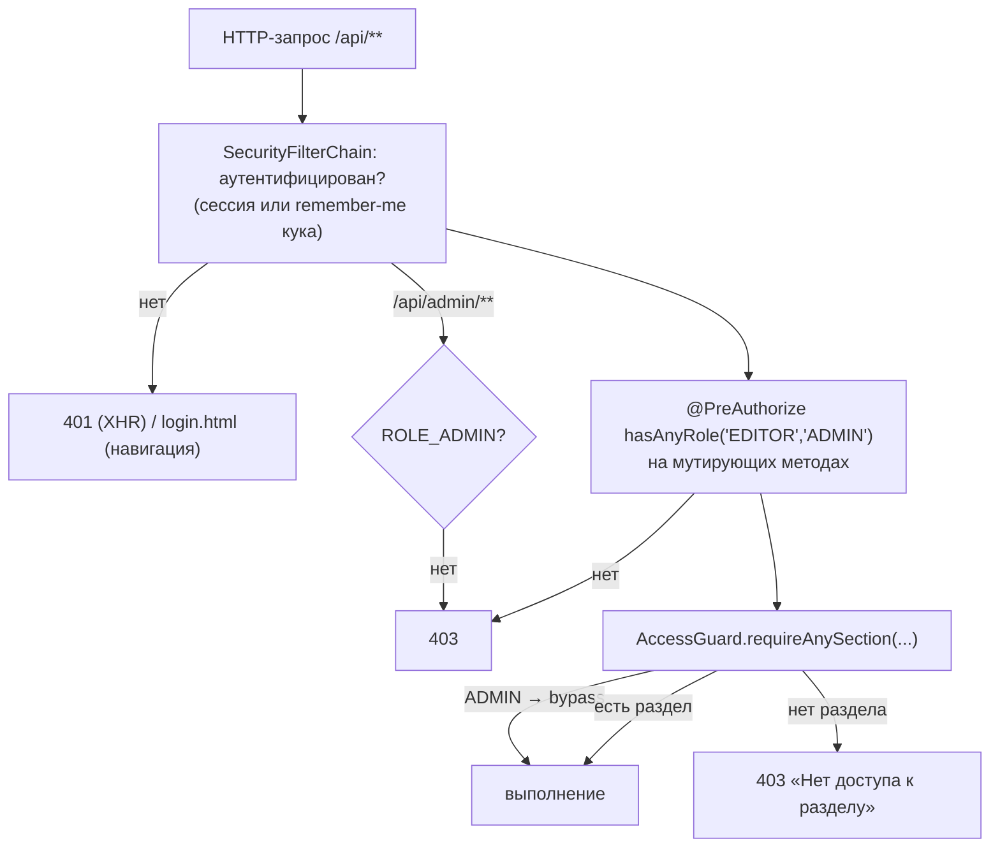

# Пользователи и доступ

Серверная часть управления пользователями: сущность, роли, разделы, сервис, контроллеры и DTO. Общая модель безопасности (filter chain, remember-me, AccessGuard) — в [[Безопасность и RBAC]]; фронтовый раздел «Управление доступом» и страница входа — в [[Управление доступом и вход]]; таблицы `app.users` / `app.user_sections` — в [[Таблицы приложения]].

## Модель: роль × разделы

Доступ двумерный:

- **Роль** (`Role`, enum) — уровень возможностей, один на пользователя:
  - `READER` — только чтение назначенных разделов;
  - `EDITOR` — READER + создание/правка/удаление шаблонов (и прочие мутации, закрытые `@PreAuthorize("hasAnyRole('EDITOR','ADMIN')")`);
  - `ADMIN` — EDITOR + управление пользователями, ролями и разделами.
- **Разделы** (`sections`) — какие пункты NAV пользователь видит и какими API-группами может пользоваться. Ортогональны роли: редактор может иметь доступ только к шаблонам, читатель — ко всем разделам.

ADMIN обходит проверку разделов на сервере (`AccessGuard`) и в `/api/me` получает полный список разделов независимо от содержимого `user_sections` — новые разделы появляются у админов автоматически.

## Sections — канонические id разделов

`src/main/java/ru/banki/crm/service/Sections.java` — final-класс с константами; список обязан совпадать с id пунктов NAV в v1-фронте:

| id | Раздел UI |
|---|---|
| `home` | Главная |
| `deviations` | Отклонения |
| `onelink` | OneLink |
| `admin` | Мастер коммуникаций |
| `templates` | Список шаблонов |
| `dashboard` | Дашборд |
| `journeys` | Цепочки (Flow Builder) — см. [[Цепочки (Journeys)]] |
| `access` | Управление доступом (фактически используется только ADMIN-ом) |

`ALL` — упорядоченный `List<String>` (отдаётся фронту для рендера чекбоксов), `VALID` — `Set` для `isValid(id)` (валидация входных payload'ов).

## AppUser и AppUserRepository

`src/main/java/ru/banki/crm/domain/AppUser.java` — JPA-сущность таблицы `app.users`:

| Поле | Тип | Колонка | Смысл |
|---|---|---|---|
| `id` | `Long` | `id` (IDENTITY) | PK |
| `email` | `String` | `email` NOT NULL UNIQUE | логин (корпоративная почта), хранится в lowercase |
| `passwordHash` | `String` | `password_hash` NOT NULL | BCrypt-хэш |
| `displayName` | `String` | `display_name` | отображаемое имя |
| `role` | `Role` | `role` NOT NULL | `@Enumerated(STRING)`, дефолт `READER` |
| `enabled` | `boolean` | `enabled` NOT NULL | выключенный пользователь не проходит вход (`AppUserPrincipal.isEnabled()`) |
| `createdAt` | `OffsetDateTime` | `created_at` (insertable/updatable = false) | ставится дефолтом БД `now()` |
| `sections` | `Set<String>` | `app.user_sections(user_id, section_id)` | `@ElementCollection(fetch = EAGER)` — грузится сразу, т.к. нужен на каждом запросе для ACL |

`src/main/java/ru/banki/crm/repo/AppUserRepository.java`: `findByEmailIgnoreCase(email)`, `existsByEmailIgnoreCase(email)` — email-регистронезависимость на уровне запросов.

## UserService

`src/main/java/ru/banki/crm/service/UserService.java`. Зависимости: репозиторий, `PasswordEncoder` (BCrypt из `SecurityConfig`), строка `app.email-domain` (env `APP_EMAIL_DOMAIN`; пустая = без ограничений).

- `list()` — все пользователи → `UserView` (без хэшей).
- `create(CreateUser)` — email: trim + lowercase → `validateDomain` (если домен задан, адрес обязан кончаться на `@<домен>`, иначе 400 «Разрешены только адреса @…») → проверка дубля (`existsByEmailIgnoreCase` → 409 «Пользователь уже существует»). Роль парсится `Role.valueOf(upper)` (некорректная → 400), пароль хэшируется, разделы валидируются `Sections.isValid` (неизвестный id → 400 «Неизвестный раздел»), `enabled = true`.
- `update(id, UpdateUser)` — частичный: применяются только non-null поля (displayName, role, enabled, sections). Пароль этим методом не меняется.
- `delete(id)` — с защитой: нельзя удалить последнего ADMIN-а (подсчёт `countAdmins()`; если удаляемый — админ и админов ≤ 1 → 409 «Нельзя удалить последнего администратора»).
- `resetPassword(id, newPassword)` — административный сброс без старого пароля.
- `changeOwnPassword(email, current, newPassword)` — самостоятельная смена: находит по email (нет → 401), сверяет текущий пароль `encoder.matches` (не совпал → 400 «Текущий пароль неверен»), пишет новый хэш.

Отдельного журнала действий над пользователями нет — [[Аудит и журналирование]] покрывает только шаблоны и материализацию.

## DTO: UserDtos и MeDto

`src/main/java/ru/banki/crm/dto/UserDtos.java` — final-контейнер records:

- `UserView(id, email, displayName, role, enabled, sections)` — ответ списка/create/update; роль строкой.
- `CreateUser(email @NotBlank @Email, displayName, role @NotBlank, password @NotBlank @Size(min=8), sections)` — пароль минимум 8 символов (bean validation, сообщение по-русски).
- `UpdateUser(displayName, role, enabled, sections)` — все поля опциональны.
- `ResetPassword(newPassword @NotBlank @Size(min=8))`.
- `ChangeOwnPassword(currentPassword @NotBlank, newPassword @NotBlank @Size(min=8))`.

`src/main/java/ru/banki/crm/dto/MeDto.java` — record `me(email, displayName, role, canEdit, isAdmin, sections)`: идентичность + вычисленные capability-флаги, по которым SPA строит NAV и прячет кнопки редактирования (`canEdit` = EDITOR или ADMIN, `isAdmin` = ADMIN).

## AdminUserController — /api/admin

`src/main/java/ru/banki/crm/web/AdminUserController.java`. Весь префикс `/api/admin/**` закрыт правилом `hasRole("ADMIN")` в `SecurityConfig` — на методах контроллера отдельных гардов нет.

| Метод | Путь | Действие |
|---|---|---|
| GET | `/api/admin/sections` | `Sections.ALL` — каталог разделов для чекбоксов в UI |
| GET | `/api/admin/users` | список `UserView` |
| POST | `/api/admin/users` | создать (`@Valid CreateUser`) → `UserView` |
| PUT | `/api/admin/users/{id}` | частично обновить (`UpdateUser`) → `UserView` |
| DELETE | `/api/admin/users/{id}` | удалить (кроме последнего админа) |
| PUT | `/api/admin/users/{id}/password` | сброс пароля (`@Valid ResetPassword`) → `{"status":"ok"}` |

## AuthController — /api/me

`src/main/java/ru/banki/crm/web/AuthController.java`, доступен любому аутентифицированному:

- **GET `/api/me`** → `MeDto`. Берёт principal из `CurrentUser.principal()` (нет → 401 «Не авторизован»). Для ADMIN в поле `sections` кладётся `Set.copyOf(Sections.ALL)` вместо содержимого `user_sections` — сервер всё равно пускает админа всюду, а так и NAV показывает всё без ручной правки БД.
- **PUT `/api/me/password`** (`@Valid ChangeOwnPassword`) → `UserService.changeOwnPassword` для `CurrentUser.email()`.

Сам вход/выход — не контроллер: `formLogin` Spring Security обрабатывает POST `/api/login` (поля `email`/`password`, успех → 200 без тела, ошибка → 401) и POST `/logout` (200, куки сессии и remember-me удаляются). Детали, включая remember-me на 30 дней, — в [[Безопасность и RBAC]].

## Бутстрап первого админа

`src/main/java/ru/banki/crm/config/AdminBootstrap.java` — `CommandLineRunner`. На старте: если `app.admin.email`/`app.admin.password` (env `ADMIN_EMAIL`/`ADMIN_PASSWORD`) пусты — warning и пропуск; если пользователь с таким email уже есть — только лог; иначе создаётся ADMIN «Администратор» со всеми разделами. Идемпотентно, поэтому безопасно при каждом рестарте. Значения по средам — в [[Конфигурация]].

## Поток проверки доступа на запросе

## Связанные заметки

[[Обзор бэкенда]] · [[Безопасность и RBAC]] · [[Управление доступом и вход]] · [[Таблицы приложения]] · [[Конфигурация]] · [[REST API]]
