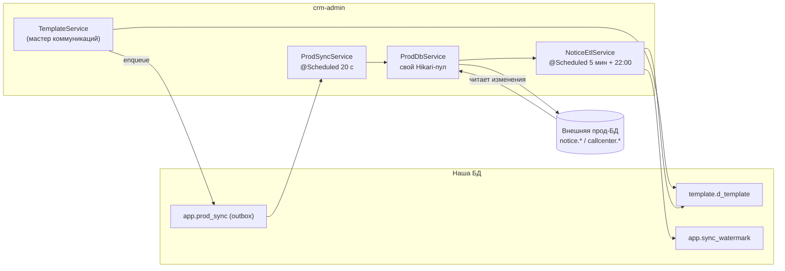

# Синхронизация с прод-БД

Каноническая заметка про обмен данными с **внешней прод-БД**. Оба направления описаны здесь; другие заметки на неё ссылаются.

Исходная точка: в нашей базе шаблоны хранятся **только** в едином справочнике `template.d_template` — локальных копий канальных таблиц у нас нет (миграция `V12` их снесла). Реальные `notice.*` / `callcenter.*` живут во внешней прод-БД, куда панель ходит по отдельному соединению. Отсюда два потока:

| Направление | Что везёт | Кто отвечает |
|---|---|---|
| **мы → прод** | операции мастера коммуникаций (INSERT/UPDATE/DELETE шаблонов) | outbox `app.prod_sync` + `ProdSyncService` + `ProdDbService` |
| **прод → мы** | актуализация нашей копии `d_template` по прод-таблицам | `NoticeEtlService` + водяные знаки `app.sync_watermark` |

Прод — **источник истины**. В обратную сторону мы ничего не удаляем и ничего не переписываем поверх неотправленных локальных правок.

## Подключение к проду

Источник истины для настроек — **строка реестра `app.db_connection` с флагом `is_prod_sync` и `is_active`** (миграции `V14`, `V15`; реестр — страница «Диагностика» в настроечной админке `/settings`). Тот же реестр использует отчёт «ЧЕК СМС траффик» ([[Отчёты]]).

`ProdDbService` держит **собственный маленький Hikari-пул**, а не спринговый `DataSource`-бин — чтобы не мешать автоконфигурации основной БД:

- `maximumPoolSize = 2`, `minimumIdle = 0`;
- `initializationFailTimeout = -1` — пул создаётся, даже если прод сейчас недоступен;
- таймаут соединения `PROD_DB_CONNECT_TIMEOUT_MS` (20 с по умолчанию): канал до прода может идти через бастион/VPN, на рукопожатие нужен запас; `socketTimeout` — 60 с;
- `SET TIME ZONE 'Europe/Moscow'` на каждом соединении (`PROD_DB_TIME_ZONE`): метки времени пишем и читаем в UTC+3, как и всё остальное в проде — совпадает с `hibernate.jdbc.time_zone`;
- пул **пересобирается автоматически**, если в реестре поменяли url/логин/пароль (сравнивается сигнатура конфигурации).

Переменные `PROD_DB_URL` / `PROD_DB_USER` / `PROD_DB_PASSWORD` остались **только для одноразового сида**: на первом старте, если строки-приёмника ещё нет, `ProdDbService.seedFromEnv()` заводит её в реестре. После этого env можно убрать.

Прод не настроен → оба направления **пассивны и молчат**: очередь не ведётся, ETL пропускает прогон.

## Направление «мы → прод»: очередь `app.prod_sync`

### Кто наполняет очередь

`TemplateService` после каждой операции мастера коммуникаций вызывает `UnifiedTemplateService.enqueueProdSync(channel, operation, code, payload)`:

| Операция мастера | Что встаёт в очередь |
|---|---|
| создание шаблона | `INSERT` + payload новой строки |
| правка | `UPDATE` + payload текущей строки |
| удаление | `DELETE` + payload удаляемой строки (снимается до удаления) |

Payload собирает `TemplateStore.prodPayload`: строка `d_template` разворачивается обратно в **прод-вид** (ядро — по маппингу колонок, остальное — из `channel_props jsonb`). `null`-значения не отправляются: в проде такие колонки `NOT NULL` с дефолтом, пусть остаются как есть. **Метки времени прода наружу не отправляются** — их проставляет сам прод, иначе мы записали бы туда устаревшее значение и сломали отслеживание изменений.

Пока прод не подключён, очередь **не ведётся вовсе** — копить нечего и некуда, записи появятся с момента реального подключения.

### Таблица очереди (миграция `V8`)

`app.prod_sync`: `channel`, `operation` (`INSERT|UPDATE|DELETE`), `local_code`, `prod_code`, `payload jsonb`, `status` (`PENDING|OK|ERROR`), `attempts`, `last_error`, `created_by`, `timestamp_cr/upd`. Схема — [[Таблицы приложения]].

### Доставка

`ProdSyncService`:

- фоновый тик **каждые 20 секунд** (`@Scheduled(fixedDelay = 20000, initialDelay = 15000)`), до 50 записей за проход; ручной запуск из UI берёт до 200;
- берутся `PENDING` с `attempts < 10`, по возрастанию `id`;
- успех → `status = OK`, проставляется `prod_code`;
- ошибка → `attempts + 1`, текст в `last_error` (обрезается до 2000 символов); после **10** неудач запись переходит в `ERROR` и ждёт ручного вмешательства («Повтор» сбрасывает попытки, «Отмена» удаляет запись);
- **уборка** каждые 60 секунд: доставленные (`OK`) удаляются через `app.prodsync.ok-ttl-minutes` (10 минут). Очередь — список задач, а не журнал; аудит доставок лежит в `t_admin_log` ([[Аудит и журналирование]]). `PENDING` и `ERROR` уборка не трогает: иначе несинхронизированное изменение потерялось бы без следа.

### Что делает `ProdDbService.apply`

Одна операция — одна транзакция на прод-соединении:

1. `set_config('app.current_user', split_part(email, '@', 1), true)` — прод-триггеры аудита запишут реального пользователя (аналог того, что делала старая Appsmith-админка). `is_local = true`: значение живёт только до конца этой транзакции, чтобы в переиспользованном соединении не утёк чужой актёр.
2. `INSERT` / `UPDATE` / `DELETE` по бизнес-коду канала.
3. `UPDATE`, не нашедший строки (исторически не доехала), **превращается в `INSERT`**.

Тонкости вставки:

- перечисляются **только заполненные** колонки: явный `NULL` перебил бы `DEFAULT` прод-таблицы и упал на `NOT NULL`;
- набор колонок сверяется с `information_schema` прод-таблицы — payload из `d_template` может содержать лишние ключи, имена проверяются регуляркой `[a-z_][a-z0-9_]*`;
- типы конвертирует сам Postgres через `jsonb_populate_record(NULL::<таблица>, ?::jsonb)`;
- `timestamp_cr` / `timestamp_upd` ставятся `now()` **часами прода** — именно по ним обратный ETL увидит изменение (собственный триггер прода, если он есть, просто перекроет значение).

### Коды присваивает прод

При `INSERT` номер выдаёт прод-БД (`max + 1` в её транзакции — как делала старая админка):

| Канал | Прод-таблица | Бизнес-код | Правило |
|---|---|---|---|
| `sms` | `notice.d_com_sms_template` | `code` | нумерация в диапазоне **< 10000** |
| `push` | `notice.push_template` | `code` | сквозной счётчик |
| `email` | `notice.email_template` | `id` | код = `id`, диапазон **< 10000** |
| `cc` | `callcenter.d_segment_properties` | `segment` | **прод код не переназначает** — сегмент задаёт пользователь; по счётчику выдаётся только суррогатный `id` |
| `fa` / `vk` / `la` | `notice.fa_template` / `vk_template` / `live_activity_template` | `id` | схема предварительная, уточняется при подключении доставки |

Исчерпание диапазона → ошибка «Свободные коды в диапазоне до 10000 закончились…», запись уходит в повторы.

Если прод присвоил код, отличный от локального, `UnifiedTemplateService.applyProdCode` переписывает его **и в `template.d_template`, и в хвосте очереди** этого шаблона: у ещё не доставленных `PENDING`-записей меняется `local_code` и соответствующее поле внутри `payload` (`jsonb_set`). Иначе последующий `UPDATE` ушёл бы в проде «в никуда».

### Управление из панели

Страница «Диагностика» (`/settings`, только ADMIN) показывает состояние соединения, наличие канальных таблиц и счётчики очереди; оттуда же — просмотр записей, повтор, отмена и принудительный прогон. Эндпоинты — `/api/admin/prod-db/**`, см. [[REST API]].

## Направление «прод → мы»: ETL шаблонов

`NoticeEtlService` поддерживает нашу копию `template.d_template` в соответствии с прод-таблицами. Каналы: `sms`, `push`, `email`, `cc`, `fa`, `vk`, `la`. Пишем **только к себе**, в прод из этого направления не идёт ничего.

### Два режима

| Режим | Расписание | Что читает |
|---|---|---|
| **Инкремент** | `@Scheduled(fixedDelay = ETL_INTERVAL_MS)`, по умолчанию **5 минут** (initial delay 60 с) | строки, у которых `COALESCE(timestamp_upd, timestamp_cr)` больше водяного знака канала (минус overlap) |
| **Полная сверка** | `@Scheduled(cron = ETL_FULL_CRON)`, по умолчанию **22:00** ежедневно | все строки канала |

`COALESCE` обязателен: метки времени в проде завели недавно, у старых строк `timestamp_upd = NULL`, и условие «`upd > since`» их бы теряло.

Чтение — **потоковое**: серверный курсор Postgres (`autoCommit = false` + `fetchSize = 500`), чтобы большая таблица не уехала в память целиком.

Оба режима включаются флагом **`ETL_ENABLED`, по умолчанию выключенным**. Прогон идёт **по одному за раз** (инкремент и ночной полный не топчутся). Канал, у которого в проде нет таблицы или колонок времени, пропускается с записью в `failed` — остальные каналы обрабатываются.

### Водяные знаки `app.sync_watermark`

Отдельная таблица «канал → `last_prod_ts`» (миграция `V16`), а **не** `max(d_template.timestamp_upd)`: последний пишут ещё и локальные правки мастера нашими часами, из-за чего знак «отравлялся» бы и мог поехать назад. Знак двигается **только вперёд** (`GREATEST` в `ON CONFLICT`) и только по максимуму меток фактически прочитанного батча. `last_prod_ts IS NULL` — канал ещё ни разу не синхронизирован, тянем всё.

`ETL_OVERLAP_MINUTES` (перекрытие окна) по умолчанию **0**, и это осознанно: метки времени в проде выставили разом, поэтому у всех старых строк `timestamp_cr` одинаковый — знак встаёт ровно на него, и любое перекрытие заставляло бы каждые 5 минут перечитывать всю таблицу. Страховка от пропусков на границе окна — ночной полный прогон.

### Локальные правки не затираются

Перед прогоном ETL собирает ключи `channel:code`, у которых в очереди `app.prod_sync` висит запись со статусом `PENDING` или `ERROR`. Такие строки прод-версией **не перезаписываются** — они попадают в счётчик `skippedQueued`. Иначе неотправленная локальная правка молча откатилась бы к прод-состоянию.

Запись у нас делает `TemplateStore.upsertFromProdRow`: ядро — в типизированные колонки `d_template`, всё остальное — в `channel_props jsonb`; **метки времени прода у себя не храним** (это его бухгалтерия). См. [[Справочники шаблонов]].

### Ограничение, о котором нужно помнить

> **Инкремент видит только те строки, у которых изменился `timestamp_upd` (или `timestamp_cr`).**

Отсюда два слепых пятна:

1. **Правки мимо этого столбца** — прямой `UPDATE` в проде без обновления метки, бэкофисная утилита, которая метку не ведёт, историческая строка без меток. Инкремент про них не узнает никогда.
2. **Удаления** — удалённая строка не оставляет после себя изменённой метки, а вешать триггеры на прод нам нельзя.

Оба случая подхватывает **только полный ночной прогон**: он читает таблицу целиком, поэтому «тихие» правки долетают до нас, а по недостающим ключам собирается корзина **`onlyInOurs`** — что есть у нас, но отсутствует в проде (до 500 строк). Туда попадает и удалённое в проде, и наше локальное, ещё не доехавшее; косвенный признак — стоит ли ключ в очереди синка. **ETL ничего не удаляет — только показывает.** Решение принимает человек.

Практический вывод: между двумя ночными прогонами наша копия может расходиться с продом по «тихим» правкам и удалениям. Если сверка нужна прямо сейчас — есть ручной полный прогон и отдельный отчёт-сверка (ниже).

### Статус и ручной запуск

`GET /api/admin/etl/status` отдаёт: включён ли ETL, настроен ли прод, идёт ли прогон, водяные знаки по каналам и итоги последнего прогона (`applied`, `skippedQueued`, `perChannel`, `failed`, `tookMs`). Ручные прогоны — `POST /api/admin/etl/run` (инкремент) и `/run-full` (полный). Всё под `/api/admin/**`, то есть только ADMIN — [[REST API]].

## Сверка и обратный импорт

`ProdReconcileService` — отдельный инструмент «Диагностики», не расписание:

- **Отчёт-сверка** (`GET /api/admin/prod-db/reconcile`) сравнивает `d_template` с продом в прод-виде по ключу `(channel, code)` и раскладывает по корзинам **«только в проде» / «разошлись» / «только у нас»** плюс счётчик совпадений. Прод читается потоково, в памяти держатся только компактные сводки. При сравнении: поле, которое прод не задал (NULL/пусто), расхождением не считается, а «пустышные» значения (пусто, `false`, `0`) считаются эквивалентными — иначе наши дефолты (`active_flag` и т.п.) давали бы шум.
- **Импорт выбранных строк** (`POST …/reconcile/import`) — upsert **прямо в `d_template`, минуя очередь** (мы тянем ИЗ прода), каждая строка в своей транзакции с записью в аудит.
- **Импорт всей прод-базы** (`POST …/reconcile/import-all`) — фоновая задача в отдельном демон-потоке, батчами по 500, **одна задача за раз**; прогресс опрашивается через `…/import-all/status`.

Прод при этом не меняется, «наши-только» строки не трогаются.

## Переменные окружения

| Переменная | По умолчанию | Смысл |
|---|---|---|
| `ETL_ENABLED` | `false` | включает оба режима ETL «прод → мы» |
| `ETL_INTERVAL_MS` | `300000` | период инкремента (5 минут) |
| `ETL_FULL_CRON` | `0 0 22 * * *` | расписание полного прогона (22:00) |
| `ETL_OVERLAP_MINUTES` | `0` | перекрытие окна инкремента |
| `ETL_INITIAL_DELAY_MS` | `60000` | задержка первого инкремента после старта |
| `PROD_DB_URL` / `PROD_DB_USER` / `PROD_DB_PASSWORD` | пусто | **только одноразовый сид** строки-приёмника в реестр |
| `PROD_DB_CONNECT_TIMEOUT_MS` | `20000` | таймаут установления соединения с продом |
| `PROD_DB_TIME_ZONE` | `Europe/Moscow` | часовой пояс прод-сессии |
| `app.prodsync.ok-ttl-minutes` | `10` | сколько держать доставленные записи очереди |

Полный список настроек — [[Конфигурация]].

## Смежные заметки

- Эндпоинты `/api/admin/prod-db/**` и `/api/admin/etl/**` — [[REST API]]
- Схема `app.prod_sync`, `app.sync_watermark`, `app.db_connection` — [[Таблицы приложения]]
- Единый справочник `template.d_template` и `channel_props` — [[Справочники шаблонов]]
- Кто наполняет очередь — [[Шаблоны и мастер коммуникаций]]
- Журнал доставок и правок — [[Аудит и журналирование]]
- Эксплуатация (типовые команды по очереди) — [[Шпаргалка]]
- Реестр подключений как источник DWH-коннекта — [[Отчёты]]
