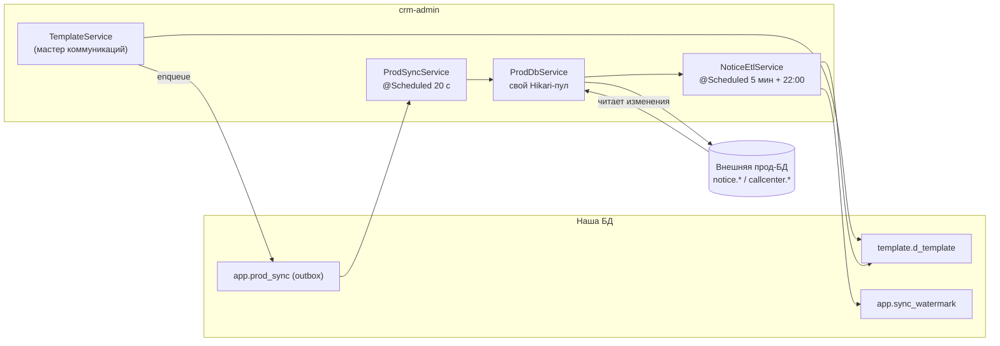

# Синхронизация с прод-БД

Каноническая заметка про обмен данными с **внешней прод-БД**. Оба направления описаны здесь; другие заметки на неё ссылаются.

Исходная точка: в нашей базе шаблоны хранятся **только** в едином справочнике `template.d_template` — локальных копий канальных таблиц у нас нет (миграция `V12` их снесла). Реальные `notice.*` / `callcenter.*` живут во внешней прод-БД, куда панель ходит по отдельному соединению. Отсюда два потока:

| Направление | Что везёт | Кто отвечает |
|---|---|---|
| **мы → прод** | операции мастера коммуникаций (INSERT/UPDATE/DELETE шаблонов) | outbox `app.prod_sync` + `ProdSyncService` + `ProdDbService` |
| **прод → мы** | актуализация нашей копии `d_template` по прод-таблицам | `NoticeEtlService` + водяные знаки `app.sync_watermark` |

Прод — **источник истины**. В обратную сторону мы ничего не удаляем и ничего не переписываем поверх неотправленных локальных правок.

## Подключение к проду

Источник истины для настроек — **строка реестра `app.db_connection` с флагом `is_prod_sync` и `is_active`** (миграции `V14`, `V15`; реестр — страница «Диагностика» в настроечной админке `/settings`). Тот же реестр использует отчёт «ЧЕК СМС траффик» ([Отчёты](Отчёты.md)).

`ProdDbService` держит **собственный маленький Hikari-пул**, а не спринговый `DataSource`-бин — чтобы не мешать автоконфигурации основной БД:

- `maximumPoolSize = 2`, `minimumIdle = 0`;
- `initializationFailTimeout = -1` — пул создаётся, даже если прод сейчас недоступен;
- таймаут соединения `PROD_DB_CONNECT_TIMEOUT_MS` (20 с по умолчанию): канал до прода может идти через бастион/VPN, на рукопожатие нужен запас; `socketTimeout` — 60 с;
- `SET TIME ZONE 'Europe/Moscow'` на каждом соединении (`PROD_DB_TIME_ZONE`): метки времени пишем и читаем в UTC+3, как и всё остальное в проде — совпадает с `hibernate.jdbc.time_zone`;
- пул **пересобирается автоматически**, если в реестре поменяли url/логин/пароль (сравнивается сигнатура конфигурации).

Переменные `PROD_DB_URL` / `PROD_DB_USER` / `PROD_DB_PASSWORD` остались **только для одноразового сида**: на первом старте, если строки-приёмника ещё нет, `ProdDbService.seedFromEnv()` заводит её в реестре. После этого env можно убрать.

Прод не настроен → оба направления **пассивны и молчат**: очередь не ведётся, ETL пропускает прогон.

## Направление «мы → прод»: очередь `app.prod_sync`

### Кто наполняет очередь

`TemplateService` после каждой операции мастера коммуникаций вызывает `UnifiedTemplateService.enqueueProdSync(channel, operation, code, payload)`:

| Операция мастера | Что встаёт в очередь |
|---|---|
| создание шаблона | `INSERT` + payload новой строки |
| правка | `UPDATE` + payload текущей строки |
| удаление | `DELETE` + payload удаляемой строки (снимается до удаления) |

Payload — строка `d_template`, развёрнутая обратно в **прод-вид**; собирает его `TemplateStore.prodPayload`, правила сборки (маппинг ядра, `channel_props`, выброшенные `null` и метки времени) описаны в [Шаблоны и мастер коммуникаций](Шаблоны%20и%20мастер%20коммуникаций.md).

Пока прод не подключён, очередь **не ведётся вовсе** — копить нечего и некуда, записи появятся с момента реального подключения.

### Что проверяется до постановки в очередь

Доставка асинхронная, и отказ прода всплывал бы через десятки секунд — когда пользователь уже увидел «шаблон создан» и ушёл: шаблон остался бы только у нас, а запись очереди повисла бы в `ERROR`. Поэтому перед `enqueue` делается пре-флайт `TemplateService.requireProdAccepts` (`src/main/java/ru/banki/crm/service/TemplateService.java:51`): payload сверяется со списком колонок прод-таблицы, которые `NOT NULL` и **без** `DEFAULT` (`ProdDbService.requiredColumns`, `src/main/java/ru/banki/crm/service/prod/ProdDbService.java:618`). Чего не хватает — то перечисляется в `400 «Прод не примет шаблон: не заполнены обязательные поля — …»`, и, поскольку метод транзакционный, локальная строка тоже не остаётся.

Спрашивается именно прод, а не наша схема: у той же колонки у нас может стоять `DEFAULT ''`, и по своей базе список получился бы неверным. Ответ кешируется на канал и сбрасывается при смене приёмника — схема прода меняется редко, дёргать её на каждое сохранение незачем. Прод не настроен или недоступен → список пуст и пре-флайт молчит, а не блокирует работу.

### Таблица очереди (миграция `V8`)

`app.prod_sync`: `channel`, `operation` (`INSERT|UPDATE|DELETE`), `local_code`, `prod_code`, `payload jsonb`, `status` (`PENDING|SENDING|OK|ERROR`), `attempts`, `last_error`, `created_by`, `timestamp_cr/upd`. Схема — [[Таблицы приложения]].

### Доставка: захват записи и две отдельные транзакции

`ProdSyncService` (`src/main/java/ru/banki/crm/service/prod/ProdSyncService.java:104`) устроен вокруг одного требования — **в проде не должно появиться два шаблона на одну заявку**. Отсюда весь порядок действий:

1. Фоновый тик **каждые 20 секунд** (`@Scheduled(fixedDelay = 20000, initialDelay = 15000)`), до 50 записей за проход; ручной запуск из UI берёт до 200. Выбираются `PENDING` с `attempts < 10`, по возрастанию `id`.
2. **Запись захватывается до обращения к проду**: `UPDATE app.prod_sync SET status = 'SENDING', attempts = attempts + 1 WHERE id = ? AND status = 'PENDING'` (`ProdSyncService.java:121`). Условие `status = 'PENDING'` внутри самого `UPDATE` и есть захват: кто первым обновил — тот и владеет, обновлено 0 строк — запись пропускается. Пока она `SENDING`, её не подхватит ни следующий тик, ни второй экземпляр приложения.
3. Ошибка доставки → `status = CASE WHEN attempts >= 10 THEN 'ERROR' ELSE 'PENDING' END`, текст в `last_error` (обрезается до 2000 символов). `ERROR` ждёт человека: «Повтор» сбрасывает попытки, «Отмена» удаляет запись.
4. **Успех фиксируется немедленно и отдельным запросом**: `status = OK`, проставляется `prod_code` (`ProdSyncService.java:144`).
5. **Только потом** — локальная бухгалтерия: если прод выдал код, отличный от локального, вызывается `applyProdCode`, и **в своей транзакции** (`ProdSyncService.java:151`). Её падение больше не может привести к повторной отправке; текст ошибки дописывается в `last_error` уже доставленной записи, чтобы человек увидел, что локальный код разошёлся с продовым.

> **Почему шаги 4 и 5 разведены.** Раньше отметка «доставлено» лежала в одной транзакции с переименованием локального кода. Переименование падало на `UNIQUE (channel, code)` — код, который выдал прод, оказывался занят другим нашим шаблоном, — откат уносил вместе с ним и отметку, запись оставалась `PENDING`, и через 20 секунд тот же шаблон уезжал в прод второй раз. Так в проде и появлялись дубли.

**Зависшие `SENDING` не переотправляются.** Уборка (`ProdSyncService.java:80`, каждые 60 секунд) переводит в `ERROR` всё, что провисело в `SENDING` дольше `app.prodsync.stuck-minutes` (5 минут), с текстом «Доставка прервана… Проверьте в прод-БД, доехала ли строка, и повторите вручную». Автоматического повтора здесь нет намеренно: приложение упало или потеряло связь между отправкой и отметкой, и снаружи не различить, доехала строка или нет — именно автоматический повтор ровно в этом месте и плодит дубли. Решение оставлено человеку.

Та же уборка удаляет доставленные (`OK`) через `app.prodsync.ok-ttl-minutes` (10 минут): очередь — список задач, а не журнал, аудит доставок лежит в `t_admin_log` ([Аудит и журналирование](Аудит%20и%20журналирование.md)). `PENDING` и `ERROR` она не трогает — иначе несинхронизированное изменение потерялось бы без следа.

### Что делает `ProdDbService.apply`

Одна операция — одна транзакция на прод-соединении:

1. `set_config('app.current_user', split_part(email, '@', 1), true)` — прод-триггеры аудита запишут реального пользователя (аналог того, что делала старая Appsmith-админка). `is_local = true`: значение живёт только до конца этой транзакции, чтобы в переиспользованном соединении не утёк чужой актёр.
2. `INSERT` / `UPDATE` / `DELETE` по бизнес-коду канала.
3. `UPDATE`, не нашедший строки (исторически не доехала), **превращается в `INSERT`**.

Тонкости вставки:

- перечисляются **только заполненные** колонки: явный `NULL` перебил бы `DEFAULT` прод-таблицы и упал на `NOT NULL`;
- набор колонок сверяется с `information_schema` прод-таблицы — payload из `d_template` может содержать лишние ключи, имена проверяются регуляркой `[a-z_][a-z0-9_]*`;
- типы конвертирует сам Postgres через `jsonb_populate_record(NULL::<таблица>, ?::jsonb)`;
- `timestamp_cr` / `timestamp_upd` ставятся `now()` **часами прода** — именно по ним обратный ETL увидит изменение (собственный триггер прода, если он есть, просто перекроет значение).

#### Проверка на свежий дубль — `recentTwin`

Перед `INSERT` в проде ищется строка, совпадающая с этой **полностью** (`ProdDbService.recentTwin`, `src/main/java/ru/banki/crm/service/prod/ProdDbService.java:533`): тот же `source_type`, то же `communication_name`, `timestamp_cr` за последний час и совпадение по содержимому — `msg_text`, `title`, `subject`, `letteros_id`, `sender_name`, `deep_link` (те из них, что есть и в payload, и в прод-таблице). Нашлась — её бизнес-код возвращается как результат доставки, вставка не делается.

Очередь и так не переотправляет доставленное, но если связь оборвётся **между** вставкой и получением ответа, повтор всё равно возможен, а различить «не доехало» и «доехало, но ответ потерян» снаружи нельзя. Это вторая линия обороны.

**Почему сравнивается содержимое, а не только кампания.** А/Б-шаблоны заводят парой: одна кампания, одно имя коммуникации, разный текст. Проверка по паре «кампания + имя» приняла бы второй шаблон за дубль первого, молча вернула бы его код — и вторая половина теста в прод не уехала бы вовсе. При настоящем повторе payload тот же самый до байта, поэтому содержимое совпадёт; у А/Б-пары — нет.

Детали: значения сопоставляются как текст (`coalesce(col::text, '')`) — в разных каналах эти колонки разных типов, а нужно только равенство; окно в час требует наличия `timestamp_cr`, иначе совпадение годовой давности приняли бы за свежий дубль; если сравнивать нечего (ни одной колонки содержимого) или запрос упал — проверка молча пропускается и вставка идёт обычным путём. Лучше лишняя строка, чем потерянная.

#### Спутник sms-шаблона

У канала `sms` в проде на каждый шаблон заводится строка в `notice.d_com_sms_type` — тип отправки. Все её поля, кроме кодов, постоянные (`brief = SendSplashUrl`, `name = «отправка смс CRM»`, `sender_name = Banki.ru`, приоритет, таймаут, окно `00:00–23:59`): у коммуникаций CRM тип отправки всегда один. `smsTypeEnsure` (`ProdDbService.java:270`) вызывается и при вставке, и при обновлении — проверка «нет — создать» идемпотентна, а у шаблонов, уехавших до появления этого правила, спутника нет вовсе, и правка их дозаведёт. Существующая строка не трогается: её могли поправить руками в проде.

`code` и `template_code` равны коду шаблона **в проде**, а не нашему: при вставке код присваивает прод, и локальный сослался бы на чужую строку. При `DELETE` спутник удаляется **перед** шаблоном (он ссылается на него `template_code`) и только своей формы — `code = template_code`; строку с тем же кодом, но ссылающуюся на другой шаблон, заводили не мы.

### Коды присваивает прод

При `INSERT` номер выдаёт прод-БД: `max + 1` по нужной колонке в её же транзакции — как делала старая админка. Что за таблица, какая колонка бизнес-кода, назначает ли прод код и есть ли у канала предел нумерации — берётся из `UnifiedTemplateService.channelTable(channel)`; таблица соответствий приведена в [Шаблоны и мастер коммуникаций](Шаблоны%20и%20мастер%20коммуникаций.md).

Два следствия для доставки:

- у `sms` и `email` код выделяется **в диапазоне до 10000** (выше живут служебные коды прода). Диапазон исчерпан → ошибка «Свободные коды в диапазоне до 10000 закончились…», запись уходит в повторы;
- у **КЦ прод код не переназначает**: `segment` — бизнес-ключ, его задаёт пользователь, и по счётчику выдаётся только суррогатный `id`. Поэтому и `applyProdCode` для `cc` не срабатывает.

Если прод присвоил код, отличный от локального, `UnifiedTemplateService.applyProdCode` (`src/main/java/ru/banki/crm/service/UnifiedTemplateService.java:102`) переписывает его **и в `template.d_template`, и в хвосте очереди** этого шаблона: у ещё не доставленных `PENDING`-записей меняется `local_code` и соответствующее поле внутри `payload` (`jsonb_set`). Иначе последующий `UPDATE` ушёл бы в проде «в никуда».

Перед переименованием проверяется, не занят ли код от прода другим нашим шаблоном. Занят — метод кидает `«код N в канале ch уже занят другим шаблоном — локальный код M оставлен как есть»`. Раньше на этом месте из глубины JDBC прилетало нарушение `UNIQUE (channel, code)`, и оно роняло доставку целиком (см. выше, почему это кончалось дублями в проде). Теперь сказано прямо, что произошло, доставка уже зафиксирована, переотправки не будет, а текст оседает в `last_error` записи очереди.

### Управление из панели

Страница «Диагностика» (`/settings`, только ADMIN) показывает состояние соединения, наличие канальных таблиц и счётчики очереди по всем четырём статусам (`pending`, `sending`, `error`, `ok`); оттуда же — просмотр записей, повтор, отмена и принудительный прогон. Эндпоинты — `/api/admin/prod-db/**`, см. [[REST API]].

Список записей по умолчанию показывает `PENDING`, `SENDING` и `ERROR`: `SENDING` — это «ушло в прод, ответа нет», и прятать такое нельзя. «Повтор» (`/retry/{id}`) возвращает запись в `PENDING` и обнуляет `attempts`. «Отмена» (`/cancel/{id}`) удаляет **только** `PENDING` и `ERROR` — `SENDING` не удаляется намеренно: неизвестно, доехала строка или нет, и молча убрать такую запись значило бы потерять единственный след операции.

## Направление «прод → мы»: ETL шаблонов

`NoticeEtlService` (`src/main/java/ru/banki/crm/service/prod/NoticeEtlService.java:102`) поддерживает нашу копию `template.d_template` в соответствии с прод-таблицами. Каналы: `sms`, `push`, `email`, `cc`, `fa`, `vk`, `la`. Пишем **только к себе**, в прод из этого направления не идёт ничего.

### Два режима

| Режим | Расписание | Что читает |
|---|---|---|
| **Инкремент** | `@Scheduled(fixedDelay = ETL_INTERVAL_MS)`, по умолчанию **5 минут** (initial delay 60 с) | строки, у которых `COALESCE(timestamp_upd, timestamp_cr)` больше водяного знака канала (минус overlap) |
| **Полная сверка** | `@Scheduled(cron = ETL_FULL_CRON)`, по умолчанию **22:00** ежедневно | все строки канала |

`COALESCE` обязателен: метки времени в проде завели недавно, у старых строк `timestamp_upd = NULL`, и условие «`upd > since`» их бы теряло.

Чтение — **потоковое**: серверный курсор Postgres (`autoCommit = false` + `fetchSize = 500`), чтобы большая таблица не уехала в память целиком.

Оба режима включаются флагом **`ETL_ENABLED`, по умолчанию выключенным**. Прогон идёт **по одному за раз** (`AtomicBoolean running`: инкремент и ночной полный не топчутся) — если прогон уже идёт или прод не настроен, `run()` возвращает `{"skipped": "…"}` и ничего не делает. Канал, у которого в проде нет таблицы или колонок времени, пропускается с текстом в списке **`failed`** — остальные каналы обрабатываются, один сломанный канал не отменяет прогон.

### Водяные знаки `app.sync_watermark`

Отдельная таблица «канал → `last_prod_ts`» (миграция `V16`), а **не** `max(d_template.timestamp_upd)`: последний пишут ещё и локальные правки мастера нашими часами, из-за чего знак «отравлялся» бы и мог поехать назад. Знак двигается **только вперёд** (`GREATEST` в `ON CONFLICT`) и только по максимуму меток фактически прочитанного батча. `last_prod_ts IS NULL` — канал ещё ни разу не синхронизирован, тянем всё.

`ETL_OVERLAP_MINUTES` (перекрытие окна) по умолчанию **0**, и это осознанно: метки времени в проде выставили разом, поэтому у всех старых строк `timestamp_cr` одинаковый — знак встаёт ровно на него, и любое перекрытие заставляло бы каждые 5 минут перечитывать всю таблицу. Страховка от пропусков на границе окна — ночной полный прогон.

### Локальные правки не затираются

Перед прогоном ETL собирает ключи `channel:code`, у которых в очереди `app.prod_sync` висит запись со статусом `PENDING` или `ERROR` (`NoticeEtlService.java:168`). Такие строки прод-версией **не перезаписываются** — они попадают в счётчик **`skippedQueued`**. Иначе неотправленная локальная правка молча откатилась бы к прод-состоянию. `SENDING` в этот список не входит: такая запись уже ушла в прод, и прочитанная оттуда строка — это она и есть.

Запись у нас делает `TemplateStore.upsertFromProdRow`: ядро — в типизированные колонки `d_template`, всё остальное — в `channel_props jsonb`; **метки времени прода у себя не храним** (это его бухгалтерия). См. [[Справочники шаблонов]].

### Ограничение, о котором нужно помнить

> **Инкремент видит только те строки, у которых изменился `timestamp_upd` (или `timestamp_cr`).**

Отсюда два слепых пятна:

1. **Правки мимо этого столбца** — прямой `UPDATE` в проде без обновления метки, бэкофисная утилита, которая метку не ведёт, историческая строка без меток. Инкремент про них не узнает никогда.
2. **Удаления** — удалённая строка не оставляет после себя изменённой метки, а вешать триггеры на прод нам нельзя.

Оба случая подхватывает **только полный ночной прогон**: он читает таблицу целиком, поэтому «тихие» правки долетают до нас, а по недостающим ключам собирается корзина **`onlyInOurs`** — что есть у нас, но отсутствует в проде (до 500 строк). Туда попадает и удалённое в проде, и наше локальное, ещё не доехавшее; косвенный признак — стоит ли ключ в очереди синка. **ETL ничего не удаляет — только показывает.** Решение принимает человек.

Практический вывод: между двумя ночными прогонами наша копия может расходиться с продом по «тихим» правкам и удалениям. Если сверка нужна прямо сейчас — есть ручной полный прогон и отдельный отчёт-сверка (ниже).

### Статус и ручной запуск

`GET /api/admin/etl/status` отдаёт: включён ли ETL, настроен ли прод, идёт ли прогон, водяные знаки по каналам и итоги последнего прогона (`applied`, `skippedQueued`, `perChannel`, `failed`, `tookMs`). Ручные прогоны — `POST /api/admin/etl/run` (инкремент) и `/run-full` (полный). Всё под `/api/admin/**`, то есть только ADMIN — [[REST API]].

## Сверка и обратный импорт

`ProdReconcileService` — отдельный инструмент «Диагностики», не расписание:

- **Отчёт-сверка** (`GET /api/admin/prod-db/reconcile`) сравнивает `d_template` с продом в прод-виде по ключу `(channel, code)` и раскладывает по корзинам **«только в проде» / «разошлись» / «только у нас»** плюс счётчик совпадений. Прод читается потоково, в памяти держатся только компактные сводки. При сравнении: поле, которое прод не задал (NULL/пусто), расхождением не считается, а «пустышные» значения (пусто, `false`, `0`) считаются эквивалентными — иначе наши дефолты (`active_flag` и т.п.) давали бы шум.
- **Импорт выбранных строк** (`POST …/reconcile/import`) — upsert **прямо в `d_template`, минуя очередь** (мы тянем ИЗ прода), каждая строка в своей транзакции с записью в аудит.
- **Импорт всей прод-базы** (`POST …/reconcile/import-all`) — фоновая задача в отдельном демон-потоке, батчами по 500, **одна задача за раз**; прогресс опрашивается через `…/import-all/status`.

Прод при этом не меняется, «наши-только» строки не трогаются.

## Переменные окружения

## События: сверка с crmdb по расписанию

События ездят в свою базу (`crmdb`, флаг `is_event_db`), и у обратного направления два режима, как у шаблонов:

- **Хвост** (`app.event-import.interval-ms`, по умолчанию каждые 5 минут) — только строки с `id` больше нашей отметки. Отметка — `max(prod_id)` в `flow.t_event_link` по этой таблице с `direction = IMPORT`.
- **Полная сверка** (`app.event-import.full-cron`, по умолчанию 22:30) — проход по всем восьми таблицам с пропуском уже затянутого.

Второе не дублирует первое. Хвост не возвращается назад, а строка могла быть пропущена из-за неприехавшей зависимости — шаг выборки без своей настройки запуска. Такие остаются позади отметки, и подбирает их только вечерний прогон.

Оба режима выключены по умолчанию (`EVENT_IMPORT_ENABLED=false`) и слушаются выключателя `event-import` в «Процессах переливов». Изменённые в проде строки не подтягивает ни тот, ни другой: оба тянут только новые.

Ключи `app.proddb.*`, `app.etl.*` и `app.prodsync.*` с дефолтами и env-именами перечислены в [Конфигурация](Конфигурация.md) — здесь они не дублируются.

## Смежные заметки

- Эндпоинты `/api/admin/prod-db/**` и `/api/admin/etl/**` — [[REST API]]
- Схема `app.prod_sync`, `app.sync_watermark`, `app.db_connection` — [[Таблицы приложения]]
- Единый справочник `template.d_template` и `channel_props` — [[Справочники шаблонов]]
- Кто наполняет очередь — [Шаблоны и мастер коммуникаций](Шаблоны%20и%20мастер%20коммуникаций.md)
- Журнал доставок и правок — [Аудит и журналирование](Аудит%20и%20журналирование.md)
- Эксплуатация (типовые команды по очереди) — [[Шпаргалка]]
- Реестр подключений как источник DWH-коннекта — [Отчёты](Отчёты.md)
