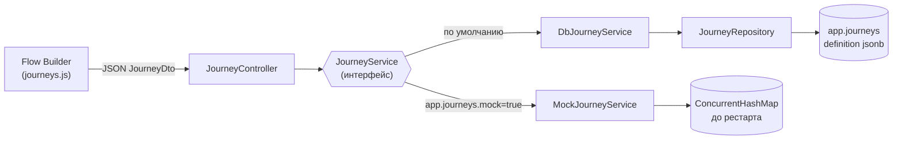

# Цепочки (Journeys)

Подсистема хранения **цепочек-схем** — блок-схем коммуникаций, которые пользователь рисует в [[Flow Builder (цепочки)]] (раздел «Цепочки» фронтенда, аналог Salesforce Flow Builder на базе Drawflow). Здесь описан только слой хранения и CRUD-API; превращение схемы в реальные строки процессных таблиц — отдельная подсистема, см. [[Материализация (Flow)]].

Ключевая идея: **вся схема (узлы + связи + позиции на канве) хранится одним jsonb-документом** в колонке `definition` таблицы `app.journeys` (см. [[Таблицы приложения]]). Читается и пишется атомарно, никакой нормализации узлов по строкам — схема целиком принадлежит редактору и меняется только целиком.

Состав подсистемы (пути от корня repo):

| Компонент | Файл | Роль |
|---|---|---|
| `JourneyController` | `src/main/java/ru/banki/crm/web/JourneyController.java` | REST CRUD `/api/journeys` |
| `JourneyService` | `src/main/java/ru/banki/crm/service/JourneyService.java` | интерфейс хранилища |
| `DbJourneyService` | `src/main/java/ru/banki/crm/service/DbJourneyService.java` | реализация на PostgreSQL (по умолчанию) |
| `MockJourneyService` | `src/main/java/ru/banki/crm/service/MockJourneyService.java` | in-memory-мок для разработки без БД |
| `Journey` | `src/main/java/ru/banki/crm/domain/Journey.java` | JPA-сущность `app.journeys` |
| `JourneyRepository` | `src/main/java/ru/banki/crm/repo/JourneyRepository.java` | Spring Data репозиторий |
| `JourneyDtos` | `src/main/java/ru/banki/crm/dto/JourneyDtos.java` | DTO: узел, ребро, схема, строка списка |
| миграция | `src/main/resources/db/migration/V3__journeys.sql` (+ `V6__flow_layer_a.sql` добавила `kind`, `continues_journey_id`) | DDL таблицы |



## JourneyController — REST API

`src/main/java/ru/banki/crm/web/JourneyController.java`, `@RestController`, базовый путь `/api/journeys`. Полный список эндпоинтов приложения — в [[REST API]].

Модель доступа двухуровневая (подробно — [[Безопасность и RBAC]]):

1. **Раздел**: каждый метод первым делом вызывает `guard.requireAnySection(Sections.JOURNEYS)` (`AccessGuard`, секция `journeys` из `src/main/java/ru/banki/crm/service/Sections.java`) — у пользователя должен быть открыт раздел «Цепочки», иначе 403 независимо от роли.
2. **Роль**: мутирующие методы дополнительно помечены `@PreAuthorize("hasAnyRole('EDITOR','ADMIN')")` — VIEWER может только читать.

| Метод | Путь | Роль | Что делает |
|---|---|---|---|
| `GET` | `/api/journeys` | любой с разделом | `list()` → `List<JourneyListItem>` — все цепочки, отсортированы по имени |
| `GET` | `/api/journeys/{id}` | любой с разделом | `get(id)` → `JourneyDto` (вся схема); 404 «Цепочка не найдена: {id}», если нет |
| `POST` | `/api/journeys` | EDITOR/ADMIN | `create(dto)` — создать; id генерируется сервером, тело валидируется (`@Valid`) |
| `PUT` | `/api/journeys/{id}` | EDITOR/ADMIN | `update(id, dto)` — полная перезапись схемы; 404, если id не существует |
| `DELETE` | `/api/journeys/{id}` | EDITOR/ADMIN | `delete(id)` — удалить цепочку целиком |

Контроллер тонкий: никакой логики, кроме охраны доступа, — всё делегируется в `JourneyService`.

Отдельного эндпоинта «сохранить и материализовать» здесь нет — `POST /api/flow/materialize` (см. [[Материализация (Flow)]]) сам вызывает `journeys.create(...)` / `journeys.update(...)` перед материализацией, чтобы у неё был стабильный `journey_id`.

## JourneyService — интерфейс

`src/main/java/ru/banki/crm/service/JourneyService.java` — контракт хранилища из пяти методов:

```java
List<JourneyListItem> list();
JourneyDto get(String id);
JourneyDto create(JourneyDto dto);   // возвращает созданную цепочку с присвоенным id
JourneyDto update(String id, JourneyDto dto);
void delete(String id);
```

Реализации выбираются условно через `@ConditionalOnProperty` по флагу `app.journeys.mock` (см. [[Конфигурация]]):

| Реализация | Условие активации | Хранилище |
|---|---|---|
| `DbJourneyService` | `app.journeys.mock=false` **или флаг отсутствует** (`matchIfMissing = true`) — то есть по умолчанию | PostgreSQL, `app.journeys` |
| `MockJourneyService` | `app.journeys.mock=true` | `ConcurrentHashMap` в памяти, живёт до рестарта |

Замечание: javadoc самого интерфейса устарел (говорит, что «единственная реализация — MockJourneyService») — фактически с появлением `V3__journeys.sql` основная реализация именно Db, мок остался для разработки без БД.

## DbJourneyService — хранение в PostgreSQL

`src/main/java/ru/banki/crm/service/DbJourneyService.java`, `@Service`, активен по умолчанию.

Внутренний record `Definition(List<JourneyNode> nodes, List<JourneyEdge> edges)` — это ровно содержимое jsonb-колонки `definition`: узлы и связи **без** `id`/`name`/`kind` (они лежат отдельными колонками таблицы). Сериализация — через копию общего `ObjectMapper` с `JsonInclude.Include.NON_NULL` (null-поля узлов не раздувают JSON).

Поведение методов:

- **`list()`** (`@Transactional(readOnly = true)`) — `repo.findAll()`, для каждой цепочки парсит `definition`, чтобы посчитать `nodeCount`, сортирует по имени. То есть список — O(n) по полным документам; при нынешних объёмах (десятки цепочек) это осознанно просто.
- **`get(id)`** — грузит сущность (`load` → 404 `ResponseStatusException` «Цепочка не найдена: {id}»), парсит `definition` и собирает полный `JourneyDto`. `parse` устойчив к `nodes`/`edges` = null (заменяет на пустые списки), а битый JSON превращает в 500 «Повреждён JSON цепочки {id}: …».
- **`create(dto)`** — генерирует id как **первые 8 символов случайного UUID** (`UUID.randomUUID().toString().substring(0, 8)`, например `"3f9a12bc"`), дальше общий `save`.
- **`update(id, dto)`** — `load(id)` (404, если нет), затем `save` — полная перезапись имени, вида и схемы.
- **`delete(id)`** — `repo.delete(load(id))`.

Общий приватный `save(Journey j, String id, JourneyDto dto)`:

- `kind` нормализуется: всё, что не строка `"offline"`, становится `"online"`;
- `continuesJourneyId` сохраняется **только у offline-цепочек**, у online принудительно `null`;
- `definition` = сериализованный `Definition(nodes, edges)`; ошибка сериализации → 400 «Не удалось сериализовать схему: …»;
- `updatedBy` = e-mail текущего пользователя (`CurrentUser.email()`), `updatedAt` = `Instant.now()` — простейший аудит «кто последний трогал» (полноценный журнал операций есть только у материализации, см. [[Аудит и журналирование]]).

## MockJourneyService — in-memory-мок

`src/main/java/ru/banki/crm/service/MockJourneyService.java`. Включается `app.journeys.mock=true`, данные живут в `ConcurrentHashMap` до рестарта. Семантика идентична Db-реализации: те же 8-символьные id, та же нормализация `kind`/`continuesJourneyId` (метод `withId`), те же 404.

В `@PostConstruct seed()` мок наполняется демо-цепочкой `demo-welcome` («Welcome-цепочка (демо)») из 7 узлов: `startIncome` → `comm`(sms) → `decision` → ветки `comm`(email)/`pause`→`comm`(sms) → `subflow` — удобно, чтобы сразу увидеть все типы узлов на канве.

## Journey — сущность и таблица

`src/main/java/ru/banki/crm/domain/Journey.java` → таблица `app.journeys` (описание всех app-таблиц — [[Таблицы приложения]]):

| Поле / колонка | Тип | Смысл |
|---|---|---|
| `id` | `varchar(36)` PK | 8-символьный префикс UUID (колонка с запасом под полный UUID) |
| `name` | `text NOT NULL` | человекочитаемое название цепочки |
| `kind` | `varchar(10) NOT NULL DEFAULT 'online'`, CHECK `online/offline` | тип цепочки: online — стартует с Income event, offline — с Time event (проверяется при материализации, не при сохранении) |
| `continues_journey_id` | `varchar(36)`, FK на `app.journeys(id)` ON DELETE SET NULL | **информационная** метка у offline-цепочки: «продолжение какой online-цепочки»; на логику не влияет |
| `definition` | `jsonb NOT NULL` (`@JdbcTypeCode(SqlTypes.JSON)`) | `{nodes:[...], edges:[...]}` в формате `JourneyDtos` |
| `updated_by` | `text` | e-mail последнего редактора |
| `updated_at` | `timestamptz NOT NULL` | момент последнего сохранения |

Колонки `kind` и `continues_journey_id` добавлены миграцией `V6__flow_layer_a.sql` (базовая таблица — `V3__journeys.sql`). Важно из комментария миграции V3: **в prod-профиле Flyway выключен**, там таблицу создавали этим же скриптом вручную (см. [[Среды и деплой]]).

`JourneyRepository` (`src/main/java/ru/banki/crm/repo/JourneyRepository.java`) — пустой `JpaRepository<Journey, String>`: хватает `findAll`/`findById`/`save`/`delete`.

## JourneyDtos — формат схемы

`src/main/java/ru/banki/crm/dto/JourneyDtos.java` — финальный класс-контейнер из четырёх record. Этот же формат (без обёртки id/name) лежит в jsonb; фронтенд ходит им же, поэтому смена хранилища DTO не трогает.

### JourneyNode — узел схемы

| Поле | Тип | Смысл |
|---|---|---|
| `id` | `String`, `@NotBlank` | клиентский id узла, стабильный внутри цепочки (`n0`, `n1`, …) |
| `type` | `String` | тип узла: `startIncome` \| `startTime` \| `comm` \| `subflow` \| `assignment` \| `decision` \| `pause` \| `loop` \| `createRecords` \| `updateRecords` \| `getRecords` \| `deleteRecords`; **`null` (старые данные) трактуется как `comm`** |
| `day` | `int` | день отправки (для `comm`); с 2026-07 на фронте readonly и автоподставляется из `sending_day` шаблона |
| `channel` | `String` | канал коммуникации `sms` \| `push` \| `email` \| `cc` (для `comm`) |
| `templateCode` | `String` | код существующего шаблона в канальном справочнике (для `comm`), см. [[Справочники шаблонов]] |
| `title` | `String` | короткое название узла (у `comm` в UI больше не вводится, поле осталось в DTO для остальных типов и старых данных) |
| `note` | `String` | комментарий «что происходит» |
| `active` | `boolean` | активен ли узел |
| `posX`, `posY` | `double` | позиция на канве Drawflow |
| `props` | `Map<String,String>` | поля, специфичные для типа узла (см. ниже) |

Содержимое `props` по типам (заполняет [[Flow Builder (цепочки)]], потребляет материализация):

- **`startIncome`**: `event_name`, `system`, `notify_channel` (значения КАПСОМ из справочника: SMS/EMAIL/PUSH/CC/FA/VK/WA/WEBPUSH/ROBOT), `sub_channel`, `platform`, `group_event_descr`, `send_delay`, `life_time`, `allow_ml` ("true"/"false"), `definition_key` (6 прод-значений, включая `smsChannelProccessV2` с опечаткой — так в проде), `business_key_prefix` (7 значений).
- **`startTime`**: `event_name`, `system`, `notify_channel`, `crontab` (**один текстовый crontab**, например `0 9 * * *`; никаких `time_start`/`period_unit`/`period_q` в UI больше нет), `database` (`crmdb` по умолчанию \| `greenplum`), `process_name` (одно поле — оно же `selection`), `sql_steps` (**JSON-массив строк** — несколько SQL-шагов выборки; легаси-схемы могли иметь одиночный `props.sql`), `definition_key`, `business_key_prefix`.
- **`subflow`**: `journey` — id вложенной цепочки.
- **`decision`**: `title`, `sql` (SQL-условие «SELECT → Да/Нет»); **`pause`**: `duration`, `until`; **`assignment`**: `variable`, `value`; **`loop`**: `collection`; **`create/update/get/deleteRecords`**: `object`, `filter`, `fieldsMap` и т.п.

Важно: узлы Logic/Data (`decision`, `pause`, `assignment`, `loop`, `*Records`) сейчас **чисто визуальные** — движок исполнения runs/steps не реализован, при материализации они игнорируются (материализуются только старт + comm + развёрнутые subflow). Задержки цепочки в проде фактически задаются `sending_day` шаблонов.

### JourneyEdge — ребро

`record JourneyEdge(@NotBlank String from, @NotBlank String to, String fromPort)` — связь «из узла → в узел»; `fromPort` — какой выход узла (`output_1`/`output_2` у Decision «Да/Нет» и Loop «Для каждого / После последнего»).

### JourneyDto — вся схема

`record JourneyDto(String id, @NotBlank String name, String kind, String continuesJourneyId, @NotNull @Valid List<JourneyNode> nodes, @NotNull @Valid List<JourneyEdge> edges)` — `id` = null при создании; `kind` = null у старых данных трактуется как `online`.

### JourneyListItem — строка списка

`record JourneyListItem(String id, String name, int nodeCount, String kind)` — для выпадающего списка цепочек и списка options у Subflow.

## Правило: цепочка без старта = Subflow

Ни контроллер, ни сервисы **не требуют наличия стартового узла при сохранении**. Это осознанно: цепочка без узла `startIncome`/`startTime` считается **вложенной (Subflow)** по autolaunched-модели — её сохраняют как самостоятельный объект, вставляют узлом `subflow` в родительские цепочки, а материализуется она **только в составе родителя** (узлы `comm` вложенной цепочки рекурсивно разворачиваются в шаблоны родительского события — `MaterializationService.expandedComms`, подробно в [[Материализация (Flow)]]).

Попытка материализовать такую цепочку саму по себе даёт проблему валидации: «Нет стартового узла (Income event или Time event). Цепочка без старта — вложенная (Subflow): сохранить её можно, а материализуется она в составе родительской цепочки».

Единственная проверка на сохранении, и та клиентская: `journeys.js → jrSave()` прогоняет `missingTemplates(j)` — у каждой `comm`-ноды должен существовать шаблон в канальном справочнике (`CRM.getTemplate`), иначе фронт блокирует сохранение с сообщением «шаблон {channel}:{code} не найден — заведи его в „Мастере коммуникаций"». Серверная сторона на CRUD этого не дублирует (дублирует материализация — `validate/templateExists`).

## Связанные заметки

- [[Материализация (Flow)]] — как схема превращается в строки слоёв A и B
- [[Flow Builder (цепочки)]] — фронтенд-редактор (канва, модалка настроек узла, UX связей)
- [[Слой A (flow)]] и [[Слой B (процессные таблицы)]] — куда материализуется
- [[Шаблоны и мастер коммуникаций]] — откуда берутся `templateCode` и `sending_day`
- [[Безопасность и RBAC]] — роли и разделы, [[REST API]] — сводка эндпоинтов
