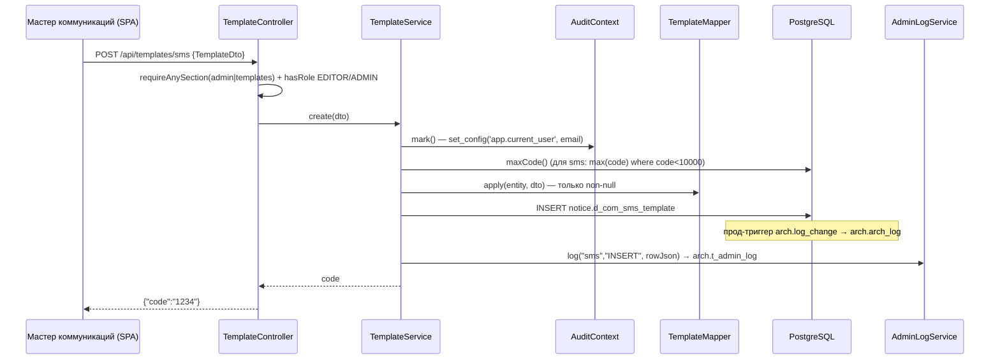

# Шаблоны и мастер коммуникаций

Подсистема шаблонов — ядро админки: единый CRUD над четырьмя канальными таблицами (push / email / sms / call-center) через один REST-контракт. Фронтовая часть («Мастер коммуникаций» и «Список шаблонов») описана в [[Мастер коммуникаций (формы)]]; сами таблицы БД — в [[Справочники шаблонов]]. Здесь — серверная сторона: контроллеры, сервисы, маппер, DTO, сущности и репозитории.

## TemplateController — REST-эндпоинты

`src/main/java/ru/banki/crm/web/TemplateController.java`, префикс `/api/templates`. Значения `{channel}`: `push` | `email` | `sms` | `cc` (нормализуются trim+lowercase в сервисе). Доступ: чтение — раздел `templates` или `admin` (через `AccessGuard.requireAnySection`), запись — дополнительно роль EDITOR/ADMIN (`@PreAuthorize("hasAnyRole('EDITOR','ADMIN')")`). Подробнее о двухуровневой модели — [[Безопасность и RBAC]].

| Метод | Путь | Что делает | Ответ |
|---|---|---|---|
| GET | `/api/templates` | объединённый список всех каналов с фильтрами `channel`, `product`, `touch`, `trigger`, `active` (все опциональны) | `List<TemplateListItemDto>` |
| GET | `/api/templates/{channel}/{code}` | полная карточка шаблона | `TemplateDto` |
| POST | `/api/templates/{channel}` | создание; `channel` из пути перекрывает поле DTO | `{"code": "<бизнес-код>"}` |
| POST | `/api/templates/{channel}/chain` | батч-создание «цепочки» (один base, много дней) | `{"codes": ["...", ...]}` |
| PUT | `/api/templates/{channel}/{code}` | частичное обновление (non-null поля DTO) | 200 без тела |
| DELETE | `/api/templates/{channel}/{code}` | удаление | 200 без тела |

Аналог в v2 (Appsmith): список — запрос `FetchAllTemplates` (UNION по таблицам), цепочка — клиентский цикл INSERT-ов.

## TemplateService — CRUD-диспетчер

`src/main/java/ru/banki/crm/service/TemplateService.java`. Все мутирующие методы `@Transactional` и начинаются с `audit.mark()` (установка GUC `app.current_user` для прод-триггера — см. [[Аудит и журналирование]]); каждая операция дополнительно пишется в `arch.t_admin_log` через `AdminLogService` в той же транзакции.

### list(channel, product, touch, trigger, active)

Читает `findAll()` из всех четырёх репозиториев в один `List<TemplateBase>`, маппит в `TemplateListItemDto` и фильтрует стримом:

- `channel`, `touch`, `trigger` — точное совпадение (пустая строка = без фильтра);
- `product` — `productType.contains(product)` (product_type — массив строк);
- `active` — строка `"active"` означает «только активные», любое другое непустое значение — «только неактивные» (сравнение `"active".equals(active) == Boolean.TRUE.equals(i.active())`).

Сортировка: по каналу, затем по коду (null-код считается пустой строкой). Фильтрация в памяти, не в SQL — при текущих объёмах справочников это осознанное упрощение.

### get(channel, code)

`load(channel, code)` → `mapper.toDto(...)`. Поиск строки зависит от канала:

- `push` → `pushRepo.findFirstByCode(Integer)` — по бизнес-коду;
- `sms` → `smsRepo.findFirstByCode(Integer)`;
- `email` → `emailRepo.findById(Long)` — у email бизнес-код и есть PK `id`;
- `cc` → `ccRepo.findFirstBySegment(Integer)` — по номеру сегмента, не по суррогатному id.

Не найдено → 404 `«Шаблон не найден: {channel}/{code}»`; неизвестный канал → 400.

### create(dto) → String (бизнес-код)

Генерация кода по каналам:

- **push**: `pushRepo.maxCode() + 1` (`max(code)` по всей таблице);
- **sms**: `smsRepo.maxCode() + 1`, причём `maxCode()` считает `max(code)` только среди `code < 10000` — правило v2 «SMS-коды держим ниже 10000» (выше живут спец-диапазоны);
- **email**: код не задаётся — им становится сгенерированный последовательностью PK `id` (`notice.email_template_id_seq`);
- **cc**: пользователь обязан прислать `dto.code` — это номер сегмента (`segment`); пусто → 400 «Для КЦ обязателен номер сегмента». Суррогатный PK `id` генерируется сам.

После сохранения: `adminLog.log(channel, "INSERT", rowJson)` — в журнал пишется **созданная** строка (для INSERT это единственный способ сохранить данные о заведении).

### createChain(req) — батч «цепочка»

`ChainRequest` (`src/main/java/ru/banki/crm/dto/ChainRequest.java`): `TemplateDto base` + `List<String> days`. Для каждого дня делается поверхностная копия base (`BeanUtils.copyProperties`) с подменой `sendingDay`, затем обычный `create(...)`. Всё в **одной транзакции** — v2 крутил цикл отдельных INSERT-ов на клиенте, и падение посередине оставляло полуцепочку; здесь либо создаются все дни, либо ни одного. Валидация: без base или с пустым days → 400. Ответ — список созданных кодов в порядке дней.

Не путать с цепочками-схемами (journeys): здесь «цепочка» — серия шаблонов одного касания по дням; конструктор схем описан в [[Цепочки (Journeys)]].

### update(channel, code, dto)

Загружает сущность, пишет в журнал состояние **до** изменения (`old_row` в классической семантике), затем `mapper.apply(e, dto)` — переносятся только non-null поля, т.е. это частичный update. Явного `save` нет — managed-сущность флашится на коммите.

### delete(channel, code)

Журналирует удаляемую строку (`old_row`), затем `delete` через канальный репозиторий с кастом к конкретному типу.

Вспомогательное: `idOf(TemplateBase)` — суррогатный PK строки через `instanceof`-каскад (у всех четырёх таблиц колонка `id`); используется для `rowJson`.

## TemplateMapper

`src/main/java/ru/banki/crm/service/TemplateMapper.java`, `@Component`. Три метода:

- `toListItem(TemplateBase)` → `TemplateListItemDto`: канал, бизнес-код, communication_name, product_type, touch_point, trigger_type, partner_name, active_flag; для email дополнительно `letterosId` (строкой).
- `toDto(TemplateBase)` — полная карточка: сначала общие поля `TemplateBase`, затем `instanceof`-ветка по каналу с канальными полями. `sendingDay` (Integer в БД) конвертируется в String для фронта; `letterosId` (Long) — тоже в String.
- `apply(TemplateBase, TemplateDto)` — запись: только non-null значения (хелпер `set(value, setter)`), поэтому годится и для create, и для частичного update. `setInt` парсит `sendingDay` из строки (пустое/некорректное — молча пропускается, остаётся дефолт сущности); `setLong` аналогично для `letterosId` (bigint; нечисловой ввод игнорируется).

## DTO

### TemplateDto (`src/main/java/ru/banki/crm/dto/TemplateDto.java`, `@Data`)

Единый payload на все каналы; заполняются только релевантные каналу поля.

- Идентификация: `channel` (push|email|sms|cc), `code` — бизнес-id строкой (code / email id / номер сегмента).
- Общее ядро (все каналы): `productType List<String>`, `sourceType`, `communicationType`, `source`, `triggerType`, `sendingDay` (строка), `partnerName`, `affSub3`, `active Boolean`, `communicationName`, `touchPoint`, `businessCommunicationType`, `nationalRating/marketplace/mobileApp/loyalty/dialog/news Boolean`, `selectionWizardService String`.
- push/sms: `msgText`, `title` (только push), `brief`, `name`, `deepLink`, `webviewUrl` (push), `senderName` (sms), `nightSend Boolean`.
- email: `letterosId` (строка), `subject`, `emailFrom`, `serviceFlag`, `infoFlag`, `preheader`, `utmCustom` (+ общий `msgText`).
- cc: `sourceSystem`, `segmentDescr`, `hostId Long`, `mlCheckProbability Boolean`, `mlProbabilityRequired BigDecimal`, `cutpercent/nocutpercent Integer`, `kvintCampaignId String`.

Важно: `source` есть в DTO как «общее» поле, но в сущностях оно живёт только у push/email/sms — у КЦ-таблицы такой колонки нет (см. ниже).

### TemplateListItemDto (record)

`channel, code, communicationName, productType List<String>, touchPoint, triggerType, partnerName, active Boolean, letterosId` — зеркалит колонки UNION-списка v2 FetchAllTemplates.

## Сущности

### TemplateBase (`src/main/java/ru/banki/crm/domain/TemplateBase.java`)

`@MappedSuperclass` — общие колонки четырёх таблиц. Все поля с дефолтами (`""`, `false`, `0`, пустой список), чтобы вставки из сокращённой формы v1 удовлетворяли прод-NOT NULL. Поля: `sourceType`, `productType` (`text[]`, маппится `@JdbcTypeCode(SqlTypes.ARRAY)` в `List<String>`), `communicationType`, `triggerType`, `sendingDay Integer` (smallint в notice-таблицах, integer в callcenter — Integer покрывает оба), `partnerName`, `affSub3`, `activeFlag Boolean = true`, `communicationName`, `touchPoint`, `businessCommunicationType`, `selectionWizardService` (**varchar(16)** в проде — сервисная метка, НЕ boolean), `nationalRating`, `marketplace`, `mobileApp`, `loyalty`, `dialog`, `news`.

Абстрактные методы: `channel()` (дискриминатор для объединённого списка) и `businessCode()` (бизнес-идентификатор строкой).

**Гоча: `source` НЕ в TemplateBase** — у `callcenter.d_segment_properties` нет такой колонки, поэтому `source` объявлен отдельно в `PushTemplate`, `EmailTemplate` и `SmsTemplate`. Именно из-за этого при материализации цепочек `resolveSource()` берёт source из шаблона первой comm-ноды и не может взять его у cc (см. [[Материализация (Flow)]]).

### Канальные сущности

| Сущность | Таблица | PK | Бизнес-код | Канальные поля |
|---|---|---|---|---|
| `PushTemplate` | `notice.push_template` | `id Long` (seq `notice.push_template_id_seq`) | `code Integer` (MAX+1) | `brief`, `name`, `title`, `msgText`, `deepLink`, `source`, `abGroup`, `webviewUrl`, `nightSend=false` |
| `SmsTemplate` | `notice.d_com_sms_template` | `id Integer` (seq `notice.d_com_sms_template_id_seq`) | `code Integer` (MAX+1, < 10000) | `brief`, `name`, `msgText`, `source`, `abGroup`, `senderName`, `nightSend=false`, `antispamCheck=false` |
| `EmailTemplate` | `notice.email_template` | `id Long` (seq `notice.email_template_id_seq`) | **PK = бизнес-код** | `triggerCode Integer`, `letterosId Long` (**bigint**), `subject=""`, `emailFrom=""`, `source`, `abGroup`, `service Boolean` (колонка `is_service`; имя без `is`, чтобы Lombok не портил boolean-аксессоры), `info` (`is_info`), `msgText`, `preheader`, `utmCustom`, `mailText` |
| `CcSegment` | `callcenter.d_segment_properties` | **суррогатный** `id Long` (seq `..._id_seq`), пользователю не показывается | `segment Integer NOT NULL` — вводится пользователем, поиск по нему | `sourceSystem=""`, `segmentDescr`, `hostId Long`, `mlCheckProbability Boolean`, `mlProbabilityRequired BigDecimal`, `cutpercent/nocutpercent Integer`, `abGroup`, `placement`, `kvintCampaignId` |

## Репозитории

`src/main/java/ru/banki/crm/repo/`:

- `PushTemplateRepository`: `findFirstByCode(Integer)`, `maxCode()` = `coalesce(max(code),0)`, `distinctPartnerNames()`, `distinctCommunicationNames()` (везде отсекаются null и пустые строки).
- `SmsTemplateRepository`: то же, но `maxCode()` с условием `code < 10000`.
- `EmailTemplateRepository`: только distinct-запросы (код = PK, отдельного maxCode нет).
- `CcSegmentRepository`: `findFirstBySegment(Integer)` + distinct-запросы.

## NamingService

`src/main/java/ru/banki/crm/service/NamingService.java`, `@Service`. Правила именования коммуникаций, портированные из v2 (`CommunicationNameJS`) / v1 `saveTemplate`. **Реализовано сейчас только суффиксирование A/B-вариантов**; полный префиксный генератор campaign_name/communication_name из v2 в бэкенд не перенесён — v1-фронт собирает communication_name на клиенте и присылает готовым, а campaign_name для слоя A формирует материализация (см. [[Материализация (Flow)]]).

Формула `abVariants(base, count)`:

1. пустой/blank base → заменяется на `"NoComName"`, иначе trim;
2. существующий хвост-вариант срезается: `replaceAll("-[a-zA-Z]$", "")` (из `foo-b` снова получается `foo`);
3. count зажимается в диапазон **[2, 26]**: `n = max(2, min(count, 26))` (меньше двух вариантов бессмысленно, больше 26 не хватит латиницы);
4. результат — `base + "-" + буква` по алфавиту `abcdefghijklmnopqrstuvwxyz`: `abVariants("foo", 3)` → `["foo-a", "foo-b", "foo-c"]`.

## Справочники: DictionaryController + DictionaryService

`src/main/java/ru/banki/crm/web/DictionaryController.java` (`/api/dictionaries`, без секционных гардов — доступно любому аутентифицированному) и `src/main/java/ru/banki/crm/service/DictionaryService.java`. Всё собирается из живых данных четырёх таблиц (в v2 — запросы AllPartnerName и FetchCCSegments):

| Эндпоинт | Метод сервиса | Что возвращает |
|---|---|---|
| GET `/partners` | `partnerNames()` | объединение `distinctPartnerNames()` всех 4 репозиториев, TreeSet → отсортированный список без дублей |
| GET `/cc-segments` | `ccSegments()` | `ccRepo.findAll()` — полные `CcSegment` (фронт показывает segment + описание) |
| GET `/comm-names?channel=` | `communicationNames(channel)` | distinct communication_name по каналу (`push`/`email`/`sms`/`cc`); без параметра или с неизвестным значением — по всем каналам сразу. Подсказки для editable-combobox мастера |

Отдельная группа справочников значений для Flow Builder (notify_channel КАПСОМ, definition_key, business_key_prefix, database) живёт не здесь, а в клиентском коде конструктора — см. [[Flow Builder (цепочки)]].

## Схема потока создания шаблона

## Связанные заметки

[[Обзор бэкенда]] · [[Мастер коммуникаций (формы)]] · [[Справочники шаблонов]] · [[Аудит и журналирование]] · [[Безопасность и RBAC]] · [[REST API]]
