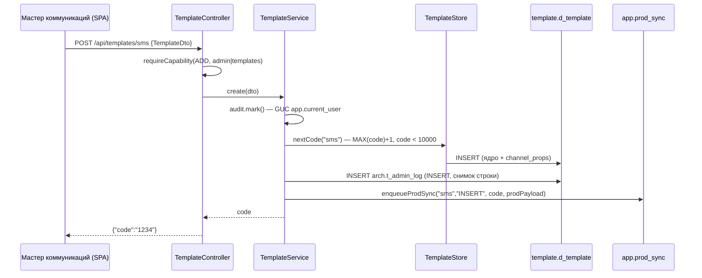

# Шаблоны и мастер коммуникаций

Серверная сторона шаблонов. **Единственное хранилище — `template.d_template`**: ядро типизированными колонками + `channel_props jsonb` с канальными полями. Канальные таблицы `notice.*` / `callcenter.*` приложением больше не читаются и не пишутся — их локальные копии выпилены миграцией `V12`, а настоящие живут во внешней прод-БД и наполняются очередью синка ([Синхронизация с прод-БД](Синхронизация%20с%20прод-БД.md)).

Структура самой таблицы — в [[Справочники шаблонов]]; фронтовая часть — в [[Мастер коммуникаций (формы)]]; список эндпоинтов — в [[REST API]].

## Каналы

`sms` · `push` · `email` · `cc` · `fa` · `vk` · `la`. Значение нормализуется trim + lowercase; неизвестное — 400 «Неизвестный канал: …».

Описание внешней прод-таблицы канала отдаёт `UnifiedTemplateService.channelTable(channel)` — record `ChannelTable(table, codeCol, hasNight, prodAssignsCode, codeLimit)`:

| Канал | Прод-таблица | Колонка кода | `night_send` | Код назначает прод | Лимит кода |
|---|---|---|---|---|---|
| `sms` | `notice.d_com_sms_template` | `code` | да | да | < 10000 |
| `push` | `notice.push_template` | `code` | да | да | — |
| `email` | `notice.email_template` | `id` | нет | да | < 10000 |
| `cc` | `callcenter.d_segment_properties` | `segment` | нет | **нет** | — |
| `fa` | `notice.fa_template` | `id` | нет | да | — |
| `vk` | `notice.vk_template` | `id` | нет | да | — |
| `la` | `notice.live_activity_template` | `id` | да | да | — |

Каналы `fa` (финансовый ассистент), `vk` и `la` (Live Activity) добавлены миграцией `V13` — только расширением CHECK-ограничения `channel`, без новых колонок: всё специфичное лежит в `channel_props`. Схема их прод-таблиц предварительная и уточняется при подключении доставки. В мастере `la` — тумблер внутри формы Push: включён → канал `la`, выключен → обычный `push`.

`UnifiedTemplateService.prodDefaults(channel)` перечисляет канальные поля, которые прод требует непустыми (сейчас — `email.subject`); они подставляются пустой строкой и при записи к нам, и при доставке.

## TemplateController — `/api/templates`

Тонкий: гард доступа + делегирование. Чтение требует раздела `templates` или `admin` (`AccessGuard.requireAnySection`), запись — соответствующего права в матрице (`requireCapability(ADD|EDIT|DELETE, …)`), см. [[Безопасность и RBAC]].

| Метод | Путь | Что делает |
|---|---|---|
| GET | `/api/templates` | список с фильтрами `channel`, `product`, `touch`, `trigger`, `partner` (мультизначные), `active`, `q`, сортировкой `sort`/`dir` и пагинацией `limit`/`offset` |
| GET | `/api/templates/facets` | значения выпадающих фильтров из реальных данных |
| GET | `/api/templates/count` | `{total, active}` под теми же фильтрами |
| GET | `/api/templates/{channel}/{code}` | полная карточка (`TemplateDto`) |
| POST | `/api/templates/{channel}` | создание, `channel` из пути перекрывает поле DTO → `{"code": "…"}` |
| POST | `/api/templates/{channel}/chain` | батч «цепочка» → `{"codes": [...]}` |
| PUT | `/api/templates/{channel}/{code}` | частичное обновление |
| DELETE | `/api/templates/{channel}/{code}` | удаление |

## TemplateService — CRUD и список

Мутирующие методы `@Transactional`, начинаются с `audit.mark()`, пишут в `arch.t_admin_log` и ставят операцию в очередь синка — всё в одной транзакции (см. [Аудит и журналирование](Аудит%20и%20журналирование.md)).

### Две проверки перед сохранением

**Обязательные поля карточки** — `requireFilled` (`src/main/java/ru/banki/crm/service/TemplateService.java:100`). Тот же список, что и в форме, но проверяется на сервере: форму можно обойти запросом в API, материализацией цепочки, импортом, а правило про то, что уедет в прод, должен держать сервер. Общий набор — communication name, trigger type, product type, partner name, touch point, sending day, communication tunnel, business communication type, landing page; сверх него у `email` — Letteros ID, у `sms` — message text и sender name, у остальных каналов, кроме `cc`, — message text. У письма нет текста сообщения (контент в Letteros), у КЦ нет ни текста, ни отправителя.

**При правке спрашивается только за то, что очищают**: если поле было пустым и до правки, оно пропускается. У шаблонов, заведённых до появления правила, часть полей пуста, и запрет целиком запер бы старые карточки — поправить текст было бы нельзя, пока не заполнишь всё остальное. Стереть уже заполненное по-прежнему нельзя. Не хватает — `400 «Не заполнены обязательные поля: …»`.

**Пре-флайт по схеме прода** — `requireProdAccepts` перед постановкой в очередь: payload сверяется с колонками прод-таблицы, которые `NOT NULL` и без `DEFAULT`. Описан в [Синхронизация с прод-БД](Синхронизация%20с%20прод-БД.md).

**`list(...)`** — фильтрация и сортировка **в памяти** поверх `TemplateStore.list()`. Внутри одного фильтра значения объединяются по ИЛИ, между фильтрами — И; `product` проходит, если списки продуктов пересекаются; `active` сравнивается как `"active".equals(active) == Boolean.TRUE.equals(i.active())`; `q` — свободный поиск по коду, названию, партнёру, точке касания, триггеру, `campaign_name`, `letteros_id` и продуктам. Сортируется **вся** отфильтрованная выборка и только потом режется страница (иначе порядок был бы виден лишь внутри загруженных строк). Коды сравниваются как числа («9» < «10»), строки — русским `Collator`; хвостовой ключ `channel + code` держит страницы стабильными.

**`facets()` / `count(...)`** — значения фильтров и итоги из тех же данных, чтобы клиент не выгружал весь справочник.

**`create(dto)`** — код по каналу:

- `cc` — номер сегмента обязателен и приходит от пользователя; пусто → 400 «Для КЦ обязателен номер сегмента», дубль → 409 «Сегмент уже заведён: …»;
- остальные — `TemplateStore.nextCode(channel)`: `MAX(code) + 1` внутри канала, у `sms` и `email` — только среди `code < 10000` (выше живут служебные коды прода). Диапазон исчерпан → 409 «Свободные коды канала … закончились».

Дальше `store.insert`, запись `INSERT` в журнал и постановка в очередь синка. Коды при доставке может переназначить прод (`prodAssignsCode`) — как это происходит и что бывает, когда новый код уже занят, описано в [Синхронизация с прод-БД](Синхронизация%20с%20прод-БД.md).

**`createChain(req)`** — `ChainRequest(base, days)`: на каждый день делается копия base (`BeanUtils.copyProperties`) с подменённым `sendingDay`, дальше обычный `create`. Всё в **одной транзакции** — либо создаются все дни, либо ни одного. Без base или с пустым days → 400.

> Не путать с цепочками-схемами: здесь «цепочка» — серия шаблонов одного касания по дням. Конструктор схем — [Цепочки (Journeys)](Цепочки%20(Journeys).md).

**`update`** — сначала снимок строки **до** изменения в журнал, потом частичное обновление; **`delete`** — проверка существования, снимок в журнал, удаление, `DELETE` в очередь синка тем же payload'ом.

## TemplateStore — маппинг DTO ↔ колонки

`JdbcTemplate` + Jackson. Строка читается как `to_jsonb(t)` и разбирается в `TemplateDto`, пишется — параметризованным SQL.

### Ядро: DTO → колонка `d_template`

| Поле DTO | Колонка |
|---|---|
| `communicationName` | `communication_name` |
| **`sourceType`** | **`campaign_name`** |
| `communicationType` | `communication_type` |
| `businessCommunicationType` | `business_communication_type` |
| `triggerType` | `trigger_type` |
| `sendingDay` (строка) | `sending_day` (smallint) |
| `productType` `List<String>` | `product_type` `text[]` |
| `partnerName`, `touchPoint`, `affSub3`, `selectionWizardService` | одноимённые |
| `marketplace`, `dialog`, `loyalty`, `nationalRating`, `news`, `mobileApp`, `nightSend` | одноимённые boolean |
| `active` | `active_flag` |

Расхождение `sourceType ↔ campaign_name` — историческое: в прод-таблицах колонка называется `source_type`, у нас — `campaign_name`, а DTO сохранил прод-имя. Обе стороны перевода собраны в `TemplateStore.CORE_TO_PROD`.

### Канальные поля: DTO → ключ `channel_props`

`source`, `msg_text`, `title`, `brief`, `name`, `deep_link`, `webview_url`, `sender_name`, `letteros_id`, `subject`, `email_from`, `is_service`, `is_info`, `preheader`, `utm_custom`, `source_system`, `segment_descr`, `host_id`, `ml_check_probability`, `ml_probability_required`, `cutpercent`, `nocutpercent`, `kvint_campaign_id`, `ab_group`; для `fa` — `fa_id`, `c2d_transport`, `c2d_account`, `web_url`, `link_title`, `need_push`, `ch2d_operator_id`, `channel_id`, `action_buttons`; для `vk` — `vk_template_name`, `ttl`, `buttons`; для `la` — `activity_name`, `la_event`, `la_visualization`, `la_status`, `current_step`, `la_visualization_attributes`.

Ключи — это **имена колонок прод-таблиц**, поэтому обратная сборка тривиальна. Поля `action_buttons`, `buttons`, `la_visualization_attributes` приходят строкой и кладутся как разобранный JSON; если строка не парсится — сохраняется как есть, данные не теряются.

**Исключение — `source` у e-mail.** В прод эта колонка не отправляется вообще: `prodPayload` убирает ключ из payload. Раз колонки нет в payload — она не попадает ни в список колонок `INSERT` (сработает `DEFAULT` прод-таблицы), ни в `SET` при `UPDATE` (значение останется как было); по той же причине сверка с продом её не сравнивает — `diffNodes` идёт по полям нашего payload.

Раньше туда уезжал плейсхолдер `{{linkSourceCRM}}`: считалось, что через него собираются ссылки в письме. Это оказалось неверно — поле заполняет не панель, и наша запись затирала чужое значение. Сам плейсхолдер никуда не делся, но живёт он **в ссылках внутри письма**, которые собирает «Конструктор ссылок» (`onelink.js`, `getSourceValue`), а не в колонке прод-таблицы.

Обратный ход при этом не изменился по смыслу: карточка показывает `channel_props.source` как имя кампании, и оно берётся из `source_type`. Разница в том, что раньше подмена срабатывала только при точном совпадении с плейсхолдером, а любое другое значение прода приезжало в поле «имя кампании» как есть; теперь `source` прода при импорте не читается совсем.

### Частичное обновление и мерж props

`update` собирает `SET` только из non-null полей DTO, а `channel_props` **мержится**: `channel_props = channel_props || CAST(? AS jsonb)`. Поэтому форма может прислать одно поле, не затирая остальные. `timestamp_upd = now()` ставится всегда.

### prodPayload — строка в структуре прод-таблицы

`channel_props` + ядро под прод-именами (`CORE_TO_PROD`) + бизнес-код под именем `codeColumn(channel)` (`id` для email/fa/vk/la, `segment` для cc, иначе `code`). Null-значения выбрасываются: в проде такие колонки NOT NULL с дефолтом.

**Метки времени наружу не отправляются.** `PROD_TIMESTAMPS = {timestamp_cr, timestamp_upd}` вычищаются и из payload'а, и при обратном импорте: их проставляет сам прод, а уехавшая туда устаревшая метка сломала бы отслеживание изменений, на котором держится ETL. Ранее попавшие в `channel_props` метки подчистила миграция `V17`.

`upsertFromProdRow(channel, prod)` — обратное направление: строка прод-таблицы (jsonb с прод-именами) раскладывается по ядру и `channel_props` и пишется `ON CONFLICT (channel, code) DO UPDATE`. Очередь синка при этом не трогается — тянем **из** прода. Используется ETL и сверкой, см. [Синхронизация с прод-БД](Синхронизация%20с%20прод-БД.md).

## Правила именования — NamingService

Реализовано **только суффиксирование A/B-вариантов**; полный префиксный генератор `communication_name` из v2 в бэкенд не перенесён — фронт собирает имя на клиенте и присылает готовым.

`abVariants(base, count)`:

1. пустой base → `"NoComName"`, иначе trim;
2. существующий хвост-вариант срезается: `replaceAll("-[a-zA-Z]$", "")` (из `foo-b` снова `foo`);
3. count зажимается в **[2, 26]** (меньше двух бессмысленно, больше 26 не хватит латиницы);
4. результат — `base + "-" + буква`: `abVariants("foo", 3)` → `["foo-a", "foo-b", "foo-c"]`.

## Справочники — DictionaryController + DictionaryService

`/api/dictionaries`, без секционных гардов (доступно любому аутентифицированному).

| Эндпоинт | Источник |
|---|---|
| GET `/partners` | справочник `dictionary.d_partner` (`V25`) |
| POST `/partners` | завести партнёра прямо из формы; требует ADD на `admin`, `templates` или `promo` |
| GET `/cc-segments` | строки канала `cc`: код, `communication_name`, `channel_props->>'segment_descr'`, `active_flag` |
| GET `/comm-names` | **только** справочник `reference.d_communication_name` |
| GET `/touch-points` | `reference.d_touch_point` |
| GET `/product-types` | `dictionary.d_product_type`, порядок по `sort_order` (смысловой, не алфавитный) |

`comm-names` и `partners` раньше собирались как `DISTINCT` по заведённым шаблонам; на реальных данных список превращался в свалку исторических значений и опечаток, поэтому оба оставлены чистыми справочниками. У `comm-names` параметр `channel` сохранён ради совместимости вызовов, но на результат не влияет. Поля в форме остались редактируемыми — вписать значение вне списка по-прежнему можно, а нужное — добавить в справочник прямо из формы (`POST /partners`).

Сравнение при добавлении партнёра **регистронезависимое**: `UNIQUE (name)` считает «Sber» и «sber» разными, а для списка это дубль. Если такой партнёр уже есть, возвращается его каноническое написание, и форма подставляет именно его. Имя длиннее 200 символов отбивается на входе — столько в колонке.

## Поток создания шаблона

## Связанные заметки

[Обзор бэкенда](Обзор%20бэкенда.md) · [[Справочники шаблонов]] · [[Мастер коммуникаций (формы)]] · [Синхронизация с прод-БД](Синхронизация%20с%20прод-БД.md) · [Материализация (Flow)](Материализация%20(Flow).md) · [Аудит и журналирование](Аудит%20и%20журналирование.md) · [[Безопасность и RBAC]] · [[REST API]]
