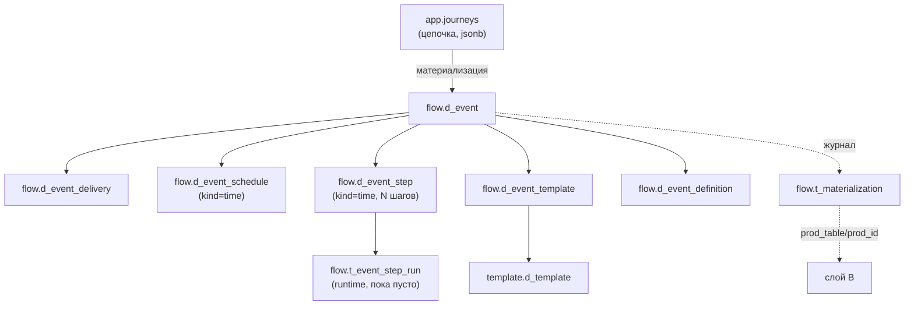

# Слой A (flow)

Схема **`flow`** — наша нормализованная модель процесса коммуникаций, «истина» для UI и Flow Builder. **8 таблиц**, создана миграцией `V6__flow_layer_a.sql`. Заполняет её `ru/banki/crm/service/flow/MaterializationService`; из этой же модели данные разворачиваются в [[Слой B (процессные таблицы)]] — копии продовых таблиц, которые читают существующие движки рассылок.

Здесь описана **структура схемы `flow`**. Алгоритм материализации (что именно и в каком порядке пишется, валидация, разворачивание Subflow) — [[Материализация (Flow)]]; формат цепочки-источника — [[Цепочки (Journeys)]]; карта схем — [[Схема БД]].

Зачем отдельный слой: продовые таблицы исторически разрознены — онлайн-события в `tracker`, расписание в `scheduler`, маппинги в `template`/`commapi`, конфиг перемешан с runtime. Слой A сводит всё к одному агрегату «событие» с чистым разделением конфиг/runtime, а слой B становится **производным артефактом**, который можно пересобрать в любой момент. Конвенция имён: `d_*` — конфигурация, `t_*` — runtime и журналы.

## flow.d_event — единый справочник событий

Заменяет собой пару «`tracker.t_event_comm` (онлайн) + `scheduler.t_get_event` (расписание)»: тип различается колонкой `kind`. Единственная таблица схемы с естественным ключом.

| Колонка | Тип | Ключи / NOT NULL | Смысл |
| ------- | --- | ---------------- | ----- |
| `id` | `bigint` | PK, IDENTITY | — |
| `kind` | `varchar(10)` | NOT NULL, CHECK `IN ('income','time')` | `income` — онлайн-событие (старт Income event), `time` — событие расписания (старт Time event) |
| `event_name` | `varchar(255)` | NOT NULL, UNIQUE вместе с `system` | Имя события |
| `system` | `varchar(255)` | UNIQUE `(event_name, system)` | Система-источник события |
| `source` | `varchar(255)` | — | Источник кампании. **Руками не вводится**: берётся из шаблона первой (по дню) comm-ноды — `coalesce(channel_props->>'source', campaign_name)` из `template.d_template` |
| `group_event_descr` | `varchar(255)` | — | Группа событий (описание) |
| `description` | `varchar(255)` | — | Описание; при материализации сюда пишется имя цепочки |
| `journey_id` | `varchar(36)` | FK → `app.journeys(id)` ON DELETE SET NULL | Обратная ссылка на цепочку-схему, породившую событие |
| `is_active` | `boolean` | NOT NULL DEFAULT true | Активность; задаёт пользователь в свойствах стартового узла |
| `timestamp_cr` | `timestamptz` | NOT NULL DEFAULT now() | Создание |
| `timestamp_upd` | `timestamptz` | — | Обновление (заполняется upsert-ом) |

Пишется upsert-ом `INSERT … ON CONFLICT (event_name, system) DO UPDATE … RETURNING id` — повторная материализация той же цепочки не плодит события. Вся обвязка события (`d_event_delivery` / `_schedule` / `_step` / `_template` / `_definition`) при этом **удаляется по `event_id` и создаётся заново**.

## flow.d_event_delivery — настройки доставки

Одна строка на событие, пишется для обоих `kind`.

| Колонка | Тип | Ключи / NOT NULL | Смысл |
| ------- | --- | ---------------- | ----- |
| `id` | `bigint` | PK, IDENTITY | — |
| `event_id` | `bigint` | NOT NULL, FK → `flow.d_event(id)` ON DELETE CASCADE | Событие |
| `notify_channel` | `varchar(20)` | — | Канал уведомления; значения продовые, **капсом**: `SMS`, `EMAIL`, `PUSH`, `CC`, `FA`, `VK`, `WA`, `WEBPUSH`, `ROBOT` |
| `sub_channel` | `varchar(255)` | — | Подканал |
| `platform` | `varchar(50)` | — | Платформа |
| `send_delay` | `integer` | — | Задержка отправки (материализация по умолчанию ставит 2) |
| `life_time` | `integer` | — | Время жизни коммуникации (по умолчанию 1000) |
| `check_interval` | `interval` | — | Интервал проверки (аналог `tracker.d_comm_creation.check_interval`); материализацией не заполняется |
| `allow_ml` | `boolean` | NOT NULL DEFAULT false | Разрешить ML-фильтрацию |
| `comm_decision_tree_id` | `bigint` | — | ID дерева решений; не заполняется |
| `stop_product_ids` | `bigint[]` | — | Стоп-продукты; не заполняется |
| `stop_events` | `jsonb` | — | Стоп-события; не заполняется |
| `notify_channel_priority` | `jsonb` | — | Приоритет каналов; не заполняется |

## flow.d_event_schedule — расписание (только kind=time)

Чистый конфиг без runtime. Единственная таблица схемы, где PK — не суррогатный `id`, а сам `event_id`: строка на событие ровно одна, и это гарантировано ключом.

| Колонка | Тип | Ключи / NOT NULL | Смысл |
| ------- | --- | ---------------- | ----- |
| `event_id` | `bigint` | **PK**, NOT NULL, FK → `flow.d_event(id)` ON DELETE CASCADE | Событие |
| `crontab` | `varchar` | — | Расписание **одним текстовым crontab-выражением** (напр. `0 9 * * *`). В форме Time event это единственное поле расписания |
| `time_start` | `timestamp` | — | Наследие продовой `t_launch_settings`; материализация не заполняет |
| `period_unit` | `varchar(6)` | — | Легаси-периодичность; не заполняется |
| `period_q` | `integer` | — | Легаси-периодичность; не заполняется |
| `date_start` / `date_end` | `timestamp` | — | Окно действия расписания; не заполняются |
| `database` | `varchar(255)` | — | БД выборки: `crmdb` (по умолчанию) или `greenplum` |
| `is_batch` | `boolean` | NOT NULL DEFAULT true | Батчевый запуск |
| `max_retry_attempts` | `integer` | DEFAULT 1 | Число ретраев |
| `priority` | `integer` | — | Приоритет джобы |
| `job_group` | `varchar(255)` | DEFAULT `'CRM'` | Группа джобов |

Материализация вставляет только `(event_id, crontab, database, is_batch = true)`.

## flow.d_event_step — SQL-шаги выборки (конфиг)

У Time event шагов может быть несколько: в UI это `props.sql_steps` — JSON-массив строк; на каждый элемент создаётся строка здесь и в `scheduler.t_execution_steps`.

| Колонка | Тип | Ключи / NOT NULL | Смысл |
| ------- | --- | ---------------- | ----- |
| `id` | `bigint` | PK, IDENTITY | — |
| `event_id` | `bigint` | NOT NULL, FK → `flow.d_event(id)` ON DELETE CASCADE | Событие |
| `order_num` | `integer` | NOT NULL | Порядок шага, 1..N по порядку в массиве |
| `process_name` | `varchar(255)` | — | Имя процесса выборки; совпадает с `selection` слоя B (`props.process_name`, фолбэк — `event_name`) |
| `sql_text` | `varchar` | — | SQL шага |
| `returns_result_set` | `boolean` | NOT NULL DEFAULT false | Возвращает ли шаг выборку (материализация ставит `true`) |
| `is_active` | `boolean` | NOT NULL DEFAULT true | Активность |

## flow.t_event_step_run — история исполнений (runtime)

Отделяет runtime от конфига: в продовой `t_execution_steps` статусы последнего запуска затирают друг друга, здесь — append-only история. **Пока не заполняется**: собственного движка исполнения нет, таблица — задел.

| Колонка | Тип | Ключи / NOT NULL | Смысл |
| ------- | --- | ---------------- | ----- |
| `id` | `bigint` | PK, IDENTITY | — |
| `step_id` | `bigint` | NOT NULL, FK → `flow.d_event_step(id)` ON DELETE CASCADE | Шаг |
| `started_at` | `timestamptz` | NOT NULL DEFAULT now() | Старт |
| `finished_at` | `timestamptz` | — | Финиш |
| `status` | `varchar(20)` | — | Статус исполнения |
| `error` | `varchar` | — | Текст ошибки |
| `rows_affected` | `bigint` | — | Затронуто строк |

## flow.d_event_template — событие → шаблон

| Колонка | Тип | Ключи / NOT NULL | Смысл |
| ------- | --- | ---------------- | ----- |
| `id` | `bigint` | PK, IDENTITY | — |
| `event_id` | `bigint` | NOT NULL, FK → `flow.d_event(id)` ON DELETE CASCADE | Событие |
| `template_id` | `bigint` | FK → `template.d_template(id)` ON DELETE SET NULL | Шаблон в едином справочнике — **единственный межсхемный FK слоя A наружу**, кроме `journey_id`. См. [[Справочники шаблонов]] |
| `step_no` | `integer` | — | `NULL` = одиночный шаблон; для цепочки — позиция шага 1..N (comm-ноды отсортированы по дню) |
| `segment_id` | `integer` | — | Сегмент (аналог `d_template_mapping.segment_id`); не заполняется |
| `is_multiple_choice` | `boolean` | DEFAULT false | Множественный выбор шаблона |

Шаблоны вложенных цепочек (Subflow) попадают сюда как обычные шаги родительского события — список comm-нод разворачивается рекурсивно ([[Материализация (Flow)]]).

## flow.d_event_definition — событие → метод отправки

| Колонка | Тип | Ключи / NOT NULL | Смысл |
| ------- | --- | ---------------- | ----- |
| `id` | `bigint` | PK, IDENTITY | — |
| `event_id` | `bigint` | NOT NULL, FK → `flow.d_event(id)` ON DELETE CASCADE | Событие |
| `notify_channel` | `varchar(20)` | — | Канал (капсом) |
| `definition_key` | `varchar(255)` | — | Ключ Camunda-процесса отправки; в UI select из значений прода: `smsChannelProcessV2`, `pushChannelProcessV2`, `smsChannelProccessV2` (**да, с опечаткой «Proccess» — так в проде**), `emailChannelProcessV2`, `vkChannelProcessV2`, `waChannelProcessV2` |
| `business_key_prefix` | `varchar(255)` | — | Префикс бизнес-ключа: `WaChannel`, `VkChannel`, `PushChannel`, `webPushChannel`, `pushChannel`, `emailChannel`, `smsChannel` |
| `is_correlation` | `boolean` | NOT NULL DEFAULT false | Корреляция сообщений |
| `correlation_keys` | `text[]` | — | Ключи корреляции; не заполняется |
| `notify_channel_priority` | `jsonb` | — | Приоритет каналов; не заполняется |

## flow.t_materialization — журнал соответствий слоёв

Сердце идемпотентности: фиксирует, **что** и **во что** материализовалось в слое B. Внешних ключей нет намеренно — таблица связывает сущности из разных схем по строковым именам.

| Колонка | Тип | Ключи / NOT NULL | Смысл |
| ------- | --- | ---------------- | ----- |
| `id` | `bigint` | PK, IDENTITY | — |
| `our_entity` | `varchar(64)` | NOT NULL | Наша сущность, напр. `app.journeys` |
| `our_id` | `varchar(64)` | NOT NULL | Её идентификатор (id цепочки) |
| `prod_table` | `varchar(128)` | NOT NULL | Таблица слоя B, напр. `scheduler.t_get_event` |
| `prod_id` | `varchar(64)` | NOT NULL | id созданной строки слоя B |
| `materialized_at` | `timestamptz` | NOT NULL DEFAULT now() | Момент |
| `materialized_by` | `varchar(255)` | — | Email автора |

Повторная материализация цепочки сначала удаляет по этому журналу свои прежние строки слоя B (только из белого списка таблиц), затем чистит журнал и создаёт всё заново.

## Замечания по целостности

Модель молодая, и часть инвариантов держится на коде, а не на схеме. Фиксируем честно — при доработке слоя A это первые кандидаты на исправление.

1. **Нет уникальных ключей на обвязке события.** У `d_event_delivery`, `d_event_definition` и `d_event_template` есть только PK по суррогатному `id`. Ожидаемых UNIQUE — `(event_id, notify_channel)` у первых двух и `(event_id, step_no)` у третьей — **не существует**; у `d_event_step` аналогично нет UNIQUE `(event_id, order_num)`. Дубли по событию база примет молча. Единственность сейчас обеспечивает только `MaterializationService`, который перед вставкой делает `DELETE … WHERE event_id = :e`; любая запись мимо этого кода (руками, другим сервисом, частично упавшая транзакция) даст дубликаты, которые движки слоя B размножат в отправки.
2. **`notify_channel` и `notify_channel_priority` дублируются** между `d_event_delivery` и `d_event_definition`. Обе колонки описывают одно и то же, синхронизировать их нечем — при расхождении непонятно, какая строка авторитетна. Наследие того, что слой A повторяет разбивку прод-таблиц (`tracker.d_comm_creation` и `commapi.d_definition_mapping` тоже хранят канал каждая у себя).
3. **Массивы и jsonb исключают внешние ключи.** `d_event_delivery.stop_product_ids` (`bigint[]`), `d_event_delivery.stop_events` (`jsonb`), `d_event_definition.correlation_keys` (`text[]`) — по смыслу ссылки на продукты и события, но на массив и jsonb FK не построить. Ссылочная целостность по этим полям не проверяется никем; сейчас это не стреляет только потому, что материализация их не заполняет.
4. **`t_materialization` без индексов** кроме PK, хотя читается всегда по `(our_entity, our_id)`. На нынешних объёмах (десятки строк) незаметно.

Источники: живой контур test (`information_schema.columns`, `pg_constraint`); `src/main/resources/db/migration/V6__flow_layer_a.sql`; `src/main/java/ru/banki/crm/service/flow/MaterializationService.java`; `src/main/resources/static/journeys.js`.
