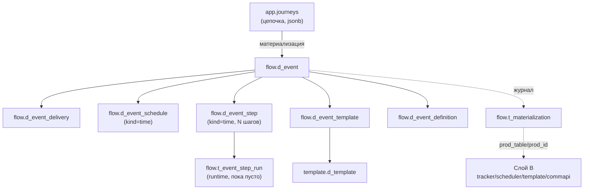

# Слой A (flow)

Схема `flow` — **наша нормализованная модель процесса коммуникаций**, «истина» для UI и Flow Builder. Создаётся миграцией `V6__flow_layer_a.sql` (`CREATE SCHEMA IF NOT EXISTS flow`). Заполняет её `ru/banki/crm/service/flow/MaterializationService` при материализации цепочки; из этой же модели данные разворачиваются в [[Слой B (процессные таблицы)]] — копии продовых таблиц, которые читают существующие движки рассылок. Общая картина процесса — [[Материализация (Flow)]] и [[Флоу системы]].

Зачем два слоя: продовые таблицы (слой B) исторически разрознены — онлайн-события в `tracker`, расписание в `scheduler`, маппинги в `template`/`commapi`, конфиг перемешан с runtime (`t_launch_settings` хранит и crontab, и статусы последнего запуска). Слой A сводит всё к одному агрегату «событие» с чистым разделением конфиг/runtime; слой B становится **производным артефактом**, который можно в любой момент пересобрать из слоя A. Конвенция имён: `d_*` — конфигурация, `t_*` — runtime/журналы.

## flow.d_event — единый справочник событий

Заменяет собой пару `tracker.t_event_comm` (онлайн) + `scheduler.t_get_event` (расписание): тип различается колонкой `kind`.

| Колонка | Тип | Смысл |
| ------- | --- | ----- |
| `id` | `bigint IDENTITY PK` | — |
| `kind` | `varchar(10) NOT NULL` | `CHECK (kind IN ('income','time'))`: `income` — онлайн-событие (старт Income event), `time` — событие расписания (старт Time event) |
| `event_name` | `varchar(255) NOT NULL` | Имя события; вместе с `system` — естественный ключ: `UNIQUE (event_name, system)` |
| `system` | `varchar(255)` | Система-источник события |
| `source` | `varchar(255)` | Источник кампании. **Не вводится руками**: `MaterializationService.resolveSource()` берёт его из шаблона первой (по дню) comm-ноды цепочки, включая развёрнутые Subflow; у cc-шаблонов колонки `source` нет — они пропускаются |
| `group_event_descr` | `varchar(255)` | Группа событий (описание) |
| `description` | `varchar(255)` | Описание; при материализации сюда пишется имя цепочки (`j.name()`) |
| `journey_id` | `varchar(36) REFERENCES app.journeys(id) ON DELETE SET NULL` | Обратная ссылка на цепочку-схему, породившую событие |
| `is_active` | `boolean NOT NULL DEFAULT true` | Активность |
| `timestamp_cr` | `timestamptz NOT NULL DEFAULT now()` | Создание |
| `timestamp_upd` | `timestamptz` | Обновление (заполняется upsert'ом) |

Пишется upsert'ом `INSERT … ON CONFLICT (event_name, system) DO UPDATE … RETURNING id` (`MaterializationService.upsertLayerA`) — повторная материализация той же цепочки не плодит события. Вся «обвязка» события (`d_event_delivery/schedule/step/template/definition`) при этом **удаляется и создаётся заново** — идемпотентно.

## flow.d_event_delivery — настройки доставки

Одна строка на событие (пишется всегда, для обоих kind).

| Колонка | Тип | Смысл |
| ------- | --- | ----- |
| `id` | `bigint IDENTITY PK` | — |
| `event_id` | `bigint NOT NULL → flow.d_event (CASCADE)` | Событие |
| `notify_channel` | `varchar(20)` | Канал уведомления; в UI это select с продовыми значениями **капсом**: `SMS`, `EMAIL`, `PUSH`, `CC`, `FA`, `VK`, `WA`, `WEBPUSH`, `ROBOT` (`NOTIFY_CHANNELS` в `static/journeys.js`) |
| `sub_channel` | `varchar(255)` | Подканал |
| `platform` | `varchar(50)` | Платформа |
| `send_delay` | `integer` | Задержка отправки (по умолчанию при материализации — 2) |
| `life_time` | `integer` | Время жизни коммуникации (по умолчанию 1000) |
| `check_interval` | `interval` | Интервал проверки (аналог `tracker.d_comm_creation.check_interval`; материализацией пока не заполняется) |
| `allow_ml` | `boolean NOT NULL DEFAULT false` | Разрешить ML-фильтрацию |
| `comm_decision_tree_id` | `bigint` | ID дерева решений (пока не заполняется) |
| `stop_product_ids` | `bigint[]` | Стоп-продукты (пока не заполняется) |
| `stop_events` | `jsonb` | Стоп-события (пока не заполняется) |
| `notify_channel_priority` | `jsonb` | Приоритет каналов (пока не заполняется) |

## flow.d_event_schedule — расписание (только kind=time)

Чистый конфиг без runtime; PK = `event_id` (одна строка на событие).

| Колонка | Тип | Смысл |
| ------- | --- | ----- |
| `event_id` | `bigint PK → flow.d_event (CASCADE)` | Событие |
| `crontab` | `varchar` | Расписание **одним текстовым crontab-выражением** (напр. `0 9 * * *`). В Time event UI это единственное поле расписания — полей `time_start`/`period_unit`/`period_q` в форме больше нет |
| `time_start` | `timestamp` | Есть в DDL (наследие продовой `t_launch_settings`), но материализация её **не заполняет** |
| `period_unit` | `varchar(6)` | Аналогично — в DDL есть, не заполняется |
| `period_q` | `integer` | Аналогично — не заполняется |
| `date_start` / `date_end` | `timestamp` | Окно действия расписания (не заполняются) |
| `database` | `varchar(255)` | БД выборки; select в UI: `crmdb` (default) или `greenplum` |
| `is_batch` | `boolean NOT NULL DEFAULT true` | Батчевый запуск |
| `max_retry_attempts` | `integer DEFAULT 1` | Ретраи |
| `priority` | `integer` | Приоритет |
| `job_group` | `varchar(255) DEFAULT 'CRM'` | Группа джобов |

Материализация вставляет только `(event_id, crontab, database, is_batch=true)` — см. `upsertLayerA`.

## flow.d_event_step — SQL-шаги выборки (конфиг)

Time event может иметь **несколько** SQL-шагов: в UI это `props.sql_steps` — JSON-массив строк (поле kind `steps` в `journeys.js`); `MaterializationService.sqlSteps()` парсит массив (легаси-фолбэк: одиночный `props.sql`) и создаёт по строке на шаг здесь и в `scheduler.t_execution_steps`.

| Колонка | Тип | Смысл |
| ------- | --- | ----- |
| `id` | `bigint IDENTITY PK` | — |
| `event_id` | `bigint NOT NULL → flow.d_event (CASCADE)` | Событие |
| `order_num` | `integer NOT NULL` | Порядок шага (1..N по порядку в массиве) |
| `process_name` | `varchar(255)` | Имя процесса выборки; **одно поле** — равно `selection` (`props.process_name`, фолбэк — `event_name`) |
| `sql_text` | `varchar` | SQL шага |
| `returns_result_set` | `boolean NOT NULL DEFAULT false` | Возвращает ли шаг выборку (материализация ставит `true`) |
| `is_active` | `boolean NOT NULL DEFAULT true` | Активность |

## flow.t_event_step_run — история исполнений (runtime)

Отделяет runtime от конфига: в продовой `t_execution_steps` статусы последнего запуска затирают друг друга, здесь — append-only история. **Пока не заполняется**: собственный движок исполнения не реализован, таблица — задел.

| Колонка | Тип | Смысл |
| ------- | --- | ----- |
| `id` | `bigint IDENTITY PK` | — |
| `step_id` | `bigint NOT NULL → flow.d_event_step (CASCADE)` | Шаг |
| `started_at` | `timestamptz NOT NULL DEFAULT now()` | Старт |
| `finished_at` | `timestamptz` | Финиш |
| `status` | `varchar(20)` | Статус исполнения |
| `error` | `varchar` | Текст ошибки |
| `rows_affected` | `bigint` | Затронутые строки |

## flow.d_event_template — событие → шаблон

| Колонка | Тип | Смысл |
| ------- | --- | ----- |
| `id` | `bigint IDENTITY PK` | — |
| `event_id` | `bigint NOT NULL → flow.d_event (CASCADE)` | Событие |
| `template_id` | `bigint REFERENCES template.d_template(id) ON DELETE SET NULL` | Шаблон в **едином** справочнике (FK добавлен `ALTER TABLE` в V6 после создания `d_template`); перед вставкой `resolveUnifiedTemplateId` автосинкает запись из канальной таблицы — см. [[Справочники шаблонов]] |
| `step_no` | `integer` | `NULL` = одиночный шаблон; для цепочки — позиция шага (1..N, comm-ноды отсортированы по дню) |
| `segment_id` | `integer` | Сегмент (аналог `d_template_mapping.segment_id`; пока не заполняется) |
| `is_multiple_choice` | `boolean DEFAULT false` | Множественный выбор шаблона |

Важно про Subflow: `insertLayerAMappings` работает по **развёрнутому** списку comm-нод (`expandedComms`/`collectComms` — вложенные цепочки раскрываются рекурсивно, циклы и повторное включение той же цепочки пропускаются молча), т.е. шаблоны subflow становятся шагами родительского события.

## flow.d_event_definition — событие → метод отправки

| Колонка | Тип | Смысл |
| ------- | --- | ----- |
| `id` | `bigint IDENTITY PK` | — |
| `event_id` | `bigint NOT NULL → flow.d_event (CASCADE)` | Событие |
| `notify_channel` | `varchar(20)` | Канал (капсом, см. выше) |
| `definition_key` | `varchar(255)` | Ключ Camunda-процесса отправки; select в UI (6 значений): `smsChannelProcessV2`, `pushChannelProcessV2`, `smsChannelProccessV2` (**да, с опечаткой «Proccess» — так в проде**), `emailChannelProcessV2`, `vkChannelProcessV2`, `waChannelProcessV2` |
| `business_key_prefix` | `varchar(255)` | Префикс бизнес-ключа; select (7 значений): `WaChannel`, `VkChannel`, `PushChannel`, `webPushChannel`, `pushChannel`, `emailChannel`, `smsChannel` |
| `is_correlation` | `boolean NOT NULL DEFAULT false` | Корреляция сообщений |
| `correlation_keys` | `text[]` | Ключи корреляции (пока не заполняется) |
| `notify_channel_priority` | `jsonb` | Приоритет каналов (пока не заполняется) |

## flow.t_materialization — журнал соответствий слоёв

Сердце идемпотентности: фиксирует, **что** и **во что** материализовалось в слое B.

| Колонка | Тип | Смысл |
| ------- | --- | ----- |
| `id` | `bigint IDENTITY PK` | — |
| `our_entity` | `varchar(64) NOT NULL` | Наша сущность, напр. `app.journeys` |
| `our_id` | `varchar(64) NOT NULL` | Её id (id цепочки) |
| `prod_table` | `varchar(128) NOT NULL` | Таблица слоя B, напр. `scheduler.t_get_event` |
| `prod_id` | `varchar(64) NOT NULL` | id созданной строки слоя B |
| `materialized_at` | `timestamptz NOT NULL DEFAULT now()` | Момент |
| `materialized_by` | `varchar(255)` | Email автора (`CurrentUser.email()`) |

Повторная материализация цепочки сначала удаляет по этому журналу свои прежние строки слоя B (`deletePreviousMaterialization`: DELETE только из белого списка `LAYER_B_TABLES`), затем чистит журнал и создаёт всё заново. Каждая новая вставка слоя B пишется сюда **и** в `arch.t_admin_log` (см. [[Таблицы приложения]]).

## Что материализуется, а что нет

Собственного движка исполнения цепочек (runs/steps) **нет**: узлы Pause/Decision/Assignment/Loop/Data в Flow Builder пока чисто визуальные. В слой A и слой B попадают только стартовый узел (Income/Time event) и comm-ноды (включая развёрнутые Subflow). Задержки шагов цепочки в проде задаются `sending_day` шаблонов ([[Справочники шаблонов]]). Пустой или не найденный Subflow — problem в `validate`; цепочка без стартового узла — валидный Subflow: сохранить можно, материализовать отдельно нельзя. См. [[Цепочки (Journeys)]] и [[Flow Builder (цепочки)]].

Источники: `src/main/resources/db/migration/V6__flow_layer_a.sql`; `src/main/java/ru/banki/crm/service/flow/MaterializationService.java` (методы `upsertLayerA`, `insertLayerAMappings`, `resolveSource`, `sqlSteps`, `expandedComms`); `src/main/resources/static/journeys.js` (`NOTIFY_CHANNELS`, `DEFINITION_KEYS`, `BUSINESS_KEY_PREFIXES`, `DATABASES`).
