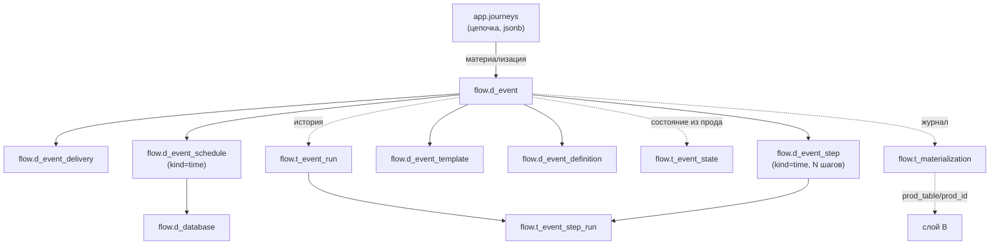

# Слой A (flow)

Схема **`flow`** — наша нормализованная модель процесса коммуникаций, «истина» для UI и Flow Builder. **11 таблиц**: восемь завела `V6__flow_layer_a.sql`, три добавила `V33__flow_job_normalization.sql`. Пишет их `ru/banki/crm/service/flow/MaterializationService`, из этой же модели данные разворачиваются в [Слой B (процессные таблицы)](Слой%20B%20%28процессные%20таблицы%29.md) — копии продовых таблиц, которые читают существующие движки рассылок.

Здесь — **структура схемы `flow`**. Алгоритм материализации — [[Материализация (Flow)]]; формат цепочки-источника — [[Цепочки (Journeys)]]; карта схем — [Схема БД](Схема%20БД.md).

Зачем отдельный слой: продовые таблицы разрознены — онлайн-события в `tracker`, расписание в `scheduler`, маппинги в `template`/`commapi`. Слой A сводит всё к одному агрегату «событие». Конвенция имён: `d_*` — конфигурация, `t_*` — состояние и журналы.

## Три владельца вместо одной строки

Это главное решение схемы, и оно же — ответ на изъян прода. В `scheduler.t_launch_settings` и `scheduler.t_execution_steps` в **одной строке** лежат три разные по природе вещи:

1. **настройка**, которую задаёт человек (кронтаб, база выборки, SQL шага);
2. **расчёт планировщика** — что он вывел из кронтаба (`time_start`, `period_unit`, `period_q`, `date_start`, `date_end`, `date_next`);
3. **состояние текущего прогона** (`status`, `cron_status`, `last_exec_status`, `last_err`, `retry_count`).

Отсюда две беды. Планировщик пишет в ту же строку, что и человек, — его запись физически может затереть настройку. И истории нет вовсе: статус перезаписывается, вчерашняя ошибка исчезает в момент, когда стартовал сегодняшний прогон, и на вопрос «сколько раз за неделю падало» ответить нечем.

`V33` разводит это по владельцам:

| Что | Таблицы | Кто пишет |
| --- | ------- | --------- |
| конфигурация | `d_event*`, `d_database` | мы — материализация из Flow Builder |
| состояние | `t_event_state` | ETL, зеркалит расчёт прод-планировщика |
| история | `t_event_run`, `t_event_step_run` | append-only, ничего не затирается |

Чужой расчёт мы у себя **не храним как конфигурацию** — только показываем в `t_event_state`. Копия чужого вычисления в нашей настройке устаревает при первом же тике планировщика, и дальше непонятно, какая из двух цифр правда.

## Конфигурация

### flow.d_event — единый справочник событий

Заменяет пару «`tracker.t_event_comm` (онлайн) + `scheduler.t_get_event` (расписание)»: тип различается колонкой `kind`. Единственная таблица схемы с естественным ключом (`src/main/resources/db/migration/V6__flow_layer_a.sql:9`).

| Колонка | Тип | Ключи / NOT NULL | Смысл |
| ------- | --- | ---------------- | ----- |
| `id` | `bigint` | PK, IDENTITY | — |
| `kind` | `varchar(10)` | NOT NULL, CHECK `IN ('income','time')` | `income` — онлайн-событие, `time` — событие расписания |
| `event_name` | `varchar(255)` | NOT NULL, UNIQUE вместе с `system` | Имя события |
| `system` | `varchar(255)` | UNIQUE `(event_name, system)` | Система-источник |
| `source` | `varchar(255)` | — | Источник кампании. Руками не вводится: берётся из шаблона первой (по дню) comm-ноды — см. [Справочники шаблонов](Справочники%20шаблонов.md) |
| `group_event_descr` | `varchar(255)` | — | Группа событий |
| `description` | `varchar(255)` | — | Описание; при материализации сюда пишется имя цепочки |
| `journey_id` | `varchar(36)` | FK → `app.journeys(id)` ON DELETE SET NULL | Обратная ссылка на цепочку, породившую событие |
| `is_active` | `boolean` | NOT NULL DEFAULT true | Активность |
| `timestamp_cr` | `timestamptz` | NOT NULL DEFAULT now() | Создание |
| `timestamp_upd` | `timestamptz` | — | Обновление (заполняется upsert-ом) |

Пишется upsert-ом по `(event_name, system)` — повторная материализация той же цепочки не плодит события. Вся обвязка события при этом **удаляется по `event_id` и создаётся заново**. Без UNIQUE `(event_name, system)` каждая пересборка цепочки давала бы новое событие-двойник, а прод-движки видели бы два конкурирующих конфига под одним именем.

### flow.d_event_delivery — настройки доставки

Одна строка на событие, пишется для обоих `kind` (`V6__flow_layer_a.sql:25`).

| Колонка | Тип | Ключи / NOT NULL | Смысл |
| ------- | --- | ---------------- | ----- |
| `id` | `bigint` | PK, IDENTITY | — |
| `event_id` | `bigint` | NOT NULL, FK → `flow.d_event(id)` CASCADE | Событие |
| `notify_channel` | `varchar(20)` | — | Канал уведомления, значения продовые и **капсом**: `SMS`, `EMAIL`, `PUSH`, `CC`, `FA`, `VK`, `WA`, `WEBPUSH`, `ROBOT` |
| `sub_channel` | `varchar(255)` | — | Подканал |
| `platform` | `varchar(50)` | — | Платформа |
| `send_delay` | `integer` | — | Задержка отправки (материализация по умолчанию ставит 2) |
| `life_time` | `integer` | — | Время жизни коммуникации (по умолчанию 1000) |
| `check_interval` | `interval` | — | Интервал проверки; не заполняется |
| `allow_ml` | `boolean` | NOT NULL DEFAULT false | Разрешить ML-фильтрацию |
| `comm_decision_tree_id` | `bigint` | — | Дерево решений; не заполняется |
| `stop_product_ids` | `bigint[]` | — | Стоп-продукты; не заполняется |
| `stop_events` | `jsonb` | — | Стоп-события; не заполняется |
| `notify_channel_priority` | `jsonb` | — | Приоритет каналов; не заполняется |

### flow.d_event_schedule — расписание (только kind=time)

Чистая конфигурация. PK — сам `event_id`, а не суррогат: строка на событие ровно одна, и это гарантирует ключ. `V33` снял отсюда пять колонок — `time_start`, `period_unit`, `period_q`, `date_start`, `date_end` (`src/main/resources/db/migration/V33__flow_job_normalization.sql:46`): их считает планировщик по кронтабу, мы в них никогда не писали, и теперь они видны в `t_event_state`.

| Колонка | Тип | Ключи / NOT NULL | Смысл |
| ------- | --- | ---------------- | ----- |
| `event_id` | `bigint` | **PK**, FK → `flow.d_event(id)` CASCADE | Событие |
| `crontab` | `varchar` | — | Расписание одним crontab-выражением (напр. `0 9 * * *`) — единственное поле расписания в форме Time event |
| `database` | `varchar(255)` | FK → `flow.d_database(code)` | БД выборки |
| `is_batch` | `boolean` | NOT NULL DEFAULT true | Массовая отправка против единичной |
| `max_retry_attempts` | `integer` | DEFAULT 1 | Число ретраев |
| `priority` | `integer` | — | Приоритет джобы |
| `job_group` | `varchar(255)` | DEFAULT `'CRM'` | Группа джобов |

Материализация вставляет `(event_id, crontab, database, is_batch)`.

### flow.d_database — справочник баз выборки

Заведён `V33__flow_job_normalization.sql:18`. Раньше `database` был свободной строкой: опечатка означала, что задание не запустится, и узнали бы об этом постфактум — по невышедшей рассылке. Теперь это внешний ключ, и опечатка ловится на записи.

| Колонка | Тип | Ключи / NOT NULL | Смысл |
| ------- | --- | ---------------- | ----- |
| `code` | `varchar(255)` | PK | Имя базы, на него ссылается `d_event_schedule.database` |
| `description` | `varchar(255)` | — | Пояснение |

Сид: `crmdb` («База CRM по умолчанию») плюс всё, что уже встречалось в данных, — справочник наполнялся до навешивания ключа, чтобы миграция не потеряла ни одной строки.

### flow.d_event_step — SQL-шаги выборки

У Time event шагов может быть несколько: в UI это `props.sql_steps`, на каждый элемент создаётся строка здесь и в `scheduler.t_execution_steps` (`V6__flow_layer_a.sql:58`).

| Колонка | Тип | Ключи / NOT NULL | Смысл |
| ------- | --- | ---------------- | ----- |
| `id` | `bigint` | PK, IDENTITY | — |
| `event_id` | `bigint` | NOT NULL, FK → `flow.d_event(id)` CASCADE | Событие |
| `order_num` | `integer` | NOT NULL, **UNIQUE `(event_id, order_num)`** | Порядок шага, 1..N |
| `process_name` | `varchar(255)` | — | Имя процесса выборки; совпадает с `selection` слоя B |
| `sql_text` | `varchar` | — | SQL шага |
| `returns_result_set` | `boolean` | NOT NULL DEFAULT false | Возвращает ли шаг выборку (материализация ставит `true`) |
| `is_active` | `boolean` | NOT NULL DEFAULT true | Активность шага |

UNIQUE `(event_id, order_num)` добавлен в `V33__flow_job_normalization.sql:69`. Без него два шага могли получить один `order_num`, и **очередь исполнения становилась неопределённой** — что первым вернёт база, то и выполнится. Для выборки, где второй шаг читает временную таблицу первого, это тихий неверный результат, а не ошибка. Перед навешиванием ключа задвоенные строки перенумерованы (`V33__flow_job_normalization.sql:57`) — данные сохранены, изменился только номер.

## Состояние и история

### flow.t_event_state — состояние задания глазами прод-планировщика

Один к одному с событием (`V33__flow_job_normalization.sql:86`). **Пишет ETL, руками не правится** — так и записано в `COMMENT ON TABLE`. Читает UI: по этой таблице показывается, что происходит с заданием.

Имена сознательно не повторяют прод: там три колонки со словом `status`, и по названию не отличить фазу от исхода.

| Колонка | Тип | Ключи / CHECK | Смысл |
| ------- | --- | ------------- | ----- |
| `event_id` | `bigint` | PK, FK → `flow.d_event(id)` CASCADE | Событие |
| `phase` | `varchar(16)` | CHECK `NEW` / `WAITING` / `PROCESSING` | Где задание сейчас; в проде это `t_launch_settings.status` |
| `cron_state` | `varchar(16)` | CHECK `STARTED` / `STOPPED` | Знает ли о задании крон; в проде `cron_status` |
| `last_result` | `varchar(16)` | CHECK `SUCCESS` / `ERROR` | Чем кончился прошлый прогон; в проде `last_exec_status` |
| `date_next` | `timestamptz` | — | Следующий запуск по расчёту планировщика |
| `time_start`, `period_unit`, `period_q`, `date_start`, `date_end` | — | — | То, что планировщик вывел из кронтаба: показываем, но не задаём |
| `synced_at` | `timestamptz` | NOT NULL DEFAULT now() | Когда состояние забрали. Без метки непонятно, свежее оно или недельной давности |

Все три CHECK допускают NULL (`V33__flow_job_normalization.sql:100`): состояние может быть ещё не синхронизировано. Индекс `t_event_state_cron_idx (cron_state, phase)` — под самый частый разбор: «мы включили, а крон не знает» — это самый распространённый способ завести задание, которое никогда не сработает.

### flow.t_event_run — прогоны задания

Строка на прогон, ничего не затирается (`V33__flow_job_normalization.sql:120`). Колонки: `id`, `event_id` (FK CASCADE), `started_at`, `finished_at`, `result` (CHECK `SUCCESS`/`ERROR`/NULL), `error`, `attempt` (NOT NULL DEFAULT 1). Индекс `(event_id, started_at DESC)` — история читается всегда «последние сверху».

Честная оговорка о точности: она равна частоте опроса ETL. Прогон короче интервала опроса мы просто не увидим. Для вопроса «падает или нет» этого хватает, для точной длительности — нет; чтобы было точно, историю должен писать сам планировщик, а это правка прод-компонента.

### flow.t_event_step_run — прогоны шагов

Заведена в `V6__flow_layer_a.sql:69`, дотянута до модели прогонов в `V33__flow_job_normalization.sql:136`.

| Колонка | Тип | Ключи / CHECK | Смысл |
| ------- | --- | ------------- | ----- |
| `id` | `bigint` | PK, IDENTITY | — |
| `step_id` | `bigint` | NOT NULL, FK → `flow.d_event_step(id)` CASCADE | Шаг |
| `run_id` | `bigint` | FK → `flow.t_event_run(id)` CASCADE | Прогон задания. Nullable: строки до `V33` к прогону не привязаны, и терять их незачем |
| `started_at` / `finished_at` | `timestamptz` | старт NOT NULL DEFAULT now() | Границы исполнения |
| `status` | `varchar(20)` | CHECK `SUCCESS` / `ERROR` / NULL | Исход шага |
| `retry_count` | `integer` | — | Сколько раз повторяли |
| `error` | `varchar` | — | Текст ошибки |
| `rows_affected` | `bigint` | — | Затронуто строк |

## flow.d_event_template — событие → шаблон

| Колонка | Тип | Ключи / NOT NULL | Смысл |
| ------- | --- | ---------------- | ----- |
| `id` | `bigint` | PK, IDENTITY | — |
| `event_id` | `bigint` | NOT NULL, FK → `flow.d_event(id)` CASCADE | Событие |
| `template_id` | `bigint` | FK → `template.d_template(id)` ON DELETE SET NULL | Шаблон в едином справочнике; кроме `journey_id` — единственный FK слоя A наружу. См. [Справочники шаблонов](Справочники%20шаблонов.md) |
| `step_no` | `integer` | — | `NULL` = одиночный шаблон; для цепочки — позиция шага 1..N (comm-ноды отсортированы по дню) |
| `segment_id` | `integer` | — | Сегмент; не заполняется |
| `is_multiple_choice` | `boolean` | DEFAULT false | Множественный выбор шаблона |

Шаблоны вложенных цепочек (Subflow) попадают сюда как обычные шаги родительского события.

## flow.d_event_definition — событие → метод отправки

| Колонка | Тип | Ключи / NOT NULL | Смысл |
| ------- | --- | ---------------- | ----- |
| `id` | `bigint` | PK, IDENTITY | — |
| `event_id` | `bigint` | NOT NULL, FK → `flow.d_event(id)` CASCADE | Событие |
| `notify_channel` | `varchar(20)` | — | Канал капсом |
| `definition_key` | `varchar(255)` | — | Ключ Camunda-процесса отправки; список значений — [Слой B (процессные таблицы)](Слой%20B%20%28процессные%20таблицы%29.md) |
| `business_key_prefix` | `varchar(255)` | — | Префикс бизнес-ключа |
| `is_correlation` | `boolean` | NOT NULL DEFAULT false | Корреляция сообщений |
| `correlation_keys` | `text[]` | — | Ключи корреляции; не заполняется |
| `notify_channel_priority` | `jsonb` | — | Приоритет каналов; не заполняется |

## flow.t_materialization — журнал соответствий слоёв

Сердце идемпотентности: фиксирует, что и во что материализовалось в слое B. Внешних ключей нет намеренно — таблица связывает сущности из разных схем по строковым именам.

| Колонка | Тип | Ключи / NOT NULL | Смысл |
| ------- | --- | ---------------- | ----- |
| `id` | `bigint` | PK, IDENTITY | — |
| `our_entity` | `varchar(64)` | NOT NULL | Наша сущность, напр. `app.journeys` |
| `our_id` | `varchar(64)` | NOT NULL | Её идентификатор |
| `prod_table` | `varchar(128)` | NOT NULL | Таблица слоя B, напр. `scheduler.t_get_event` |
| `prod_id` | `varchar(64)` | NOT NULL | id созданной строки слоя B |
| `materialized_at` | `timestamptz` | NOT NULL DEFAULT now() | Момент |
| `materialized_by` | `varchar(255)` | — | Email автора |

Повторная материализация цепочки сначала удаляет по этому журналу свои прежние строки слоя B (только из белого списка таблиц), затем чистит журнал и создаёт всё заново. Потеря строки журнала = осиротевшие строки в проде, которые никто уже не уберёт.

## Что остаётся на совести кода

1. **Нет UNIQUE на обвязке события.** У `d_event_delivery`, `d_event_definition` и `d_event_template` есть только PK по суррогатному `id`; ожидаемых `(event_id, notify_channel)` и `(event_id, step_no)` не существует. Дубли база примет молча, а движки слоя B размножат их в отправки. Единственность держит `MaterializationService`, который перед вставкой делает `DELETE … WHERE event_id = :e`; любая запись мимо этого кода даст дубликаты. Порядок шагов эту дыру уже закрыл (`d_event_step`), обвязка — нет.
2. **`notify_channel` и `notify_channel_priority` дублируются** между `d_event_delivery` и `d_event_definition`. Обе колонки описывают одно и то же, синхронизировать их нечем — при расхождении непонятно, какая строка авторитетна. Наследие того, что слой A повторяет разбивку прод-таблиц.
3. **Массивы и jsonb исключают внешние ключи.** `stop_product_ids`, `stop_events`, `correlation_keys` по смыслу ссылки на продукты и события, но FK на массив и jsonb не построить. Не стреляет только потому, что материализация их не заполняет.
4. **`t_materialization` без индексов** кроме PK, хотя читается всегда по `(our_entity, our_id)`. На нынешних объёмах незаметно.

Источники: `src/main/resources/db/migration/V6__flow_layer_a.sql`, `src/main/resources/db/migration/V33__flow_job_normalization.sql`; `src/main/java/ru/banki/crm/service/flow/MaterializationService.java`.
