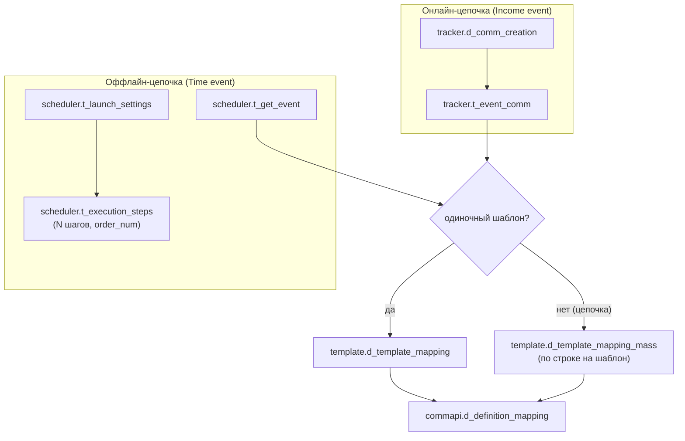

# Слой B (процессные таблицы)

Схемы `tracker`, `scheduler`, `template` (процессная часть), `commapi` — **копии продовых таблиц процесса коммуникаций, 1:1 по DDL из прода**. Создаются миграцией `V5__process_layer_b.sql`. Это «интерфейсные» таблицы: в проде их читают существующие движки рассылок, а наша админка (как раньше Appsmith-админка своим DO-скриптом) **пишет** в них конфигурацию при материализации цепочек — см. [[Материализация (Flow)]] и [[Слой A (flow)]].

**Единственное намеренное отличие от прода:** все `id` — `bigint GENERATED BY DEFAULT AS IDENTITY` (у прода/старой админки местами практиковался `max(id)+1`). `GENERATED BY DEFAULT` (а не `ALWAYS`) — чтобы при переносе данных можно было вставлять строки с готовыми id.

## Кто пишет и кто читает

- **Пишет у нас:** `ru/banki/crm/service/flow/MaterializationService.materialize()` — по подтверждённым в модалке предпросмотра строкам (`PlannedRow`, значения пользователь мог править). Защита: белый список таблиц `LAYER_B_TABLES`, жёсткая валидация имён колонок regex'ом `[a-z_][a-z0-9_]*`, значения — только bind-параметрами. Каждая вставка журналируется в `flow.t_materialization` и `arch.t_admin_log`; повторная материализация цепочки сначала удаляет прежние строки по журналу (идемпотентность).
- **Читает в проде:** движок онлайн-событий (tracker), шедулер выборок (scheduler), маппинги шаблонов и Camunda-процессы отправки (template/commapi). Наше приложение эти таблицы после записи не использует.

Порядок вставки при материализации — родители до детей (`orderForInsert`), FK подставляются автоматически: в предпросмотре они показаны как `"(auto)"`, при выполнении `resolveAuto()` заменяет `(auto)` на id уже вставленного родителя (`id_comm_creation` ← `tracker.d_comm_creation`, `t_launch_settings_id` ← `scheduler.t_launch_settings`, `get_event_id`/`event_id` ← `scheduler.t_get_event`).

## Онлайн: схема tracker

### tracker.d_comm_creation — параметры создания коммуникации

Справочник, на который ссылается `t_event_comm`. При материализации Income event создаётся первым.

| Колонка | Тип | Смысл / что пишет материализация |
| ------- | --- | -------------------------------- |
| `id` | `bigint IDENTITY PK` | — |
| `allow_ml` | `boolean NOT NULL DEFAULT false` | Разрешить ML-фильтрацию (из `props.allow_ml` стартового узла) |
| `send_delay` | `integer` | Задержка отправки (default при материализации: 2) |
| `lifetime` | `integer` | Время жизни (default: 1000). Гоча: здесь `lifetime`, а в `t_get_event` — `life_time` |
| `comm_decision_tree_id` | `bigint` | Дерево решений (не заполняется) |
| `notify_channel` | `varchar(10)` | Канал (капсом: `SMS`/`EMAIL`/`PUSH`/`CC`/`FA`/`VK`/`WA`/`WEBPUSH`/`ROBOT`) |
| `timestamp_cr` | `timestamp NOT NULL DEFAULT now()` | — |
| `check_interval` | `interval` | Интервал проверки (не заполняется) |

### tracker.t_event_comm — справочник онлайн-событий

| Колонка | Тип | Смысл / что пишет материализация |
| ------- | --- | -------------------------------- |
| `id` | `bigint IDENTITY PK` | — |
| `event_name` | `varchar(255) NOT NULL` | Имя события (из стартового узла) |
| `system` | `varchar(255)` | Система-источник |
| `id_comm_creation` | `bigint NOT NULL REFERENCES tracker.d_comm_creation(id)` | FK — `(auto)` в предпросмотре |
| `is_active` | `boolean NOT NULL DEFAULT false` | Материализация ставит `true` |
| `timestamp_cr` | `timestamp NOT NULL DEFAULT now()` | — |
| `sub_channel` | `varchar(255)` | Подканал |
| `platform` | `varchar(50)` | Платформа |
| `group_event_descr` | `varchar(255)` | Группа событий |
| `stop_product_ids` | `bigint[]` | Стоп-продукты (не заполняется) |
| `stop_events` | `jsonb` | Стоп-события (не заполняется) |
| `is_chain` | `boolean NOT NULL DEFAULT false` | `true`, если comm-нод (после разворачивания Subflow) больше одной |

## Расписание: схема scheduler

### scheduler.t_get_event — справочник событий расписания

| Колонка | Тип | Смысл / что пишет материализация |
| ------- | --- | -------------------------------- |
| `id` | `bigint IDENTITY PK` | — |
| `selection` | `varchar(255) NOT NULL` | Имя процесса выборки. **`selection` = `process_name`** — в UI Time event это одно поле «Имя процесса (selection)» (`props.process_name`, фолбэк — `event_name`) |
| `event_name` | `varchar(255)` | Имя события |
| `system` | `varchar(255)` | Система |
| `send_delay` | `integer` | Задержка (default: 2) |
| `product_id` | `bigint` | Продукт (не заполняется) |
| `is_deferred` | `boolean NOT NULL` | Материализация ставит `false` |
| `source` | `varchar(255)` | Источник. **Не вводится руками** — `resolveSource()` берёт его из шаблона первой (по дню) comm-ноды; у cc-шаблонов колонки `source` нет, они пропускаются |
| `allow_ml` | `boolean NOT NULL` | ML-фильтрация |
| `notify_channel` | `varchar(20)` | Канал (капсом) |
| `comm_decision_tree_id` | `bigint` | Не заполняется |
| `params` | `jsonb` | Параметры (не заполняется) |
| `is_active` | `boolean NOT NULL` | Материализация ставит `true` |
| `life_time` | `integer` | Время жизни (default: 1000) |
| `sub_channel` | `varchar(255)` | Подканал |
| `platform` | `varchar(50)` | Платформа |
| `group_event_descr` | `varchar(255)` | Группа событий |

### scheduler.t_launch_settings — настройки запуска

Продовая таблица смешивает конфиг и runtime (в слое A конфиг вынесен в `flow.d_event_schedule`, runtime — в `flow.t_event_step_run`).

| Колонка | Тип | Смысл / что пишет материализация |
| ------- | --- | -------------------------------- |
| `id` | `bigint IDENTITY PK` | — |
| `selection` | `varchar(255) NOT NULL` | То же имя процесса, что и в `t_get_event.selection` |
| `time_start` | `timestamp NOT NULL` | Материализация пишет литерал `now()` (спецзначение из предпросмотра обрабатывается в `insertReturningId`). Отдельного поля времени старта в UI нет |
| `period_unit` | `varchar(6)` | Легаси-периодичность — **не заполняется** (расписание задаётся crontab'ом) |
| `period_q` | `integer` | Легаси — не заполняется |
| `database` | `varchar(255) NOT NULL` | БД выборки: `crmdb` (default) или `greenplum` (select `DATABASES` в UI) |
| `description` | `varchar(255)` | Материализация пишет имя цепочки |
| `is_active` | `boolean NOT NULL` | `true` |
| `status` | `varchar(255) NOT NULL` | `NEW` |
| `date_start` / `date_end` / `date_next` | `timestamp` | Runtime шедулера — не заполняются |
| `is_batch` | `boolean NOT NULL` | `true` |
| `max_retry_attempts` | `integer DEFAULT 1` | `1` |
| `crontab` | `varchar` | **Один текстовый crontab** (напр. `0 9 * * *`) из поля Time event |
| `last_exec_status` | `varchar(255)` | Runtime — не заполняется |
| `cron_status` | `varchar(255)` | Runtime — не заполняется |
| `job_group` | `varchar(255) DEFAULT 'CRM'` | `CRM` |
| `priority` | `integer` | Не заполняется |
| `timestamp_cr` / `timestamp_upd` | `timestamp` | Не заполняются (nullable) |

### scheduler.t_execution_steps — SQL-шаги выборки

SQL-шагов у Time event может быть **несколько**: UI хранит их в `props.sql_steps` (JSON-массив строк), `MaterializationService.sqlSteps()` разворачивает массив в N строк с `order_num` 1..N (легаси-фолбэк — одиночный `props.sql`). Параллельно те же шаги пишутся в `flow.d_event_step`.

| Колонка | Тип | Смысл / что пишет материализация |
| ------- | --- | -------------------------------- |
| `id` | `bigint IDENTITY PK` | — |
| `t_launch_settings_id` | `bigint NOT NULL REFERENCES scheduler.t_launch_settings(id)` | FK — `(auto)` |
| `process_name` | `varchar(255) NOT NULL` | = `selection` |
| `order_num` | `integer NOT NULL` | Порядок шага (1..N) |
| `is_active` | `boolean NOT NULL` | `true` |
| `returns_result_set` | `boolean NOT NULL` | `true` |
| `last_ds` / `last_de` | `timestamp` | Runtime: старт/финиш последнего запуска — не заполняются |
| `sql_text` | `varchar` | SQL шага |
| `last_err` | `varchar` | Runtime — не заполняется |
| `status` | `varchar(255)` | Runtime — не заполняется |
| `retry_count` | `integer` | Runtime — не заполняется |

## Маппинги: схемы template и commapi

### template.d_template_mapping — событие → шаблон (одиночный)

Используется, когда после разворачивания Subflow осталась **одна** comm-нода.

| Колонка | Тип | Смысл / что пишет материализация |
| ------- | --- | -------------------------------- |
| `id` | `bigint IDENTITY PK` | — |
| `get_event_id` | `bigint` | Для Time event — `(auto)` = id `scheduler.t_get_event`; для Income event — NULL (движок матчит по `event_name`/`system`) |
| `event_name` | `varchar(255)` | Имя события |
| `system` | `varchar(255)` | Система |
| `segment_id` | `integer` | Сегмент (не заполняется) |
| `notify_channel` | `varchar(10)` | Канал comm-ноды (`sms`/`push`/`email`/`cc` — здесь канал шаблона, нижним регистром) |
| `template_id` | `integer` | Бизнес-код шаблона (code / id / segment) |
| `is_multiple_choice` | `boolean DEFAULT false` | Множественный выбор |

### template.d_template_mapping_mass — событие → шаблоны цепочки

Создана в проде для прозрачности цепочек. Материализация пишет по строке на каждую comm-ноду (включая развёрнутые Subflow), в порядке возрастания дня.

| Колонка | Тип | Смысл |
| ------- | --- | ----- |
| `id` | `bigint IDENTITY PK` | — |
| `event_id` | `bigint` | `(auto)` для Time event, NULL для Income |
| `event_name` | `varchar` | Имя события |
| `template_id` | `integer` | Бизнес-код шаблона |
| `channel` | `varchar` | Канал шаблона (`sms`/`push`/`email`/`cc`) |

### commapi.d_definition_mapping — событие → метод отправки

| Колонка | Тип | Смысл / что пишет материализация |
| ------- | --- | -------------------------------- |
| `id` | `bigint IDENTITY PK` | — |
| `get_event_id` | `bigint` | `(auto)` для Time event, NULL для Income |
| `event_name` | `varchar(255)` | Имя события |
| `system` | `varchar(255)` | Система |
| `notify_channel` | `varchar(10)` | Канал (капсом, из стартового узла) |
| `definition_key` | `varchar(255) NOT NULL` | Ключ Camunda-процесса; значения из прода (6): `smsChannelProcessV2`, `pushChannelProcessV2`, `smsChannelProccessV2` (**с опечаткой — так в проде**), `emailChannelProcessV2`, `vkChannelProcessV2`, `waChannelProcessV2` |
| `business_key_prefix` | `varchar(255) NOT NULL` | Префикс бизнес-ключа (7 значений): `WaChannel`, `VkChannel`, `PushChannel`, `webPushChannel`, `pushChannel`, `emailChannel`, `smsChannel` |
| `is_correlation` | `boolean NOT NULL DEFAULT false` | Материализация ставит `false` |
| `correlation_keys` | `text[]` | Не заполняется |
| `notify_channel_priority` | `jsonb` | Не заполняется |

## Переменные (та же миграция V5)

`template.d_variables`, `template.d_variable_synonyms`, `template.d_variables_link` создаются в V5 (структура восстановлена по DO-скрипту старой админки — точного продового DDL нет), но логически относятся к справочникам шаблонов — полное описание в [[Справочники шаблонов]].

## Что слой B не покрывает

Материализуются только старт + comm-ноды (+ развёрнутые Subflow): у Pause/Decision/Assignment/Loop/Data-узлов Flow Builder продовых таблиц нет — движок исполнения не реализован, задержки в проде задаются `sending_day` шаблонов. Единый справочник `template.d_template` — не слой B, а слой A ([[Слой A (flow)]]): прод-движки его не читают, он синкается из канальных таблиц при материализации.

Источники: `src/main/resources/db/migration/V5__process_layer_b.sql`; `src/main/java/ru/banki/crm/service/flow/MaterializationService.java` (`preview`, `materialize`, `orderForInsert`, `resolveAuto`, `insertReturningId`, `LAYER_B_TABLES`); `src/main/java/ru/banki/crm/web/FlowController.java` (`POST /api/flow/preview`, `POST /api/flow/materialize` — см. [[REST API]]).
