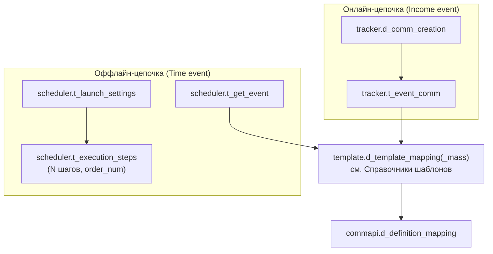

# Слой B (процессные таблицы)

Схемы **`tracker`** (2 таблицы), **`scheduler`** (3) и **`commapi`** (1) — копии продовых таблиц процесса коммуникаций, 1:1 по DDL из прода. Создаёт их `V5__process_layer_b.sql`. Это «интерфейсные» таблицы: в проде их читают существующие движки рассылок, а наша панель **пишет** в них конфигурацию при материализации цепочек.

Здесь — **структура шести таблиц**. Алгоритм записи — [[Материализация (Flow)]]; наша нормализованная модель-источник — [Слой A (flow)](Слой%20A%20%28flow%29.md); карта схем — [Схема БД](Схема%20БД.md).

## Чем слой B отличается от слоя A

- **Форма задана не нами.** Слой B воспроизводит прод как есть: разрозненные схемы, конфиг вперемешку с runtime, связи по строкам вместо ключей. Слой A — наша модель, где всё это разведено.
- **Слой B производный.** Он пересобирается из слоя A в любой момент; терять в нём нечего, кроме журнала соответствий `flow.t_materialization`.
- **Слой B никто у нас не читает.** Записали — и забыли: дальше с этими строками работают прод-движки. Панель после материализации в них не заглядывает.
- **Единственное намеренное отличие от прода:** все `id` объявлены как `bigint GENERATED BY DEFAULT AS IDENTITY` (в проде местами практиковался `max(id)+1`). Именно `BY DEFAULT`, а не `ALWAYS` — чтобы при переносе данных можно было вставлять строки с готовыми id.

> [!info] Маппинги «событие → шаблон» тоже относятся к слою B
> `template.d_template_mapping` и `template.d_template_mapping_mass` по природе такой же слой B, но физически лежат в схеме `template`. Чтобы не описывать схему дважды, они описаны в [Справочники шаблонов](Справочники%20шаблонов.md).

## Кто пишет и кто читает

- **Пишем мы:** `MaterializationService.materialize()` — по подтверждённым в модалке предпросмотра строкам (значения пользователь мог править). Защита: белый список таблиц, валидация имён колонок регуляркой, значения — только bind-параметрами. Каждая вставка журналируется в `flow.t_materialization` и `arch.t_admin_log`.
- **Читает прод:** движок онлайн-событий (`tracker`), шедулер выборок (`scheduler`), Camunda-процессы отправки (`commapi`).

## Схема tracker — онлайн-события

### tracker.d_comm_creation — параметры создания коммуникации

Справочник, на который ссылается `t_event_comm`. При материализации Income event создаётся первым (`src/main/resources/db/migration/V5__process_layer_b.sql:15`).

| Колонка | Тип | Ключи / NOT NULL | Смысл |
| ------- | --- | ---------------- | ----- |
| `id` | `bigint` | PK, IDENTITY BY DEFAULT | — |
| `allow_ml` | `boolean` | NOT NULL DEFAULT false | Разрешить ML-фильтрацию |
| `send_delay` | `integer` | — | Задержка отправки; по умолчанию 2 |
| `lifetime` | `integer` | — | Время жизни коммуникации; по умолчанию 1000. **Гоча:** здесь `lifetime`, а в `scheduler.t_get_event` то же поле называется `life_time` |
| `comm_decision_tree_id` | `bigint` | — | Дерево решений; не заполняется |
| `notify_channel` | `varchar(10)` | — | Канал капсом; список значений — [Слой A (flow)](Слой%20A%20%28flow%29.md) |
| `check_interval` | `interval` | — | Интервал проверки; не заполняется |
| `timestamp_cr` | `timestamp` | NOT NULL DEFAULT now() | Создание |

### tracker.t_event_comm — справочник онлайн-событий

`V5__process_layer_b.sql:27`.

| Колонка | Тип | Ключи / NOT NULL | Смысл |
| ------- | --- | ---------------- | ----- |
| `id` | `bigint` | PK, IDENTITY BY DEFAULT | — |
| `event_name` | `varchar(255)` | NOT NULL | Имя события |
| `system` | `varchar(255)` | — | Система-источник |
| `id_comm_creation` | `bigint` | NOT NULL, FK → `tracker.d_comm_creation(id)` | Параметры создания; в предпросмотре показан как `(auto)` |
| `is_active` | `boolean` | NOT NULL DEFAULT false | Материализация ставит `true` |
| `sub_channel` | `varchar(255)` | — | Подканал |
| `platform` | `varchar(50)` | — | Платформа |
| `group_event_descr` | `varchar(255)` | — | Группа событий |
| `stop_product_ids` | `bigint[]` | — | Стоп-продукты; не заполняется |
| `stop_events` | `jsonb` | — | Стоп-события; не заполняется |
| `is_chain` | `boolean` | NOT NULL DEFAULT false | `true`, если comm-нод после разворачивания Subflow больше одной |
| `timestamp_cr` | `timestamp` | NOT NULL DEFAULT now() | Создание |

## Схема scheduler — расписание

### scheduler.t_get_event — справочник событий расписания

`V5__process_layer_b.sql:45`.

| Колонка | Тип | Ключи / NOT NULL | Смысл |
| ------- | --- | ---------------- | ----- |
| `id` | `bigint` | PK, IDENTITY BY DEFAULT | — |
| `selection` | `varchar(255)` | NOT NULL | Имя процесса выборки. **`selection` = `process_name`**: в форме Time event это одно поле |
| `event_name` | `varchar(255)` | — | Имя события |
| `system` | `varchar(255)` | — | Система |
| `send_delay` | `integer` | — | Задержка; по умолчанию 2 |
| `product_id` | `bigint` | — | Продукт; не заполняется |
| `is_deferred` | `boolean` | NOT NULL | Отложенное событие; материализация ставит `false` |
| `source` | `varchar(255)` | — | Источник кампании; берётся из шаблона первой (по дню) comm-ноды |
| `allow_ml` | `boolean` | NOT NULL | ML-фильтрация |
| `notify_channel` | `varchar(20)` | — | Канал капсом |
| `comm_decision_tree_id` | `bigint` | — | Дерево решений; не заполняется |
| `params` | `jsonb` | — | Параметры выборки; не заполняется |
| `is_active` | `boolean` | NOT NULL | Материализация ставит `true` |
| `life_time` | `integer` | — | Время жизни; по умолчанию 1000 |
| `sub_channel` | `varchar(255)` | — | Подканал |
| `platform` | `varchar(50)` | — | Платформа |
| `group_event_descr` | `varchar(255)` | — | Группа событий |

### scheduler.t_launch_settings — настройки запуска

Та самая таблица, где в одной строке лежат настройка человека, расчёт планировщика и состояние прогона. Почему это плохо и как слой A это разводит — [Слой A (flow)](Слой%20A%20%28flow%29.md). Здесь фиксируем, что именно пишем мы, а что не наше (`V5__process_layer_b.sql:66`).

| Колонка | Тип | Ключи / NOT NULL | Смысл |
| ------- | --- | ---------------- | ----- |
| `id` | `bigint` | PK, IDENTITY BY DEFAULT | — |
| `selection` | `varchar(255)` | NOT NULL | То же имя процесса, что в `t_get_event.selection` — связка между таблицами **по строке, а не по FK** |
| `time_start` | `timestamp` | NOT NULL | Материализация пишет `now()`; дальше поле ведёт планировщик |
| `period_unit` / `period_q` | `varchar(6)` / `integer` | — | Периодичность в разборе планировщика; мы не пишем |
| `database` | `varchar(255)` | NOT NULL | БД выборки; у нас это FK на `flow.d_database`, в проде — свободная строка |
| `description` | `varchar(255)` | — | Материализация пишет имя цепочки |
| `is_active` | `boolean` | NOT NULL | `true` |
| `status` | `varchar(255)` | NOT NULL | Фаза задания: **`NEW`** (материализация ставит его) → `WAITING` → `PROCESSING`. Дальше ведёт планировщик |
| `date_start` / `date_end` / `date_next` | `timestamp` | — | Окно и следующий запуск; считает планировщик |
| `is_batch` | `boolean` | NOT NULL | Массовая отправка против единичной |
| `max_retry_attempts` | `integer` | DEFAULT 1 | Ретраи |
| `crontab` | `varchar` | — | Один текстовый crontab (напр. `0 9 * * *`) из формы Time event |
| `last_exec_status` | `varchar(255)` | — | Исход прошлого прогона: `SUCCESS` / `ERROR` / NULL (ещё не запускалось) |
| `cron_status` | `varchar(255)` | — | Знает ли о задании крон: `STARTED` / `STOPPED` |
| `job_group` | `varchar(255)` | DEFAULT `'CRM'` | Группа джобов |
| `priority` | `integer` | — | Приоритет; не заполняется |
| `timestamp_cr` / `timestamp_upd` | `timestamp` | — | Nullable, не заполняются |

Три колонки со словом «status» в одной таблице — источник постоянной путаницы: `status` это фаза, `cron_status` — регистрация в кроне, `last_exec_status` — исход. У себя мы их переименовали в `phase` / `cron_state` / `last_result` и накрыли CHECK-ами — [Слой A (flow)](Слой%20A%20%28flow%29.md). Здесь ограничений нет: таблица копирует прод-DDL, и в неё пройдёт любая строка.

### scheduler.t_execution_steps — SQL-шаги выборки

Единственный внешний ключ внутри `scheduler`. Шагов у Time event может быть несколько: массив `props.sql_steps` разворачивается в N строк с `order_num` 1..N; параллельно те же шаги пишутся в `flow.d_event_step` (`V5__process_layer_b.sql:91`).

| Колонка | Тип | Ключи / NOT NULL | Смысл |
| ------- | --- | ---------------- | ----- |
| `id` | `bigint` | PK, IDENTITY BY DEFAULT | — |
| `t_launch_settings_id` | `bigint` | NOT NULL, FK → `scheduler.t_launch_settings(id)` | Настройки запуска; в предпросмотре `(auto)` |
| `process_name` | `varchar(255)` | NOT NULL | Совпадает с `selection` |
| `order_num` | `integer` | NOT NULL | Порядок шага, 1..N. **UNIQUE здесь нет** — в отличие от `flow.d_event_step`; задвоенный номер даст неопределённый порядок исполнения |
| `is_active` | `boolean` | NOT NULL | Активность шага |
| `returns_result_set` | `boolean` | NOT NULL | `true` |
| `sql_text` | `varchar` | — | SQL шага |
| `last_ds` / `last_de` | `timestamp` | — | Старт/финиш последнего запуска; пишет планировщик |
| `last_err` | `varchar` | — | Ошибка последнего запуска; пишет планировщик |
| `status` | `varchar(255)` | — | Исход последнего запуска: `SUCCESS` / `ERROR` / NULL. Значение **перезаписывается** — прошлые прогоны не сохраняются |
| `retry_count` | `integer` | — | Счётчик повторов; ведёт планировщик |

## Схема commapi — метод отправки

### commapi.d_definition_mapping — событие → Camunda-процесс

Единственная таблица схемы. Внешних ключей нет: с событием связывается либо через `get_event_id`, либо по паре `event_name`/`system` (`V5__process_layer_b.sql:130`).

| Колонка | Тип | Ключи / NOT NULL | Смысл |
| ------- | --- | ---------------- | ----- |
| `id` | `bigint` | PK, IDENTITY BY DEFAULT | — |
| `get_event_id` | `bigint` | — | Для Time event — `(auto)` = id `scheduler.t_get_event`; для Income event NULL |
| `event_name` | `varchar(255)` | — | Имя события |
| `system` | `varchar(255)` | — | Система |
| `notify_channel` | `varchar(10)` | — | Канал капсом |
| `definition_key` | `varchar(255)` | **NOT NULL** | Ключ Camunda-процесса: `smsChannelProcessV2`, `pushChannelProcessV2`, `smsChannelProccessV2` (**да, с опечаткой «Proccess» — так в проде**), `emailChannelProcessV2`, `vkChannelProcessV2`, `waChannelProcessV2` |
| `business_key_prefix` | `varchar(255)` | **NOT NULL** | Префикс бизнес-ключа: `WaChannel`, `VkChannel`, `PushChannel`, `webPushChannel`, `pushChannel`, `emailChannel`, `smsChannel` |
| `is_correlation` | `boolean` | NOT NULL DEFAULT false | Корреляция; материализация ставит `false` |
| `correlation_keys` | `text[]` | — | Ключи корреляции; не заполняется |
| `notify_channel_priority` | `jsonb` | — | Приоритет каналов; не заполняется |

## Особенности слоя B

- **Ссылочная целостность почти отсутствует** — и это воспроизведение прода, а не наша недоработка: во всех шести таблицах ровно два внешних ключа (`t_event_comm.id_comm_creation` и `t_execution_steps.t_launch_settings_id`), уникальных ключей нет ни одного. `t_get_event` и `t_launch_settings` связаны только совпадением строки `selection`, а `d_definition_mapping` — совпадением `event_name`/`system`. Повторную вставку база не остановит: от дублей защищает только удаление прежних строк по журналу `flow.t_materialization`. Дубль здесь стоит дорого — прод-движок увидит два конфига и отправит коммуникацию дважды.
- **Наружу схемы не ссылаются** — ни в `app`, ни в `flow`. Связь со слоем A ведётся исключительно журналом материализации.
- **Что сюда не попадает:** материализуются только стартовый узел и comm-ноды (включая развёрнутые Subflow). У узлов Pause / Decision / Assignment / Loop / Data продовых таблиц нет — собственного движка исполнения не существует, а задержки шагов задаёт `sending_day` шаблона ([Справочники шаблонов](Справочники%20шаблонов.md)).

Источники: `src/main/resources/db/migration/V5__process_layer_b.sql`, комментарии `src/main/resources/db/migration/V33__flow_job_normalization.sql:75`; `src/main/java/ru/banki/crm/service/flow/MaterializationService.java`.
