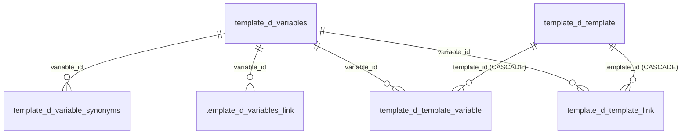

# Справочники шаблонов

Две схемы: **`template`** (8 таблиц) — единый справочник шаблонов коммуникаций с обвязкой переменных и продовыми маппингами «событие → шаблон», и **`dictionary`** (4 таблицы) — значения выпадающих списков мастера.

Здесь — **структура таблиц**. Формы, валидация и жизненный цикл шаблона — [[Шаблоны и мастер коммуникаций]] и [[Мастер коммуникаций (формы)]]; доставка шаблонов во внешнюю прод-БД — [[Синхронизация с прод-БД]]; карта схем — [Схема БД](Схема%20БД.md).

Локальных копий канальных прод-таблиц у нас нет: `V12` снёс их вместе со схемами `notice`/`callcenter` ([Схема БД](Схема%20БД.md)). **Единственное наше хранилище шаблонов — `template.d_template`.**

## template.d_template — единый справочник шаблонов

Заведён в `src/main/resources/db/migration/V6__flow_layer_a.sql:120`, наполнен бэкфиллом из четырёх канальных таблиц в `src/main/resources/db/migration/V8__unified_primary_prod_sync.sql:9`.

Идея простая: цепочке нужен один внешний ключ на «шаблон вообще», а не четыре условных. Поэтому поля, общие для всех каналов, вынесены в типизированные колонки, а канальная специфика сложена в `channel_props jsonb`. Пишет таблицу мастер коммуникаций и ETL из прода, читают карточка шаблона, список шаблонов, Flow Builder и материализация.

| Колонка | Тип | Ключи / NOT NULL | Смысл |
| ------- | --- | ---------------- | ----- |
| `id` | `bigint` | PK, IDENTITY BY DEFAULT | Суррогатный ключ; на него ссылается `flow.d_event_template.template_id` (ON DELETE SET NULL) |
| `channel` | `varchar(10)` | NOT NULL, CHECK | Канал: `sms`, `push`, `email`, `cc`, `fa`, `vk`, `la` (три последних добавлены в `src/main/resources/db/migration/V13__template_channels_fa_vk_la.sql:9`) |
| `code` | `bigint` | NOT NULL, **UNIQUE `(channel, code)`** | Бизнес-код шаблона — то, чем оперируют пользователь и Flow Builder |
| `communication_name` | `varchar(255)` | — | Имя коммуникации; подсказки из `reference.d_communication_name` |
| `campaign_name` | `varchar(255)` | — | **Гоча:** сюда кладётся `source_type` продовой канальной таблицы, а не название кампании. Заодно служит фолбэком при поиске `source` события |
| `communication_type` | `varchar(16)` | — | Тип коммуникации (`tunnel_a` и т. п.) |
| `business_communication_type` | `varchar(16)` | — | `adv` / `info` |
| `trigger_type` | `varchar(8)` | — | `trigger` / `promo` |
| `sending_day` | `smallint` | — | **День отправки относительно старта цепочки.** Именно он задаёт фактические задержки шагов в проде — собственного движка пауз нет. В Flow Builder поле «День» у comm-узла readonly и подставляется отсюда |
| `product_type` | `text[]` | — | Продукты; допустимые значения — `dictionary.d_product_type` |
| `partner_name` | `varchar(255)` | — | Партнёр |
| `touch_point` | `varchar(255)` | — | Точка касания; значения — `reference.d_touch_point` |
| `aff_sub3` | `varchar(255)` | — | Метка партнёрской аналитики |
| `selection_wizard_service` | `varchar(16)` | — | Сервис мастера подбора |
| `marketplace`, `dialog`, `loyalty`, `national_rating`, `news`, `mobile_app`, `night_send`, `permanent_exclude` | `boolean` | DEFAULT false | Флаги площадок и режимов. У email и cc `night_send` всегда `false` — в источнике такой колонки нет |
| `active_flag` | `boolean` | NOT NULL DEFAULT true | Активность шаблона |
| `channel_props` | `jsonb` | NOT NULL DEFAULT `'{}'` | Все канальные поля (состав — ниже) |
| `timestamp_cr` | `timestamptz` | NOT NULL DEFAULT now() | Создание записи |
| `timestamp_upd` | `timestamptz` | — | Последнее изменение (наши часы, не прод) |

**Чем грозит потеря UNIQUE `(channel, code)`.** На эту пару завязано всё: `resolveUnifiedTemplateId` ищет шаблон по ней, ETL делает по ней `ON CONFLICT DO UPDATE`, синк по ней же переименовывает код после ответа прода. Два шаблона с одинаковой парой означают, что цепочка сошлётся на произвольный из них, а ETL начнёт перезаписывать один другим. Ключ ловит и рабочий сценарий: если прод присвоил код, уже занятый нашим шаблоном, `applyProdCode` не переименовывает молча, а падает с внятным сообщением и оставляет локальный код как есть.

### Каналы и их прод-таблицы

`code` — это не суррогатный `id`, а код из соответствующей прод-таблицы; его природа у каждого канала своя (`UnifiedTemplateService.channelTable()`).

| Канал | Прод-таблица (внешняя) | Что лежит в `code` | Кто присваивает |
| ----- | ---------------------- | ------------------ | --------------- |
| `sms` | `notice.d_com_sms_template` | `code` | прод; диапазон до 10000 (выше — служебные коды) |
| `push` | `notice.push_template` | `code` | прод, без ограничения диапазона |
| `email` | `notice.email_template` | `id` (отдельного кода нет; `trigger_code` кодом **не** является) | прод; диапазон до 10000 |
| `cc` | `callcenter.d_segment_properties` | `segment` — бизнес-номер сегмента | **пользователь**; прод его не переназначает |
| `fa` | `notice.fa_template` | `id` | прод |
| `vk` | `notice.vk_template` | `id` | прод |
| `la` | `notice.live_activity_template` | `id` | прод; в мастере это тумблер в форме Push |

**У первых четырёх каналов прод-таблицы реально существуют, у `fa`, `vk` и `la` — ещё нет.** Имена в таблице выше для них предварительные: `V13` завёл каналы в нашем справочнике, а прод-доставку (имена и схему таблиц, дефолты NOT NULL-колонок) договорились настроить отдельно. Практическое следствие: шаблон такого канала заводится и живёт у нас нормально, а вот его доставка упрётся в отсутствующую таблицу. Проверка наличия встроена в «Диагностику» — `ProdDbService.health()` обходит все семь каналов и по каждому отвечает, есть ли таблица в прод-БД.

### Что лежит в channel_props

Состав ключей задан комментарием к `V6__flow_layer_a.sql:114` и пополняется ETL: всё, что пришло из прод-строки и не легло в ядро, попадает сюда под продовым именем колонки.

- **sms** — `msg_text`, `sender_name`, `antispam_check`, `brief`, `name`, `default_attrs`, `required_attrs`, `attribute_values`, `ab_group`, `source`;
- **push** — `title`, `msg_text`, `deep_link`, `webview_url`, `img_ios`, `img_android`, `time_to_live`, `action_buttons`, `brief`, `name`, `ab_group`, `source`;
- **email** — `subject`, `email_from`, `letteros_id`, `preheader`, `is_service`, `is_info`, `utm_custom`, `trigger_code`, `mail_text`, `links_info`, `msg_text`, `brief`, `name`, `ab_group`, `source`;
- **cc** — `segment_descr`, `source_system`, `host_id`, `ml_check_probability`, `ml_probability_required`, `ml_check_probability_loyal`, `ml_probability_required_loyal`, `ml_probability_required_uplift`, `active_ml_probability_type`, `cutpercent`, `nocutpercent`, `send_loyal_info`, `placement`, `kvint_campaign_id`, `ab_group`;
- **fa / vk / la** — поля соответствующих форм мастера (`ru/banki/crm/dto/TemplateDto`): `need_push`, `c2d_transport`, `web_url`, `link_title` у fa; `vk_template_name`, `ttl`, `buttons` у vk; `activity_name`, `la_event`, `la_visualization` и её атрибуты у la.

Два важных момента:

- **`source` живёт в `channel_props`, а не в колонке.** Материализация ищет источник кампании как `coalesce(channel_props->>'source', campaign_name)` по шаблону первой (по дню) comm-ноды и кладёт результат в `flow.d_event.source` и `scheduler.t_get_event.source`. У канала `cc` поля `source` нет вовсе — такие шаблоны при поиске пропускаются.
- **Прод-меток `timestamp_cr`/`timestamp_upd` в `channel_props` быть не должно.** Первые прогоны ETL складывали их туда как обычные канальные поля; при обратном синке такая метка уехала бы в прод и затёрла настоящую, сломав отслеживание изменений, на котором ETL и держится. `src/main/resources/db/migration/V17__strip_prod_timestamps_from_props.sql:6` вычистил их из данных, а код с тех пор их отфильтровывает (`TemplateStore.PROD_TIMESTAMPS`).

## Переменные шаблонов

Четыре таблицы связок (`V5__process_layer_b.sql:146` и `V6__flow_layer_a.sql:155`). Структура восстановлена по DO-скрипту старой Appsmith-админки — точного продового DDL нет. **Приложение их пока не заполняет**: это заготовка под мастер переменных.

### template.d_variables — словарь переменных

| Колонка | Тип | Ключи / NOT NULL | Смысл |
| ------- | --- | ---------------- | ----- |
| `id` | `integer` | PK, IDENTITY BY DEFAULT | — |
| `name` | `varchar(255)` | NOT NULL | Имя переменной в тексте шаблона |
| `is_pd` | `boolean` | NOT NULL DEFAULT false | Персональные данные — требует особого обращения |
| `is_application` | `boolean` | NOT NULL DEFAULT false | Переменная из заявки |
| `is_link` | `boolean` | NOT NULL DEFAULT false | Переменная-ссылка; параметры — в `d_variables_link` |
| `is_service` | `boolean` | NOT NULL DEFAULT false | Сервисная переменная |
| `is_logo` | `boolean` | NOT NULL DEFAULT false | Логотип |

### template.d_variable_synonyms — синонимы имени по каналам

`id integer` PK; `synonym varchar(255)` — как та же переменная называется в конкретном канале или системе; `notify_channel varchar(20)`; `system varchar(255)`; `variable_id integer` FK → `template.d_variables(id)`.

### template.d_variables_link — параметры переменных-ссылок

`id integer` PK; `variable_id integer` FK → `template.d_variables(id)` (переменная с `is_link = true`); `page_link varchar` — URL страницы; `link_parameters varchar` — что дописывается к URL.

### template.d_template_variable и template.d_template_link

Обе связывают шаблон с переменной: `id bigint` PK, `template_id bigint` NOT NULL FK → `template.d_template(id)` ON DELETE CASCADE, `variable_id integer` NOT NULL FK → `template.d_variables(id)`, UNIQUE `(template_id, variable_id)`. У `d_template_variable` есть ещё `required boolean NOT NULL DEFAULT false` — обязательна ли переменная для отправки. `d_template_link` перечисляет только переменные-ссылки; сами параметры лежат в `d_variables_link`.

UNIQUE здесь не декоративный: дубль означал бы, что одна и та же переменная у шаблона числится дважды с разным `required`, и какое из значений сработает — вопрос порядка строк.

## Прод-маппинги «событие → шаблон»

Две таблицы физически лежат в схеме `template`, но по природе относятся к слою B: их читают прод-движки, а пишет наша материализация ([Слой B (процессные таблицы)](Слой%20B%20%28процессные%20таблицы%29.md), [[Материализация (Flow)]]). Внешних ключей нет: связь с событием — по `get_event_id`/`event_id` либо по паре `event_name`/`system`.

### template.d_template_mapping — одиночный шаблон

Используется, когда после разворачивания Subflow осталась **одна** comm-нода (`V5__process_layer_b.sql:109`).

| Колонка | Тип | Ключи / NOT NULL | Смысл |
| ------- | --- | ---------------- | ----- |
| `id` | `bigint` | PK, IDENTITY BY DEFAULT | — |
| `get_event_id` | `bigint` | — | Для Time event — id `scheduler.t_get_event`; для Income event NULL |
| `event_name` | `varchar(255)` | — | Имя события |
| `system` | `varchar(255)` | — | Система |
| `segment_id` | `integer` | — | Сегмент; не заполняется |
| `notify_channel` | `varchar(10)` | — | Канал comm-ноды — здесь **нижним регистром**, в отличие от канала события |
| `template_id` | `integer` | — | **Бизнес-код** шаблона, а не `d_template.id` |
| `is_multiple_choice` | `boolean` | DEFAULT false | Множественный выбор |

### template.d_template_mapping_mass — цепочка шаблонов

Заведена в проде для прозрачности цепочек: по строке на каждую comm-ноду (включая развёрнутые Subflow), в порядке возрастания дня (`V5__process_layer_b.sql:121`). Колонки: `id bigint` PK, `event_id bigint`, `event_name varchar`, `template_id integer` (бизнес-код), `channel varchar` нижним регистром.

## Схема dictionary — значения форм мастера

Раньше эти списки были захардкожены во фронте; теперь ведутся в БД и пополняются без релиза (`DictionaryService`, [[REST API]]). Три таблицы имеют одинаковую структуру, `d_partner` отличается — см. ниже.

| Колонка | Тип | Ключи / NOT NULL | Смысл |
| ------- | --- | ---------------- | ----- |
| `id` | `bigint` | PK, `GENERATED ALWAYS AS IDENTITY` | — |
| `value` | `varchar(255)` | NOT NULL, UNIQUE | Само значение — то, что уезжает в шаблон |
| `description` | `varchar(255)` | — | Пояснение для оператора |
| `sort_order` | `integer` | NOT NULL DEFAULT 100 | Порядок в выпадающем списке (задан явно, не по алфавиту) |
| `is_active` | `boolean` | NOT NULL DEFAULT true | Скрыть значение, не удаляя |
| `timestamp_cr` | `timestamptz` | NOT NULL DEFAULT now() | Создание |
| `timestamp_upd` | `timestamptz` | — | Изменение |

| Таблица | Что перечисляет | Сид |
| ------- | --------------- | --- |
| `reference.d_communication_name` | База имени коммуникации (`promo`, `welcome`, `abandoned-form`, …) | `src/main/resources/db/migration/V10__dictionary_tables.sql:28` — 32 значения из фронта + уже встречавшиеся в шаблонах |
| `reference.d_touch_point` | Точка касания (`promo`, `issue`, `renewal`, `mobile-app`, …) | `src/main/resources/db/migration/V10__dictionary_tables.sql:40` — 16 значений |
| `dictionary.d_product_type` | Продукт коммуникации (`credits`, `deposits`, `osago`, …) | `src/main/resources/db/migration/V19__d_product_type.sql:16` — 33 значения в порядке, заданном заказчиком |
| `dictionary.d_partner` | Партнёр (`Alfa`, `Sber`, `T-Bank`, …) | `src/main/resources/db/migration/V25__dictionary_partner.sql:20` — 139 значений, перенос захардкоженного `PROMO_PARTNERS` из `promo.js` |

UNIQUE на `value` держит две вещи сразу: справочник без дублей и безопасный повторный прогон сида (`ON CONFLICT DO NOTHING`).

**`d_partner` устроен иначе**: состав колонок задал заказчик — `id bigserial`, `name varchar(200)`, `timestamp_cr`, `timestamp_upd`; ни `sort_order`, ни `is_active` нет, порядок — по `lower(name)`. `UNIQUE(name)` добавлен сверх задания. Список залит как есть, без чистки: в нём остались служебные значения (`none`, `Digest`, `General`, `multipartner`), площадки вперемешку с финансовыми организациями и вероятные дубли (`Sovkom`/`SovkomBank`, `Svoy`/`SvoyBank`, `GPB`/`Gazprombank`) — осознанное решение заказчика.

Справочник партнёров читают три места: карточка шаблона, инлайн-правка колонки «Партнёр» в списке шаблонов и планирование промо. Он же единственный, который **пополняется прямо из формы**: у введённого значения, которого нет в справочнике, появляется пункт «+ Добавить «…»» (`POST /api/dictionaries/partners`, право `add` в `admin`/`templates`). Сравнение регистронезависимое, так что `sber` не заводит дубль к `Sber`.

`d_product_type` появился потому, что поле было свободным вводом и в данных накопились и `credit`, и `credits`, и `card` вместо `debitcards`. Список `communication_name` намеренно показывает **только** значения справочника: раньше туда подмешивались имена из заведённых шаблонов и на реальных данных список превращался в свалку.

## Роль в материализации цепочек

Материализация ([[Материализация (Flow)]]) завязана на `template.d_template` в четырёх точках:

- **гейт наличия**: если шаблона с такой парой `(channel, code)` нет, цепочку нельзя ни материализовать, ни даже сохранить из Flow Builder;
- **`resolveUnifiedTemplateId`** находит `id` по `(channel, code)` и подставляет его в `flow.d_event_template.template_id`;
- **`resolveSource`** достаёт источник кампании (см. выше);
- **`sending_day`** шаблона = «День» comm-ноды = фактическая задержка шага цепочки в проде.

Источники: `src/main/resources/db/migration/V5, V6, V8, V10, V12, V13, V17, V19, V25`; `src/main/java/ru/banki/crm/service/{UnifiedTemplateService,TemplateService,TemplateStore,DictionaryService}.java`, `service/flow/MaterializationService.java`, `service/prod/{ProdDbService,NoticeEtlService}.java`.
