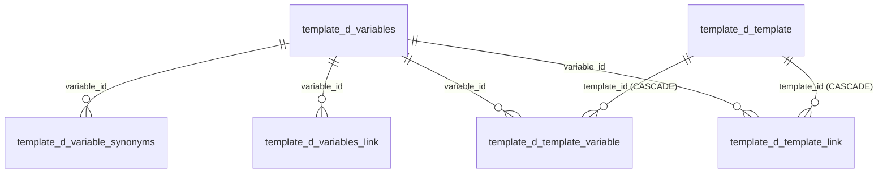

# Справочники шаблонов

Две схемы: **`template`** (8 таблиц) — единый справочник шаблонов коммуникаций с обвязкой переменных и продовыми маппингами «событие → шаблон», и **`dictionary`** (3 таблицы) — значения выпадающих списков мастера.

Здесь описана **структура таблиц**. Формы, валидация и жизненный цикл шаблона — [[Шаблоны и мастер коммуникаций]] и [[Мастер коммуникаций (формы)]]; доставка шаблонов во внешнюю прод-БД — [[Синхронизация с прод-БД]]; карта схем — [[Схема БД]].

> [!important] Локальных канальных таблиц у нас больше нет
> До миграции `V12` в базе жили staging-копии продовых `notice.push_template`, `notice.email_template`, `notice.d_com_sms_template` и `callcenter.d_segment_properties`. Они удалены вместе со схемами `notice`/`callcenter`. **Единственное наше хранилище шаблонов — `template.d_template`**; реальные канальные таблицы существуют только во внешней прод-БД и правятся отдельным соединением через очередь `app.prod_sync` ([[Синхронизация с прод-БД]]).

## template.d_template — единый справочник шаблонов

Идея: цепочке нужен один внешний ключ на «шаблон вообще», а не четыре условных. Поэтому поля, общие для всех каналов, вынесены в типизированные колонки, а канальная специфика сложена в `channel_props jsonb`.

| Колонка | Тип | Ключи / NOT NULL | Смысл |
| ------- | --- | ---------------- | ----- |
| `id` | `bigint` | PK, IDENTITY BY DEFAULT | Суррогатный ключ; на него ссылается `flow.d_event_template.template_id` (ON DELETE SET NULL) |
| `channel` | `varchar(10)` | NOT NULL, CHECK | Канал: `sms`, `push`, `email`, `cc`, `fa`, `vk`, `la` (три последних добавлены в `V13`) |
| `code` | `bigint` | NOT NULL, UNIQUE `(channel, code)` | **Бизнес-код шаблона** — то, чем оперируют пользователь и Flow Builder. У каждого канала своя природа кода (см. ниже) |
| `communication_name` | `varchar(255)` | — | Имя коммуникации; подсказки берутся из `dictionary.d_communication_name` |
| `campaign_name` | `varchar(255)` | — | **Гоча:** сюда кладётся `source_type` продовой канальной таблицы, а не название кампании. Заодно служит фолбэком при поиске `source` события |
| `communication_type` | `varchar(16)` | — | Тип коммуникации (`tunnel_a` и т. п.) |
| `business_communication_type` | `varchar(16)` | — | `adv` / `info` |
| `trigger_type` | `varchar(8)` | — | `trigger` / `promo` |
| `sending_day` | `smallint` | — | **День отправки относительно старта цепочки.** Именно он задаёт фактические задержки шагов в проде — собственного движка пауз нет. В Flow Builder поле «День» у comm-узла readonly и подставляется отсюда |
| `product_type` | `text[]` | — | Продукты; допустимые значения ведутся в `dictionary.d_product_type` |
| `partner_name` | `varchar(255)` | — | Партнёр |
| `touch_point` | `varchar(255)` | — | Точка касания; значения — `dictionary.d_touch_point` |
| `aff_sub3` | `varchar(255)` | — | Метка партнёрской аналитики |
| `selection_wizard_service` | `varchar(16)` | — | Сервис мастера подбора |
| `marketplace`, `dialog`, `loyalty`, `national_rating`, `news`, `mobile_app`, `night_send`, `permanent_exclude` | `boolean` | DEFAULT false | Флаги площадок и режимов. У email и cc `night_send` всегда `false` — в источнике такой колонки нет |
| `active_flag` | `boolean` | NOT NULL DEFAULT true | Активность шаблона |
| `channel_props` | `jsonb` | NOT NULL DEFAULT `'{}'` | Все канальные поля (состав — ниже) |
| `timestamp_cr` | `timestamptz` | NOT NULL DEFAULT now() | Создание записи |
| `timestamp_upd` | `timestamptz` | — | Последнее изменение (наши часы, не прод) |

### Бизнес-код по каналам

`code` — это не суррогатный `id`, а код из соответствующей прод-таблицы; его природа у каждого канала своя (`UnifiedTemplateService.channelTable()`):

| Канал | Прод-таблица (внешняя) | Что лежит в `code` | Кто присваивает |
| ----- | ---------------------- | ------------------ | --------------- |
| `sms` | `notice.d_com_sms_template` | `code` | прод; диапазон до 10000 (выше — служебные коды) |
| `push` | `notice.push_template` | `code` | прод, без ограничения диапазона |
| `email` | `notice.email_template` | `id` (отдельного кода нет; `trigger_code` кодом **не** является) | прод; диапазон до 10000 |
| `cc` | `callcenter.d_segment_properties` | `segment` — бизнес-номер сегмента | **пользователь**; прод его не переназначает |
| `fa` | `notice.fa_template` | `id` | прод; схема прод-таблицы предварительная |
| `vk` | `notice.vk_template` | `id` | прод; схема предварительная |
| `la` | `notice.live_activity_template` | `id` | прод; в мастере это тумблер в форме Push |

### Что лежит в channel_props

Набор ключей зависит от канала (фактический состав на test):

- **sms** — `msg_text`, `sender_name`, `antispam_check`, `brief`, `name`, `default_attrs`, `required_attrs`, `attribute_values`, `ab_group`, `source`;
- **push** — `title`, `msg_text`, `deep_link`, `webview_url`, `img_ios`, `img_android`, `time_to_live`, `action_buttons`, `brief`, `name`, `ab_group`, `source`;
- **email** — `subject`, `email_from`, `letteros_id`, `preheader`, `is_service`, `is_info`, `utm_custom`, `trigger_code`, `mail_text`, `links_info`, `msg_text`, `need_push`, `brief`, `name`, `ab_group`, `source`;
- **cc** — `segment_descr`, `source_system`, `host_id`, `ml_check_probability`, `ml_probability_required`, `ml_check_probability_loyal`, `ml_probability_required_loyal`, `ml_probability_required_uplift`, `active_ml_probability_type`, `cutpercent`, `nocutpercent`, `send_loyal_info`, `placement`, `kvint_campaign_id`, `ab_group`.

Два важных момента:

- **`source` живёт в `channel_props`, а не в колонке.** Материализация ищет источник кампании как `coalesce(channel_props->>'source', campaign_name)` по шаблону первой (по дню) comm-ноды и кладёт результат в `flow.d_event.source` и `scheduler.t_get_event.source`. У канала `cc` поля `source` нет вовсе — такие шаблоны при поиске пропускаются.
- **Прод-меток `timestamp_cr`/`timestamp_upd` в `channel_props` быть не должно.** Первые прогоны ETL складывали их туда как обычные канальные поля; при обратном синке такая метка уехала бы в прод и затёрла настоящую. Миграция `V17` вычистила их из данных, а код с тех пор их отфильтровывает.

## Переменные шаблонов

Четыре таблицы связок. Структура восстановлена по DO-скрипту старой Appsmith-админки — точного продового DDL нет. **Приложение их пока не заполняет** (на test все пусты) — это заготовка под мастер переменных.

### template.d_variables — словарь переменных

| Колонка | Тип | Ключи / NOT NULL | Смысл |
| ------- | --- | ---------------- | ----- |
| `id` | `integer` | PK, IDENTITY BY DEFAULT | — |
| `name` | `varchar(255)` | NOT NULL | Имя переменной в тексте шаблона |
| `is_pd` | `boolean` | NOT NULL DEFAULT false | Персональные данные — требует особого обращения |
| `is_application` | `boolean` | NOT NULL DEFAULT false | Переменная из заявки |
| `is_link` | `boolean` | NOT NULL DEFAULT false | Переменная-ссылка; параметры — в `d_variables_link` |
| `is_service` | `boolean` | NOT NULL DEFAULT false | Сервисная переменная |
| `is_logo` | `boolean` | NOT NULL DEFAULT false | Логотип |

### template.d_variable_synonyms — синонимы имени по каналам

| Колонка | Тип | Ключи / NOT NULL | Смысл |
| ------- | --- | ---------------- | ----- |
| `id` | `integer` | PK, IDENTITY BY DEFAULT | — |
| `synonym` | `varchar(255)` | — | Как та же переменная называется в конкретном канале/системе |
| `notify_channel` | `varchar(20)` | — | Канал, где действует синоним |
| `system` | `varchar(255)` | — | Система |
| `variable_id` | `integer` | FK → `template.d_variables(id)` | Переменная |

### template.d_variables_link — параметры переменных-ссылок

| Колонка | Тип | Ключи / NOT NULL | Смысл |
| ------- | --- | ---------------- | ----- |
| `id` | `integer` | PK, IDENTITY BY DEFAULT | — |
| `variable_id` | `integer` | FK → `template.d_variables(id)` | Переменная с `is_link = true` |
| `page_link` | `varchar` | — | URL страницы, куда ведёт ссылка |
| `link_parameters` | `varchar` | — | Параметры, дописываемые к URL |

### template.d_template_variable — «шаблон ↔ переменная»

| Колонка | Тип | Ключи / NOT NULL | Смысл |
| ------- | --- | ---------------- | ----- |
| `id` | `bigint` | PK, IDENTITY BY DEFAULT | — |
| `template_id` | `bigint` | NOT NULL, FK → `template.d_template(id)` ON DELETE CASCADE, UNIQUE `(template_id, variable_id)` | Шаблон |
| `variable_id` | `integer` | NOT NULL, FK → `template.d_variables(id)` | Переменная |
| `required` | `boolean` | NOT NULL DEFAULT false | Обязательна ли для отправки |

### template.d_template_link — «шаблон ↔ переменная-ссылка»

| Колонка | Тип | Ключи / NOT NULL | Смысл |
| ------- | --- | ---------------- | ----- |
| `id` | `bigint` | PK, IDENTITY BY DEFAULT | — |
| `template_id` | `bigint` | NOT NULL, FK → `template.d_template(id)` ON DELETE CASCADE, UNIQUE `(template_id, variable_id)` | Шаблон |
| `variable_id` | `integer` | NOT NULL, FK → `template.d_variables(id)` | Переменная-ссылка; сами параметры — в `d_variables_link` |

## Прод-маппинги «событие → шаблон»

Две таблицы, физически лежащие в схеме `template`, но по природе относящиеся к слою B — их читают прод-движки, а пишет наша материализация ([[Слой B (процессные таблицы)]], [[Материализация (Flow)]]). Внешних ключей нет: связь с событием — по `get_event_id`/`event_id` либо по паре `event_name`/`system`.

### template.d_template_mapping — одиночный шаблон

Используется, когда после разворачивания Subflow осталась **одна** comm-нода.

| Колонка | Тип | Ключи / NOT NULL | Смысл |
| ------- | --- | ---------------- | ----- |
| `id` | `bigint` | PK, IDENTITY BY DEFAULT | — |
| `get_event_id` | `bigint` | — | Для Time event — id `scheduler.t_get_event`; для Income event NULL |
| `event_name` | `varchar(255)` | — | Имя события |
| `system` | `varchar(255)` | — | Система |
| `segment_id` | `integer` | — | Сегмент; не заполняется |
| `notify_channel` | `varchar(10)` | — | Канал comm-ноды — здесь **нижним регистром** (`sms`/`push`/`email`/`cc`), в отличие от канала события |
| `template_id` | `integer` | — | **Бизнес-код** шаблона, а не `d_template.id` |
| `is_multiple_choice` | `boolean` | DEFAULT false | Множественный выбор |

### template.d_template_mapping_mass — цепочка шаблонов

Заведена в проде для прозрачности цепочек: по строке на каждую comm-ноду (включая развёрнутые Subflow), в порядке возрастания дня.

| Колонка | Тип | Ключи / NOT NULL | Смысл |
| ------- | --- | ---------------- | ----- |
| `id` | `bigint` | PK, IDENTITY BY DEFAULT | — |
| `event_id` | `bigint` | — | Для Time event — id `scheduler.t_get_event`; для Income event NULL |
| `event_name` | `varchar` | — | Имя события |
| `template_id` | `integer` | — | Бизнес-код шаблона |
| `channel` | `varchar` | — | Канал шаблона нижним регистром |

## Схема dictionary — значения форм мастера

Раньше эти списки были захардкожены во фронте; теперь ведутся в БД и пополняются без релиза (`DictionaryService`, [[REST API]]). Три таблицы имеют одинаковую структуру (`d_partner` отличается — см. ниже):

| Колонка | Тип | Ключи / NOT NULL | Смысл |
| ------- | --- | ---------------- | ----- |
| `id` | `bigint` | PK, `GENERATED ALWAYS AS IDENTITY` | — |
| `value` | `varchar(255)` | NOT NULL, UNIQUE | Само значение — то, что уезжает в шаблон |
| `description` | `varchar(255)` | — | Пояснение для оператора |
| `sort_order` | `integer` | NOT NULL DEFAULT 100 | Порядок в выпадающем списке (задан явно, не по алфавиту) |
| `is_active` | `boolean` | NOT NULL DEFAULT true | Скрыть значение, не удаляя |
| `timestamp_cr` | `timestamptz` | NOT NULL DEFAULT now() | Создание |
| `timestamp_upd` | `timestamptz` | — | Изменение |

| Таблица | Что перечисляет | Сид |
| ------- | --------------- | --- |
| `dictionary.d_communication_name` | База имени коммуникации (`promo`, `welcome`, `abandoned-form`, …) | `V10`: 32 значения из фронта + значения, уже встречавшиеся в шаблонах |
| `dictionary.d_touch_point` | Точка касания (`promo`, `issue`, `renewal`, `mobile-app`, …) | `V10`: 16 значений |
| `dictionary.d_product_type` | Продукт коммуникации (`credits`, `deposits`, `osago`, …) | `V19`: 33 значения в порядке, заданном заказчиком |
| `dictionary.d_partner` | Партнёр (`Alfa`, `Sber`, `Tinkoff`, …) | `V25`: 139 значений — перенос захардкоженного `PROMO_PARTNERS` из `promo.js` |

**`d_partner` устроен иначе**: состав колонок задал заказчик — `id bigserial`, `name varchar(200)`, `timestamp_cr`, `timestamp_upd`; ни `sort_order`, ни `is_active` нет, порядок — по `lower(name)`. `UNIQUE(name)` добавлен сверх задания. Список залит **как есть**, без чистки: в нём остались служебные значения (`none`, `Digest`, `General`, `multipartner`), площадки вперемешку с финансовыми организациями и вероятные дубли (`Sovkom`/`SovkomBank`, `Svoy`/`SvoyBank`, `GPB`/`Gazprombank`) — это осознанное решение заказчика.

Справочник читают три места: карточка шаблона (поле «Partner name»), инлайн-правка колонки «Партнёр» в списке шаблонов и планирование промо (подсказка поля «Партнёр»). Зашитый массив `PROMO_PARTNERS` в `promo.js` остался только фолбэком на случай недоступного справочника и больше не правится.

Справочник партнёров — единственный, который **пополняется прямо из формы** мастера: в выпадающем списке «Partner Name» у введённого значения, которого нет в справочнике, появляется пункт «+ Добавить «…»» (`POST /api/dictionaries/partners`, право `add` в `admin`/`templates`). Сравнение с существующими регистронезависимое, так что `sber` не заводит дубль к `Sber`.

`d_product_type` появился потому, что поле было свободным вводом и в данных накопились и `credit`, и `credits`, и `card` вместо `debitcards`. Выпадающий список `communication_name` намеренно показывает **только** значения справочника: раньше туда подмешивались имена из уже заведённых шаблонов, и на реальных данных список превращался в свалку исторических имён. Вписать значение вне списка по-прежнему можно — поле осталось редактируемым.

## Роль в материализации цепочек

Материализация ([[Материализация (Flow)]]) завязана на `template.d_template` в четырёх точках:

- **гейт наличия**: если шаблона с такой парой `(channel, code)` нет, цепочку нельзя ни материализовать, ни даже сохранить из Flow Builder;
- **`resolveUnifiedTemplateId`** находит `id` по `(channel, code)` и подставляет его в `flow.d_event_template.template_id`;
- **`resolveSource`** достаёт источник кампании (см. выше);
- **`sending_day`** шаблона = «День» comm-ноды = фактическая задержка шага цепочки в проде.

Источники: живой контур test (`information_schema.columns`, `pg_constraint`, состав `channel_props`); `src/main/resources/db/migration/V5, V6, V8, V10, V12, V13, V17, V19`; `src/main/java/ru/banki/crm/service/{UnifiedTemplateService,TemplateService,TemplateStore,DictionaryService}.java`, `service/flow/MaterializationService.java`.
