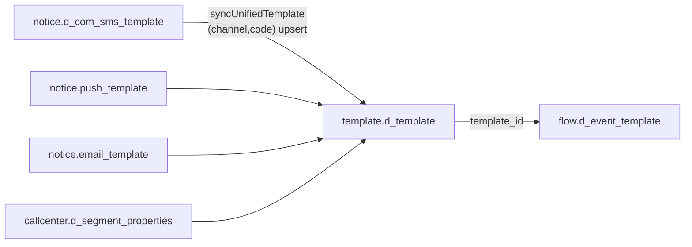

# Справочники шаблонов

Все таблицы, описывающие **шаблоны коммуникаций**: четыре канальные прод-таблицы (push/email/sms/cc), наш единый справочник `template.d_template` и таблицы переменных. Канальные таблицы создаются в `V1__template_schema.sql` **1:1 по реальному продовому DDL** (полный набор колонок, типы, nullability); отличие от прода одно — всем NOT NULL-колонкам добавлены DEFAULT'ы, чтобы демо-сиды и урезанная форма мастера вставлялись без ошибок (приложение эти значения всё равно задаёт явно). На корпоративной БД таблицы уже существуют — прод-профиль отключает Flyway.

Физические имена вынесены в конфиг `app.tables.push/email/sms/cc` (`src/main/resources/application.yml`) — код обращается к ним через `AdminLogService.tableFor(channel)` и JPA-entity. С этими таблицами работает [[Шаблоны и мастер коммуникаций]] (бэкенд `ru/banki/crm/service/TemplateService`) и [[Мастер коммуникаций (формы)]].

## Общее ядро четырёх таблиц

Во всех четырёх повторяется один и тот же блок «паспортных» полей кампании:

`communication_name`, `source_type`, `communication_type varchar(16)`, `business_communication_type varchar(16)`, `trigger_type varchar(8)`, `sending_day smallint`, `product_type text[]`, `partner_name varchar(100)`, `touch_point`, `aff_sub3 varchar(255)`, `ab_group varchar(8)`, `selection_wizard_service varchar(16)`, флаги `marketplace / mobile_app / loyalty / dialog / news / national_rating / permanent_exclude`, `active_flag boolean DEFAULT true`.

Два поля ядра особенно важны для цепочек:

- **`sending_day`** — день отправки относительно старта цепочки. Именно он задаёт задержки цепочки в проде (движка исполнения пауз у нас нет — см. [[Материализация (Flow)]]). В Flow Builder поле «День» у Communication Alert **readonly** и автоподставляется из `sending_day` выбранного шаблона (`CRM.getTemplate` в `src/main/resources/static/journeys.js`).
- **`source`** — источник кампании. При материализации `source` события **не вводится руками**: `MaterializationService.resolveSource()` берёт его из шаблона первой (по дню) comm-ноды и кладёт в `scheduler.t_get_event.source` и `flow.d_event.source`. У `callcenter.d_segment_properties` колонки `source` **нет** (есть только `source_system`/`source_type`), поэтому cc-шаблоны при поиске source пропускаются.

## Бизнес-код шаблона по каналам

Пользователь и Flow Builder оперируют не суррогатным `id`, а «кодом» — он у каждого канала свой (`TemplateBase.businessCode()`, `MaterializationService.channelTable()`):

| Канал | Таблица | Бизнес-код | Кто генерирует |
| ----- | ------- | ---------- | -------------- |
| sms | `notice.d_com_sms_template` | `code` | приложение: `maxCode() + 1` при создании (`TemplateService.create`) |
| push | `notice.push_template` | `code` | приложение: `maxCode() + 1` |
| email | `notice.email_template` | `id` (PK) | секвенс; отдельного бизнес-кода нет, `trigger_code` — другое поле и кодом **не** является |
| cc | `callcenter.d_segment_properties` | `segment` | вводит пользователь (обязателен, иначе 400); PK `id` — суррогатный, авто |

## notice.push_template

PK `id bigint` (секвенс `notice.push_template_id_seq`). Entity: `src/main/java/ru/banki/crm/domain/PushTemplate.java`.

| Колонка | Тип | Смысл / гочи |
| ------- | --- | ------------ |
| `id` | `bigint PK` | Суррогатный |
| `code` | `integer` | Бизнес-код (max+1 при создании) |
| `brief` | `varchar(100)` | Краткое описание |
| `name` | `varchar(64)` | Техническое имя шаблона |
| `title` | `varchar(60)` | Заголовок пуша |
| `msg_text` | `text` | Текст сообщения |
| `deep_link` | `varchar(255)` | Диплинк приложения (`banki://…`) |
| `product_type` | `text[] NOT NULL DEFAULT '{}'` | Продукты (deposit, credit, card, …) |
| `source` | `varchar(100)` | Источник кампании — отсюда берётся source события цепочки |
| `communication_type` | `varchar(16) NOT NULL DEFAULT ''` | Тип коммуникации (tunnel_a/…) |
| `trigger_type` | `varchar(8) NOT NULL DEFAULT ''` | trigger / promo |
| `sending_day` | `smallint NOT NULL DEFAULT 0` | День отправки в цепочке |
| `partner_name` | `varchar(100)` | Партнёр |
| `ab_group` | `varchar(8)` | AB-группа |
| `aff_sub3` | `varchar(255)` | Метка партнёрской аналитики |
| `webview_url` | `varchar(2048)` | URL webview |
| `source_type` | `varchar(128)` | Тип источника (promo/trigger/service/info) |
| `active_flag` | `boolean DEFAULT true` | Активность |
| `communication_name` | `varchar NOT NULL DEFAULT ''` | Имя коммуникации (общий словарь — `DictionaryService.communicationNames`) |
| `touch_point` | `varchar NOT NULL DEFAULT ''` | Точка касания (acquisition/retention/service) |
| `business_communication_type` | `varchar(16)` | adv / info |
| `night_send` | `boolean NOT NULL DEFAULT false` | Разрешена ночная отправка |
| `selection_wizard_service` | `varchar(16)` | Сервис мастера подбора |
| `national_rating`, `marketplace`, `mobile_app`, `loyalty`, `dialog`, `news` | `boolean NOT NULL DEFAULT false` | Флаги площадок/направлений |
| `img_ios`, `img_android` | `varchar(255)` | Картинки пуша по платформам |
| `action_buttons` | `jsonb` | Кнопки действий |
| `permanent_exclude` | `boolean` | Постоянное исключение из коммуникаций |
| `time_to_live` | `integer` | TTL пуша |

## notice.email_template

PK `id bigint` (секвенс `notice.email_template_id_seq`); `id` одновременно служит бизнес-кодом. Entity: `EmailTemplate.java`.

| Колонка | Тип | Смысл / гочи |
| ------- | --- | ------------ |
| `id` | `bigint PK` | Суррогатный **и** бизнес-код email-шаблона |
| `trigger_code` | `integer` | Код триггера (не бизнес-код шаблона!) |
| `msg_text` | `text` | Текст письма |
| `subject` | `text NOT NULL DEFAULT ''` | Тема |
| `email_from` | `varchar(64) NOT NULL DEFAULT ''` | Отправитель |
| `letteros_id` | `bigint` | ID макета в LetterOS |
| `is_service` | `boolean NOT NULL DEFAULT false` | Сервисное письмо |
| `preheader` | `varchar` | Прехедер |
| `utm_custom` | `varchar` | Кастомные UTM |
| `source_type` | `varchar(128) NOT NULL DEFAULT ''` | Тип источника |
| `product_type` | `text[] NOT NULL DEFAULT '{}'` | Продукты |
| `source` | `varchar(100)` | Источник кампании |
| `is_info` | `boolean NOT NULL DEFAULT false` | Информационное письмо |
| `trigger_type` | `varchar(8) NOT NULL DEFAULT ''` | trigger / promo |
| `sending_day` | `smallint NOT NULL DEFAULT 0` | День отправки |
| `partner_name` | `varchar(100)` | Партнёр |
| `ab_group` | `varchar(8)` | AB-группа |
| `aff_sub3` | `varchar(255) NOT NULL DEFAULT ''` | Метка аналитики |
| `communication_name` | `varchar(255) NOT NULL DEFAULT ''` | Имя коммуникации |
| `active_flag` | `boolean DEFAULT true` | Активность |
| `touch_point` | `varchar NOT NULL DEFAULT ''` | Точка касания |
| `communication_type` | `varchar(16) NOT NULL DEFAULT ''` | Тип коммуникации |
| `permanent_exclude` | `boolean` | Постоянное исключение |
| `business_communication_type` | `varchar(16) NOT NULL DEFAULT ''` | adv / info |
| `selection_wizard_service` | `varchar(16)` | Сервис мастера подбора |
| `national_rating` | `boolean NOT NULL DEFAULT false` | Флаг |
| `marketplace`, `mobile_app`, `loyalty`, `dialog`, `news` | `boolean` (nullable!) | В отличие от push/sms эти флаги здесь **nullable без DEFAULT** — гоча DDL |
| `mail_text` | `varchar` | Альтернативный текст |
| `links_info` | `jsonb` | Информация о ссылках письма |

Гоча: у email **нет** колонки `night_send` (в автосинке единого справочника подставляется `false`).

## notice.d_com_sms_template

PK `id integer` (секвенс `notice.d_com_sms_template_id_seq`) — единственная из четырёх с `integer`-PK. Entity: `SmsTemplate.java`.

| Колонка | Тип | Смысл / гочи |
| ------- | --- | ------------ |
| `id` | `integer PK` | Суррогатный |
| `code` | `integer` | Бизнес-код (max+1 при создании) |
| `brief` | `varchar(60)` | Краткое описание |
| `name` | `varchar(60)` | Техническое имя |
| `msg_text` | `text` | Текст SMS |
| `default_attrs` | `jsonb` | Значения атрибутов по умолчанию |
| `required_attrs` | `text[]` | Обязательные атрибуты |
| `attribute_values` | `varchar` | Значения атрибутов (легаси-строка) |
| `source_type` | `varchar(128) NOT NULL DEFAULT ''` | Тип источника |
| `product_type` | `text[] NOT NULL DEFAULT '{}'` | Продукты |
| `communication_type` | `varchar(16) NOT NULL DEFAULT ''` | Тип коммуникации |
| `source` | `varchar(100)` | Источник кампании |
| `trigger_type` | `varchar(8) NOT NULL DEFAULT ''` | trigger / promo |
| `sending_day` | `smallint NOT NULL DEFAULT 0` | День отправки |
| `partner_name` | `varchar(100)` | Партнёр |
| `ab_group` | `varchar(8)` | AB-группа |
| `aff_sub3` | `varchar(255) NOT NULL DEFAULT ''` | Метка аналитики |
| `active_flag` | `boolean DEFAULT true` | Активность |
| `communication_name` | `varchar NOT NULL DEFAULT ''` | Имя коммуникации |
| `touch_point` | `varchar NOT NULL DEFAULT ''` | Точка касания |
| `permanent_exclude` | `boolean` | Постоянное исключение |
| `business_communication_type` | `varchar(16) NOT NULL DEFAULT ''` | adv / info |
| `night_send` | `boolean NOT NULL DEFAULT false` | Ночная отправка |
| `selection_wizard_service` | `varchar(16)` | Сервис мастера подбора |
| `national_rating`, `marketplace`, `mobile_app`, `loyalty`, `dialog`, `news` | `boolean NOT NULL DEFAULT false` | Флаги |
| `sender_name` | `varchar(30)` | Имя отправителя (BANKIRU) |
| `antispam_check` | `boolean NOT NULL DEFAULT false` | Проверка антиспамом |

## callcenter.d_segment_properties

PK `id bigint` (секвенс `callcenter.d_segment_properties_id_seq`) — суррогатный; бизнес-номер — **`segment`** (`integer NOT NULL`), его вводит пользователь и по нему шаблон ищется (`CcSegmentRepository.findFirstBySegment`). Entity: `CcSegment.java`.

| Колонка | Тип | Смысл / гочи |
| ------- | --- | ------------ |
| `id` | `bigint PK` | Суррогатный (авто) |
| `source_system` | `varchar NOT NULL DEFAULT ''` | Система-источник (напр. kvint) |
| `segment` | `integer NOT NULL` | **Бизнес-номер сегмента** — «код шаблона» канала cc |
| `segment_descr` | `text` | Описание сегмента |
| `active_flag` | `boolean DEFAULT true` | Активность |
| `host_id` | `bigint` | ID хоста обзвона |
| `ml_check_probability` | `boolean` | Включена ML-проверка вероятности |
| `ml_probability_required` | `numeric` | Порог вероятности |
| `cutpercent` / `nocutpercent` | `integer` | Проценты отсечения выборки |
| `send_loyal_info` | `boolean` | Слать информацию лояльным |
| `product_type` | `text[] NOT NULL DEFAULT '{}'` | Продукты |
| `ml_check_probability_loyal` | `boolean` | ML-проверка для лояльных |
| `ml_probability_required_loyal` | `numeric` | Порог для лояльных |
| `trigger_type` | `varchar(8) NOT NULL DEFAULT ''` | trigger / promo |
| `sending_day` | `smallint NOT NULL DEFAULT 0` | День отправки |
| `ab_group` | `varchar(8)` | AB-группа |
| `aff_sub3` | `varchar(255) NOT NULL DEFAULT ''` | Метка аналитики |
| `communication_type` | `varchar(16) NOT NULL DEFAULT ''` | Тип коммуникации |
| `partner_name` | `varchar(100)` | Партнёр |
| `communication_name` | `varchar(255) NOT NULL DEFAULT ''` | Имя коммуникации |
| `source_type` | `varchar(128) NOT NULL DEFAULT ''` | Тип источника |
| `placement` | `varchar(20)` | Размещение |
| `touch_point` | `varchar NOT NULL DEFAULT ''` | Точка касания |
| `kvint_campaign_id` | `varchar(100)` | ID кампании в Kvint (робот-обзвон) |
| `ml_probability_required_uplift` | `numeric` | Порог uplift-модели |
| `active_ml_probability_type` | `varchar(100)` | Какая ML-вероятность активна |
| `business_communication_type` | `varchar(16) NOT NULL DEFAULT ''` | adv / info |
| `selection_wizard_service` | `varchar(16)` | Сервис мастера подбора |
| `national_rating`, `marketplace`, `mobile_app`, `loyalty`, `dialog`, `news` | `boolean NOT NULL DEFAULT false` | Флаги |
| `permanent_exclude` | `boolean` | Постоянное исключение |

Гочи cc: нет колонок `source` и `night_send`; нет `msg_text` (текст говорит оператор/робот).

## Аудит канальных таблиц

На всех четырёх — триггеры `trg_audit_push/email/sms/cc` → `arch.log_change()` → `arch.arch_log`; плюс `TemplateService` пишет `arch.t_admin_log` на каждый INSERT/UPDATE/DELETE. Подробно — [[Таблицы приложения]] и [[Аудит и журналирование]].

## template.d_template — единый справочник (свёртка четырёх)

Создаётся в `V6__flow_layer_a.sql`; логически относится к слою A ([[Слой A (flow)]]). Идея: цепочке нужен один FK на «шаблон вообще», а не четыре условных — поэтому общие поля четырёх канальных таблиц типизированы в ядро, а канальная специфика сложена в `channel_props jsonb`.

| Колонка | Тип | Смысл |
| ------- | --- | ----- |
| `id` | `bigint IDENTITY PK` | На него ссылается `flow.d_event_template.template_id` (ON DELETE SET NULL) |
| `channel` | `varchar(10) NOT NULL` | `CHECK (channel IN ('sms','push','email','cc'))` |
| `code` | `bigint NOT NULL` | Бизнес-код канала (code / id / segment); **`UNIQUE (channel, code)`** |
| `communication_name` | `varchar(255)` | Имя коммуникации |
| `campaign_name` | `varchar(255)` | **Гоча:** при автосинке сюда кладётся `source_type` канальной таблицы (см. `syncUnifiedTemplate`) |
| `communication_type` | `varchar(16)` | Тип коммуникации |
| `business_communication_type` | `varchar(16)` | adv / info |
| `trigger_type` | `varchar(8)` | trigger / promo |
| `sending_day` | `smallint` | День отправки |
| `product_type` | `text[]` | Продукты |
| `partner_name` | `varchar(255)` | Партнёр |
| `touch_point` | `varchar(255)` | Точка касания |
| `aff_sub3` | `varchar(255)` | Метка аналитики |
| `selection_wizard_service` | `varchar(16)` | Сервис мастера подбора |
| `marketplace`, `dialog`, `loyalty`, `national_rating`, `news`, `mobile_app`, `night_send`, `permanent_exclude` | `boolean DEFAULT false` | Флаги; для email/cc `night_send` всегда false (колонки в источнике нет) |
| `active_flag` | `boolean NOT NULL DEFAULT true` | Активность |
| `channel_props` | `jsonb NOT NULL DEFAULT '{}'` | Все канальные поля: sms — `msg_text`, `sender_name`, `antispam_check`, `brief`, `name`…; push — `title`, `msg_text`, `deep_link`, `webview_url`, `img_ios/android`, `time_to_live`…; email — `letteros_id`, `subject`, `email_from`, `preheader`, `is_service`, `is_info`, `utm_custom`, `trigger_code`…; cc — `segment`, `source_system`, `host_id`, `ml_*`, `cutpercent`, `placement`, `kvint_campaign_id`… |
| `timestamp_cr` | `timestamptz NOT NULL DEFAULT now()` | Создание записи справочника |
| `timestamp_upd` | `timestamptz` | Последний автосинк |

**Автосинк.** Пока в единый справочник никто не пишет руками: `MaterializationService.syncUnifiedTemplate(channel, code)` при каждой материализации делает `INSERT … SELECT` из канальной таблицы с `ON CONFLICT (channel, code) DO UPDATE` — ядро в типизированные колонки, а `channel_props` = `to_jsonb(строки)` минус `id`, бизнес-код и колонки ядра (`CORE_COLS`). Затем `resolveUnifiedTemplateId` находит `id` по `(channel, code)` и подставляет его в `flow.d_event_template`.

## Переменные шаблонов

Структура восстановлена по DO-скрипту старой Appsmith-админки (точного продового DDL нет) — `V5__process_layer_b.sql`; связки с единым справочником — `V6__flow_layer_a.sql`. Приложение их пока не заполняет — заготовка под мастер переменных.

### template.d_variables
| Колонка | Тип | Смысл |
| ------- | --- | ----- |
| `id` | `integer IDENTITY PK` | — |
| `name` | `varchar(255) NOT NULL` | Имя переменной |
| `is_pd` | `boolean NOT NULL DEFAULT false` | Персональные данные |
| `is_application` | `boolean NOT NULL DEFAULT false` | Переменная заявки |
| `is_link` | `boolean NOT NULL DEFAULT false` | Переменная-ссылка (параметры — в `d_variables_link`) |
| `is_service` | `boolean NOT NULL DEFAULT false` | Сервисная |
| `is_logo` | `boolean NOT NULL DEFAULT false` | Логотип |

### template.d_variable_synonyms
| Колонка | Тип | Смысл |
| ------- | --- | ----- |
| `id` | `integer IDENTITY PK` | — |
| `synonym` | `varchar(255)` | Синоним имени в конкретном канале/системе |
| `notify_channel` | `varchar(20)` | Канал |
| `system` | `varchar(255)` | Система |
| `variable_id` | `integer REFERENCES template.d_variables(id)` | Переменная |

### template.d_variables_link
| Колонка | Тип | Смысл |
| ------- | --- | ----- |
| `id` | `integer IDENTITY PK` | — |
| `variable_id` | `integer REFERENCES template.d_variables(id)` | Переменная-ссылка |
| `page_link` | `varchar` | URL страницы |
| `link_parameters` | `varchar` | Параметры ссылки |

### template.d_template_variable (V6)
Связка «шаблон ↔ переменная»: `id bigint IDENTITY PK`, `template_id bigint NOT NULL → template.d_template (CASCADE)`, `variable_id integer NOT NULL → template.d_variables`, `required boolean NOT NULL DEFAULT false`, `UNIQUE (template_id, variable_id)`.

### template.d_template_link (V6)
Связка «шаблон ↔ переменная-ссылка» (для переменных с `is_link = true`; сами параметры — в `d_variables_link`): `id bigint IDENTITY PK`, `template_id bigint NOT NULL → template.d_template (CASCADE)`, `variable_id integer NOT NULL → template.d_variables`, `UNIQUE (template_id, variable_id)`.

## Роль в материализации цепочек

Материализация ([[Материализация (Flow)]]) жёстко завязана на канальные справочники:
- `templateExists(channel, code)` — гейт: если шаблон не найден, цепочку нельзя ни материализовать (ошибка в `validate`), ни даже сохранить из Flow Builder (клиентская проверка `missingTemplates` в `journeys.js`);
- `resolveSource(journey)` — `source` события из шаблона первой comm-ноды;
- `sending_day` шаблона = «День» comm-ноды = фактическая задержка шага цепочки в проде;
- `syncUnifiedTemplate` — автосинк в `template.d_template`.

Источники: `src/main/resources/db/migration/V1__template_schema.sql`, `V5__process_layer_b.sql`, `V6__flow_layer_a.sql`; `src/main/java/ru/banki/crm/service/TemplateService.java`, `service/flow/MaterializationService.java`, `domain/TemplateBase.java` и наследники.
