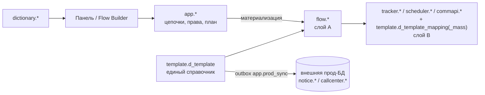
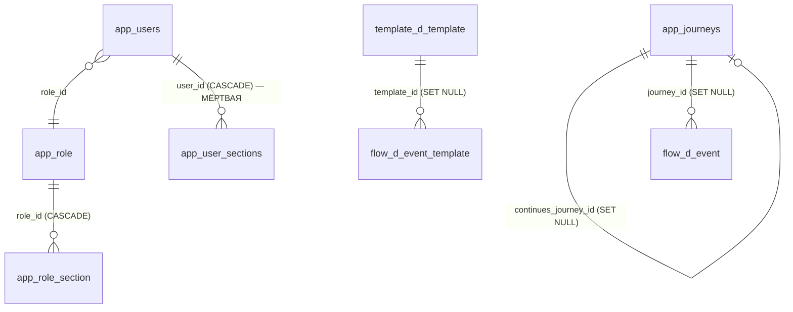

# Схема БД

Карта верхнего уровня базы crm-admin: какие схемы существуют, за что отвечают и в какой заметке описаны детально. **Списков колонок здесь нет** — они живут в четырёх детальных заметках, ссылки на которые даны в таблице ниже.

Физически это одна PostgreSQL 16 (в dev/test/preprod — контейнеры `db-*` из `docker-compose.yml`, см. [[Среды и деплой]]). Структуру раскатывает **Flyway** (`src/main/resources/db/migration`, актуальная версия — **V26** от 30.07.2026). В прод-профиле Flyway выключен (`spring.flyway.enabled=false`): там подключаемся к уже существующей корпоративной базе.

Сверено с живым контуром **test** на 30.07.2026: **9 схем с таблицами, 41 таблица** (включая `app.flyway_schema_history`).

## Схемы

| Схема | Слой | За что отвечает | Таблиц | Детально |
| ----- | ---- | --------------- | ------ | -------- |
| `app` | приложение | Ядро панели: учётки, роли и матрица прав, цепочки, настройки, план промо, журнал А/Б тестов, реестр подключений, очередь синка с продом | 12 | [[Таблицы приложения]] |
| `arch` | приложение (журналы) | Два журнала: триггерный `arch_log` и журнал действий админки `t_admin_log` | 2 | [[Таблицы приложения]], механика — [[Аудит и журналирование]] |
| `flow` | слой A | Нормализованная модель процесса коммуникаций — «истина» для UI и Flow Builder | 8 | [[Слой A (flow)]] |
| `template` | справочник + слой B | Единый справочник шаблонов `d_template` с обвязкой переменных **и** прод-маппинги «событие → шаблон» | 8 | [[Справочники шаблонов]] |
| `dictionary` | справочники | Значения выпадающих списков мастера (имя коммуникации, точка касания, продукт, партнёр) | 4 | [[Справочники шаблонов]] |
| `tracker` | слой B | Онлайн-события прод-движка рассылок | 2 | [[Слой B (процессные таблицы)]] |
| `scheduler` | слой B | События расписания, настройки запуска и SQL-шаги выборок | 3 | [[Слой B (процессные таблицы)]] |
| `commapi` | слой B | Событие → метод отправки (Camunda-definition) | 1 | [[Слой B (процессные таблицы)]] |
| `crm` | **тест-заглушка** | `v_crm_matrix_report` — витрина для смоук-теста отчёта, **см. предупреждение ниже** | 1 | [[Отчёты]] |

### Пустые схемы-остатки

В базе физически присутствуют ещё `notice`, `callcenter`, `retention` и `public`, но **таблиц в них нет**:

- `notice` и `callcenter` держали локальные staging-копии канальных прод-таблиц шаблонов; `V12__drop_local_channel_staging.sql` удалил и таблицы, и схемы. На test они снова появились пустыми — Flyway пересоздаёт их как `spring.flyway.schemas` при следующем прогоне. Реальные `notice.*` / `callcenter.*` живут **во внешней прод-БД** и правятся только через отдельное соединение (см. [[Синхронизация с прод-БД]]);
- `retention` создана в `V1` про запас, таблиц в ней не было никогда;
- `public` — системная схема Postgres, пустая.

### ⚠️ `crm.v_crm_matrix_report` — это тестовая заглушка

Несмотря на префикс `v_`, это обычная **таблица**, а не представление, и **её нет ни на препроде, ни на проде**. Она создана вручную только на контуре **test**, чтобы прогнать смоук-тест выгрузки «ЧЕК СМС траффик» (`SmsCheckReportService` читает из неё агрегаты по `report_date` / `channel_name`). В миграциях её нет, частью схемы приложения она **не является** — реальные данные для отчёта должны прийти из DWH-витрины. Подробности — [[Отчёты]].

## Слои и как они связаны

- **Слой A** (`flow.*`) — наша нормализованная модель: один агрегат «событие» с чистым разделением конфиг/runtime.
- **Слой B** — копии продовых процессных таблиц 1:1; производный артефакт, который пересобирается из слоя A.
- Между слоями **нет внешних ключей**: соответствие фиксирует журнал `flow.t_materialization` (`our_entity`/`our_id` → `prod_table`/`prod_id`), по нему же повторная материализация удаляет свои прежние строки. Как именно A превращается в B — [[Материализация (Flow)]].
- Шаблоны хранятся **только** в `template.d_template`; локальных канальных таблиц у нас нет, наружу они уезжают очередью `app.prod_sync` — [[Синхронизация с прод-БД]], [[Шаблоны и мастер коммуникаций]].

## Межсхемные внешние ключи

Их всего пять — всё остальное замыкается внутри своей схемы:

Схемы `tracker`, `scheduler`, `commapi` и `dictionary` внешних ключей наружу не имеют вовсе — это осознанно: слой B копирует прод-DDL, а справочники значений ни с чем не связаны ключами.

## Миграции

| Версия | Что делает |
| ------ | ---------- |
| `V1` | Схемы `notice`/`callcenter`/`retention`/`arch`; канальные staging-таблицы шаблонов (сняты в V12); `arch.arch_log`, функция `arch.log_change()` и аудит-триггеры |
| `V2` | Схема `app`; `app.users` (строковая роль с CHECK) и `app.user_sections` |
| `V3` | `app.journeys` — цепочка одним jsonb-документом |
| `V4` | `arch.t_admin_log` — журнал действий админки |
| `V5` | Схемы `tracker`/`scheduler`/`template`/`commapi`; таблицы слоя B + таблицы переменных |
| `V6` | Схема `flow`; 8 таблиц слоя A; `template.d_template` + связки переменных; колонки `kind`/`continues_journey_id` в `app.journeys` |
| `V7` | `app.panel_settings` (key → jsonb) |
| `V8` | Бэкфилл `template.d_template` из канальных таблиц + очередь синка `app.prod_sync` |
| `V9` | Чистка очереди синка от отладочных записей |
| `V10` | Схема `dictionary`; `d_communication_name`, `d_touch_point` + сиды |
| `V11` | Роль `SUPER_ADMIN` в старом строковом перечислении |
| `V12` | **Удаление** локальных канальных staging-таблиц и схем `notice`/`callcenter` |
| `V13` | Новые каналы шаблонов `fa`, `vk`, `la` в CHECK `d_template.channel` |
| `V14` | `app.db_connection` — реестр подключений для «Диагностики» |
| `V15` | Флаг `is_prod_sync` + частичный UNIQUE-индекс: приёмник синка ровно один |
| `V16` | `app.sync_watermark` — водяные знаки ETL по каналам |
| `V17` | Вычистка `timestamp_cr`/`timestamp_upd` из `d_template.channel_props` (данные) |
| `V18` | `app.promo_plan` — общий план промо |
| `V19` | `dictionary.d_product_type` + сид из 33 значений |
| `V20` | Гранулярные права: колонки `can_read/add/edit/delete` в `app.user_sections` |
| `V21` | **Роли стали данными**: `app.role` + `app.role_section`, `app.users.role_id`; строковая колонка `users.role` удалена |
| `V22` | Встроенная роль «Админ» и пять разделов только-просмотра (`srcbuilder`, `reports`, `heatmap`, `monitoring`, `uploads`) |
| `V23` (30.07) | Сужение прав роли «Маркетолог» до пяти разделов только на чтение — **данные, не структура** |
| `V24` (30.07) | Колонка `communication_name` в `app.promo_plan` |
| `V25` (30.07) | `dictionary.d_partner` + сид из 139 партнёров (перенос захардкоженного `PROMO_PARTNERS` из `promo.js`) |
| `V26` (30.07) | `app.ab_test` — журнал А/Б тестов; права на секцию `abtests` скопированы роль-в-роль с `promo` |

Каталог сидов — `src/main/resources/db/seed` (`V900__seed_dev.sql`, `V901__seed_journeys.sql`) — **выведен из обращения** (30.07). `V900` вставляет демо-шаблоны в канальные таблицы, удалённые в `V12`: на уже поднятых контурах он применился исторически (раньше `V12`) и прошёл, а на чистом томе Flyway идёт по возрастанию версии — `V12` сносит таблицы, `V900` выполняется последним и падает, приложение не стартует. Поэтому в профиле `docker` осталось только `locations: classpath:db/migration` (`out-of-order: true`), а записи о сидах из `flyway_schema_history` вычищает `FlywaySeedCleanup` перед `migrate()` — иначе Flyway валился бы на «applied migration not resolved locally». Класс временный: его можно удалить, когда все три контура один раз поднимутся с ним.

## Что где искать

- Права и разделы (модель, а не таблицы) — [[Безопасность и RBAC]];
- превращение цепочки в строки слоя A/B — [[Материализация (Flow)]];
- жизненный цикл шаблона и мастер — [[Шаблоны и мастер коммуникаций]];
- очередь и ETL с внешним продом — [[Синхронизация с прод-БД]];
- общая картина сервиса — [[Обзор архитектуры]].

Источники: живой контур test (`docker exec crm-admin-db-test psql -U crm -d crm`), `src/main/resources/db/migration/V1…V24`, `src/main/resources/application.yml`.
