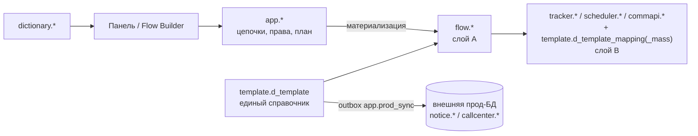
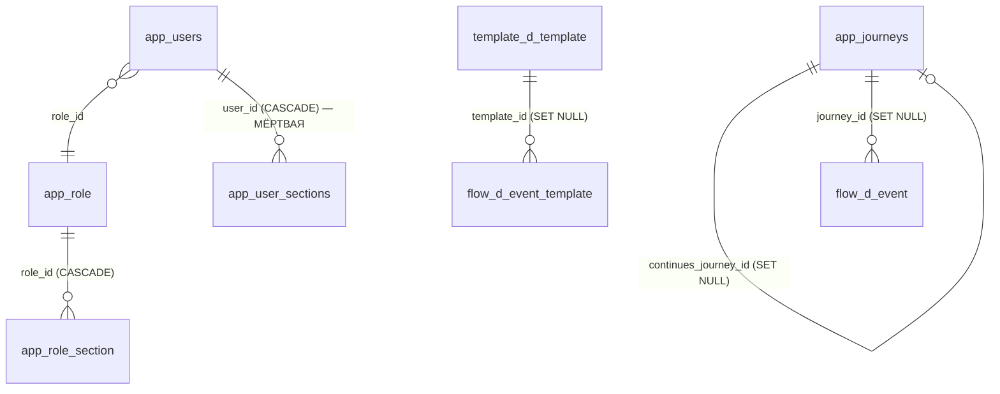

# Схема БД

Карта верхнего уровня базы crm-admin: какие схемы есть, за что отвечают и где описаны детально. **Списков колонок здесь нет** — они живут в четырёх соседних заметках.

Физически это одна PostgreSQL 16 (в dev/test/preprod — контейнеры `db-*` из `docker-compose.yml`, см. [[Среды и деплой]]). Структуру раскатывает **Flyway** (`src/main/resources/db/migration`, последняя миграция — `V33__flow_job_normalization.sql`). В прод-профиле Flyway выключен (`spring.flyway.enabled=false`): там подключаемся к уже существующей корпоративной базе.

По миграциям `V1`…`V33` в базе **8 схем с таблицами и 48 таблиц**, считая служебную `app.flyway_schema_history`.

## Схемы

| Схема | Слой | За что отвечает | Таблиц | Детально |
| ----- | ---- | --------------- | ------ | -------- |
| `app` | приложение | Ядро панели: учётки, роли и матрица прав, цепочки, настройки, план промо, А/Б тесты, реестр подключений, очередь синка, модель Scheme Builder | 17 | [Таблицы приложения](Таблицы%20приложения.md) |
| `arch` | приложение (журналы) | Два журнала: триггерный `arch_log` и журнал действий админки `t_admin_log` | 2 | [Таблицы приложения](Таблицы%20приложения.md), механика — [[Аудит и журналирование]] |
| `flow` | слой A | Нормализованная модель процесса коммуникаций: конфигурация, состояние задания и история прогонов | 11 | [Слой A (flow)](Слой%20A%20%28flow%29.md) |
| `template` | справочник + слой B | Единый справочник шаблонов `d_template` с обвязкой переменных **и** прод-маппинги «событие → шаблон» | 8 | [Справочники шаблонов](Справочники%20шаблонов.md) |
| `dictionary` | справочники | Значения выпадающих списков мастера: имя коммуникации, точка касания, продукт, партнёр | 4 | [Справочники шаблонов](Справочники%20шаблонов.md) |
| `tracker` | слой B | Онлайн-события прод-движка рассылок | 2 | [Слой B (процессные таблицы)](Слой%20B%20%28процессные%20таблицы%29.md) |
| `scheduler` | слой B | События расписания, настройки запуска и SQL-шаги выборок | 3 | [Слой B (процессные таблицы)](Слой%20B%20%28процессные%20таблицы%29.md) |
| `commapi` | слой B | Событие → метод отправки (Camunda-definition) | 1 | [Слой B (процессные таблицы)](Слой%20B%20%28процессные%20таблицы%29.md) |

### Схемы без таблиц

- `notice` и `callcenter` держали локальные staging-копии канальных прод-таблиц шаблонов. `V12__drop_local_channel_staging.sql:12` снёс и таблицы, и схемы; Flyway пересоздаёт их пустыми, потому что они перечислены в `spring.flyway.schemas`. **Настоящие `notice.*` / `callcenter.*` живут во внешней прод-БД** и правятся только отдельным соединением — [[Синхронизация с прод-БД]];
- `retention` создана в `V1__template_schema.sql:9` про запас, таблиц в ней не было никогда;
- `public` — схема Postgres по умолчанию, пустая. Вместе с двумя предыдущими она в стоп-листе Scheme Builder (`app.schema_reserved`).

### `crm.v_crm_matrix_report` — не часть схемы

Несмотря на префикс `v_`, это обычная таблица, а не представление, и в миграциях её нет: заведена руками только на контуре **test**, чтобы прогнать смоук-тест выгрузки «ЧЕК СМС траффик». На препроде и проде её нет, реальные данные должны прийти из витрины DWH — [[Отчёты]].

## Слои и как они связаны

- **Слой A** (`flow.*`) — наша нормализованная модель: один агрегат «событие», где конфигурация, состояние и история разведены по разным таблицам.
- **Слой B** — копии продовых процессных таблиц 1:1; производный артефакт, который пересобирается из слоя A.
- Между слоями **нет внешних ключей**: соответствие фиксирует журнал `flow.t_materialization`, по нему же повторная материализация удаляет свои прежние строки. Алгоритм — [[Материализация (Flow)]].
- Шаблоны хранятся **только** в `template.d_template`; наружу они уезжают очередью `app.prod_sync` — [[Синхронизация с прод-БД]].

## Межсхемные внешние ключи

Их пять — всё остальное замыкается внутри своей схемы:

Схемы `tracker`, `scheduler`, `commapi` и `dictionary` внешних ключей наружу не имеют вовсе, и это осознанно: слой B копирует прод-DDL, а справочники значений ни с чем не связаны ключами.

## Миграции

| Версия | Что делает |
| ------ | ---------- |
| `V1` | Схемы `notice`/`callcenter`/`retention`/`arch`; канальные staging-таблицы шаблонов (сняты в `V12`); `arch.arch_log`, функция `arch.log_change()` и аудит-триггеры |
| `V2` | Схема `app`; `app.users` (строковая роль с CHECK) и `app.user_sections` |
| `V3` | `app.journeys` — цепочка одним jsonb-документом |
| `V4` | `arch.t_admin_log` — журнал действий админки |
| `V5` | Схемы `tracker`/`scheduler`/`template`/`commapi`; таблицы слоя B + таблицы переменных |
| `V6` | Схема `flow`; 8 таблиц слоя A; `template.d_template` + связки переменных; колонки `kind`/`continues_journey_id` в `app.journeys` |
| `V7` | `app.panel_settings` (key → jsonb) |
| `V8` | Бэкфилл `template.d_template` из канальных таблиц + очередь синка `app.prod_sync` |
| `V9` | Чистка очереди синка от отладочных записей |
| `V10` | Схема `dictionary`; `d_communication_name`, `d_touch_point` + сиды |
| `V11` | Роль `SUPER_ADMIN` в старом строковом перечислении |
| `V12` | **Удаление** локальных канальных staging-таблиц и схем `notice`/`callcenter` |
| `V13` | Каналы `fa`, `vk`, `la` в CHECK `d_template.channel` |
| `V14` | `app.db_connection` — реестр подключений для «Диагностики» |
| `V15` | Флаг `is_prod_sync` + частичный UNIQUE-индекс: приёмник синка ровно один |
| `V16` | `app.sync_watermark` — водяные знаки ETL по каналам |
| `V17` | Вычистка `timestamp_cr`/`timestamp_upd` из `d_template.channel_props` — данные, не структура |
| `V18` | `app.promo_plan` — общий план промо |
| `V19` | `dictionary.d_product_type` + сид из 33 значений |
| `V20` | Гранулярные права: колонки `can_read/add/edit/delete` в `app.user_sections` |
| `V21` | **Роли стали данными**: `app.role` + `app.role_section`, `app.users.role_id`; строковая `users.role` удалена |
| `V22` | Встроенная роль «Админ» и пять разделов только-просмотра |
| `V23` | Сужение прав роли «Маркетолог» до пяти разделов на чтение — данные, не структура |
| `V24` | Колонка `communication_name` в `app.promo_plan` |
| `V25` | `dictionary.d_partner` + сид из 139 партнёров |
| `V26` | `app.ab_test` — журнал А/Б тестов; права на секцию `abtests` скопированы роль-в-роль с `promo` |
| `V27` | Колонка `status` в `app.ab_test` |
| `V28` | Набор статусов А/Б тестов: «запланировано» / «идёт» / «завершён» |
| `V29` | Секция RBAC на каждый пункт меню: зонтичные `reports`/`monitoring` развёрнуты в пункты с переносом прав — [[Безопасность и RBAC]] |
| `V30` | Scheme Builder: `app.schema_model`, `app.schema_version`, `app.schema_audit` |
| `V31` | Scheme Builder: `app.schema_owned` (что билдер завёл сам) и `app.schema_reserved` (чего ему нельзя касаться) + сид стоп-листа |
| `V32` | Колонка `base_extra` в `app.promo_plan` |
| `V33` | **Нормализация расписаний и шагов**: `flow.d_database`, снятие расчётных колонок с `d_event_schedule`, UNIQUE на порядке шагов, `flow.t_event_state`, `flow.t_event_run`, дотяжка `t_event_step_run` |

Каталог сидов `src/main/resources/db/seed` (`V900__seed_dev.sql`, `V901__seed_journeys.sql`) **выведен из обращения**. `V900` вставляет демо-шаблоны в канальные таблицы, удалённые в `V12`: на уже поднятых контурах он применился исторически (раньше `V12`) и прошёл, а на чистом томе Flyway идёт по возрастанию версии — `V12` сносит таблицы, `V900` выполняется последним и падает, приложение не стартует. Поэтому в профиле `docker` осталось только `locations: classpath:db/migration` с `out-of-order: true`, а записи о сидах из `flyway_schema_history` вычищает `FlywaySeedCleanup` перед `migrate()` — иначе Flyway валился бы на «applied migration not resolved locally».

## Что где искать

- Права и разделы как модель, а не таблицы — [[Безопасность и RBAC]];
- превращение цепочки в строки слоя A и B — [[Материализация (Flow)]];
- жизненный цикл шаблона и мастер — [[Шаблоны и мастер коммуникаций]];
- очередь и ETL с внешним продом — [[Синхронизация с прод-БД]];
- общая картина сервиса — [[Обзор архитектуры]].

Источники: `src/main/resources/db/migration/V1…V33`, `src/main/resources/application.yml`.
