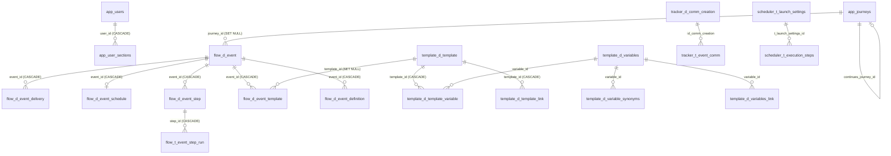

# Схема БД

Обзор всей структуры базы данных crm-admin. В dev/test-контурах поднимается собственная **PostgreSQL 16** в Docker (три отдельных контейнера `db-prod` / `db-preprod` / `db-test`, см. `docker-compose.yml` и [[Среды и деплой]]), а **Flyway** воспроизводит прод-идентичную схему. В прод-профиле Flyway полностью выключен (`spring.flyway.enabled=false` в `src/main/resources/application.yml`) — там подключаемся к существующей корпоративной БД, где таблицы уже есть.

Ключевая идея: одна физическая база, но логически — три слоя.

1. **Корпоративные таблицы шаблонов** (`notice`, `callcenter`, `arch`) — 1:1 копии продового DDL, с ними работает мастер коммуникаций → [[Справочники шаблонов]].
2. **Собственные таблицы приложения** (`app`, `arch.t_admin_log`) — пользователи, ACL, цепочки, журналы → [[Таблицы приложения]].
3. **Двухслойная модель процесса коммуникаций**: наш нормализованный **слой A** (`flow.*` + единый справочник `template.d_template`) и **слой B** — копии продовых процессных таблиц (`tracker`, `scheduler`, `template`, `commapi`), в которые слой A материализуется → [[Слой A (flow)]], [[Слой B (процессные таблицы)]], [[Материализация (Flow)]].

## Девять схем + одна зарезервированная

| Схема        | Слой            | Назначение                                                                            | Таблицы                                                                                                                                                                                                      |     |
| ------------ | --------------- | ------------------------------------------------------------------------------------- | ------------------------------------------------------------------------------------------------------------------------------------------------------------------------------------------------------------ | --- |
| `notice`     | шаблоны         | Шаблоны push/email/SMS                                                                | `push_template`, `email_template`, `d_com_sms_template` — [[Справочники шаблонов]]                                                                                                                           |     |
| `callcenter` | шаблоны         | Сегменты обзвона колл-центром                                                         | `d_segment_properties` — [[Справочники шаблонов]]                                                                                                                                                            |     |
| `retention`  | —               | Зарезервирована: `CREATE SCHEMA IF NOT EXISTS retention` в V1, таблиц в миграциях нет | —                                                                                                                                                                                                            |     |
| `arch`       | аудит           | Триггерный аудит + журнал действий админки                                            | `arch_log`, `t_admin_log` — [[Таблицы приложения]], [[Аудит и журналирование]]                                                                                                                               |     |
| `app`        | приложение      | Пользователи, RBAC-разделы, цепочки, настройки панели                                 | `users`, `user_sections`, `journeys`, `panel_settings` — [[Таблицы приложения]]                                                                                                                              |     |
| `tracker`    | слой B          | Онлайн-события прод-движка                                                            | `d_comm_creation`, `t_event_comm` — [[Слой B (процессные таблицы)]]                                                                                                                                          |     |
| `scheduler`  | слой B          | События расписания и SQL-шаги выборок                                                 | `t_get_event`, `t_launch_settings`, `t_execution_steps` — [[Слой B (процессные таблицы)]]                                                                                                                    |     |
| `template`   | слой B + слой A | Маппинги событие→шаблон, переменные; **плюс** наш единый справочник шаблонов          | слой B: `d_template_mapping`, `d_template_mapping_mass`, `d_variables`, `d_variable_synonyms`, `d_variables_link`; слой A: `d_template`, `d_template_variable`, `d_template_link` — [[Справочники шаблонов]] |     |
| `commapi`    | слой B          | Событие → метод отправки (definition)                                                 | `d_definition_mapping` — [[Слой B (процессные таблицы)]]                                                                                                                                                     |     |
| `flow`       | слой A          | Нормализованная модель процесса («истина» для UI)                                     | `d_event`, `d_event_delivery`, `d_event_schedule`, `d_event_step`, `t_event_step_run`, `d_event_template`, `d_event_definition`, `t_materialization` — [[Слой A (flow)]]                                     |     |

В `spring.flyway.schemas` перечислены только `notice,callcenter,retention,arch,app` (их создаёт сам Flyway, `create-schemas: true`, `default-schema: app`); схемы `tracker`/`scheduler`/`template`/`commapi` создаются внутри `V5__process_layer_b.sql`, а `flow` — внутри `V6__flow_layer_a.sql` через `CREATE SCHEMA IF NOT EXISTS`.

## Таблица миграций

Каталог: `src/main/resources/db/migration` (схема) и `src/main/resources/db/seed` (демо-данные). В профиле `docker` locations = `db/migration,db/seed` и включён `out-of-order: true` — сиды заняли версии V900+, поэтому «младшие» схемные миграции (V3+) применяются задним числом. В прод-профиле не выполняется ничего.

| Миграция | Что создаёт |
| -------- | ----------- |
| `V1__template_schema.sql` | Схемы `notice`/`callcenter`/`retention`/`arch`; 4 канальные таблицы шаблонов с секвенсами (`notice.push_template`, `notice.email_template`, `notice.d_com_sms_template`, `callcenter.d_segment_properties`); таблица аудита `arch.arch_log`, функция `arch.log_change()` и 4 триггера `trg_audit_*` |
| `V2__auth.sql` | Схема `app`; `app.users` (роль с CHECK `READER/EDITOR/ADMIN`) и `app.user_sections` |
| `V3__journeys.sql` | `app.journeys` — цепочка одним jsonb-документом `definition` |
| `V4__admin_log.sql` | `arch.t_admin_log` — журнал действий админки (структура 1:1 по прод-спецификации) |
| `V5__process_layer_b.sql` | Схемы `tracker`/`scheduler`/`template`/`commapi`; 8 процессных таблиц слоя B + 3 таблицы переменных (`d_variables`, `d_variable_synonyms`, `d_variables_link`) |
| `V6__flow_layer_a.sql` | Схема `flow`; 8 таблиц слоя A; единый справочник `template.d_template` + `d_template_variable`/`d_template_link`; колонки `kind` и `continues_journey_id` в `app.journeys`; FK `flow.d_event_template.template_id → template.d_template.id` |
| `V7__panel_settings.sql` | `app.panel_settings` (key `varchar(64)` PK → `value jsonb`, `timestamp_upd`) — серверные настройки панели для настроечной админки `/settings`; сид: пустой конфиг `appSections = '{}'` (все разделы всем приложениям) |
| `V900__seed_dev.sql` (seed) | Демо-шаблоны: по 2 строки в каждую из 4 канальных таблиц (только профиль `docker`) |
| `V901__seed_journeys.sql` (seed) | Демо-цепочка `demo-welcome` в `app.journeys` (4 узла sms/email/sms/push, 4 ребра), `ON CONFLICT DO NOTHING` |

## erDiagram ключевых связей

Связи между слоем A и слоем B — **не FK**, а журнал соответствий `flow.t_materialization` (`our_entity`/`our_id` → `prod_table`/`prod_id`): именно по нему повторная материализация удаляет свои прежние строки слоя B (идемпотентность, `MaterializationService.deletePreviousMaterialization`). Аналогично 4 канальные таблицы шаблонов связаны с `template.d_template` не ключами, а автосинком по паре `(channel, code)` при материализации.

## Аудит на уровне БД

Каждая канальная таблица шаблонов имеет триггер `AFTER INSERT OR UPDATE OR DELETE FOR EACH ROW` → `arch.log_change()`, который пишет в `arch.arch_log` имя таблицы, операцию, бизнес-ключ (`COALESCE(code, id, segment)` из jsonb-образа строки) и автора из GUC `current_setting('app.current_user', true)`. GUC выставляет приложение (`ru/banki/crm/service/AuditContext.mark()` — `set_config('app.current_user', <email>, true)`) в той же транзакции. Параллельно приложение само ведёт `arch.t_admin_log` через `AdminLogService`. Подробно — [[Аудит и журналирование]] и [[Таблицы приложения]].

## Seeds (демо-данные)

`V900__seed_dev.sql` — по два шаблона на канал (push: «Одобрено»/«Напоминание», sms: OTP/вклад, email: letteros 1001/1002, cc: сегменты 1001/1002 с `kvint_campaign_id`), все NOT NULL-колонки без значения опираются на DEFAULT'ы из V1. `V901__seed_journeys.sql` — цепочка `demo-welcome` для раздела «Цепочки». Сиды применяются **только** в профиле `docker` и никогда в проде.

## Конфигурация физических имён

Физические имена таблиц вынесены в `application.yml` (`app.tables.push/email/sms/cc`, `app.tables.admin-log` ← env `ADMIN_LOG_TABLE`) — переключение окружения не требует правок кода. Датасорс — `DB_URL`/`DB_USER`/`DB_PASSWORD`. См. [[Конфигурация]].

## Источники

- `src/main/resources/db/migration/V1__template_schema.sql` … `V7__panel_settings.sql`
- `src/main/resources/db/seed/V900__seed_dev.sql`, `V901__seed_journeys.sql`
- `src/main/resources/application.yml`, `docker-compose.yml`
- `src/main/java/ru/banki/crm/service/flow/MaterializationService.java`
