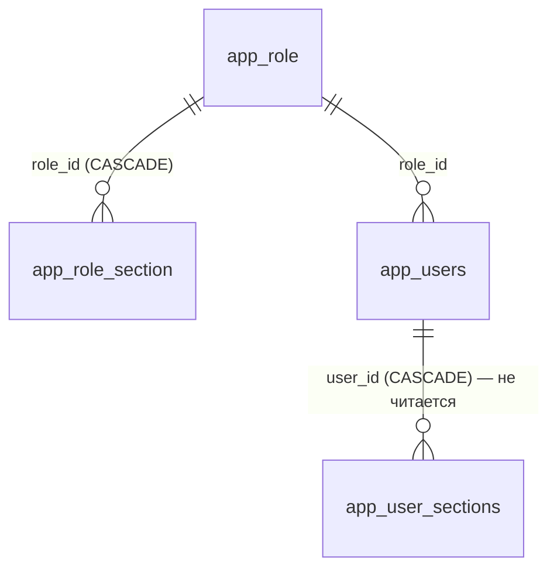

# Таблицы приложения

Схема **`app`** — ядро панели: то, чего в проде нет и что придумано нами. Плюс схема **`arch`** с двумя журналами. Всего 13 таблиц (11 + 2).

Здесь описана **структура** таблиц. Смежные темы намеренно не пересказываются: модель прав — [[Безопасность и RBAC]], сценарии работы с учётками — [[Безопасность и RBAC]], механика журналирования — [[Аудит и журналирование]], очередь и ETL с внешним продом — [[Синхронизация с прод-БД]], раздел плана промо — [[Планирование промо]]. Карта схем целиком — [[Схема БД]].

## Доступ: роли, права, учётки

С миграции **V21 роли стали данными**. Раньше роль была строкой в `app.users` из жёсткого перечисления (`READER`/`EDITOR`/`ADMIN`/`SUPER_ADMIN`), а матрица прав висела на каждом пользователе. Теперь есть справочник ролей и матрица «роль × раздел»: права **живые** — принадлежат роли, правка роли меняет всех её носителей сразу. У пользователя осталась только ссылка на роль.

### app.role — справочник ролей

| Колонка | Тип | Ключи / NOT NULL | Смысл |
| ------- | --- | ---------------- | ----- |
| `id` | `bigint` | PK, `GENERATED ALWAYS AS IDENTITY` | — |
| `name` | `text` | NOT NULL, UNIQUE | Отображаемое имя роли («Аналитик», «Маркетолог») |
| `is_admin` | `boolean` | NOT NULL DEFAULT false | Админ-полномочия: носитель **обходит матрицу** на сервере |
| `is_super_admin` | `boolean` | NOT NULL DEFAULT false | Полный доступ; привязана к учётке из `ADMIN_EMAIL` |
| `is_system` | `boolean` | NOT NULL DEFAULT false | Встроенная роль: удалять и переименовывать нельзя |
| `sort_order` | `integer` | NOT NULL DEFAULT 100 | Порядок в списках UI |

Семь встроенных ролей (на test, `is_system = true` у всех): «Супер админ» (10), «Админ» (15), «Проджект-менеджер» (20), «Тимлид аналитики» (30), «Аналитик» (40), «Маркетолог» (50), «СЕО» (60). Пользовательские роли заводятся через раздел «Управление доступом» (`RoleService`).

### app.role_section — матрица «раздел × право»

| Колонка | Тип | Ключи / NOT NULL | Смысл |
| ------- | --- | ---------------- | ----- |
| `role_id` | `bigint` | PK (часть), NOT NULL, FK → `app.role(id)` ON DELETE CASCADE | Роль |
| `section_id` | `text` | PK (часть), NOT NULL | Идентификатор раздела UI; список — `ru/banki/crm/service/Sections.java` |
| `can_read` | `boolean` | NOT NULL DEFAULT true | Видимость раздела |
| `can_add` | `boolean` | NOT NULL DEFAULT false | Создание записей |
| `can_edit` | `boolean` | NOT NULL DEFAULT false | Правка |
| `can_delete` | `boolean` | NOT NULL DEFAULT false | Удаление |

Каноничные `section_id` (14 штук): `home`, `deviations`, `onelink`, `admin` (мастер коммуникаций), `templates`, `dashboard`, `journeys`, `access`, `promo`, `srcbuilder`, `reports`, `heatmap`, `monitoring`, `uploads`. Осмысленные `add/edit/delete` есть только у `admin`, `templates`, `promo` (`Sections.WRITABLE`) — у остальных значима лишь галка чтения. Разделы `journeys` и `access` админские: доступ к ним даёт флаг роли, а не матрица.

Права ролей правятся **данными**: миграция `V23__marketer_readonly_sections.sql` (30.07) удалила все строки роли «Маркетолог» и вставила заново пять разделов только на чтение — `promo`, `srcbuilder`, `templates`, `admin`, `reports`. Структуру она не меняла. Кто что видит по факту — [[Безопасность и RBAC]].

### app.users — учётные записи

| Колонка | Тип | Ключи / NOT NULL | Смысл |
| ------- | --- | ---------------- | ----- |
| `id` | `bigint` | PK, `bigserial` | Суррогатный ключ |
| `email` | `text` | NOT NULL, UNIQUE | Логин; домен может ограничиваться настройкой `app.email-domain` (env `APP_EMAIL_DOMAIN`) |
| `password_hash` | `text` | NOT NULL | BCrypt-хэш |
| `display_name` | `text` | — | Отображаемое имя |
| `enabled` | `boolean` | NOT NULL DEFAULT true | Выключенный пользователь войти не может |
| `created_at` | `timestamptz` | NOT NULL DEFAULT now() | Момент регистрации |
| `role_id` | `bigint` | NOT NULL, FK → `app.role(id)` | Роль; всё, что можно пользователю, определяется ею |

Строковая колонка `role` удалена в V21 (её порядковый номер в таблице остался пропущенным — `ordinal_position` 5 не занят). Первый супер-админ создаётся идемпотентно при старте: `ru/banki/crm/config/AdminBootstrap` читает `ADMIN_EMAIL`/`ADMIN_PASSWORD` и заводит учётку с ролью «Супер админ»; если переменные не заданы — пишет warning и пропускает шаг.

### app.user_sections — МЁРТВАЯ таблица

> [!warning] Не используется
> Осталась от прежней модели прав (персональная матрица на каждого пользователя, V2 + V20). После перехода на роли-данные (V21) enforcement на неё **не смотрит**, приложение её не читает и не пишет. Строки в ней (на test — 16) — исторический мусор от старых учёток. Структура сохранена на случай будущих персональных исключений; сейчас любые правки в ней ни на что не влияют.

Структура: `user_id bigint NOT NULL FK → app.users(id) ON DELETE CASCADE`, `section_id text NOT NULL`, PK `(user_id, section_id)`, флаги `can_read` (DEFAULT true) / `can_add` / `can_edit` / `can_delete` (DEFAULT false).

## Цепочки и настройки

### app.journeys — цепочки Flow Builder

Вся схема цепочки (узлы, рёбра, координаты на канве) хранится **одним jsonb-документом** и читается/пишется атомарно — отдельных таблиц узлов и рёбер нет.

| Колонка | Тип | Ключи / NOT NULL | Смысл |
| ------- | --- | ---------------- | ----- |
| `id` | `varchar(36)` | PK | UUID-строка, генерируется приложением |
| `name` | `text` | NOT NULL | Название цепочки |
| `definition` | `jsonb` | NOT NULL | `{nodes:[…], edges:[…]}` в формате `ru/banki/crm/dto/JourneyDtos` |
| `kind` | `varchar(10)` | NOT NULL DEFAULT `'online'`, CHECK `IN ('online','offline')` | Онлайн-цепочка стартует с Income event, оффлайн — с Time event |
| `continues_journey_id` | `varchar(36)` | FK → `app.journeys(id)` ON DELETE SET NULL | Для offline: информационная метка «продолжение какой online-цепочки»; на логику не влияет |
| `updated_by` | `text` | — | Email последнего редактора |
| `updated_at` | `timestamptz` | NOT NULL DEFAULT now() | Момент сохранения |

Обратная ссылка идёт и в слой A: `flow.d_event.journey_id` (ON DELETE SET NULL) — [[Слой A (flow)]]. Формат `definition`, типы узлов и правила валидации — [[Цепочки (Journeys)]] и [[Flow Builder (цепочки)]]. Работа с таблицей — `DbJourneyService` (включается при `app.journeys.mock=false`).

### app.panel_settings — настройки панели (key → jsonb)

| Колонка | Тип | Ключи / NOT NULL | Смысл |
| ------- | --- | ---------------- | ----- |
| `key` | `varchar(64)` | PK | Имя настройки; контроллер валидирует регуляркой `[a-zA-Z][a-zA-Z0-9_-]{0,63}` |
| `value` | `jsonb` | NOT NULL DEFAULT `'{}'` | Произвольное значение |
| `timestamp_upd` | `timestamptz` | NOT NULL DEFAULT now() | Момент последнего upsert-а |

Единственный используемый ключ — `appSections`: конфиг «приложение App Launcher → доступные разделы панели»; **пустой объект = все разделы всем приложениям**. Чтение доступно любому аутентифицированному, запись — только админам, каждая запись попадает в `arch.t_admin_log`. См. [[Оболочка панели (shell)]].

### app.promo_plan — общий план промо

Раньше план жил в `localStorage` у каждого в браузере — общего плана не существовало. Правило «одна запись = один канал» сохранено: промо на три канала создаёт три строки.

| Колонка | Тип | Ключи / NOT NULL | Смысл |
| ------- | --- | ---------------- | ----- |
| `id` | `bigint` | PK, `bigserial` | — |
| `plan_date` | `date` | NOT NULL | Дата отправки; по ней индекс `ix_promo_plan_date` (раздел всегда читается срезом по месяцу) |
| `product` | `varchar(200)` | NOT NULL DEFAULT `''` | Продукт (`crm_product_segment`) |
| `partner` | `varchar(200)` | NOT NULL DEFAULT `''` | Партнёр |
| `base` | `text` | NOT NULL DEFAULT `''` | Словесное описание базы отправки |
| `channel` | `varchar(40)` | NOT NULL DEFAULT `''` | Ровно один канал на строку |
| `is_total` | `boolean` | NOT NULL DEFAULT false | Строка-итог, а не отдельная отправка |
| `uniq_name` | `varchar(120)` | NOT NULL DEFAULT `''` | Уникальное имя для сборки `source` (латиница/цифры/дефис) |
| `task_key` | `varchar(60)` | NOT NULL DEFAULT `''` | Ключ задачи, напр. `CRM-8746` |
| `owner_name` | `varchar(120)` | NOT NULL DEFAULT `''` | Ответственный; пока свободный текст, привязки к `app.users` нет |
| `status` | `varchar(60)` | NOT NULL DEFAULT `''` | Статус промо |
| `note` | `text` | NOT NULL DEFAULT `''` | Комментарий |
| `communication_name` | `text` | NOT NULL DEFAULT `''` | **Добавлена в `V24` (30.07).** Готовое название коммуникации: при импорте календаря из Excel оно приходит текстом («Альфа-Карта»), а партнёра и уникального имени в выгрузке нет — грид показывает сохранённое название, когда авто-сборка неполная |
| `timestamp_cr` | `timestamptz` | NOT NULL DEFAULT now() | Создание |
| `timestamp_upd` | `timestamptz` | NOT NULL DEFAULT now() | Обновление; служит **версией строки** — правка присылает его обратно, при расхождении API отдаёт 409 |
| `created_by` / `updated_by` | `varchar(200)` | — | Авторы |

### app.ab_test — журнал А/Б тестов

Заведена в `V26` (30.07). Раздел устроен как план промо — та же оптимистическая блокировка по `timestamp_upd`; логика раздела — [[АБ тесты]].

| Колонка | Тип | Ключи / NOT NULL | Смысл |
| ------- | --- | ---------------- | ----- |
| `id` | `bigint` | PK, `bigserial` | — |
| `date_start` | `date` | NOT NULL | Когда начали; по ней индекс `ix_ab_test_date` и порядок вывода (свежие сверху) |
| `date_end` | `date` | — | Когда закончили. **NULL допустим**: даты может ещё не быть у идущего теста |
| `subject` | `text` | NOT NULL DEFAULT `''` | Что тестировали (гипотеза) |
| `templates` | `text` | NOT NULL DEFAULT `''` | Какие шаблоны использовались; свободный текст, а не ссылка на `d_template` — в тесте участвуют и шаблоны, которых у нас ещё нет |
| `owner_name` | `varchar(200)` | NOT NULL DEFAULT `''` | Кто инициировал |
| `tester` | `varchar(200)` | NOT NULL DEFAULT `''` | Кто тестировал; при заведении подставляется почта учётки, дальше правится руками. Связи с `app.users` нет намеренно: тестировать может человек без учётки в панели |
| `result` | `text` | NOT NULL DEFAULT `''` | Результаты |
| `status` | `varchar(40)` | NOT NULL DEFAULT `'идёт'` | **Добавлена в `V27` (31.07).** Проставляется вручную: `идёт` / `не идёт`. Раньше «идёт» выводилось из пустой `date_end`, но статус нужнее отдельно — тест могут приостановить, когда дата окончания ещё не наступила |
| `timestamp_cr` | `timestamptz` | NOT NULL DEFAULT now() | Создание |
| `timestamp_upd` | `timestamptz` | NOT NULL DEFAULT now() | Обновление; служит **версией строки** — правка присылает его обратно, при расхождении API отдаёт 409 |
| `created_by` / `updated_by` | `varchar(200)` | — | Авторы |

## Интеграция с прод-БД

Обе таблицы обслуживают синк шаблонов наружу; сценарий целиком — [[Синхронизация с прод-БД]].

### app.prod_sync — очередь синка (outbox)

Каждая операция мастера над шаблоном встаёт сюда и доставляется во **внешнюю** прод-БД (`ProdSyncService` → `ProdDbService`). На test очередь пуста.

| Колонка | Тип | Ключи / NOT NULL | Смысл |
| ------- | --- | ---------------- | ----- |
| `id` | `bigint` | PK, `GENERATED ALWAYS AS IDENTITY` | — |
| `channel` | `varchar(8)` | NOT NULL | `sms` / `push` / `email` / `cc` / `fa` / `vk` / `la` |
| `operation` | `varchar(8)` | NOT NULL | `INSERT` / `UPDATE` / `DELETE` |
| `local_code` | `bigint` | — | Бизнес-код у нас на момент постановки (нужен для UPDATE/DELETE) |
| `prod_code` | `bigint` | — | Код, который присвоил прод после доставки |
| `payload` | `jsonb` | NOT NULL | Строка прод-таблицы 1:1 — ровно то, что уезжает |
| `status` | `varchar(10)` | NOT NULL DEFAULT `'PENDING'` | `PENDING` / `OK` / `ERROR`; индекс `idx_prod_sync_status (status, timestamp_cr)` |
| `attempts` | `integer` | NOT NULL DEFAULT 0 | Счётчик попыток доставки |
| `last_error` | `text` | — | Текст последней ошибки |
| `created_by` | `varchar(255)` | — | Автор операции |
| `timestamp_cr` / `timestamp_upd` | `timestamptz` | NOT NULL DEFAULT now() | Постановка в очередь / последняя попытка |

### app.sync_watermark — водяные знаки ETL

До какого **прод-времени** по каналу мы уже затянули изменения обратно к себе. Отдельная таблица, а не `max(d_template.timestamp_upd)`: последний пишут ещё и локальные правки мастера, из-за чего знак «отравлялся» бы и мог поехать назад. Знак двигается только вперёд. На test пуста — ETL ещё не запускался.

| Колонка | Тип | Ключи / NOT NULL | Смысл |
| ------- | --- | ---------------- | ----- |
| `channel` | `varchar(10)` | PK | Канал |
| `last_prod_ts` | `timestamptz` | — | NULL = канал ни разу не синхронизирован |
| `timestamp_upd` | `timestamptz` | NOT NULL DEFAULT now() | Когда знак двигали |

### app.db_connection — реестр подключений

Внешние базы для страницы «Диагностика» (`/settings`, только админ). Встроенные подключения (наша БД) в таблице **не хранятся** — сервис добавляет их к списку на лету как read-only.

| Колонка | Тип | Ключи / NOT NULL | Смысл |
| ------- | --- | ---------------- | ----- |
| `id` | `bigint` | PK, `bigserial` | — |
| `name` | `varchar(100)` | NOT NULL, UNIQUE | Человекочитаемое имя |
| `jdbc_url` | `text` | NOT NULL | `jdbc:postgresql://host:port/db` |
| `username` | `varchar(200)` | — | Пользователь БД |
| `password` | `text` | — | Пароль в открытом виде; **наружу через API не отдаётся**, в списке только признак `hasPassword` |
| `driver` | `varchar(100)` | — | По умолчанию PostgreSQL |
| `purpose` | `text` | — | Заметка «для чего это подключение» |
| `is_active` | `boolean` | NOT NULL DEFAULT true | Активность |
| `is_prod_sync` | `boolean` | NOT NULL DEFAULT false | Приёмник синка шаблонов; частичный уникальный индекс `uq_db_connection_prod_sync` гарантирует, что он **ровно один** |
| `last_status` | `varchar(20)` | — | Результат последней проверки: `OK` / `ERROR` / NULL |
| `last_error` | `text` | — | Текст ошибки проверки |
| `last_latency_ms` | `integer` | — | Задержка `SELECT 1`, мс |
| `last_checked_at` | `timestamptz` | — | Когда проверяли |
| `created_at` | `timestamptz` | NOT NULL DEFAULT now() | — |
| `created_by` | `varchar(200)` | — | Кто завёл |

### app.flyway_schema_history

Служебная таблица Flyway (`installed_rank` PK, `version`, `description`, `script`, `checksum`, `installed_by`, `installed_on`, `execution_time`, `success`). Приложение её не трогает. По ней видно, что на test применены все версии до **V24** включительно; из-за `out-of-order: true` сиды V900/V901 стоят по порядку установки между V3 и V4.

## Журналы (схема arch)

### arch.t_admin_log — журнал действий админки

Заполняется **приложением** (`AdminLogService`), структура 1:1 по прод-спецификации. Физическое имя конфигурируется: `app.tables.admin-log` ← env `ADMIN_LOG_TABLE`.

| Колонка | Тип | Ключи / NOT NULL | Смысл |
| ------- | --- | ---------------- | ----- |
| `id` | `bigint` | PK, `GENERATED BY DEFAULT AS IDENTITY` | — |
| `table_name` | `varchar` | — | Физическое имя затронутой таблицы |
| `operation` | `varchar` | — | `INSERT` / `UPDATE` / `DELETE` |
| `old_row` | `jsonb` | — | Образ строки; **семантика зависит от операции** (см. ниже) |
| `action_user` | `varchar` | — | Email текущего пользователя |
| `timestamp_cr` | `timestamp` | NOT NULL DEFAULT now() | Момент записи |

Семантика `old_row`: для `UPDATE`/`DELETE` — строка **до** изменения, для `INSERT` — **созданная** строка (иначе о факте заведения не осталось бы данных). Кто и когда сюда пишет — [[Аудит и журналирование]].

### arch.arch_log — триггерный аудит (сейчас не пополняется)

> [!warning] Осиротевшая таблица
> Создавалась в `V1` вместе с функцией `arch.log_change()` и четырьмя триггерами `trg_audit_*` на локальных канальных таблицах шаблонов. Миграция `V12` удалила эти таблицы через `DROP … CASCADE` — вместе с ними ушли и триггеры. Функция `arch.log_change()` в базе осталась, но **вызывать её больше некому**: в живой БД триггеров нет ни на одной таблице. Строки в `arch_log` (на test — 31) остались от периода до V12.

Структура: `id bigserial PK`, `table_name text NOT NULL` (схема + имя), `operation text NOT NULL` (`TG_OP`), `row_pk text` (бизнес-ключ строки), `changed_by text` (email из транзакционного GUC `app.current_user`), `changed_at timestamptz NOT NULL DEFAULT now()`.

Источники: живой контур test; `src/main/resources/db/migration/V2, V3, V4, V7, V8, V14…V24`; `ru/banki/crm/service/{RoleService,UserService,PromoPlanService,DbConnectionService,AdminLogService,Sections}.java`, `service/prod/*`.
