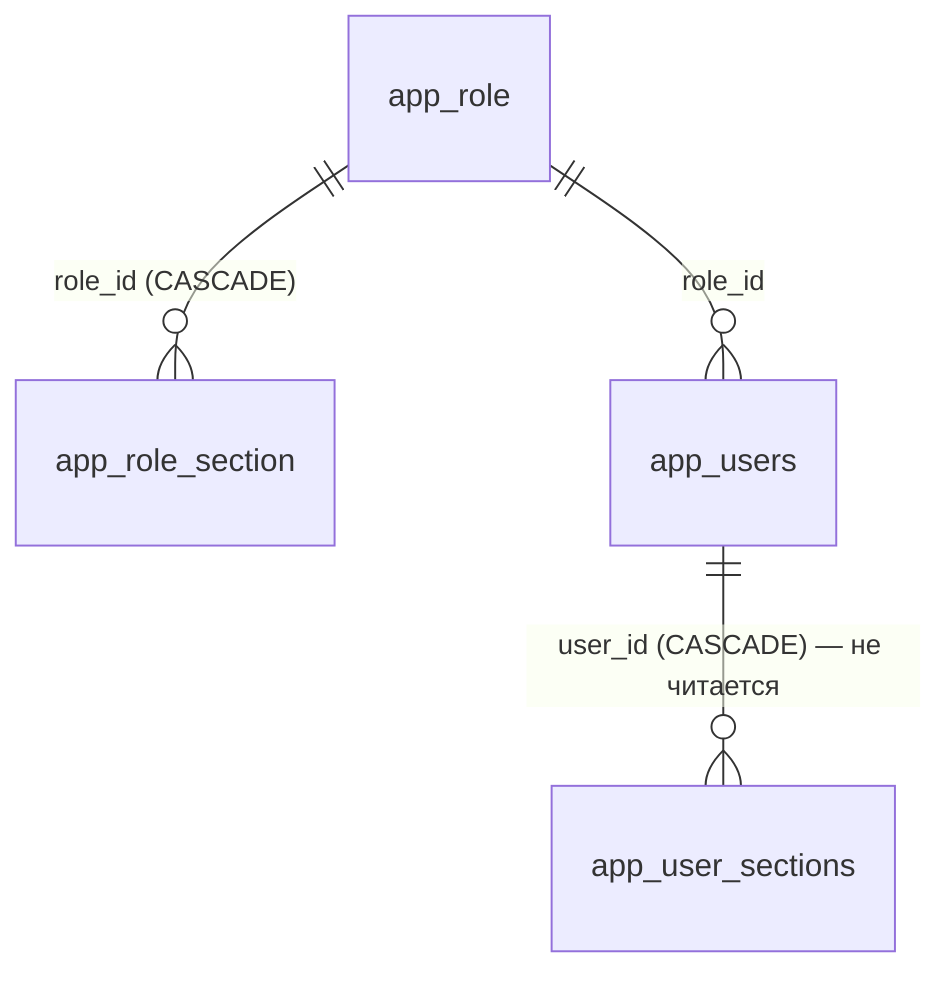

# Таблицы приложения

Схема **`app`** — ядро панели: то, чего в проде нет и что придумано нами. Плюс схема **`arch`** с двумя журналами. Итого 19 таблиц: 16 прикладных в `app`, служебная `app.flyway_schema_history` и две в `arch`.

Здесь — **структура** таблиц. Смежные темы не пересказываются: модель прав — [[Безопасность и RBAC]], механика журналирования — [[Аудит и журналирование]], очередь и ETL с внешним продом — [[Синхронизация с прод-БД]], раздел плана промо — [[Планирование промо]]. Карта схем — [Схема БД](Схема%20БД.md).

## Доступ: роли, права, учётки

С миграции `V21__roles_as_data.sql` **роли стали данными**. Раньше роль была строкой в `app.users` из жёсткого перечисления, а матрица прав висела на каждом пользователе. Теперь есть справочник ролей и матрица «роль × раздел»: права **живые** — принадлежат роли, правка роли меняет всех её носителей сразу. У пользователя осталась только ссылка на роль.

### app.role — справочник ролей

`src/main/resources/db/migration/V21__roles_as_data.sql:9`. Пишет `RoleService` (раздел «Управление доступом»), читает каждый запрос при проверке прав.

| Колонка | Тип | Ключи / NOT NULL | Смысл |
| ------- | --- | ---------------- | ----- |
| `id` | `bigint` | PK, `GENERATED ALWAYS AS IDENTITY` | — |
| `name` | `text` | NOT NULL, UNIQUE | Отображаемое имя роли |
| `is_admin` | `boolean` | NOT NULL DEFAULT false | Админ-полномочия: носитель **обходит матрицу** на сервере |
| `is_super_admin` | `boolean` | NOT NULL DEFAULT false | Полный доступ; привязана к учётке из `ADMIN_EMAIL` |
| `is_system` | `boolean` | NOT NULL DEFAULT false | Встроенная роль: удалять и переименовывать нельзя |
| `sort_order` | `integer` | NOT NULL DEFAULT 100 | Порядок в списках UI |

Семь встроенных ролей (`is_system = true`): «Супер админ» (10), «Админ» (15, `V22__admin_role_and_more_sections.sql:7`), «Проджект-менеджер» (20), «Тимлид аналитики» (30), «Аналитик» (40), «Маркетолог» (50), «СЕО» (60).

### app.role_section — матрица «раздел × право»

`V21__roles_as_data.sql:18`.

| Колонка | Тип | Ключи / NOT NULL | Смысл |
| ------- | --- | ---------------- | ----- |
| `role_id` | `bigint` | PK (часть), FK → `app.role(id)` ON DELETE CASCADE | Роль |
| `section_id` | `text` | PK (часть), NOT NULL | Идентификатор раздела UI; канон — `ru/banki/crm/service/Sections.java` |
| `can_read` | `boolean` | NOT NULL DEFAULT true | Видимость раздела |
| `can_add` / `can_edit` / `can_delete` | `boolean` | NOT NULL DEFAULT false | Создание / правка / удаление |

Канонических `section_id` девятнадцать: `home`, `onelink`, `admin` (мастер коммуникаций), `templates`, `srcbuilder`, `promo`, `abtests`, `heatmap`, пять отчётов `rep-planfact` / `rep-matrix` / `rep-leadgen` / `rep-smscheck` / `rep-demo`, `dashboard`, `deviations`, `mon-campaigns`, `uploads`, `journeys`, `access`. Осмысленные `add/edit/delete` есть только у `admin`, `templates`, `promo`, `abtests` (`Sections.WRITABLE`) — у остальных значима лишь галка чтения. `journeys` и `access` админские: доступ к ним даёт флаг роли, а не матрица.

Зонтичных секций `reports` и `monitoring` больше нет: `src/main/resources/db/migration/V29__section_per_nav_item.sql:31` развернул их в отдельные пункты меню с переносом прав один-в-один, а группа сайдбара сама скрывается, когда скрыты все её дети. Права ролей правятся **данными** — так, `V23__marketer_readonly_sections.sql:16` удалил все строки роли «Маркетолог» и вставил заново пять разделов только на чтение. Кто что видит по факту — [[Безопасность и RBAC]].

### app.users — учётные записи

`src/main/resources/db/migration/V2__auth.sql:7`.

| Колонка | Тип | Ключи / NOT NULL | Смысл |
| ------- | --- | ---------------- | ----- |
| `id` | `bigint` | PK, `bigserial` | — |
| `email` | `text` | NOT NULL, UNIQUE | Логин; домен может ограничиваться настройкой `app.email-domain` |
| `password_hash` | `text` | NOT NULL | BCrypt-хэш |
| `display_name` | `text` | — | Отображаемое имя |
| `enabled` | `boolean` | NOT NULL DEFAULT true | Выключенный пользователь войти не может |
| `created_at` | `timestamptz` | NOT NULL DEFAULT now() | Момент регистрации |
| `role_id` | `bigint` | NOT NULL, FK → `app.role(id)` | Роль; всё, что можно пользователю, определяется ею |

Строковая колонка `role` и её CHECK удалены в `V21__roles_as_data.sql:87`. Первый супер-админ создаётся идемпотентно при старте: `AdminBootstrap` читает `ADMIN_EMAIL`/`ADMIN_PASSWORD` и заводит учётку с ролью «Супер админ»; если переменные не заданы — пишет warning и пропускает шаг.

### app.user_sections — мёртвая таблица

> [!warning] Не используется
> Осталась от прежней модели прав — персональная матрица на каждого пользователя (`V2__auth.sql:18` + `V20__section_capabilities.sql:6`). После перехода на роли-данные enforcement на неё **не смотрит**, приложение её не читает и не пишет. Структура сохранена на случай будущих персональных исключений; любые правки в ней ни на что не влияют.

Структура: `user_id bigint NOT NULL` FK → `app.users(id)` ON DELETE CASCADE, `section_id text NOT NULL`, PK `(user_id, section_id)`, флаги `can_read` (DEFAULT true) / `can_add` / `can_edit` / `can_delete` (DEFAULT false).

## Цепочки и настройки

### app.journeys — цепочки Flow Builder

Вся схема цепочки (узлы, рёбра, координаты на канве) хранится **одним jsonb-документом** и читается/пишется атомарно — отдельных таблиц узлов и рёбер нет (`src/main/resources/db/migration/V3__journeys.sql:4`, колонки `kind` и `continues_journey_id` добавлены в `src/main/resources/db/migration/V6__flow_layer_a.sql:172`). Пишет `DbJourneyService` из Flow Builder, читает он же и материализация.

| Колонка | Тип | Ключи / NOT NULL | Смысл |
| ------- | --- | ---------------- | ----- |
| `id` | `varchar(36)` | PK | UUID-строка, генерируется приложением |
| `name` | `text` | NOT NULL | Название цепочки |
| `definition` | `jsonb` | NOT NULL | `{nodes:[…], edges:[…]}` в формате `ru/banki/crm/dto/JourneyDtos` |
| `kind` | `varchar(10)` | NOT NULL DEFAULT `'online'`, CHECK `IN ('online','offline')` | Онлайн-цепочка стартует с Income event, оффлайн — с Time event |
| `continues_journey_id` | `varchar(36)` | FK → `app.journeys(id)` ON DELETE SET NULL | Для offline: метка «продолжение какой online-цепочки»; на логику не влияет |
| `updated_by` | `text` | — | Email последнего редактора |
| `updated_at` | `timestamptz` | NOT NULL DEFAULT now() | Момент сохранения |

Обратная ссылка идёт и в слой A: `flow.d_event.journey_id` — [Слой A (flow)](Слой%20A%20%28flow%29.md). Формат `definition` и правила валидации — [[Цепочки (Journeys)]].

### app.panel_settings — настройки панели (key → jsonb)

`src/main/resources/db/migration/V7__panel_settings.sql:4`. Читать может любой аутентифицированный, писать — только админ, каждая запись попадает в `arch.t_admin_log`.

| Колонка | Тип | Ключи / NOT NULL | Смысл |
| ------- | --- | ---------------- | ----- |
| `key` | `varchar(64)` | PK | Имя настройки; контроллер валидирует регуляркой `[a-zA-Z][a-zA-Z0-9_-]{0,63}` |
| `value` | `jsonb` | NOT NULL DEFAULT `'{}'` | Произвольное значение |
| `timestamp_upd` | `timestamptz` | NOT NULL DEFAULT now() | Момент последнего upsert-а |

Единственный используемый ключ — `appSections`: конфиг «приложение App Launcher → доступные разделы панели», **пустой объект = все разделы всем приложениям**. См. [[Оболочка панели (shell)]].

### app.backlog_item — бэклог доработок панели

`src/main/resources/db/migration/V45__backlog.sql`. Заявки «сделайте вот так», которые записывают во время разговора у экрана: своя таблица, а не задача в Jira, потому что заводить внешнюю задачу ради каждой такой строки никто не станет. Что дозреет до работы — оттуда и переедет в Jira.

| Колонка | Тип | Ключи / NOT NULL | Смысл |
| ------- | --- | ---------------- | ----- |
| `id` | `bigint` | PK, identity | — |
| `title` | `varchar(300)` | NOT NULL | Заголовок: что сделать |
| `description` | `text` | NOT NULL DEFAULT `''` | Подробности |
| `area` | `varchar(120)` | NOT NULL DEFAULT `''` | К чему относится: раздел, процесс, отчёт. Свободный текст — список разделов меняется быстрее справочника |
| `priority` | `varchar(16)` | NOT NULL DEFAULT `'normal'` | `high` / `normal` / `low` |
| `status` | `varchar(16)` | NOT NULL DEFAULT `'new'` | `new` / `in_progress` / `done` / `rejected` |
| `assignee` | `varchar(160)` | NOT NULL DEFAULT `''` | Кому поручено; в интерфейсе выбирается из активных супер-админов, но колонка хранит любую почту — назначенный раньше исполнитель не пропадает, если роль сменилась |
| `author` | `varchar(160)` | NOT NULL DEFAULT `''` | Кто завёл (почта учётки) |
| `timestamp_cr` / `timestamp_upd` / `updated_by` | | | Когда завели, когда правили и кто |

Индекс `ix_backlog_status (status, priority, id DESC)` — под то, как список и читают: сначала незакрытые, внутри по приоритету. Набор статусов и приоритетов проверяется в `BacklogService`, а не ограничением в базе: он меняется от разговора к разговору, и ходить миграцией ради строки в `CHECK` дороже, чем держать список в одном месте кода.

Раздел админский целиком (`/api/admin/**` закрыт ролью в SecurityConfig), поэтому своей секции в матрице прав у бэклога нет.

### app.promo_plan — общий план промо

`src/main/resources/db/migration/V18__promo_plan.sql:10`. Раньше план жил в `localStorage` у каждого в браузере — общего плана не существовало. Правило «одна запись = один канал» сохранено: промо на три канала создаёт три строки.

| Колонка | Тип | Ключи / NOT NULL | Смысл |
| ------- | --- | ---------------- | ----- |
| `id` | `bigint` | PK, `bigserial` | — |
| `plan_date` | `date` | NOT NULL | Дата отправки; по ней индекс `ix_promo_plan_date` — раздел всегда читается срезом по месяцу |
| `product` | `varchar(200)` | NOT NULL DEFAULT `''` | Продукт (`crm_product_segment`) |
| `partner` | `varchar(200)` | NOT NULL DEFAULT `''` | Партнёр |
| `base` | `text` | NOT NULL DEFAULT `''` | База отправки — выбор из справочника |
| `base_extra` | `text` | NOT NULL DEFAULT `''` | **`V32__promo_base_extra.sql:11`.** Уточнение базы словами («только Москва+МО», «без тех, кто получал в июле»). Держится отдельно, чтобы по `base` можно было сравнивать строки между собой — подсветка пересечений в один день |
| `channel` | `varchar(40)` | NOT NULL DEFAULT `''` | Ровно один канал на строку |
| `is_total` | `boolean` | NOT NULL DEFAULT false | Строка-итог, а не отдельная отправка |
| `uniq_name` | `varchar(120)` | NOT NULL DEFAULT `''` | Уникальное имя для сборки `source` (латиница/цифры/дефис) |
| `task_key` | `varchar(60)` | NOT NULL DEFAULT `''` | Ключ задачи, напр. `CRM-8746` |
| `owner_name` | `varchar(120)` | NOT NULL DEFAULT `''` | Ответственный; свободный текст, привязки к `app.users` нет |
| `status` | `varchar(60)` | NOT NULL DEFAULT `''` | Статус промо |
| `note` | `text` | NOT NULL DEFAULT `''` | Комментарий |
| `communication_name` | `text` | NOT NULL DEFAULT `''` | **`V24__promo_communication_name.sql:8`.** Готовое название коммуникации: при импорте календаря из Excel оно приходит текстом, а партнёра и уникального имени в выгрузке нет — грид показывает сохранённое название, когда авто-сборка неполная |
| `timestamp_cr` | `timestamptz` | NOT NULL DEFAULT now() | Создание |
| `timestamp_upd` | `timestamptz` | NOT NULL DEFAULT now() | Обновление; служит **версией строки** — правка присылает его обратно, при расхождении API отдаёт 409 |
| `created_by` / `updated_by` | `varchar(200)` | — | Авторы |

### app.ab_test — журнал А/Б тестов

`src/main/resources/db/migration/V26__ab_test.sql:9`. Раздел устроен как план промо — та же оптимистическая блокировка по `timestamp_upd`; логика раздела — [[АБ тесты]].

| Колонка | Тип | Ключи / NOT NULL | Смысл |
| ------- | --- | ---------------- | ----- |
| `id` | `bigint` | PK, `bigserial` | — |
| `date_start` | `date` | NOT NULL | Когда начали; по ней индекс `ix_ab_test_date` и порядок вывода |
| `date_end` | `date` | — | Когда закончили; NULL допустим |
| `subject` | `text` | NOT NULL DEFAULT `''` | Что тестировали (гипотеза) |
| `templates` | `text` | NOT NULL DEFAULT `''` | Какие шаблоны использовались; свободный текст, а не ссылка на `d_template` — в тесте участвуют и шаблоны, которых у нас ещё нет |
| `owner_name` | `varchar(200)` | NOT NULL DEFAULT `''` | Кто инициировал |
| `tester` | `varchar(200)` | NOT NULL DEFAULT `''` | Кто тестировал; подставляется почта учётки, дальше правится руками. Связи с `app.users` нет намеренно: тестировать может человек без учётки |
| `result` | `text` | NOT NULL DEFAULT `''` | Результаты |
| `status` | `varchar(40)` | NOT NULL DEFAULT `'идёт'` | `запланировано` / `идёт` / `завершён`. Колонка из `V27__ab_test_status.sql:6`, набор расширен в `V28__ab_test_status_set.sql:8`. Раньше «идёт» выводилось из пустой `date_end`, но тест могут запланировать заранее или приостановить — одной датой это не выразить |
| `timestamp_cr` / `timestamp_upd` | `timestamptz` | NOT NULL DEFAULT now() | Создание / обновление (оно же версия строки) |
| `created_by` / `updated_by` | `varchar(200)` | — | Авторы |

## Интеграция с прод-БД

Сценарий целиком — [[Синхронизация с прод-БД]].

### app.prod_sync — очередь синка (outbox)

`src/main/resources/db/migration/V8__unified_primary_prod_sync.sql:64`. Каждая операция мастера над шаблоном встаёт сюда и доставляется во **внешнюю** прод-БД: пишет `UnifiedTemplateService.enqueueProdSync`, разбирает `ProdSyncService`, читает раздел очереди в UI (`ProdSyncController`). Пока прод-подключение не заведено, очередь не наполняется вовсе — копить некуда.

| Колонка | Тип | Ключи / NOT NULL | Смысл |
| ------- | --- | ---------------- | ----- |
| `id` | `bigint` | PK, `GENERATED ALWAYS AS IDENTITY` | — |
| `channel` | `varchar(8)` | NOT NULL | Канал шаблона — [Справочники шаблонов](Справочники%20шаблонов.md) |
| `operation` | `varchar(8)` | NOT NULL | `INSERT` / `UPDATE` / `DELETE` |
| `local_code` | `bigint` | — | Бизнес-код у нас на момент постановки (нужен для UPDATE/DELETE) |
| `prod_code` | `bigint` | — | Код, который присвоил прод после доставки |
| `payload` | `jsonb` | NOT NULL | Строка прод-таблицы 1:1 — ровно то, что уезжает |
| `status` | `varchar(10)` | NOT NULL DEFAULT `'PENDING'` | Состояние доставки, см. ниже; индекс `idx_prod_sync_status (status, timestamp_cr)` |
| `attempts` | `integer` | NOT NULL DEFAULT 0 | Счётчик попыток доставки |
| `last_error` | `text` | — | Текст последней ошибки |
| `created_by` | `varchar(255)` | — | Автор операции |
| `timestamp_cr` / `timestamp_upd` | `timestamptz` | NOT NULL DEFAULT now() | Постановка в очередь / последняя попытка |

**Статусов четыре: `PENDING`, `SENDING`, `OK`, `ERROR`.** Обычный путь — `PENDING` → `SENDING` (запись занята, отправляем) → `OK` с проставленным `prod_code`; неудачная попытка возвращает в `PENDING`, после исчерпания попыток — `ERROR`.

> [!warning] Список статусов в БД ничем не ограничен
> Колонка объявлена как `varchar(10)` **без CHECK**, а `SENDING` в миграциях вообще не упоминается — он появился только в коде (`ProdSyncService`), где `UPDATE … SET status = 'SENDING' … WHERE id = ? AND status = 'PENDING'` служит захватом записи: пока она в этом статусе, её не подхватит ни следующий тик, ни второй экземпляр приложения. Опечатка в статусе пройдёт в базу молча, и запись просто выпадет из обработки — её не увидит ни выборка `PENDING`, ни фильтр UI. Зависшие `SENDING` (приложение упало между отправкой и отметкой) сервис сам не переотправляет — неизвестно, доехала строка или нет; по таймауту он переводит их в `ERROR` с явным текстом, чтобы решал человек.

### app.sync_watermark — водяные знаки ETL

`src/main/resources/db/migration/V16__sync_watermark.sql:5`. До какого **прод-времени** по каналу мы уже затянули изменения обратно к себе. Пишет и читает `NoticeEtlService`.

| Колонка | Тип | Ключи / NOT NULL | Смысл |
| ------- | --- | ---------------- | ----- |
| `channel` | `varchar(10)` | PK | Канал |
| `last_prod_ts` | `timestamptz` | — | NULL = канал ни разу не синхронизирован |
| `timestamp_upd` | `timestamptz` | NOT NULL DEFAULT now() | Когда знак двигали |

Почему отдельная таблица, а не `max(d_template.timestamp_upd)`: последний пишут ещё и локальные правки мастера нашими часами, из-за чего знак «отравлялся» бы и мог поехать назад — а поехавший назад знак означает повторную вычитку всего канала. Двигаем только вперёд.

### app.db_connection — реестр подключений

`src/main/resources/db/migration/V14__db_connections.sql:7`. Внешние базы для страницы «Диагностика» (`/settings`, только админ). Встроенные подключения (наша БД) в таблице **не хранятся** — сервис добавляет их к списку на лету как read-only.

| Колонка | Тип | Ключи / NOT NULL | Смысл |
| ------- | --- | ---------------- | ----- |
| `id` | `bigint` | PK, `bigserial` | — |
| `name` | `varchar(100)` | NOT NULL, UNIQUE | Человекочитаемое имя |
| `jdbc_url` | `text` | NOT NULL | `jdbc:postgresql://host:port/db` |
| `username` | `varchar(200)` | — | Пользователь БД |
| `password` | `text` | — | Пароль в открытом виде; **наружу через API не отдаётся**, в списке только признак `hasPassword` |
| `driver` | `varchar(100)` | — | По умолчанию PostgreSQL |
| `purpose` | `text` | — | Заметка «для чего это подключение» |
| `is_active` | `boolean` | NOT NULL DEFAULT true | Активность |
| `is_prod_sync` | `boolean` | NOT NULL DEFAULT false | Приёмник синка шаблонов (`V15__prod_sync_connection.sql:4`) |
| `last_status` | `varchar(20)` | — | Результат последней проверки: `OK` / `ERROR` / NULL |
| `last_error` | `text` | — | Текст ошибки проверки |
| `last_latency_ms` | `integer` | — | Задержка `SELECT 1`, мс |
| `last_checked_at` | `timestamptz` | — | Когда проверяли |
| `created_at` | `timestamptz` | NOT NULL DEFAULT now() | — |
| `created_by` | `varchar(200)` | — | Кто завёл |

Частичный уникальный индекс `uq_db_connection_prod_sync … WHERE is_prod_sync` (`V15__prod_sync_connection.sql:8`) гарантирует, что приёмник **ровно один**: два приёмника означали бы, что половина шаблонов уехала в одну базу, половина в другую, и никто бы этого сразу не заметил.

## Scheme Builder: модель, история, реестр

Раздел рисует модель схемы БД и умеет заводить объекты в базе. До `V30` источником истины были файл в репозитории и черновик в `localStorage`: двое правят — второй молча затирает первого, почистил данные браузера — черновик пропал.

### app.schema_model и app.schema_version

`src/main/resources/db/migration/V30__schema_builder_model.sql:12` и `:22`. Текущая модель — ровно одна строка: `id integer PK DEFAULT 1 CHECK (id = 1)`, `model jsonb NOT NULL`, `timestamp_cr`, `timestamp_upd` (он же версия строки для оптимистической блокировки), `updated_by text`. Отдельной таблицы «документов» нет: схема у панели одна.

История — `app.schema_version`: `id` IDENTITY, `model jsonb NOT NULL`, `author`, `comment`, `timestamp_cr`, индекс `ix_schema_version_ts (timestamp_cr DESC)`. Хранится **снимок модели целиком**, а не дельта: «вернуть как было» — это взять строку, а не проигрывать журнал назад.

### app.schema_audit — журнал операций над моделью и структурой

`V30__schema_builder_model.sql:40`. Append-only: ни удаления, ни TTL. Пишут `SchemaModelService` и `SchemaDdlService`.

| Колонка | Тип | Смысл |
| ------- | --- | ----- |
| `id`, `timestamp_cr` | `bigint` IDENTITY, `timestamptz` | — |
| `actor` | `text` | Почта учётки |
| `action` | `text` NOT NULL | `create` / `update` / `delete` / `reorder` / `move` / `layout`, далее DDL |
| `target`, `target_id` | `text` | Что затронуто: сущность, `сущность.поле`, связь |
| `payload` | `jsonb` | Что именно записали |
| `target_schema`, `target_table`, `sql_text` | `text` | Под DDL-операции |
| `status` | `text` NOT NULL DEFAULT `'OK'` | `OK` / `ERROR` / `REJECTED` |
| `error`, `rows_affected`, `env`, `took_ms` | — | Ошибка, затронуто строк, контур, длительность |

Своя таблица, а не `arch.t_admin_log`, потому что тот заточен под построчные правки («таблица, операция, JSON строки»), а здесь операции над моделью и структурой — с выполненным SQL, затронутой схемой и результатом. Индексы: `ix_schema_audit_ts (timestamp_cr DESC)` и `ix_schema_audit_actor (actor)`.

### app.schema_owned — что билдер завёл сам

`src/main/resources/db/migration/V31__schema_builder_owned.sql:10`. Колонки: `id` IDENTITY, `schema_name text NOT NULL`, `table_name text` (NULL = запись про саму схему), `env text NOT NULL` (контур), `created_by`, `timestamp_cr`, UNIQUE `(schema_name, table_name, env)`, индекс по `schema_name`.

Зачем реестр, если есть `information_schema`: по каталогу Postgres видно, что объект существует, но не видно, **кем** он заведён. Право на изменение даёт запись здесь, а не факт наличия объекта в базе. Без этого билдер однажды «довёл бы до модели» чужую таблицу и снёс данные.

### app.schema_reserved — чего билдеру нельзя касаться

`V31__schema_builder_owned.sql:25`: `schema_name text PRIMARY KEY`, `reason text`. Отдельной таблицей, а не константой в коде: список пополняется вместе с базой, и правка строки безопаснее пересборки образа. Читается на каждую проверку — таблица крошечная, а цена ошибки высокая.

Сид (`V31__schema_builder_owned.sql:30`): `app`, `arch`, `flow`, `template`, `dictionary`, `tracker`, `scheduler`, `commapi`, `callcenter`, `notice`, `public`, `information_schema`, `pg_catalog`, `pg_toast`. Две схемы из списка (`notice`, `callcenter`) сейчас пустые — они в стоп-листе именно потому, что имена совпадают с продовыми.

### app.flyway_schema_history

Служебная таблица Flyway (`installed_rank` PK, `version`, `description`, `script`, `checksum`, `installed_by`, `installed_on`, `execution_time`, `success`). Приложение её не трогает. Из-за `out-of-order: true` порядок установки может не совпадать с порядком версий, а записи о выведенных из обращения сидах `V900`/`V901` вычищает `FlywaySeedCleanup` перед `migrate()` — [Схема БД](Схема%20БД.md).

## Журналы (схема arch)

### arch.t_admin_log — журнал действий админки

`src/main/resources/db/migration/V4__admin_log.sql:6`. Заполняется **приложением** (`AdminLogService`), структура 1:1 по прод-спецификации. Физическое имя конфигурируется: `app.tables.admin-log` ← env `ADMIN_LOG_TABLE`.

| Колонка | Тип | Ключи / NOT NULL | Смысл |
| ------- | --- | ---------------- | ----- |
| `id` | `bigint` | PK, `GENERATED BY DEFAULT AS IDENTITY` | — |
| `table_name` | `varchar` | — | Физическое имя затронутой таблицы |
| `operation` | `varchar` | — | `INSERT` / `UPDATE` / `DELETE` |
| `old_row` | `jsonb` | — | Образ строки; **семантика зависит от операции** |
| `action_user` | `varchar` | — | Email текущего пользователя |
| `timestamp_cr` | `timestamp` | NOT NULL DEFAULT now() | Момент записи |

Семантика `old_row`: для `UPDATE`/`DELETE` — строка **до** изменения, для `INSERT` — **созданная** строка, иначе о факте заведения не осталось бы данных. Кто и когда сюда пишет — [[Аудит и журналирование]].

### arch.arch_log — триггерный аудит, больше не пополняется

> [!warning] Осиротевшая таблица
> Создана в `src/main/resources/db/migration/V1__template_schema.sql:174` вместе с функцией `arch.log_change()` (`:183`) и четырьмя триггерами `trg_audit_*` на локальных канальных таблицах шаблонов (`:198`). `V12__drop_local_channel_staging.sql:12` удалил эти таблицы через `DROP … CASCADE` — вместе с ними ушли и триггеры. Функция осталась, но **вызывать её больше некому**: триггеров нет ни на одной таблице. Строки в `arch_log` остались от периода до `V12`.

Структура: `id bigserial` PK, `table_name text NOT NULL` (схема + имя), `operation text NOT NULL` (`TG_OP`), `row_pk text` (бизнес-ключ строки), `changed_by text` (email из транзакционного GUC `app.current_user`), `changed_at timestamptz NOT NULL DEFAULT now()`.

Источники: `src/main/resources/db/migration/V1…V4, V7, V8, V14…V33`; `ru/banki/crm/service/{RoleService,UserService,PromoPlanService,DbConnectionService,AdminLogService,SchemaModelService,Sections}.java`, `service/schema/*`, `service/prod/*`.
