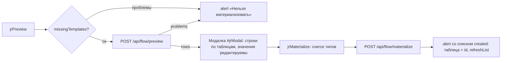

# Flow Builder (цепочки)

Раздел «Цепочки» (`<section id="sec-journeys">` в `index.html` + весь `src/main/resources/static/journeys.js`) — визуальный конструктор блок-схем по образцу Salesforce Flow Builder на библиотеке **Drawflow** (локальные `drawflow.min.js`/`.css`). Пользователь собирает цепочку коммуникаций из узлов, сохраняет её схему через `/api/journeys` (см. [[Цепочки (Journeys)]]) и «материализует» — превращает в реальные строки процессных таблиц через `/api/flow/preview|materialize` (см. [[Материализация (Flow)]]).

Раздел виден **только на среде test и только роли ADMIN**: пункт NAV `journeys` объявлен с `envs:["test"]` **и** `adminOnly:true` (см. [[Оболочка панели (shell)]] и [[Среды и деплой]]). Это не только UX: сервер не отдаёт раздел `journeys` в `GET /api/me` не-админам (фильтр в `AuthController.me()`), а `JourneyController` и `FlowController` целиком закрыты `@PreAuthorize("hasRole('ADMIN')")` на уровне класса — EDITOR с ACL-разделом `journeys` всё равно получит 403 (см. [[Безопасность и RBAC]]). Инициализация ленивая: `initJourneysSection()` вызывается при первом открытии раздела; если Drawflow не загрузился, на канве показывается сообщение об ошибке.

## Важно понимать: что реально исполняется

**Движка исполнения (runs/steps) в системе нет.** Узлы Pause, Decision, Assignment, Loop и вся группа Data — пока чисто визуальные: они сохраняются в схеме, но при материализации в процессные таблицы попадают только **стартовый узел + Communication Alert'ы** (включая развёрнутые Subflow). Задержки между шагами цепочки в проде задаются полем `sending_day` шаблонов, а не узлом Pause. Это подтверждается серверным кодом: `MaterializationService.expandedComms()` собирает только `comm`-ноды, `preview()` строит строки от стартового узла и comm'ов.

## Типы узлов (NODE_TYPES)

Реестр в начале `journeys.js`. У каждого типа: `label`, CSS-класс группы (`cls`), число входов/выходов (`ins`/`outs`, у стартовых `ins: 0`), подписи выходов (`outLabels`) и список полей. Виды полей (`kind`): `text`, `number`, `textarea`, `select` (со списком `opts`), `bool` (select да/нет), `template` (код шаблона + кнопка ⚙), `subflow` (выбор цепочки + кнопка ↗), `steps` (редактор массива SQL-шагов).

### Старт (группа start, фиолетовая)

**Income event** (`startIncome`) — онлайн-цепочка от входящего события:

| Поле | Вид | Смысл |
|---|---|---|
| `event_name` | text | Имя события |
| `system` | text | Система-источник |
| `notify_channel` | select | Канал уведомления (справочник, см. ниже) |
| `sub_channel` | text | Sub channel |
| `platform` | text | Платформа |
| `group_event_descr` | text | Группа событий |
| `send_delay` | number | Задержка отправки |
| `life_time` | number | Время жизни |
| `allow_ml` | bool (def `false`) | Разрешить ML |
| `definition_key` | select | Ключ процесса Camunda (справочник) |
| `business_key_prefix` | select | Префикс бизнес-ключа (справочник) |

**Time event** (`startTime`) — оффлайн-цепочка по расписанию:

| Поле | Вид | Смысл |
|---|---|---|
| `event_name` | text | Имя события |
| `system` | text | Система |
| `notify_channel` | select | Канал (справочник) |
| `crontab` | text | **Один текстовый crontab** (напр. `0 9 * * *`). Полей `time_start` / `period_unit` / `period_q` больше нет |
| `database` | select | База выборки: `crmdb` (default) \| `greenplum` |
| `process_name` | text | Имя процесса (**selection**) — одно поле, `process_name` = `selection` |
| `sql_steps` | steps | **Массив SQL-шагов выборки** (JSON-массив строк в `props.sql_steps`); шагов может быть много — каждый становится строкой `flow.d_event_step` и `scheduler.t_execution_steps` с `order_num` |
| `definition_key` | select | Справочник |
| `business_key_prefix` | select | Справочник |

### Действия

**Communication Alert** (`comm`, зелёная группа) — единственный «исполняемый» рабочий узел:

| Поле | Вид | Смысл |
|---|---|---|
| `channel` | select `sms`/`push`/`email`/`cc` | Тип коммуникации |
| `template` | template | Код шаблона из справочника канала; кнопка ⚙ открывает «Просмотр настроек» шаблона |
| `day` | number, **readonly** | «День» — автоподставляется из `sending_day` шаблона (`CRM.getTemplate`), руками не вводится |
| `note` | textarea | Что происходит |
| `active` | bool | Активен |

Поля **`title` у Communication Alert больше нет** — заголовок карточки формируется из канала/шаблона/дня.

**Subflow** (`subflow`, голубая): `journey` (выбор вложенной цепочки из списка, кнопка ↗ открывает её в этом же редакторе) + `note`. Модель — «autolaunched»: у вложенной цепочки **нет стартового узла**; сохранить её без старта можно, а материализовать отдельно нельзя (сервер вернёт problem «Нет стартового узла… материализуется она в составе родительской цепочки», `MaterializationService.validate()`). При материализации родителя subflow **разворачивается рекурсивно**: `expandedComms()`/`collectComms()` собирают comm-ноды вложенных цепочек; циклы и повторные включения одной и той же цепочки пропускаются молча (set `visited`); пустой subflow или не найденная цепочка → problem.

### Логика (визуальные, оранжевая группа)

- **Assignment**: `title`, `variable`, `value`, `note`;
- **Decision** (2 выхода «Да»/«Нет»): `title`, `sql` — SQL-условие (SELECT → Да/Нет);
- **Pause**: `title`, `duration` (дней), `until` (или до события);
- **Loop** (2 выхода «Для каждого»/«После последнего»): `title`, `collection`.

### Данные (визуальные, коралловая группа)

- **Create Records**: `title`, `object` (таблица/объект), `fieldsMap` (поле=значение);
- **Update Records**: + `filter` (условие отбора);
- **Get Records**: `title`, `object`, `filter`, `into` (в переменную);
- **Delete Records**: `title`, `object`, `filter`.

## Справочники значений в селектах

Списки — из прода (`journeys.js`, строки 17–22):

- `NOTIFY_CHANNELS` — **капсом**: `SMS`, `EMAIL`, `PUSH`, `CC`, `FA`, `VK`, `WA`, `WEBPUSH`, `ROBOT` (+ пустое значение);
- `DEFINITION_KEYS` — 6 значений: `smsChannelProcessV2`, `pushChannelProcessV2`, **`smsChannelProccessV2`** (да, с опечаткой «Proccess» — так реально в проде), `emailChannelProcessV2`, `vkChannelProcessV2`, `waChannelProcessV2`;
- `BUSINESS_KEY_PREFIXES` — 7 значений: `WaChannel`, `VkChannel`, `PushChannel`, `webPushChannel`, `pushChannel`, `emailChannel`, `smsChannel`;
- `DATABASES` — `crmdb` (default) | `greenplum`.

`source` события в справочники **не входит и руками не вводится**: сервер (`MaterializationService.resolveSource()`, `src/main/java/ru/banki/crm/service/flow/MaterializationService.java:412`) берёт его из шаблона **первой comm-ноды** (comm'ы сортируются по дню; у канала `cc` колонки `source` нет — `ChannelTable.hasSource()==false`, такие пропускаются) и подставляет в `t_get_event.source` и `flow.d_event.source`.

## Компактные карточки узлов

Узел на канве — компактный блок 230px: цветной заголовок + текстовая сводка (`nodeHtml`/`nodeSummary`), **без полей ввода**. Сводки: у стартов — имя события (+ cron и число SQL-шагов у Time event), у comm — `КАНАЛ · шаблон N · день D` плюс предупреждение `⚠ шаблона нет`, у subflow — `→ имя цепочки`, у decision — задан ли SQL, у pause — «Ждать N дн.» или «До события …», и т.д. У узлов с несколькими выходами внизу подписи (`выход 1 — Да · выход 2 — Нет`).

Цвета заголовка по группе: comm — зелёный, subflow — голубой, logic — янтарный, data — коралловый, start — фиолетовый. **Communication Alert дополнительно окрашивается по выбранному каналу** — классы `jrn-ch-sms` (зелёный), `jrn-ch-push` (янтарный), `jrn-ch-email` (голубой), `jrn-ch-cc` (фиолетовый); класс вешается в `nodeHtml()` и обновляется `updateNodeCard()` после правки настроек.

## Модалка настроек (двойной клик)

Настройки узла открываются **двойным кликом** по блоку → `openNodeEditor(dfId)`: модалка `#jrEdit` с заголовком «Настройки: <тип>», тело строится `editFieldEl(f, data)` по полям типа:

- обычные поля — `editControl()` (input/number/textarea/select/bool-select); поля с `ro: true` (день у comm) — disabled с подсказкой «Подставляется автоматически»;
- `template` — input + кнопка ⚙ (`jrOpenTemplate`): проверяет канал+код, при отсутствии шаблона — alert, при наличии — закрывает модалку и открывает карточку «Просмотр настроек» этого шаблона (`openSection('admin')` + `viewFromList(id)`; оболочка сама преобразует старый плоский id в `comms/admin`, а `viewFromList` переключает на подраздел `viewer` — см. [[Оболочка панели (shell)]]);
- `subflow` — select из `listCache` (кэш списка цепочек) + кнопка ↗ (`jrOpenSubflow`): открывает выбранную цепочку в этом же редакторе (защита от «эта цепочка уже открыта»);
- `steps` — редактор SQL-шагов: number-input «сколько шагов» + textarea на каждый шаг («Шаг N — SQL»); изменение счётчика пересобирает список, сохраняя введённое; при применении пустые шаги отбрасываются, массив сериализуется `JSON.stringify` в `props.sql_steps`.

Кнопка «Применить» (`jrEditApply`) переносит значения из модалки в `data` узла (`editor.updateNodeDataFromId`) и перерисовывает карточку. Для READER'а кнопка скрыта, все контролы disabled.

### Автодень и гейт по шаблону (wireCommAutofill)

Для comm-узла в модалке работает связка канал+код → шаблон:

- `checkTemplate(channel, code)` — `CRM.getTemplate()` с кэшем `tplCache` (`"sms:1" → dto | false`);
- при вводе кода / смене канала (`change` + `input`) поле «День» автозаполняется `dto.sendingDay` (пусто → `0`); есть защита от гонки — результат применяется только если ввод не поменялся;
- если шаблона нет — красное предупреждение «⚠ Такого шаблона нет. Заведи его в „Мастере коммуникаций" — без шаблона цепочку не сохранить», день сбрасывается в 0;
- `missingTemplates(j)` собирает список проблем по всем comm-узлам (не указан канал/код; шаблон не найден) и **блокирует и сохранение (`jrSave`), и предпросмотр (`jrPreview`)** — клиентский гейт. Серверный дубль-гейт: `MaterializationService.validate()` → `templateExists()` (count по канальной таблице).

## Тулбар и тип цепочки

Тулбар: `#jrSelect` (выбор цепочки; offline помечены `[off]`, в скобках число узлов), `#jrName` (название), `#jrKind` — тип **online** (от входящего события) / **offline** (по расписанию, ретеншен), `#jrContinues` — для offline-цепочки метка «продолжением какой online-цепочки является» (заполняется online-цепочками из `listCache`, чисто информационная связь `continuesJourneyId`), кнопки «Новая / Сохранить / Предпросмотр / Удалить» и подсказка по управлению.

Серверная валидация связывает тип со стартом: online-цепочка должна начинаться с Income event, offline — с Time event; стартовый узел должен быть один; у старта обязателен `event_name`, у Time event — хотя бы один SQL-шаг (`MaterializationService.validate()`).

## Сериализация схемы

- `collectJourney()` — экспорт Drawflow → DTO: узлы `{id (jid), type, day, channel, templateCode, title, note, active, posX, posY, props}` + рёбра `{from, to, fromPort}`. Поля из `CORE_KEYS` (`channel`, `day`, `template`, `title`, `note`, `active`) идут первым классом DTO, остальные — в `props` (строками, пустые не пишутся).
- `renderJourney(j)` — обратная загрузка: маппинг jid → drawflow-id, восстановление рёбер (битые пропускаются), выставление kind/continues.
- **Миграции старых схем** в `addNodeAt()`: у Time event одиночное поле `sql` → массив `sql_steps`, `selection` → `process_name`; `notify_channel`, сохранённый в нижнем регистре, переводится в капс под новый справочник.

## Предпросмотр и материализация

- `jrPreview` требует название и непустую схему, прогоняет клиентский гейт `missingTemplates`, затем `CRM.flowPreview(journey)`. Ответ: `problems` (список причин отказа) либо `rows` — планируемые инсерты по таблицам слоя B (см. [[Слой B (процессные таблицы)]]).
- `renderModal(rows)` рисует секции «→ имя таблицы» с сеткой колонка/значение; значения можно править прямо в модалке; `"(auto)"` — disabled (id подставится автоматически).
- `coerce(orig, str)` восстанавливает тип правки по исходному значению (boolean/number/int/null/строка).
- `jrMaterialize` собирает правки обратно в `previewRows`, шлёт `CRM.flowMaterialize(journey, rows)`; ответ содержит `journeyId` (схема сохраняется вместе с материализацией) и список `created` (таблица + id) — показывается alert'ом, список цепочек обновляется.

Сервер при этом: идемпотентность через журнал `flow.t_materialization`, лог каждой вставки в `arch.t_admin_log`, синк единого справочника `template.d_template` (ядро в типизированные колонки + канальные поля в `channel_props jsonb`) — подробно в [[Материализация (Flow)]] и [[Аудит и журналирование]].

## Мультивыделение нод (wireMultiSelect)

Работать можно сразу с группой узлов (выделенные подсвечены янтарной пунктирной рамкой, класс `jr-msel`):

- **Ctrl/Cmd+клик** по ноде — добавить/убрать из выделения; клик по пустой канве без модификаторов сбрасывает его;
- **Shift+рамка** по пустому месту — выделение областью (`#jrBand`; событие перехватывается в capture-фазе, чтобы Drawflow не начал панорамирование);
- **групповое перемещение**: перетаскивание любой выделенной ноды двигает всю группу — «схваченный» узел ведёт Drawflow, остальным даётся то же смещение с учётом зума, финальные координаты пишутся в данные Drawflow (`pos_x`/`pos_y`), чтобы сохраниться в схеме;
- **Delete** — удалить всю группу (срабатывает, только когда фокус не в поле ввода);
- всё мультивыделение доступно только редакторам (`canEdit()`), удалённые ноды выбывают из выделения по событию `nodeRemoved`.

## UX канвы (wireCanvasUx)

- **Стрелка «в никуда»**: события Drawflow `connectionStart`/`connectionCancel` — если пользователь потянул связь и бросил её в пустоту, у точки обрыва открывается меню `#jrPick` «Добавить и соединить» (все типы узлов, кроме стартовых); `jrPickNode(type)` создаёт узел в точке обрыва (с учётом зума/скролла канвы) и сразу соединяет его с источником. Первые 250 мс клики игнорируются (это mouseup от броска стрелки), клик мимо меню закрывает его.
- **Подсветка точек коннекта**: input/output-точки узлов при наведении (в т.ч. когда тянешь стрелку) подсвечиваются **зелёным** с ореолом — CSS `#jrCanvas .drawflow .drawflow-node .input:hover / .output:hover` в `index.html`.
- **Удаление связи**: клик по линии (`connectionSelected`) показывает рядом с курсором круглую красную кнопку ✕ (`#jrConnDel`); `jrConnDelete()` вызывает `editor.removeSingleConnection(...)`. Кнопка прячется при снятии выделения, удалении связи, панорамировании и зуме.
- **Точка излома**: двойной клик по связи ставит reroute-точку (штатный механизм Drawflow, включён `editor.reroute = true`).
- Также работают штатные средства Drawflow: перетаскивание узлов, Delete для выделенного узла/связи, зум/панорамирование.

## Readonly для READER

`canEdit()` = `CRM.me.canEdit` (EDITOR/ADMIN). Для READER: `applyReadonly()` ставит `editor.editor_mode = "fixed"` (канву можно двигать/смотреть, редактировать нельзя), CSS по `body[data-readonly]` прячет тулбокс и кнопки «Новая/Сохранить/Удалить», модалка настроек открывается только на чтение (без «Применить»), `jrAddNode`/`jrPickNode`/`jrMaterialize` защищены проверкой `canEdit()`. С переводом раздела в admin-only этот режим стал в основном подстраховкой: не-админ раздел «Цепочки» больше не видит вовсе.

## Связанные заметки

- [[Цепочки (Journeys)]] — серверное хранение схем (`/api/journeys`, JourneyService)
- [[Материализация (Flow)]] — validate/preview/materialize, resolveSource, разворачивание Subflow на сервере
- [[Слой A (flow)]] и [[Слой B (процессные таблицы)]] — куда пишет материализация
- [[Справочники шаблонов]] — канальные таблицы, по которым проверяется `templateExists`
- [[Мастер коммуникаций (формы)]] — где заводятся шаблоны для comm-узлов
- [[Обзор фронтенда]] и [[Оболочка панели (shell)]] — навигация, api.js, ограничение раздела (test + ADMIN)
- [[Безопасность и RBAC]] — почему «Цепочки» теперь только для ADMIN
