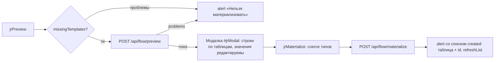

# Flow Builder (цепочки)

Раздел «Цепочки» — визуальный конструктор блок-схем по образцу Salesforce Flow Builder на библиотеке **Drawflow** (локальные `drawflow.min.js` / `drawflow.min.css`, без CDN). Разметка — `<section id="sec-journeys">` в `index.html`, вся логика — `src/main/resources/static/journeys.js`.

Пользователь собирает цепочку из узлов, сохраняет схему через `/api/journeys` (см. [Цепочки (Journeys)](../Backend/Цепочки%20(Journeys).md)) и «материализует» её — превращает в строки процессных таблиц через `/api/flow/preview` и `/api/flow/materialize` (см. [Материализация (Flow)](../Backend/Материализация%20(Flow).md)).

- Пункт NAV объявлен как `{ id:"journeys", … , adminOnly:true }` — **только роль ADMIN**. Ограничения по среде **больше нет**: раздел доступен на всех средах (в комментарии `js/shell.js` это оговорено явно). Серверные гейты — в [Безопасность и RBAC](../Architecture/Безопасность%20и%20RBAC.md).
- Инициализация ленивая: `initJourneysSection()` вызывается оболочкой при первом открытии раздела ([Оболочка панели (shell)](Оболочка%20панели%20(shell).md)). Если `Drawflow` не загрузился, на канве выводится сообщение «Drawflow не загрузился».
- `editor.reroute = true` (`journeys.js:1033`) — двойной клик по связи ставит точку излома.

## Что реально исполняется

**Движка исполнения (runs/steps) в системе нет.** Узлы Pause, Decision, Assignment, Loop и вся группа Data — визуальные: они сохраняются в схеме, но при материализации в процессные таблицы попадают только стартовый узел и Communication Alert'ы (включая развёрнутые Subflow). Задержки между шагами задаются полем `sending_day` шаблона, а не узлом Pause. Как это устроено на сервере — [Материализация (Flow)](../Backend/Материализация%20(Flow).md).

## Типы узлов (NODE_TYPES)

Реестр `NODE_TYPES` — `journeys.js:23`. У типа: `label`, класс группы (`cls`), число входов/выходов (`ins`/`outs`, у стартовых `ins: 0`), подписи выходов (`outLabels`) и список полей. Виды полей (`kind`): `text`, `number`, `textarea`, `select` (список `opts`), `bool` (select да/нет с `def`), `template` (код шаблона + кнопка ⚙), `subflow` (выбор цепочки + кнопка ↗), `steps` (редактор SQL-шагов).

### Старт (группа `start`, фиолетовая)

**Income event** (`startIncome`) — онлайн-цепочка от входящего события:

| Поле | Вид | Подпись в модалке |
|---|---|---|
| `event_name` | text | Имя события |
| `system` | text | Система |
| `notify_channel` | select | Канал (notify) |
| `sub_channel` | text | Sub channel |
| `platform` | text | Платформа |
| `group_event_descr` | text | Группа событий |
| `send_delay` | number | Задержка (send_delay) |
| `life_time` | number | Life time |
| `allow_ml` | bool, def `false` | Allow ML |
| `definition_key` | select | Definition key |
| `business_key_prefix` | select | Business key prefix |
| `is_active` | bool, def `true` | **Событие активно** |

**Time event** (`startTime`) — оффлайн-цепочка по расписанию:

| Поле | Вид | Подпись в модалке |
|---|---|---|
| `event_name` | text | Имя события |
| `system` | text | Система |
| `notify_channel` | select | Канал (notify) |
| `is_batch` | bool, def `true` | **Массовый метод отправки** |
| `crontab` | text | Crontab (текстом, напр. `0 9 * * *`) |
| `database` | select `crmdb` (def) / `greenplum` | База выборки |
| `process_name` | text | Имя процесса (selection) |
| `sql_steps` | steps | SQL-шаги выборки |
| `definition_key` | select | Definition key |
| `business_key_prefix` | select | Business key prefix |
| `is_active` | bool, def `true` | **Событие активно** |

`is_active` (оба старта) и `is_batch` (Time event) — управляемые поля (`journeys.js:39`, `journeys.js:50`). Раньше в прод всегда уезжали `true` и `true`, то есть выключить событие или отправить его единичным методом можно было только правкой в базе.

### Действия

**Communication Alert** (`comm`, зелёная) — единственный «исполняемый» узел: `channel` (select `sms`/`push`/`email`/`cc`), `template` (код шаблона, кнопка ⚙), `day` (number, **readonly** — подставляется из `sendingDay` шаблона), `note` (textarea), `active` (bool). Поля `title` у этого типа нет — заголовок карточки собирается из канала, шаблона и дня.

**Subflow** (`subflow`, голубая): `journey` (выбор вложенной цепочки, кнопка ↗) + `note`. Модель «autolaunched»: у вложенной цепочки нет стартового узла, сохранить её без старта можно, а материализовать отдельно — нет; она разворачивается в составе родительской (см. [Материализация (Flow)](../Backend/Материализация%20(Flow).md)).

### Логика (визуальные, янтарная группа `logic`)

- **Assignment**: `title`, `variable`, `value`, `note`;
- **Decision** (2 выхода «Да» / «Нет»): `title`, `sql` — SQL-условие (SELECT → Да/Нет);
- **Pause**: `title`, `duration` (Ждать, дней), `until` (Или до события);
- **Loop** (2 выхода «Для каждого» / «После последнего»): `title`, `collection`.

### Данные (визуальные, коралловая группа `data`)

- **Create Records**: `title`, `object` (Таблица / объект), `fieldsMap` (поля вида `поле=значение`);
- **Update Records**: то же + `filter` (условие отбора);
- **Get Records**: `title`, `object`, `filter`, `into` (в переменную);
- **Delete Records**: `title`, `object`, `filter`.

## Справочники значений в селектах

Списки зашиты в начале файла (`journeys.js:17`–`journeys.js:22`), значения — из прода:

- `NOTIFY_CHANNELS` — **капсом**: `SMS`, `EMAIL`, `PUSH`, `CC`, `FA`, `VK`, `WA`, `WEBPUSH`, `ROBOT` (плюс пустое значение);
- `DEFINITION_KEYS` — `smsChannelProcessV2`, `pushChannelProcessV2`, **`smsChannelProccessV2`** (да, с опечаткой «Proccess» — так в проде), `emailChannelProcessV2`, `vkChannelProcessV2`, `waChannelProcessV2`;
- `BUSINESS_KEY_PREFIXES` — `WaChannel`, `VkChannel`, `PushChannel`, `webPushChannel`, `pushChannel`, `emailChannel`, `smsChannel`;
- `DATABASES` — `crmdb` (по умолчанию) / `greenplum`.

`source` события в справочники не входит и руками не задаётся: его определяет сервер по шаблону первой comm-ноды (см. [Материализация (Flow)](../Backend/Материализация%20(Flow).md)).

## Компактные карточки узлов

Узел на канве — компактный блок: цветной заголовок плюс текстовая сводка (`nodeHtml` — `journeys.js:242`, `nodeSummary` — `journeys.js:205`), без полей ввода. Поля ввода на канве не помещались бы: у Time event их одиннадцать. Сводки: у стартов — имя события (у Time event плюс `cron:` и «SQL-шагов: N», считаются только непустые шаги); у comm — `КАНАЛ · шаблон N · день D` и предупреждение `⚠ шаблона нет`; у subflow — `→ имя цепочки`; у decision — «SQL задан / SQL не задан»; у pause — «Ждать N дн.» либо «До события …»; у assignment — `переменная = значение`; у loop — «По <коллекция>». У узлов с несколькими выходами внизу подписи `выход 1 — Да · выход 2 — Нет`.

Цвет заголовка — по группе (`start` фиолетовый, `comm` зелёный, `subflow` голубой, `logic` янтарный, `data` коралловый). **Communication Alert дополнительно окрашивается по каналу**: классы `jrn-ch-sms`, `jrn-ch-push`, `jrn-ch-email`, `jrn-ch-cc`; класс ставится в `nodeHtml()` и обновляется `updateNodeCard()` после правки настроек.

## Модалка настроек (двойной клик)

Двойной клик по блоку → `openNodeEditor(dfId)` (`journeys.js:772`): модалка `#jrEdit`, заголовок «Настройки: <тип>», тело строится `editFieldEl(f, data)` по полям типа:

- обычные поля — `editControl()` (input / number / textarea / select / bool-select «да/нет»); поля с `ro: true` (день у comm) — `disabled` с подсказкой «Подставляется автоматически»;
- `template` — input + кнопка ⚙ (`jrOpenTemplate`): проверяет канал и код запросом `CRM.getTemplate`, при отсутствии — alert, при наличии закрывает модалку и открывает шаблон в «Просмотре настроек» (`openSection('admin')` + `viewFromList(id)`; оболочка сама разворачивает плоский id в `comms/admin`, а `viewFromList` переключает на подраздел `viewer` — см. [Мастер коммуникаций (формы)](Мастер%20коммуникаций%20(формы).md));
- `subflow` — select из `listCache` + кнопка ↗ (`jrOpenSubflow`): открывает выбранную цепочку в этом же редакторе (с защитой «Эта цепочка уже открыта»);
- `steps` — редактор SQL-шагов (см. ниже).

Кнопка «Применить» (`jrEditApply`) переносит значения в `data` узла (`editor.updateNodeDataFromId`) и перерисовывает карточку. Для не-редактора кнопка скрыта, все контролы `disabled`.

### Редактор SQL-шагов (kind `steps`)

Number-input «сколько SQL-шагов выборки у события» + на каждый шаг заголовок «Шаг N — SQL», **чекбокс «активен»** и textarea. Изменение счётчика пересобирает список, сохраняя введённое. При «Применить» пустые шаги отбрасываются, остальное сериализуется в `props.sql_steps`.

**Формат `sql_steps`** — JSON-массив объектов `[{ sql, active }]`. Исторический формат (массив строк) читается по-прежнему: `parseSteps()` (`journeys.js:158`) трактует строку как активный шаг. Активность шага уезжает в `scheduler.t_execution_steps.is_active` (см. [Слой B (процессные таблицы)](../Database/Слой%20B%20(процессные%20таблицы).md)).

### Автодень и гейт по шаблону (wireCommAutofill)

Для comm-узла в модалке работает связка канал + код → шаблон (`wireCommAutofill`, `journeys.js:792`):

- `checkTemplate(channel, code)` (`journeys.js:173`) — `CRM.getTemplate()` с кэшем `tplCache` (`"sms:1" → dto | false`): один и тот же код проверяется при каждом нажатии клавиши, и без кэша это был бы запрос на символ;
- при вводе кода или смене канала (`change` + `input`) поле «День» автозаполняется `dto.sendingDay` (пусто → `0`); есть защита от гонки — результат применяется, только если ввод не изменился;
- шаблона нет → красное предупреждение «⚠ Такого шаблона нет. Заведи его в „Мастере коммуникаций" — без шаблона цепочку не сохранить», день сбрасывается в `0`;
- `missingTemplates(j)` (`journeys.js:189`) собирает проблемы по всем comm-узлам (не указан канал/код; шаблон не найден) и **блокирует и сохранение (`jrSave`), и предпросмотр (`jrPreview`)**. Серверный дубль-гейт описан в [Материализация (Flow)](../Backend/Материализация%20(Flow).md).

## Тулбар, тулбокс и тип цепочки

Тулбар: `#jrSelect` (выбор цепочки; offline помечены `[off]`, в скобках число узлов), `#jrName` (название), `#jrKind` — **online** (от входящего события) / **offline** (по расписанию, ретеншен), `#jrContinues` (виден только для offline) — метка «продолжением какой online-цепочки является», чисто информационная связь `continuesJourneyId`; кнопки «Новая / Сохранить / Предпросмотр / Удалить» и строка подсказки по управлению.

Тулбокс слева сгруппирован: **Старт** (Income event, Time event) · **Действия** (Communication Alert, Subflow) · **Логика** (Assignment, Decision, Pause, Loop) · **Данные** (Create/Update/Get/Delete Records).

Требования «тип цепочки ↔ стартовый узел» проверяет сервер — см. [Материализация (Flow)](../Backend/Материализация%20(Flow).md).

## Сериализация схемы

- `collectJourney()` (`journeys.js:546`) — экспорт Drawflow → DTO: узлы `{id (jid), type, day, channel, templateCode, title, note, active, posX, posY, props}` + рёбра `{from, to, fromPort}`. Поля из `CORE_KEYS` (`channel`, `day`, `template`, `title`, `note`, `active`) идут первым классом DTO, остальные — в `props` строками (пустые не пишутся). В корне ещё `name`, `kind`, `continuesJourneyId`.
- `renderJourney(j)` (`journeys.js:515`) — обратная загрузка: маппинг `jid` → drawflow-id, восстановление рёбер (битые пропускаются), выставление `kind` и `continues`.
- **Миграции старых схем** в `addNodeAt()` (`journeys.js:263`): у Time event одиночное поле `sql` → массив `sql_steps`, `selection` → `process_name`; `notify_channel`, сохранённый в нижнем регистре, переводится в капс под новый справочник.

## Предпросмотр и материализация

- `jrPreview` требует название и непустую схему, прогоняет клиентский гейт `missingTemplates`, затем `CRM.flowPreview(journey)`. Ответ — либо `problems` (список причин отказа, показывается alert'ом), либо `rows` — планируемые вставки по таблицам (см. [Слой B (процессные таблицы)](../Database/Слой%20B%20(процессные%20таблицы).md)).
- `renderModal(rows)` (`journeys.js:918`) рисует секции «→ имя таблицы» сеткой «колонка / значение»; значения правятся прямо в модалке, `"(auto)"` — disabled (id подставится автоматически).
- `coerce(orig, str)` (`journeys.js:951`) восстанавливает тип правки по исходному значению (boolean / number / int / null / строка).
- `jrMaterialize` собирает правки обратно в `previewRows` и шлёт `CRM.flowMaterialize(journey, rows)`; ответ содержит `journeyId` (схема сохраняется вместе с материализацией) и список `created` (таблица + id) — показывается alert'ом, список цепочек обновляется.

## Мультивыделение нод (wireMultiSelect, `journeys.js:314`)

Выделенные узлы подсвечены классом `jr-msel`:

- **Ctrl/Cmd + клик** по ноде — добавить/убрать из выделения; клик по пустой канве без модификаторов сбрасывает выделение;
- **Shift + рамка** по пустому месту — выделение областью (`#jrBand`; событие перехватывается в capture-фазе, иначе Drawflow начнёт панорамировать канву);
- **групповое перемещение**: перетаскивание любой выделенной ноды двигает всю группу — «схваченный» узел ведёт Drawflow, остальным даётся то же смещение с поправкой на зум; финальные координаты пишутся в данные Drawflow (`pos_x` / `pos_y`), чтобы попасть в схему;
- **Delete** — удалить всю группу (только когда фокус не в поле ввода);
- всё доступно только редакторам (`canEdit()`); удалённые ноды выбывают из выделения по событию `nodeRemoved`.

## UX канвы (wireCanvasUx, `journeys.js:475`)

- **Стрелка «в никуда»**: по событиям `connectionStart` / `connectionCancel` — если связь бросили в пустоту, у точки обрыва открывается меню `#jrPick` «Добавить и соединить» (все типы, кроме стартовых); `jrPickNode(type)` создаёт узел в точке обрыва (с учётом зума и смещения канвы) и сразу соединяет его с источником. Первые 250 мс клики игнорируются — это mouseup от броска стрелки.
- **Удаление связи**: клик по линии (`connectionSelected`) показывает рядом с курсором красную кнопку ✕ (`#jrConnDel`); `jrConnDelete()` вызывает `editor.removeSingleConnection(...)`. Кнопка прячется при снятии выделения, удалении связи, панорамировании и зуме (`connectionUnselected`, `connectionRemoved`, `translate`, `zoom`).
- **Точка излома**: двойной клик по связи (штатный reroute Drawflow).
- Штатные средства Drawflow тоже работают: перетаскивание узлов, Delete для выделенного узла/связи, зум и панорамирование.

## Режим только для чтения

`canEdit()` (`journeys.js:146`) = `CRM.me.canEdit`. Для не-редактора `applyReadonly()` ставит `editor.editor_mode = "fixed"` (канву можно двигать и смотреть, редактировать нельзя), CSS по `body[data-readonly]` прячет тулбокс и кнопки «Новая / Сохранить / Удалить» (`css/shell.css`), модалка настроек открывается без «Применить», а `jrAddNode` / `jrPickNode` / `jrMaterialize` / `jrSave` / `jrDelete` защищены проверкой `canEdit()`. Поскольку раздел admin-only, это в основном подстраховка.

## Связанные заметки

- [Цепочки (Journeys)](../Backend/Цепочки%20(Journeys).md) — серверное хранение схем (`/api/journeys`)
- [Материализация (Flow)](../Backend/Материализация%20(Flow).md) — validate / preview / materialize, resolveSource, разворачивание Subflow
- [Слой A (flow)](../Database/Слой%20A%20(flow).md) и [Слой B (процессные таблицы)](../Database/Слой%20B%20(процессные%20таблицы).md) — куда пишет материализация
- [Справочники шаблонов](../Database/Справочники%20шаблонов.md) — канальные таблицы, по которым проверяется наличие шаблона
- [Мастер коммуникаций (формы)](Мастер%20коммуникаций%20(формы).md) — где заводятся шаблоны для comm-узлов
- [Обзор фронтенда](Обзор%20фронтенда.md) — состав статики и слой `api.js`
- [Оболочка панели (shell)](Оболочка%20панели%20(shell).md) — навигация, ленивая инициализация раздела, ACL-контракт
- [Безопасность и RBAC](../Architecture/Безопасность%20и%20RBAC.md) — почему «Цепочки» доступны только ADMIN
