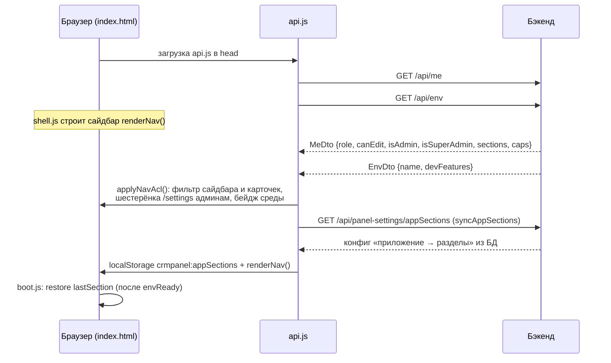

# Клиент API (api.js)

`src/main/resources/static/api.js` — единственный слой доступа к REST в SPA. Он же делает бутстрап приложения (`/api/me` и `/api/env`), фильтрует навигацию по правам и конвертирует «рыхлые» объекты форм в DTO бэкенда.

Подключается в `<head>` **до всех скриптов разделов** (`index.html:14`): они рассчитывают, что глобальный `window.CRM` уже существует.

Полные контракты эндпоинтов — в [REST API](../API/REST%20API.md); здесь только клиентская сторона.

## req(method, url, body)

Единственная транспортная функция (`api.js:8`). Все запросы разделов обязаны идти через неё — иначе теряются обработка 401 и разбор ошибок.

- `credentials: "same-origin"` — сессионная кука ходит сама, токенов в JS нет;
- тело сериализуется в JSON только если оно передано;
- **401** → редирект на `login.html` (кроме случая, когда мы уже на ней) и `throw` (`api.js:19`): истёкшая сессия в любом месте приложения приводит на форму входа, а не в тихую ошибку;
- не-OK ответ → из тела достаётся `message`, если это JSON, иначе текст или статус — и бросается `Error` с человеческим текстом (`api.js:26`);
- **204** → `null`; дальше разбор по `Content-Type`: JSON парсится, остальное возвращается текстом.

`buildQuery(filters)` (`api.js:63`) собирает query-строку и **разворачивает массив в несколько одноимённых параметров** (`channel=sms&channel=email`) — бэкенд трактует их как ИЛИ внутри одного фильтра.

## Бутстрап: /api/me и /api/env

- `CRM.meReady` (`api.js:322`) кладёт ответ в `CRM.me` и `window.CRM_ME`, ставит на `<body>` атрибут `data-role`.
- `CRM.envReady` (`api.js:329`) — `{name, devFeatures}`; при ошибке отдаёт `null`, чтобы бутстрап не встал.
- `applyNavAcl()` запускается на `DOMContentLoaded` после `Promise.all([meReady, envReady])` (`api.js:410`) и затем **после каждой перерисовки сайдбара** — ради этого `window.applyNavAcl` и экспортирован (`api.js:407`).
- `syncAppSections()` (`api.js:337`) тянет конфиг «приложение → разделы» из БД, сравнивает с `crmpanel:appSections`, при расхождении пишет и перерисовывает сайдбар. Ошибка или отсутствие доступа обрабатываются молча: панель остаётся на локальном значении, а не ломается.

## applyNavAcl: контракт data-атрибутов

`renderNav()` рисует, `applyNavAcl()` фильтрует (`api.js:349`). Договор держится на data-атрибутах `.nav-item`:

| Атрибут | Кто ставит | Что делает applyNavAcl |
|---|---|---|
| `data-envs` | пункты с `envs:[...]` — сейчас таких нет | **удаляет** пункт, если имя среды не входит в список |
| `data-admin-only` | `adminOnly:true` («Цепочки», «Сущности» без доступных сущностей) | **удаляет** пункт для не-админов |
| `data-group` + `data-children` | группы сайдбара | id группы — не раздел; группа скрывается, когда скрыты **все** её ACL-дети |
| `data-no-acl` | разделы без серверной секции (дети «Загруженных инструментов», сущности) и группы с таким ребёнком | пункт не фильтруется по `me.sections`; группа с no-acl ребёнком видима всегда |
| `data-acl-section` | «Просмотр настроек» (`viewer` → `admin`), «Шаблоны и сегменты» (→ `templates`) | пункт следует правам **другого** раздела |
| `data-nav-ref` | карточки обзорных страниц | скрываются синхронно с правами соответствующего пункта |

Разница между `remove()` и `display:none` содержательная: `envs` и `adminOnly` **выносят узел из DOM**, а фильтрация по секциям только прячет. Удалённого пункта нет и в подсчёте видимости группы.

Кроме фильтрации `applyNavAcl` подписывает `#userEmail` (текст — почта, тултип — «имя · почта (роль)»), ставит на `<body>` `data-role` и, для не-редакторов, `data-readonly="1"`, показывает шестерёнку `/settings` админам и, если активный пункт оказался скрыт, открывает первый видимый (`api.js:398`).

Для динамически строящихся списков — flyout и «Быстрые ссылки» на Главной — те же правила продублированы в оболочке функцией `aclAllows` (`js/shell.js:698`): там нет DOM с атрибутами, а решение нужно то же самое.

## Права и роль

- `CRM.can(cap, ...sections)` (`api.js:308`): `false` без `CRM.me`, `true` для админа, иначе `me.caps[section][cap]` — достаточно права **хотя бы в одном** из перечисленных разделов. Клиентское зеркало серверного `AccessGuard`.
- `CRM.displayRole(role)` (`api.js:301`): `SUPER_ADMIN` наружу показывается как `ADMIN`. Реальные полномочия проверяются по флагу `isSuperAdmin` и на сервере.

Всё это только UX — сервер проверяет права на каждом запросе, см. [Безопасность и RBAC](../Architecture/Безопасность%20и%20RBAC.md).

## Маппинги v1 ↔ DTO

Формы и карточки оперируют snake_case-объектами (наследство v1), бэкенд — `TemplateDto` в camelCase. Вся конвертация собрана здесь, чтобы разделы её не дублировали.

- **`apiItemToList(t)`** (`api.js:40`) — элемент `GET /api/templates` → строка таблицы: `id = channel + ":" + code`, имя из `communicationName || letterosId`, первый элемент `productType` как `product`. Отдельно вычисляется `is_la` — но канал при этом **не подменяется**: Live Activity показывается бейджем Push, а признак LA живёт своей колонкой (`api.js:45`).
- **`v1ToDto(d)`** (`api.js:100`) — объект карточки → DTO: ядро плюс канальные блоки FA, VK и Live Activity. Флаги проходят через `bool()`, сохраняющий `null` (в БД «не задано» и «нет» — разные вещи). Строки чистятся `trimEdges` (`api.js:93`), который снимает по краям в том числе неразрывный пробел и BOM: их приносит копипаст из Excel и почты, и они молча ломали поиск по точному совпадению.
- **`dtoToV1(t)`** (`api.js:168`) — обратный маппинг: пустые значения превращаются в `""`, `letteros_id` при отсутствии берётся из кода, для канала `cc` поле `segment` заполняется из `code`.
- **`saveFromV1(d)`** (`api.js:286`) — решает create или update по контексту `window.CRM_CURRENT`: если канал и код совпадают — `PUT`, иначе `POST`.

## Каталог CRM.*

| Метод | HTTP | Назначение |
|---|---|---|
| `fetchMe()` / `fetchEnv()` | GET `/api/me`, `/api/env` | Идентичность и среда |
| `listTemplates(filters)` | GET `/api/templates` | Страница списка (фильтры, `q`, `sort`, `dir`, `limit`, `offset`) |
| `countTemplates(filters)` | GET `/api/templates/count` | Всего и активных под фильтр |
| `facetsTemplates()` | GET `/api/templates/facets` | Значения для фильтров |
| `getTemplate(ch, code)` | GET `/api/templates/{ch}/{code}` | Полный шаблон |
| `createTemplate` / `updateTemplate` / `deleteTemplate` | POST/PUT/DELETE `/api/templates/**` | CRUD шаблона |
| `createChain(ch, base, days)` | POST `/api/templates/{ch}/chain` | Серия шаблонов-цепочки |
| `dictPartners()` / `dictAddPartner(name)` | GET/POST `/api/dictionaries/partners` | Справочник партнёров и его пополнение |
| `dictCcSegments()` / `dictCommNames(ch)` / `dictTouchPoints()` / `dictProductTypes()` | GET `/api/dictionaries/…` | Остальные справочники карточки |
| `flowPreview(j)` / `flowMaterialize(j, rows)` | POST `/api/flow/…` | Предпросмотр и материализация цепочки |
| `journeysList` / `journeyGet` / `journeyCreate` / `journeyUpdate` / `journeyDelete` | `/api/journeys` | CRUD схем цепочек |
| `adminSections()` | GET `/api/admin/sections` | Каталог разделов для матрицы прав |
| `adminListUsers` / `adminCreateUser` / `adminUpdateUser` / `adminDeleteUser` / `adminResetPassword` | `/api/admin/users` | Пользователи |
| `changeOwnPassword(cur, next)` | PUT `/api/me/password` | Смена своего пароля |
| `logout()` | POST `/logout` | Выход и переход на `login.html` |
| `can` / `displayRole` / `apiItemToList` / `v1ToDto` / `dtoToV1` / `saveFromV1` | — | Клиентские хелперы |

Чего в каталоге **нет** и почему:

- методов ролей (`adminRoles` и родственные) — они объявлены отдельным мини-`CRM` прямо в `settings/index.html` ([Страница настроек (settings)](Страница%20настроек%20(settings).md));
- настроек панели — их зовут `syncAppSections()` и страница настроек напрямую;
- подключений отчётов, промо, А/Б тестов, «ЧЕК СМС траффик», схемы сущностей — у каждого свои `fetch` в своём файле. Разделы, живущие на одном-двух эндпоинтах, не выиграли бы от общего каталога, а `api.js` разрастался бы.

## Смежное

- [REST API](../API/REST%20API.md) — серверные контракты всех методов
- [Оболочка панели (shell)](Оболочка%20панели%20(shell).md) — `renderNav`, `aclAllows`, что происходит после `applyNavAcl`
- [Безопасность и RBAC](../Architecture/Безопасность%20и%20RBAC.md) — серверная модель прав
- [Обзор фронтенда](Обзор%20фронтенда.md) — порядок загрузки скриптов
- [Мастер коммуникаций (формы)](Мастер%20коммуникаций%20(формы).md) — где используются маппинги
