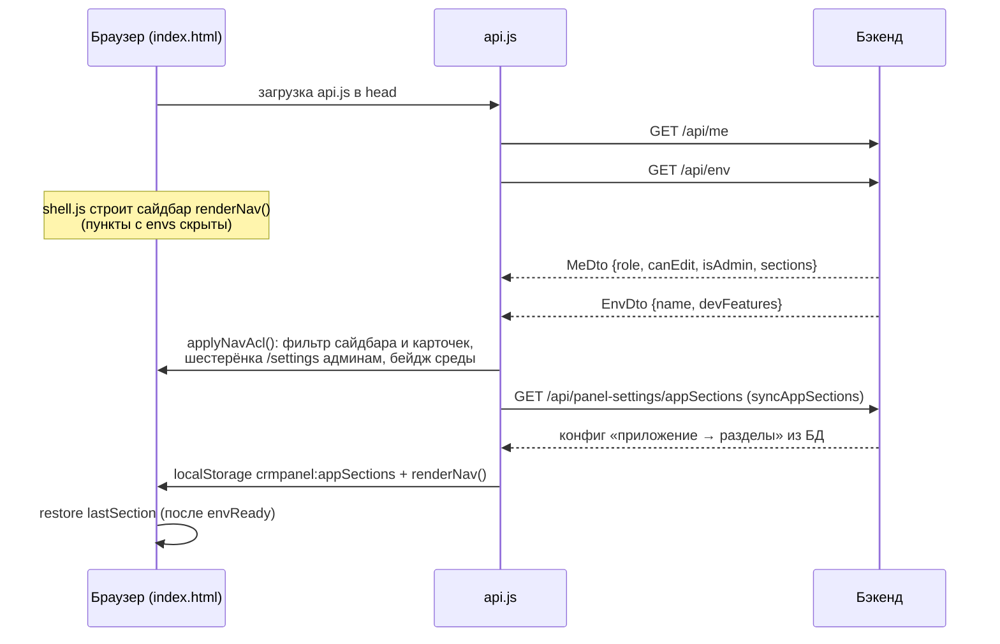

# Обзор фронтенда

Фронтенд crm-admin — это **одностраничное приложение без сборки**: `index.html` с разметкой плюс подключаемые файлы стилей и скриптов на чистом (vanilla) JavaScript. Никаких фреймворков, бандлеров и npm — файлы лежат в `src/main/resources/static/` и раздаются Spring Boot как статика. После большого обновления фронт объединён с оболочкой в стиле **Salesforce Lightning**: App Launcher-«вафля» с пятью приложениями, левый сайдбар с flyout 2-го уровня, обзорные страницы групп, тема light/dark/system и i18n RU/EN; прежнее горизонтальное верхнее меню удалено. Устройство оболочки вынесено в отдельную заметку — [[Оболочка панели (shell)]].

Состав каталога `src/main/resources/static/`:

| Файл | Назначение |
|---|---|
| `index.html` | **Только разметка**: оболочка SPA (шапка, App Launcher, сайдбар, обзорные страницы) + все секции разделов + подключения `css/` и `js/` |
| `css/shell.css` | Оболочка: `:root`-переменные, тема light/dark, шапка, сайдбар, обзорные страницы |
| `css/section-*.css` | Стили разделов, изолированы через `@scope (#sec-…)`: `-admin` (мастер), `-deviations`, `-onelink`, `-srcbuilder` |
| `js/shell.js` | Оболочка: `NAV`, `ICONS`, `renderNav`, `openSection`, `applyTheme`, `applyLang`, `t()`, `store`, виджеты главной |
| `js/wizard-forms.js` | Формы мастера: вкладки каналов, подсказки полей, формулы `communication_name` / `campaign_name`, загрузка и поиск шаблона |
| `js/template-details.js` | Карточка «Просмотр настроек» (SF Details) с построчным редактированием, предпросмотр коммуникации, сохранение шаблона |
| `js/template-list.js` | «Список шаблонов» (SF list view): фильтры, сортировка, загрузка данных и фолбэки |
| `js/dashboard.js` | Дашборд: виджеты, общая статистика и статистика по шаблону |
| `js/onelink.js`, `js/srcbuilder.js` | OneLink Builder и Конструктор source — клиентские разделы |
| `js/heatmap-*.js` | Тепловая карта: `-data` (демо-набор, ~950 КБ), `-core` (расчёты), `-io` (xlsx), `-ui` (состояние и отрисовка) |
| `js/boot.js` | Старт SPA: восстановление последнего раздела после `/api/env`, первичный перевод |
| `api.js` | Тонкий слой доступа к REST-бэкенду + маппинги v1 ↔ DTO + бутстрап `/api/me` и `/api/env` + ACL навигации (`applyNavAcl`) + синк конфига приложений (`syncAppSections`) |
| `wizard.js` | Инициализация форм «Мастера коммуникаций» под набор полей v2 (селекты, combobox, цепочка) — см. [[Мастер коммуникаций (формы)]] |
| `combobox.js` | Универсальный редактируемый выпадающий список (`window.Combobox`) |
| `journeys.js` | Раздел «Цепочки» — конструктор блок-схем на Drawflow, см. [[Flow Builder (цепочки)]] |
| `admin-users.js` | Раздел «Управление доступом» (только ADMIN), см. [[Управление доступом и вход]] |
| `login.html` | Отдельная страница входа (вне SPA), см. [[Управление доступом и вход]] |
| `settings/index.html` | **Настроечная админка `/settings`** (только ADMIN) — самостоятельная страница вне SPA, см. [[Управление доступом и вход]] |
| `drawflow.min.js` / `drawflow.min.css` | Библиотека Drawflow (канва узлов и связей), локальная копия |

Порядок подключения скриптов в `<head>` (`index.html`, строки 7–17): CDN `Chart.js 4.4.1` и `xlsx 0.18.5` (для «Панели отклонений»), затем `api.js`, `admin-users.js`, `combobox.js`, `wizard.js`, `drawflow.min.js` и `journeys.js` (с `defer`). `api.js` грузится **до** скриптов разделов — они рассчитывают, что глобальный объект `window.CRM` уже существует.

Скрипты разделов подключены в конце `<body>` в том же порядке, в каком раньше шли инлайн-блоки (`shell.js` → … → `boot.js`). Это обычные классические скрипты без `defer`/`async`: они исполняются строго по очереди и делят одну глобальную область видимости, поэтому функции и константы одного файла видны следующим. **Порядок менять нельзя**: `boot.js` замыкает список и стартует приложение, когда всё объявлено.

## Разделы и навигация

Каждый раздел — `<section class="view" id="...">` в `<main>`; активный получает класс `.active`. Список разделов — двухуровневое дерево `NAV` (`js/shell.js`): подробная таблица — в [[Оболочка панели (shell)]]. Кратко:

- **Главная** (`home`) — настраиваемые виджеты;
- группа **«Управление коммуникациями»** (`comms`): OneLink Builder, Мастер коммуникаций, Список шаблонов, Просмотр настроек (`viewer`, права следуют за `admin`), Конструктор source (клиентский), Тепловая карта (клиентская, только приложение «Маркетинг»);
- группа **«Дашборд»** (`dash`): Общая статистика, Панель отклонений;
- группа **«Мониторинг»** (`monitoring`): Базовая работа кампаний (заглушки);
- **Загруженные инструменты** (`uploads`) — свои HTML-страницы в localStorage;
- **Цепочки** (`journeys`) — `envs:["test"]` **и `adminOnly`** (виден только админам и только на test);
- **Управление доступом** (`access`) — `adminOnly`.

Разделы `admin` / `templates` / `viewer` / `dashboard` живут в **одной** секции `#sec-admin`: `setAdminMode(mode)` переключает режимы `wizard` / `list` / `view` / `dashboard` (полоса вкладок `#tabsBar` скрыта всегда — режимы выбираются сайдбаром, канал мастера — настроечным блоком `wizardSetChannel`, см. [[Мастер коммуникаций (формы)]]). `applyOnlyMode()` по-прежнему поддерживает URL-параметр `?only=list|dashboard`.

`openSection(sid, cid)` — единая точка навигации (совместима со старой плоской: `openSection('admin')` → `comms/admin`); последний раздел хранится в `crmpanel:lastSection` (`{sid, cid}`) и восстанавливается **только после** ответа `/api/env` — иначе «Цепочки» на проде открылись бы до того, как выяснится, что их там быть не должно.

### Server-driven навигация: /api/me и /api/env

Схема бутстрапа:

- `CRM.meReady = CRM.fetchMe()` — `GET /api/me` возвращает `MeDto` (`src/main/java/ru/banki/crm/dto/MeDto.java`): `email`, `displayName`, `role` (READER|EDITOR|ADMIN), `canEdit`, `isAdmin`, `sections`. Ответ кладётся в `CRM.me` / `window.CRM_ME`, на `<body>` ставится `data-role`; для не-редакторов — `data-readonly="1"`, по которому CSS прячет кнопки редактирования. ADMIN получает полный список разделов; **не-админам сервер больше не отдаёт `journeys`** даже при наличии ACL (см. [[Безопасность и RBAC]]).
- `CRM.envReady = CRM.fetchEnv()` — `GET /api/env` (`web/EnvController.java`) возвращает `{name, devFeatures}`. Имя среды рисуется бейджем `.env-pill` в шапке (после названия приложения) и управляет пунктами с `data-envs`.
- `applyNavAcl()` (в `api.js`) запускается на `DOMContentLoaded` после `Promise.all([meReady, envReady])` и затем **после каждой перерисовки сайдбара** (`renderNav()` зовёт `window.applyNavAcl`). Полный ACL-контракт (data-атрибуты `data-envs` / `data-admin-only` / `data-group`+`data-children` / `data-no-acl` / `data-acl-section` / `data-nav-ref`) — в [[Оболочка панели (shell)]].
- `syncAppSections()` (в `api.js`) — тянет конфиг «приложение → разделы» из БД (`GET /api/panel-settings/appSections`), зеркалит его в `crmpanel:appSections` и перерисовывает сайдбар при изменениях; при недоступности эндпоинта панель остаётся на localStorage.

Подробнее о ролях и раздаче разделов — [[Безопасность и RBAC]] и [[Пользователи и доступ]].

## api.js — слой доступа к REST

### req(method, url, body)

Единственная транспортная функция. Особенности:

- `credentials: "same-origin"` — сессионная кука ходит сама, никаких токенов в JS;
- тело сериализуется в JSON c заголовком `Content-Type: application/json`;
- **401** → редирект на `login.html` (кроме случая, когда мы уже на ней) и `throw` — так истёкшая сессия в любом месте приложения приводит на форму входа;
- не-OK ответ → из тела извлекается `message` (если это JSON), иначе текст/статус — и бросается `Error`;
- **204** → `null`; JSON-ответ парсится по `Content-Type`, остальное возвращается текстом.

### Маппинги v1 ↔ DTO

Формы v1 оперируют «рыхлыми» snake_case-объектами, бэкенд — `TemplateDto` (camelCase). Конвертация целиком живёт в `api.js`:

- `apiItemToList(t)` — элемент списка `GET /api/templates` → строка таблицы `ALL_TEMPLATES` v1: `id = channel + ":" + code`, имя из `communicationName || letterosId`, первый элемент `productType` как `product`;
- `v1ToDto(d)` — объект формы → `TemplateDto`: маппит ~35 полей (`comname` → `communicationName`/`name`/`brief`, `day` → `sendingDay` строкой, `letteros_id` → `letterosId`, булевы флаги через хелпер `bool()` c сохранением `null`, и т.д.); им же пользуется карточка SF Details (`sfdSave`);
- `dtoToV1(t)` — обратный маппинг для открытия шаблона на просмотр/редактирование (пустые значения превращаются в `""`, для канала `cc` поле `segment` = `code`);
- `saveFromV1(d)` — решает create/update по контексту `window.CRM_CURRENT` (заполняется при открытии шаблона из списка): если канал и код совпадают — `PUT`, иначе `POST`.

### Каталог методов CRM.*

| Метод | HTTP | Назначение |
|---|---|---|
| `fetchMe()` | GET `/api/me` | Идентичность и права |
| `fetchEnv()` | GET `/api/env` | Имя среды |
| `listTemplates(filters)` | GET `/api/templates?...` | Список шаблонов (фильтры в query) |
| `getTemplate(channel, code)` | GET `/api/templates/{ch}/{code}` | Полный шаблон |
| `createTemplate(dto)` | POST `/api/templates/{ch}` | Создание |
| `updateTemplate(channel, code, dto)` | PUT `/api/templates/{ch}/{code}` | Обновление |
| `deleteTemplate(channel, code)` | DELETE `/api/templates/{ch}/{code}` | Удаление |
| `createChain(channel, base, days)` | POST `/api/templates/{ch}/chain` | Серия шаблонов-цепочки |
| `dictPartners()` | GET `/api/dictionaries/partners` | Справочник партнёров |
| `dictCcSegments()` | GET `/api/dictionaries/cc-segments` | Сегменты КЦ |
| `dictCommNames(channel)` | GET `/api/dictionaries/comm-names?channel=` | Живые communication_name для подсказок |
| `flowPreview(journey)` | POST `/api/flow/preview` | Предпросмотр инсертов материализации |
| `flowMaterialize(journey, rows)` | POST `/api/flow/materialize` | Выполнить материализацию |
| `journeysList()` | GET `/api/journeys` | Список цепочек |
| `journeyGet(id)` | GET `/api/journeys/{id}` | Схема цепочки |
| `journeyCreate(j)` / `journeyUpdate(id, j)` / `journeyDelete(id)` | POST/PUT/DELETE `/api/journeys` | CRUD цепочек |
| `adminSections()` | GET `/api/admin/sections` | Каталог разделов для чекбоксов |
| `adminListUsers()` / `adminCreateUser(u)` / `adminUpdateUser(id,u)` / `adminDeleteUser(id)` | `/api/admin/users` | CRUD пользователей (ADMIN) |
| `adminResetPassword(id, pwd)` | PUT `/api/admin/users/{id}/password` | Сброс пароля |
| `changeOwnPassword(cur, next)` | PUT `/api/me/password` | Смена своего пароля |
| `logout()` | POST `/logout` | Выход + редирект на login.html |

Настройки панели (`GET/PUT /api/panel-settings/{key}`) в каталог `CRM.*` не входят: `syncAppSections()` в `api.js` и настроечная админка `/settings` зовут их напрямую через `req()`/`fetch`. Полное описание контрактов — в [[REST API]].

## Панель отклонений (sec-deviations)

Аналитический инструмент CVM/Retention «выручка по дням», целиком пришедший из v1 и работающий **полностью на клиенте** — бэкенд crm-admin в нём не участвует:

- данные: встроенный `SEED_RAW` (отдельный файл `js/heatmap-data.js`) либо загрузка/дозагрузка Excel/CSV через SheetJS (`xlsx.full.min.js`);
- методология: база ожидания — скользящая 7-дневная медиана (гасит недельную сезонность); всплеск/провал — отклонение ≥ 20% (итог) / ≥ 60% (продукт); «плавные снижения» — тренд вниз ≥ 14 дней;
- графики Chart.js: динамика с коридором нормы, помесячная сводка, каналы;
- работа с гипотезами: комментарии и статусы «Принять гипотезу» хранятся в `localStorage` и синхронизируются в обе стороны с Excel.

## OneLink Builder (sec-onelink)

Генератор ретаргетинговых ссылок AppsFlyer OneLink на папку `JmaP` (`ONE_LINK_BASE = "https://banki.onelink.me/JmaP"`), тоже целиком клиентский и унаследованный из v1. Пользователь выбирает канал (`callcenter`/`sms`/`email`/`messenger`/`chat-bot`), тип рассылки, продукт и прочие параметры — ссылка собирается на лету. Пока не заполнены обязательные поля, результат помечен как «ЧЕРНОВИК — не использовать» и кнопка копирования выключена. Внутри — нормализация deep link, сборка `af_dp`, utm-разметка и `aff_unique5`.

## Конструктор source (sec-srcbuilder)

Новый **клиентский** раздел (без серверной секции, `data-no-acl`): собирает значение `source`/campaign_name по правилам названия кампании — тем же формулам, что `computeCampaignName` мастера (v2): `канал_promo_продукт_партнёр_имя_ддммгг` / `канал_trigger_продукт_имя_Nday`, для `callcenter` первая часть — `contact`, у КЦ-trigger добавляется номер сегмента, у promo дата в формате `ддммгг`. Каналы: `sms` / `mobile-push` / `email` / `callcenter`; поля второй части меняются по типу кампании (promo: партнёр, уникальное название, дата; trigger: уникальное название, сегмент, день). Результат закреплён сверху (`ЧЕРНОВИК — заполните обязательные поля` → `ГОТОВО — можно копировать`, кнопка «⧉ Скопировать»). Значение предназначено для поля `source_type` шаблонов и параметра `c` ссылок OneLink.

## Кто что редактирует

| Роль | Что видно/можно (фронт) |
|---|---|
| READER | Просмотр своих разделов; `data-readonly` прячет кнопки сохранения |
| EDITOR | + создание/редактирование шаблонов |
| ADMIN | + «Цепочки» (только test), «Управление доступом», настроечная админка `/settings`, все разделы NAV |

Реальная защита — на сервере (метод-секьюрити и ACL разделов); фронтовые скрытия — только UX. См. [[Безопасность и RBAC]].

## Связанные заметки

- [[Оболочка панели (shell)]] — App Launcher, сайдбар, обзорные, тема, i18n, загруженные инструменты, мониторинг
- [[Обзор архитектуры]] — как SPA вписан в общую систему
- [[Мастер коммуникаций (формы)]] — формы каналов, цепочка, SF list view и SF Details
- [[Flow Builder (цепочки)]] — конструктор цепочек на Drawflow
- [[Управление доступом и вход]] — login.html, admin-users.js и настроечная админка `/settings`
- [[Среды и деплой]] — почему «Цепочки» видны только на test
- [[REST API]] — серверные контракты всех методов `CRM.*` и `/api/panel-settings`
