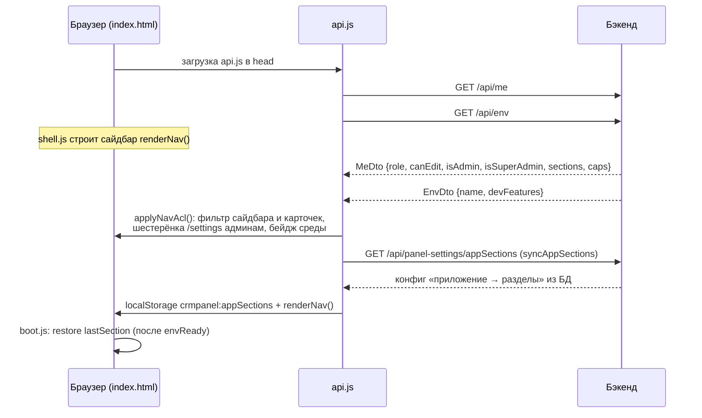

# Обзор фронтенда

Фронтенд crm-admin — **одностраничное приложение без сборки**: `index.html` с разметкой плюс подключаемые файлы стилей и скриптов на чистом (vanilla) JavaScript. Никаких фреймворков, бандлеров и npm — файлы лежат в `src/main/resources/static/` и раздаются Spring Boot как статика.

Эта заметка — карта: какой файл за что отвечает, как загружается страница, какие соглашения общие для всех разделов и где искать каждый раздел панели. Устройство самой оболочки — в [[Оболочка панели (shell)]].

## Состав каталога static/

| Файл | Назначение |
|---|---|
| `index.html` | **Только разметка**: оболочка SPA (шапка, App Launcher, сайдбар, обзорные страницы), все секции разделов и подключения `css/` и `js/` |
| `api.js` | Слой доступа к REST: транспорт `req()`, маппинги v1 ↔ DTO, каталог `CRM.*`, бутстрап `/api/me` + `/api/env`, ACL навигации (`applyNavAcl`), синк конфига приложений (`syncAppSections`), проверка прав `CRM.can` |
| `js/shell.js` | Оболочка: `NAV`, `ICONS`, i18n-словари, `renderNav`, `openSection`, `applyTheme`, `applyLang`, `store`, виджеты Главной, «Загруженные инструменты» — см. [[Оболочка панели (shell)]] |
| `js/boot.js` | Старт SPA: восстановление последнего раздела после ответа `/api/env`, первичный перевод |
| `js/template-details.js` | Карточка шаблона (мастер и просмотр), предпросмотр сообщения, создание и сохранение, пикер «Просмотра настроек» — см. [[Мастер коммуникаций (формы)]] |
| `js/template-list.js` | «Список шаблонов»: постраничная загрузка, фильтры, сортировка, настройка колонок, правка в таблице |
| `js/dashboard.js` | Режим «Общая статистика» (демо-данные) |
| `js/wizard-forms.js` | Библиотека старых форм каналов: `formatDateDDMMYY`, подсказки полей, поиск и загрузка шаблона |
| `js/promo.js` | «Планирование промо» на REST — см. [[Планирование промо]] |
| `js/reports.js` | «Отчёты»: встраивание Tableau и демо-макет отчёта — см. [[Отчёты]] |
| `js/smscheck.js` | «ЧЕК СМС траффик»: выгрузка `.xlsx` |
| `js/onelink.js` | OneLink Builder — клиентский генератор ссылок (ниже) |
| `js/srcbuilder.js` | Конструктор source — клиентский генератор имени кампании (ниже) |
| `js/heatmap-data.js`, `-core.js`, `-io.js`, `-ui.js` | **«Панель отклонений»** — вопреки названию (ниже) |
| `wizard.js` | Справочники и инициализация **старых** форм каналов |
| `combobox.js` | Редактируемый выпадающий список `window.Combobox` — используется только старыми формами |
| `journeys.js` | Раздел «Цепочки» на Drawflow — см. [[Flow Builder (цепочки)]] |
| `admin-users.js` | Экран «Управление доступом»; подключается **страницей `/settings`**, не SPA — см. [[Управление доступом и вход]] |
| `login.html` | Страница входа (вне SPA) |
| `settings/index.html` | Настроечная админка `/settings` (только ADMIN) — самостоятельная страница вне SPA |
| `drawflow.min.js` / `.css` | Библиотека Drawflow, вендорена локально |

Стили — по файлу на раздел, изолированы нативным `@scope`:

| Файл | Корень `@scope` |
|---|---|
| `css/shell.css` | — (оболочка: переменные, тема, шапка, сайдбар, обзорные, Главная, канва цепочек) |
| `css/section-admin.css` | `#sec-admin` |
| `css/section-deviations.css` | `#sec-deviations` |
| `css/section-onelink.css` | `#sec-onelink` |
| `css/section-promo.css` | `#sec-promo` |
| `css/section-reports.css` | `#view-reports`, `#view-report-embed` — секция «ЧЕК СМС траффик» (`#view-report-smscheck`) в область не входит, хотя пользуется теми же классами |
| `css/section-srcbuilder.css` | `#sec-srcbuilder` |

Благодаря `@scope` порядок подключения после `shell.css` значения не имеет.

## Как загружается страница

В `<head>` (`index.html`, строки 7–17): CDN `Chart.js 4.4.1` и `xlsx 0.18.5` (нужны «Панели отклонений»), затем `api.js`, `combobox.js`, `wizard.js`, локальный `drawflow.min.js` и `journeys.js` (с `defer`). `api.js` грузится **до** скриптов разделов — они рассчитывают, что глобальный `window.CRM` уже существует.

Скрипты разделов подключены в конце `<body>`: `js/shell.js` → `srcbuilder` → `promo` → `reports` → `smscheck` → `heatmap-*` → `onelink` → `wizard-forms` → `template-details` → `template-list` → `dashboard` → `boot.js`. Это обычные классические скрипты без `defer`/`async`: они исполняются строго по очереди и делят одну глобальную область видимости, поэтому функции одного файла видны следующим. **Порядок менять нельзя**: `boot.js` замыкает список и стартует приложение, когда всё объявлено.

### Server-driven бутстрап: /api/me и /api/env

- `CRM.meReady = CRM.fetchMe()` — `GET /api/me`. Ответ кладётся в `CRM.me` / `window.CRM_ME`, на `<body>` ставится `data-role`, для не-редакторов — `data-readonly="1"`. Роль `SUPER_ADMIN` наружу показывается как `ADMIN` (`CRM.displayRole`), реальные полномочия проверяются по флагу `isSuperAdmin` и на сервере.
- `CRM.envReady = CRM.fetchEnv()` — `GET /api/env` возвращает `{name, devFeatures}`. Имя среды рисуется бейджем `.env-pill` в шапке.
- `applyNavAcl()` запускается на `DOMContentLoaded` после `Promise.all([meReady, envReady])` и затем **после каждой перерисовки сайдбара** (`renderNav()` сам зовёт `window.applyNavAcl`). Полный ACL-контракт data-атрибутов — в [[Оболочка панели (shell)]].
- `syncAppSections()` тянет конфиг «приложение → разделы» из БД, зеркалит его в `crmpanel:appSections` и перерисовывает сайдбар при изменениях; при недоступности эндпоинта панель остаётся на localStorage.

Подробности о ролях и раздаче разделов — [[Безопасность и RBAC]].

## Общие соглашения

- **Глобальная область одна на всех.** Секции не изолированы модулями: функция, объявленная в одном файле, доступна следующим. Отсюда правило про порядок скриптов и «мягкие» вызовы через `typeof f === "function"`.
- **Состояние клиента — в `localStorage` под префиксом `crmpanel:`** (`crmpanel:app`, `:appSections`, `:subOrder`, `:layout`, `:theme`, `:lang`, `:lastSection`, `:recent`, `:tasks`, `:sidebarCollapsed`, `:uploadedTools`, `:listCols`, `:listFilters`). Хелпер `store.get/set` в `shell.js` и такой же — в `settings/index.html`. Исключение — «Панель отклонений»: она пришла из v1 со своими ключами без префикса.
- **Перевод статики — через data-атрибуты**: `data-i18n` (текст), `data-i18n-html` (токен с разметкой), `data-i18n-ph` (placeholder). Ставить `data-i18n` на элемент, внутри которого есть иконка, нельзя — перевод пишет в `textContent`.
- **Все запросы идут через `req()`** из `api.js` — иначе теряются обработка 401 и разбор ошибок.
- **Права на клиенте — только UX.** `CRM.can(cap, …sections)` и скрытые кнопки нужны для удобства; отказывает всё равно сервер ([[Безопасность и RBAC]]).
- **Секции переключаются классом `.active`** у `<section class="view">`, а не роутером; адрес страницы не меняется.

## api.js — слой доступа к REST

### req(method, url, body)

Единственная транспортная функция:

- `credentials: "same-origin"` — сессионная кука ходит сама, токенов в JS нет;
- тело сериализуется в JSON с `Content-Type: application/json`;
- **401** → редирект на `login.html` (кроме случая, когда мы уже на ней) и `throw` — истёкшая сессия в любом месте приложения приводит на форму входа;
- не-OK ответ → из тела извлекается `message` (если это JSON), иначе текст/статус — и бросается `Error`;
- **204** → `null`; JSON парсится по `Content-Type`, остальное возвращается текстом.

`buildQuery(filters)` собирает query-строку; **массив превращается в несколько одноимённых параметров** (`channel=sms&channel=email`) — бэкенд трактует их как ИЛИ внутри фильтра.

### Маппинги v1 ↔ DTO

Формы и карточки оперируют «рыхлыми» snake_case-объектами, бэкенд — `TemplateDto` (camelCase). Конвертация целиком живёт в `api.js`:

- `apiItemToList(t)` — элемент списка `GET /api/templates` → строка таблицы: `id = channel + ":" + code`, имя из `communicationName || letterosId`, первый элемент `productType` как `product`;
- `v1ToDto(d)` — объект карточки → `TemplateDto`: ядро (имя, продукт, партнёр, точка касания, день, флаги через хелпер `bool()` с сохранением `null`) плюс канальные блоки **FA** (`faId`, `channelId`, `needPush`, `c2dTransport`, `c2dAccount`, `ch2dOperatorId`, `webUrl`, `linkTitle`, `actionButtons`), **VK** (`vkTemplateName`, `ttl`, `abGroup`, `buttons`) и **Live Activity** (`activityName`, `laEvent`, `laVisualization`, `laVisualizationAttributes`, `laStatus`, `currentStep`);
- `dtoToV1(t)` — обратный маппинг для открытия шаблона (пустые значения превращаются в `""`, для канала `cc` поле `segment` = `code`);
- `saveFromV1(d)` — решает create/update по контексту `window.CRM_CURRENT`: если канал и код совпадают — `PUT`, иначе `POST`.

### Каталог CRM.*

| Метод | HTTP | Назначение |
|---|---|---|
| `fetchMe()` / `fetchEnv()` | GET `/api/me`, `/api/env` | Идентичность и среда |
| `listTemplates(filters)` | GET `/api/templates?…` | Страница списка (фильтры, `q`, `sort`, `dir`, `limit`, `offset`) |
| `countTemplates(filters)` | GET `/api/templates/count` | Всего и активных под фильтр |
| `facetsTemplates()` | GET `/api/templates/facets` | Значения для фильтров (продукты, точки, типы, партнёры) |
| `getTemplate(channel, code)` | GET `/api/templates/{ch}/{code}` | Полный шаблон |
| `createTemplate(dto)` / `updateTemplate(ch, code, dto)` / `deleteTemplate(ch, code)` | POST/PUT/DELETE `/api/templates` | CRUD шаблона |
| `createChain(channel, base, days)` | POST `/api/templates/{ch}/chain` | Серия шаблонов-цепочки |
| `dictPartners()` / `dictCcSegments()` / `dictCommNames(ch)` / `dictTouchPoints()` / `dictProductTypes()` | GET `/api/dictionaries/…` | Справочники карточки и форм |
| `flowPreview(journey)` / `flowMaterialize(journey, rows)` | POST `/api/flow/…` | Предпросмотр и материализация цепочки |
| `journeysList()` / `journeyGet(id)` / `journeyCreate(j)` / `journeyUpdate(id, j)` / `journeyDelete(id)` | `/api/journeys` | CRUD схем цепочек |
| `adminSections()` | GET `/api/admin/sections` | Каталог разделов для матрицы прав |
| `adminListUsers()` / `adminCreateUser(u)` / `adminUpdateUser(id, u)` / `adminDeleteUser(id)` / `adminResetPassword(id, pwd)` | `/api/admin/users` | Пользователи (ADMIN) |
| `changeOwnPassword(cur, next)` | PUT `/api/me/password` | Смена своего пароля |
| `logout()` | POST `/logout` | Выход и переход на `login.html` |
| `can(cap, …sections)` / `displayRole(role)` | — | Клиентские хелперы прав |

Чего в каталоге **нет**: методов ролей (`adminRoles` и родственные) — они объявлены отдельным мини-`CRM` прямо в `settings/index.html`; настроек панели (`/api/panel-settings/{key}`) — их зовут `syncAppSections()` и страница настроек напрямую; подключений отчётов и промо — у них свои функции в `js/reports.js` и `js/promo.js`. Полные контракты — [[REST API]].

## Разделы панели

Каждый раздел — `<section class="view">` в `<main>`; активный получает класс `.active`. Дерево разделов и правила их видимости — в [[Оболочка панели (shell)]].

| Раздел | Одна строка | Где описан |
|---|---|---|
| **Главная** | настраиваемая сетка виджетов (часть — демо) | [[Оболочка панели (shell)]] |
| **Управление коммуникациями → OneLink Builder** | генератор ретаргетинговых ссылок AppsFlyer | ниже |
| **→ Мастер коммуникаций** | заведение шаблона карточкой, по каналам | [[Мастер коммуникаций (формы)]] |
| **→ Список шаблонов** | витрина всех шаблонов с фильтрами и правкой в таблице | [[Мастер коммуникаций (формы)]] |
| **→ Просмотр настроек** | карточка сохранённого шаблона с предпросмотром | [[Мастер коммуникаций (формы)]] |
| **→ Конструктор source** | сборка имени кампании по правилам нейминга | ниже |
| **→ Планирование промо** | общий календарь промо на `app.promo_plan` | [[Планирование промо]] |
| **→ Тепловая карта** | **заглушка** «Раздел в разработке» | — |
| **Отчёты → Plan-Fact / CRM Matrix / CRM Leadgen** | встраивание книг Tableau | [[Отчёты]] |
| **→ ЧЕК СМС траффик** | помесячная выгрузка `.xlsx` по каналу | [[Отчёты]] |
| **→ Пример визуализации отчёта** | **демо-макет** на плейсхолдерах | [[Отчёты]] |
| **Дашборд → Общая статистика** | сводные показатели, **демо-данные** | [[Мастер коммуникаций (формы)]] |
| **→ Панель отклонений** | анализ выручки по дням, целиком на клиенте | ниже |
| **Мониторинг → Базовая работа кампаний** | пять контрольных точек, при клике — **заглушка** | [[Оболочка панели (shell)]] |
| **Загруженные инструменты** | свои HTML-страницы внутри панели | [[Оболочка панели (shell)]] |
| **Цепочки** (только ADMIN) | конструктор блок-схем на Drawflow | [[Flow Builder (цепочки)]] |
| **`/settings`** (только ADMIN) | настроечная админка из семи панелей | [[Оболочка панели (shell)]], [[Управление доступом и вход]] |

## Клиентские инструменты без серверной части

Три раздела пришли из v1 и работают целиком в браузере — бэкенд crm-admin в них не участвует. Собственных заметок у них нет, канонические описания — здесь.

### Панель отклонений (`#sec-deviations`)

Аналитический инструмент CVM/Retention «выручка по дням».

**Осторожно с именами файлов: раздел питают `js/heatmap-*.js`, а не «Тепловая карта».** `heatmap-ui.js` пишет в элементы секции `#sec-deviations` (`#metaStrip`, `#monthStrip`, `#flagBody`, `#checkList`, `#declBody`, `#chartMain`, `#chartMonth`, `#chartChannels`), а у секции `#view-heatmap` скриптов нет вообще — это статическая заглушка. Имя историческое: в v1 инструмент назывался «тепловая карта». Искать в этих файлах код тепловой карты бесполезно.

- **Данные**: встроенный `SEED_RAW` (`js/heatmap-data.js`, ~1,1 МБ — набор «день × продукт × канал»); можно заменить или дополнить импортом Excel/CSV через SheetJS.
- **Методология** (`heatmap-core.js`): база ожидания — центрированная скользящая 7-дневная медиана (гасит недельную сезонность); день считается выбросом при отклонении ≥ 20 % (РОСТ / ПАДЕНИЕ) с топ-3 драйверов; «плавные снижения» — тренд вниз ≥ 14 дней (≥ 20 % по итогу, ≥ 30 % по крупным продуктам); отдельно ищутся дни, требующие точечной проверки. Авто-гипотезы расставляются эвристикой (праздники, конец месяца, выходные), поверх них наложены заранее написанные комментарии по конкретным датам.
- **Графики** Chart.js: динамика с коридором нормы, помесячная сводка, каналы. Созданные в скрытой секции, они получают нулевой размер, поэтому оболочка при первом открытии раздела пересоздаёт их.
- **Работа с гипотезами**: комментарии и статус «решено» хранятся в `localStorage` (`revenue_notes_crmteam`, `revenue_status_crmteam` — **без префикса `crmpanel:`**) и синхронизируются в обе стороны с Excel.
- **Импорт/экспорт** (`heatmap-io.js`): импорт понимает «длинный» лист `Данные_день_продукт` и «широкий» формат, в режимах «заменить» и «дополнить», и вычитывает обратно комментарии со статусами; экспорт собирает книгу `Анализ_выручки_<дата>.xlsx` из семи листов, отдельно выгружаются комментарии в CSV.

### OneLink Builder (`#sec-onelink`)

Генератор ретаргетинговых ссылок AppsFlyer OneLink на папку `JmaP` (`ONE_LINK_BASE = "https://banki.onelink.me/JmaP"`).

Пользователь выбирает канал, тип рассылки, продукт и прочие параметры — ссылка собирается на лету. Имя кампании считается по тем же правилам, что и в мастере: promo → `канал_promo_продукт_партнёр_уник_ддммгг`, trigger → `канал_trigger_продукт_уник_Nday`; для `callcenter` первая часть — `contact`, а trigger получает ещё и номер сегмента.

В ссылку уходят `pid` (канал), `c` (имя кампании), `af_channel`, `aff_unique5`, флаги ретаргетинга (`is_retargeting`, `af_reengagement_window=30d`, `af_force_deeplink`), собранный `af_dp` / `deep_link_value` и, если заданы, `af_ios_url` / `af_android_url`; в web-адрес подмешивается utm-разметка. Deep link нормализуется (срезаются схема и домен), фигурные скобки плейсхолдеров при кодировании сохраняются. Пока не заполнены обязательные поля или адрес невалиден, результат помечен «ЧЕРНОВИК — не использовать» и копирование выключено; иначе — «ГОТОВО».

### Конструктор source (`#sec-srcbuilder`)

Собирает **только значение `source`** — по тем же формулам, что `campaign_name` в мастере. Каналы: `sms` / `mobile-push` / `email` / `callcenter`; поля второй части меняются по типу кампании (promo — партнёр, уникальное имя, дата; trigger — уникальное имя, сегмент, день). Результат закреплён сверху с состояниями «ЧЕРНОВИК — заполните обязательные поля» → «ГОТОВО — можно копировать»; незаполненные обязательные поля подсвечиваются. Значение предназначено для поля `source_type` шаблонов и параметра `c` ссылок OneLink.

## Кто что видит

| Роль | Что доступно (фронт) |
|---|---|
| Без права записи | просмотр своих разделов; `data-readonly` и `CRM.can` прячут кнопки сохранения |
| С правом записи | + создание и редактирование шаблонов, промо, цепочек |
| ADMIN | + «Цепочки», настроечная админка `/settings`, все разделы NAV |

Права раздаются не ролью-константой, а матрицей «раздел × право» — модель описана в [[Безопасность и RBAC]]. Фронтовые скрытия — только UX: сервер проверяет права на каждом запросе.

## Связанные заметки

- [[Оболочка панели (shell)]] — App Launcher, сайдбар и flyout, обзорные страницы, тема, i18n, ACL-контракт, `/settings`
- [[Мастер коммуникаций (формы)]] — карточка шаблона, список, просмотр настроек
- [[Flow Builder (цепочки)]] — конструктор цепочек на Drawflow
- [[Управление доступом и вход]] — вход, смена своего пароля, управление пользователями и ролями
- [[Отчёты]] и [[Планирование промо]] — разделы со своей серверной частью
- [[Обзор архитектуры]] — как SPA вписан в общую систему
- [[REST API]] — серверные контракты всех методов `CRM.*`
