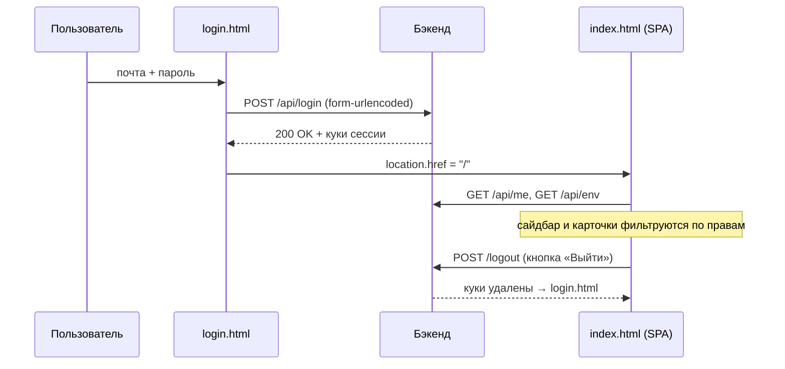

# Управление доступом и вход

Фронтовые экраны контура безопасности: страница входа `login.html`, диалог смены собственного пароля в шапке панели и экран **«Управление доступом»** в настроечной админке `/settings`.

Заметка описывает **только интерфейс**. Модель прав (роли, матрица «раздел × право», супер-админ, хранение учёток, серверные проверки) живёт в [Безопасность и RBAC](../Architecture/Безопасность%20и%20RBAC.md), контракты эндпоинтов — в [REST API](../API/REST%20API.md).

## login.html — страница входа

`src/main/resources/static/login.html` — самостоятельная страница вне SPA: тёмная карточка «CRM · Панель управления», подзаголовок «Вход по корпоративной почте».

Форма: **Почта** (`type=email`, `autocomplete="username"`, плейсхолдер `name@banki.ru`, `required`), **Пароль** (`type=password`, `autocomplete="current-password"`, `required`), кнопка «Войти» и строка ошибки `#err`.

Логика сабмита (инлайн-скрипт страницы):

1. `preventDefault()`, очистка ошибки, блокировка кнопки;
2. `POST /api/login` с `Content-Type: application/x-www-form-urlencoded`, телом `email=…&password=…` и `credentials: "same-origin"`;
3. ответ `ok` → переход на `/` (SPA); иначе — «Неверная почта или пароль» и разблокировка кнопки; исключение в `fetch` — «Ошибка сети».

**Чекбокса «запомнить меня» на форме нет** — постоянная авторизация включена на сервере безусловно, см. [Безопасность и RBAC](../Architecture/Безопасность%20и%20RBAC.md) и [Конфигурация](../Backend/Конфигурация.md).

При потере сессии на страницу возвращает не сама форма, а транспорт `req()` из `api.js`: любой ответ 401 уводит на `login.html` (см. [Обзор фронтенда](Обзор%20фронтенда.md)).

## Смена своего пароля (доступна любому пользователю)

В шапке панели, в блоке учётки `#userBox`, есть кнопка **«Пароль»** — она открывает модальный диалог `#pwdDialog` (разметка в `index.html`, логика в `js/shell.js`).

- `openPwdDialog()` очищает три поля (**Текущий пароль**, **Новый пароль**, **Повторите новый пароль**), сбрасывает строку сообщения и ставит фокус в первое поле;
- `submitPwdDialog()` проверяет на клиенте: заполнены текущий и новый («Заполни текущий и новый пароль»), новый не короче 8 символов («Новый пароль — минимум 8 символов»), повтор совпадает («Новые пароли не совпадают»);
- дальше `CRM.changeOwnPassword(cur, next)` (`PUT /api/me/password`); успех — зелёное «Пароль изменён» и автозакрытие через 1,2 с, ошибка — текст из ответа бэкенда;
- диалог закрывается по Escape и по кнопке «Отмена».

Рядом в шапке — кнопка **«Вид»** (личные тема и язык, см. [Оболочка панели (shell)](Оболочка%20панели%20(shell).md)) и **«Выйти»** (`CRM.logout()` → `POST /logout` и переход на `login.html`). На узких экранах у всех трёх кнопок остаются только иконки.

Подпись учётки `#userEmail` заполняет `applyNavAcl()` из `api.js`: текст — почта, тултип — «имя · почта (роль)».

## Экран «Управление доступом» (/settings → «Управление доступом»)

Раздел **переехал из пользовательской панели в настроечную админку**: в `NAV` оболочки пункта `access` больше нет, экран живёт панелью `#pane-access` страницы `src/main/resources/static/settings/index.html`. Вход — шестерёнка `#settingsLink` в шапке (видна только админам) → пункт «Управление доступом» в меню настроек.

Рендерит экран прежний файл `src/main/resources/static/admin-users.js` — он подключён внизу `settings/index.html` и пишет в контейнер с историческим id `#sec-access`. Полноценный `api.js` панели на страницу настроек не тянется, вместо него объявлен мини-`window.CRM` с десятью admin-методами — см. [Страница настроек (settings)](Страница%20настроек%20(settings).md).

Рендер ленивый и одноразовый: `openPane("access")` зовёт `window.renderAccessSection()` (`admin-users.js:409`), флаг `rendered` защищает от повторной отрисовки, `window.accessInvalidate()` его сбрасывает при смене языка. Весь DOM строится хелпером `h(tag, attrs, children)` (`admin-users.js:39`) — **без `innerHTML` для данных**: в почте, имени и названии роли может оказаться что угодно, и разметку из них собирать нельзя.

Стартовый запрос — `Promise.all([CRM.adminSections(), CRM.adminRoles()])` (`admin-users.js:417`): каталог разделов (без `adminOnly`) нужен для матрицы прав, список ролей — для выпадающего списка в форме пользователя. Роли грузятся раньше пользователей: без них форму пользователя нечем заполнить. Экран состоит из двух блоков.

### Блок «Пользователи»

Кнопка **«+ Новый пользователь»** и таблица: **Почта · Имя · Роль · Активен (✓/—) · действия**. У записей с `manageable === false` вместо кнопок стоит «—».

- **Изменить** — карточка над таблицей: имя, роль (select), чекбокс «Активен»; «Сохранить» → `CRM.adminUpdateUser`. Почта у существующей учётки не меняется — она идентификатор.
- **Пароль** — `prompt` «Новый пароль для … (минимум 8 символов)» → `CRM.adminResetPassword`, затем alert «Пароль обновлён».
- **Деактивировать / Активировать** — вместо удаления. Кнопка меняет надпись и цвет по `enabled`, спрашивает подтверждение и шлёт `CRM.adminUpdateUser(id, {enabled})`. Учётку не стирают: вход закрывается, данные и история остаются, при надобности её включают обратно.
- Форма **нового** пользователя: почта (`type=email`, плейсхолдер `name@banki.ru`), имя, пароль («Пароль (мин. 8)»), роль → `CRM.adminCreateUser`.

В выпадающем списке ролей — только назначаемые (`assignableRoles()`): супер-роль не показывается никогда, админ-роли доступны только супер-администратору. Админ-роль помечена суффиксом «· админ».

### Блок «Роли»

Кнопка **«+ Создать роль»** и таблица: **Роль · Тип · Права · Учёток · действия**. Тип — «супер-админ» / «админ» / «обычная», у встроенных добавляется «· встроенная». Права свёрнуты в строку `Раздел ПДРУ` (П — просмотр, Д — добавление, Р — редактирование, У — удаление); у админских ролей вместо перечня — «доступ ко всему». Встроенные роли не удаляются (вместо кнопки — пометка «встроенная»), записи с `manageable === false` не редактируются.

Форма роли: **Название** (у встроенной роли поле заблокировано с подсказкой «Встроенную роль переименовать нельзя»), чекбокс **«Админ-полномочия (управление доступом, обход матрицы)»** (доступен только супер-администратору) и **матрица прав**.

Матрица (`buildMatrix`, `admin-users.js:70`) — таблица «раздел × право» с колонками **Просмотр · Добавление · Редактирование · Удаление**:

- клик по заголовку колонки выделяет или снимает весь столбец;
- строки разбиты **заголовками групп сайдбара**, и у заголовка группы свой переключатель столбца (`admin-users.js:114`). Разделов стало больше двадцати — у каждого отчёта своя секция, — и «выдать всю группу» операция частая: кликать пять отчётов подряд незачем;
- у разделов, не поддерживающих запись (`writable: false`), колонки кроме «Просмотра» показаны прочерком;
- снятый «Просмотр» гасит и блокирует «Добавление/Редактирование/Удаление» этого раздела;
- включённый флаг «админ» целиком выключает матрицу и подписывает: «Админ-роль: доступ куда угодно и для чего угодно — матрица не ограничивает»;
- при сохранении собираются только строки, где отмечено хоть одно право.

Человекочитаемые названия разделов берутся из локальной карты `SECTION_LABELS` (`admin-users.js:12`): `home`, `deviations`, `onelink`, `admin`, `templates`, `dashboard`, `promo`, `abtests`, `journeys`, `access`, `srcbuilder`, `heatmap`, `rep-planfact`, `rep-matrix`, `rep-leadgen`, `rep-smscheck`, `rep-demo`, `mon-campaigns`, `uploads`. Зонтичных `reports` и `monitoring` в ней нет: с V29 секция заводится на каждый пункт меню, а не на группу ([Безопасность и RBAC](../Architecture/Безопасность%20и%20RBAC.md)). Карту приходится держать здесь и синхронизировать с `Sections.ALL` на сервере — раздел без подписи показывался бы сырым id, как когда-то «А/Б тесты». Все подписи прогоняются через обёртку `tr()` → глобальный словарь оболочки `t()`.

Ошибки любых операций показываются `alert(e.message)` — текст приходит из тела ответа бэкенда.

### Что из этого — только UX

Скрытые кнопки и фильтрация списков — исключительно удобство: сервер проверяет права на каждом запросе и отдаёт 403 независимо от того, что нарисовал фронт. Подробности — [Безопасность и RBAC](../Architecture/Безопасность%20и%20RBAC.md).

## Связанные заметки

- [Безопасность и RBAC](../Architecture/Безопасность%20и%20RBAC.md) — роли, матрица прав, супер-админ, хранение учёток, доступ к `/settings`, серверные проверки
- [Конфигурация](../Backend/Конфигурация.md) — переменные окружения контура авторизации
- [Обзор фронтенда](Обзор%20фронтенда.md) — `api.js`, поведение при 401, бутстрап `/api/me`
- [Оболочка панели (shell)](Оболочка%20панели%20(shell).md) — шапка, кнопка «Вид», настроечная админка `/settings` целиком
- [REST API](../API/REST%20API.md) — контракты `/api/login`, `/api/me`, `/api/admin/**`
