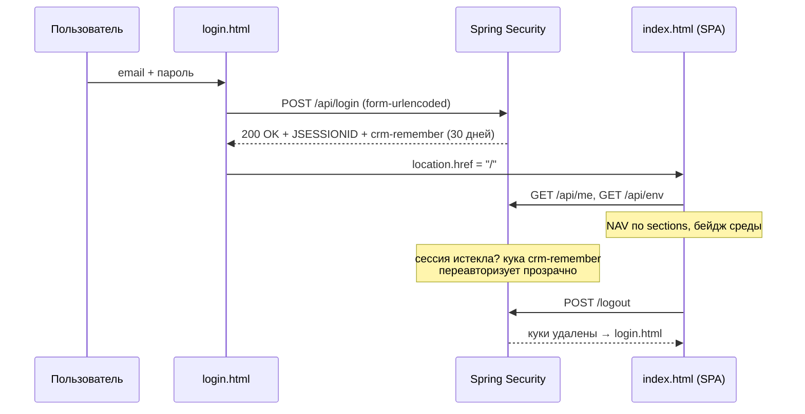

# Управление доступом и вход

Фронтовые части контура безопасности: страница входа `login.html`, раздел «Управление доступом» (`admin-users.js`, только для роли ADMIN) и **настроечная админка `/settings`** (`static/settings/index.html`, тоже только ADMIN). Серверная сторона описана в [[Безопасность и RBAC]] и [[Пользователи и доступ]].

## login.html — страница входа

`src/main/resources/static/login.html` — самостоятельная страница вне SPA (тёмная карточка «CRM · Панель управления», вход по корпоративной почте). Это один из немногих публичных ресурсов: `SecurityConfig.PUBLIC` разрешает без аутентификации только `/login.html`, `/api/login`, `/logout`, `/favicon.ico`, `/error`.

Форма: поля **Почта** (`type=email`, `autocomplete="username"`) и **Пароль** (`autocomplete="current-password"`), кнопка «Войти», строка ошибки `#err`.

Логика сабмита (инлайн-скрипт):

1. `preventDefault`, очистка ошибки, блокировка кнопки;
2. `POST /api/login` с `Content-Type: application/x-www-form-urlencoded` и телом `email=...&password=...` (`credentials: "same-origin"`) — это стандартный `formLogin` Spring Security с переименованными параметрами (`usernameParameter("email")`);
3. `200 OK` → переход на `/` (SPA); иначе — «Неверная почта или пароль» и разблокировка кнопки; сетевая ошибка — «Ошибка сети».

### Remember-me: чекбокса нет — и это осознанно

На форме входа **нет чекбокса «запомнить меня»**: постоянная авторизация включена безусловно на сервере — `SecurityConfig` (`src/main/java/ru/banki/crm/security/SecurityConfig.java`) настраивает `rememberMe` с **`alwaysRemember(true)`**. При каждом успешном входе браузеру выдаётся подписанная кука-токен:

- ключ подписи — `app.remember-me.key` (env `REMEMBER_ME_KEY`), стабильный между рестартами, чтобы кука переживала перезапуск приложения;
- срок жизни — `app.remember-me.days` (env `REMEMBER_ME_DAYS`, по умолчанию 30 дней);
- имя куки — `app.remember-me.cookie-name` (env `REMEMBER_COOKIE`, по умолчанию `crm-remember`) — **своё на каждую среду**, чтобы prod/preprod/test на одном хосте не затирали куки друг друга (см. [[Среды и деплой]], [[Конфигурация]]).

Эффект: после таймаута HTTP-сессии, закрытия браузера или рестарта сервера пользователь переавторизуется автоматически и «не вылетает» из панели. Явный `POST /logout` удаляет и сессионную куку, и remember-me (`deleteCookies(rememberCookie, sessionCookie)`).

### Как SPA реагирует на потерю сессии

`req()` в `api.js` при **401** от любого запроса перенаправляет на `login.html` (если мы ещё не на ней). Со стороны сервера `exceptionHandling` отдаёт чистый 401 только для путей `/api/**`; навигация браузера по остальным URL уводит на страницу логина штатно. CSRF пока отключён (внутренний инструмент за аутентификацией); в коде оставлена пометка включить `CookieCsrfTokenRepository` + заголовок в `api.js` перед внешней публикацией.

## Раздел «Управление доступом» (admin-users.js)

`src/main/resources/static/admin-users.js` рендерит UI в пустую секцию `#sec-access`. Раздел виден только пользователям, у которых `access` есть в `me.sections` (ADMIN получает все разделы автоматически); сервер дополнительно закрывает весь `/api/admin/**` правилом `hasRole("ADMIN")`. Рендер ленивый и одноразовый: `openSection('access')` вызывает `window.renderAccessSection()`, флаг `rendered` защищает от повторной перерисовки. Весь DOM строится хелпером `h(tag, attrs, children)` без innerHTML для данных.

### Модель, которой оперирует раздел

- **Роли** (константа `ROLES`): `READER` — только просмотр; `EDITOR` — + создание/редактирование шаблонов; `ADMIN` — + управление доступом.
- **Разделы**: каталог приходит с бэкенда `GET /api/admin/sections` (`AdminUserController.sections()` → `Sections.ALL`) и рисуется чекбоксами; человекочитаемые ярлыки — локальная карта `SECTION_LABELS` (`home` — Главная, `deviations` — Панель отклонений, `onelink` — OneLink Builder, `admin` — Мастер коммуникаций, `templates` — Список шаблонов, `dashboard` — Дашборд, `access` — Управление доступом; для неизвестных id показывается сам id — так, `journeys` из `Sections.ALL` отображается «как есть»: назначать его смысла больше нет, раздел admin-only). Роль задаёт **уровень возможностей**, набор разделов — **что видит** пользователь.
- **i18n**: ярлыки и подписи прогоняются через обёртку `tr()` → глобальный словарь оболочки `t()`/`I18N_EN`; при смене языка оболочка зовёт `window.accessInvalidate()` (сброс флага `rendered`), и раздел перерисовывается на выбранном языке.

### Возможности

**Создание пользователя** — форма «Новый пользователь»: почта (`type=email`, плейсхолдер `name@banki.ru`), имя, пароль (минимум 8 символов — валидируется на бэкенде, `UserDtos.CreateUser`), роль (по умолчанию READER), чекбоксы разделов → `CRM.adminCreateUser` (`POST /api/admin/users`); после успеха форма очищается и таблица перерисовывается.

**Таблица пользователей** (`renderUsers` ← `GET /api/admin/users`, `UserDtos.UserView`): Почта · Имя · Роль · Разделы (ярлыками) · Активен (✓/—) · кнопки:

- **Изменить** (`editUser`) — над таблицей раскрывается карточка с именем, ролью, флагом «Активен» и чекбоксами разделов; «Сохранить» → `CRM.adminUpdateUser` (`PUT /api/admin/users/{id}`). Почту сменить нельзя — она идентификатор.
- **Пароль** (`resetPwd`) — `prompt` на новый пароль (мин. 8 символов) → `CRM.adminResetPassword` (`PUT /api/admin/users/{id}/password`).
- **Удалить** (`delUser`) — `confirm` → `CRM.adminDeleteUser` (`DELETE /api/admin/users/{id}`).

Ошибки всех операций показываются `alert(e.message)` — текст приходит из тела ошибки бэкенда через `req()`.

### Как права применяются в SPA

После входа `api.js` получает `GET /api/me` (`MeDto`: `email`, `displayName`, `role`, `canEdit` = EDITOR|ADMIN, `isAdmin`, `sections`) и:

- ставит на `<body>` атрибут `data-role`, для не-редакторов — `data-readonly="1"` (CSS прячет кнопки сохранения/удаления, например тулбокс Flow Builder);
- `applyNavAcl()` фильтрует сайдбар и карточки обзорных страниц по ACL-контракту оболочки (`data-envs` / `data-admin-only` / `data-group` / `data-no-acl` / `data-acl-section` / `data-nav-ref` — см. [[Оболочка панели (shell)]]), показывает **шестерёнку `/settings` только админам** и подписывает `#userEmail` (тултип: имя · почта · роль); рядом кнопка «Выйти» → `CRM.logout()`.

Это только UX: сервер повторно проверяет права на каждом запросе (метод-секьюрити, `AccessGuard`) — подробности в [[Безопасность и RBAC]].

## Настроечная админка /settings

`src/main/resources/static/settings/index.html` — самостоятельная страница вне SPA (та же айдентика CRM Team: тёмная тема, свой сайдбар, кнопка «← В панель управления»). Доступ закрыт на сервере: `SecurityConfig` добавляет правило **`/settings/**` → `hasRole("ADMIN")`**, а `config/WebConfig` форвардит «красивые» адреса `/settings` и `/settings/` на `settings/index.html` (Spring сам не отдаёт index.html для подкаталогов статики). В SPA на неё ведёт шестерёнка `#settingsLink` в шапке (видна только админам).

Разделы настроечной админки:

- **Обзор** — карточки всех блоков настроек;
- **«Приложения и разделы»** — конфиг «приложение App Launcher → доступные разделы панели» (чекбоксы по 5 приложениям × верхнеуровневым разделам `home`/`comms`/`dash`/`monitoring`/`uploads`; «Главная» всегда включена). **Единственный блок с серверным хранением**: источник истины — БД (`app.panel_settings`, ключ `appSections`; `GET/PUT /api/panel-settings/appSections`), сохранённое значение зеркалится в `localStorage crmpanel:appSections`, чтобы оболочка панели применила его сразу; кнопка «Сбросить» пишет пустой объект = все разделы всем. Ошибки 403/404/сети показываются строкой статуса, при недоступности сервера страница работает от умолчаний;
- **«Мониторинг»** — блоки «Работа с партнёрами» (Поступление статусов · Зависшие статусы отправок · Записи отправок без идентификатора клиента · Наличие переменных Context API) — пока заглушки «Статистика в разработке»;
- **«Загруженные инструменты»** — таблица HTML-инструментов пользовательской панели (то же хранилище `crmpanel:uploadedTools` в localStorage): переименовать/удалить;
- **«Общие параметры»** — тема оформления (системная/тёмная/светлая → `crmpanel:theme`) и язык интерфейса (RU/EN → `crmpanel:lang`); значения клиентские, панель применяет их при загрузке и по событию `storage`;
- **«Диагностика»** — занятость localStorage ключами `crmpanel:*` (размеры, итог, напоминание про лимит ~5 МБ).

Страница имеет собственный мини-i18n (`S_EN`/`t2`/`translateStatic` по `data-i18n`) и собственную светлую тему (`html.theme-light`), синхронизированные с панелью через те же ключи localStorage.

## Связанные заметки

- [[Безопасность и RBAC]] — SecurityConfig (`/settings/**`), роли, ACL разделов, `/api/panel-settings`
- [[Пользователи и доступ]] — UserService, хранение пользователей и bootstrap админа
- [[Конфигурация]] — переменные REMEMBER_ME_KEY / REMEMBER_ME_DAYS / REMEMBER_COOKIE
- [[Обзор фронтенда]] — api.js (req, meReady, applyNavAcl, syncAppSections), навигация
- [[Оболочка панели (shell)]] — App Launcher, ACL-контракт, тема и язык
- [[Таблицы приложения]] — `app.panel_settings` (V7)
- [[REST API]] — контракты /api/login, /api/me, /api/admin/**, /api/panel-settings
