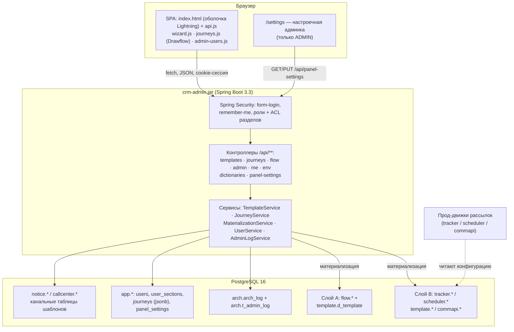
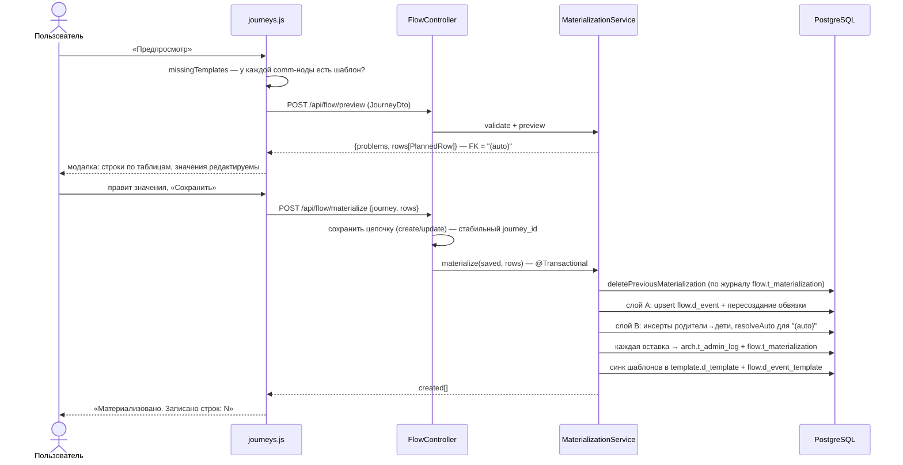
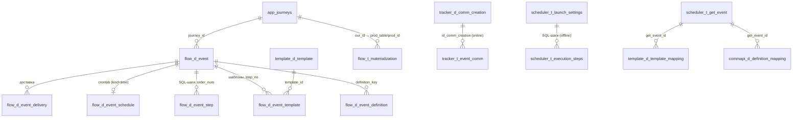

# Флоу системы

Сквозной рассказ «как всё работает» — для изучения системы с нуля. Читается сверху вниз: вход → роли → мастер коммуникаций → цепочки → предпросмотр → материализация → слои A/B → прод-движки. В каждом разделе — ссылки на детальные заметки.

## Что это за система

**crm-admin** — самописная админ-панель CRM-коммуникаций: единое место, где менеджер заводит и правит шаблоны рассылок четырёх каналов (SMS / Push / Email / колл-центр), рисует цепочки коммуникаций в визуальном конструкторе и «материализует» их в конфигурационные таблицы, которые читают существующие боевые движки рассылок. Проект заменил админку на Appsmith: та упиралась в ограничения low-code-платформы, а критичный шаг — запись в прод-структуры — был хрупким DO-скриптом. Здесь всё это — типизированный Java-код с транзакциями, журналом и идемпотентностью (мотивация — [[Обзор архитектуры]]).

Технически: один jar **Spring Boot 3.3 / Java 21** ([[Технологии]]), внутри — REST-бэкенд `/api/**` ([[Обзор бэкенда]], [[REST API]]) и **vanilla-JS SPA** без сборки ([[Обзор фронтенда]]) в оболочке в стиле Salesforce Lightning ([[Оболочка панели (shell)]]) плюс настроечная админка `/settings`; БД — **PostgreSQL 16**, схему создаёт Flyway ([[Схема БД]]).

## Среды и путь изменения

Три независимых стека в одном `docker-compose.yml`, каждый со своей PostgreSQL, из **одного образа** `crm-admin:local`: **prod :8080**, **preprod :8081**, **test :8082** ([[Среды и деплой]]). Путь изменения: **сначала test** (`docker compose build app-prod` → `up -d --no-deps app-test`), проверка, и только потом — по команде — preprod и prod. Test сбрасывается `scripts/reset-test.sh`, preprod обновляется копией прода `scripts/refresh-preprod.sh`.

Среды различаются только env-переменными: имя среды (`GET /api/env` → бейдж в шапке), per-env имена кук (три среды на одном хосте), `FEATURES_DEV` и `JOURNEYS_MOCK`. Раздел **«Цепочки» виден только на test и только админам** (пункт NAV с `envs:["test"]` и `adminOnly`; сервер закрывает `/api/journeys/**` и `/api/flow/**` ролью ADMIN), и только на test цепочки хранятся в БД (`JOURNEYS_MOCK=false`) — это нужно материализации (FK `flow.d_event.journey_id → app.journeys.id`).

## Вход и роли

Аутентификация своя: статическая `login.html` шлёт `POST /api/login` (параметры `email` + `password`), успех — сессионная кука + remember-me на 30 дней (`alwaysRemember`, per-env ключ подписи). Детали — [[Безопасность и RBAC]] и [[Управление доступом и вход]].

Доступ — две ортогональные оси:

- **Роль** (`READER` / `EDITOR` / `ADMIN`) — что можно делать: READER читает, EDITOR мутирует шаблоны, ADMIN дополнительно управляет пользователями (`/api/admin/**`), владеет цепочками и материализацией целиком (`/api/journeys/**`, `/api/flow/**` — только ADMIN), настроечной админкой `/settings` и обходит ACL разделов;
- **Разделы** (`app.user_sections`) — что видно: персональный список пунктов NAV, сервер проверяет `AccessGuard.requireAnySection(...)` в каждом методе контроллера (не-админам раздел `journeys` в `GET /api/me` не отдаётся вовсе).

SPA при загрузке параллельно спрашивает `GET /api/me` (роль, `canEdit`, `sections`) и `GET /api/env` (среда) и строит оболочку ([[Оболочка панели (shell)]]): App Launcher с пятью приложениями, левый сайдбар с flyout 2-го уровня и обзорными страницами групп, тема light/dark/system, язык RU/EN. `applyNavAcl` скрывает чужие разделы, env-гейтед — удаляет, шестерёнку `/settings` показывает только админам; конфиг «приложение → разделы» тянется из БД (`app.panel_settings`, `syncAppSections`). Всё это только UX — сервер проверяет сам. Первого супер-админа идемпотентно создаёт `AdminBootstrap` из `ADMIN_EMAIL`/`ADMIN_PASSWORD`. Управление пользователями — раздел «Управление доступом», серверные настройки панели — админка `/settings` ([[Пользователи и доступ]], [[Управление доступом и вход]]).

## Мастер коммуникаций: шаблоны

Главный рабочий цикл менеджера ([[Мастер коммуникаций (формы)]], серверная сторона — [[Шаблоны и мастер коммуникаций]]): группа «Управление коммуникациями» → «Мастер коммуникаций» → канал в настроечном блоке (сегмент SMS/Push/Email/КЦ, `wizardSetChannel`) → форма → «Сохранить» → `POST /api/templates/{channel}`. Рядом в той же группе: **«Список шаблонов»** в формате Salesforce list view (поиск, сортировка, счётчик) и **«Просмотр настроек»** — карточка Salesforce Details с построчным редактированием «карандашами», пуш-превью iOS/Android и сохранением через `PUT /api/templates/{ch}/{code}`; плюс клиентский **«Конструктор source»** с теми же формулами имён.

- Два имени собираются автоматически по правилам v2: `communication_name` (база + суффиксы флагов -cross/-marketplace/-nr/-loyalty, префикс `out-trigger-`) и `campaign_name`/`source` (`{канал}_promo_{продукт}_{партнёр}_{comname}_{дата}` / `{канал}_trigger_..._{день}day`, для КЦ — с `contact_`).
- Коды генерирует сервер: push/sms — `max(code)+1` (sms — только среди кодов < 10000), email — PK `id`, для КЦ пользователь вводит номер сегмента.
- **Цепочка дней** (переключатель Is chain) — батч `POST /api/templates/{channel}/chain`: один base + список дней, по шаблону на день, всё в одной транзакции.
- Каждая мутация журналируется дважды: триггер БД пишет в `arch.arch_log` (актор — из GUC `app.current_user`, который выставляет `AuditContext.mark()`), приложение — полный слепок строки в `arch.t_admin_log` ([[Аудит и журналирование]]).

Шаблоны лежат в **прод-идентичных** канальных таблицах `notice.push_template`, `notice.email_template`, `notice.d_com_sms_template`, `callcenter.d_segment_properties` ([[Справочники шаблонов]]). Поле `sending_day` шаблона — важное: именно оно задаёт «день» коммуникации в цепочках (см. ниже).

## Цепочки: Flow Builder (только test, только ADMIN)

Раздел «Цепочки» ([[Flow Builder (цепочки)]]) — конструктор блок-схем на вендореном Drawflow; доступен только админам и только на среде test. Узлы: старт (**Income event** — online-цепочка от входящего события; **Time event** — offline по расписанию), действия (**Communication Alert** — отправка коммуникации; **Subflow** — вложенная цепочка), логика (Assignment / Decision / Pause / Loop) и данные (Create/Update/Get/Delete Records).

**Важно понимать: движка исполнения (runs/steps) в системе нет.** Ноды логики и данных — чисто визуальные: они сохраняются в схеме, но при материализации игнорируются; в процессные таблицы попадают только стартовый узел и Communication Alert'ы (включая развёрнутые Subflow). Реальные задержки между шагами в проде задаются `sending_day` шаблонов.

Как устроен UX канвы:

- узлы на канве **компактные** — цветной заголовок + текстовая сводка, без полей ввода; настройки открываются **двойным кликом** — модалка `openNodeEditor`;
- **Communication Alert окрашен по каналу** (классы `jrn-ch-sms` / `jrn-ch-push` / `jrn-ch-email` / `jrn-ch-cc`); поля `title` у него нет — заголовок собирается из канала/шаблона/дня;
- поле **«День» readonly**: автоподставляется из `sending_day` шаблона (`CRM.getTemplate`); если шаблон не найден — предупреждение `⚠ шаблона нет` на карточке, а сохранение и материализация блокируются (клиентский `missingTemplates` + серверные `validate`/`templateExists`);
- **Time event**: один текстовый **crontab** (например `0 9 * * *`; полей time_start/period_unit/period_q больше нет), `database` (`crmdb` default | `greenplum`), `process_name` (= `selection`, одно поле) и **массив SQL-шагов** `props.sql_steps` (JSON-массив строк) — каждый шаг станет строкой `flow.d_event_step` и `scheduler.t_execution_steps` с `order_num`;
- **справочники значений** в селектах — из прода: `notify_channel` капсом (SMS/EMAIL/PUSH/CC/FA/VK/WA/WEBPUSH/ROBOT), `definition_key` — 6 значений (включая `smsChannelProccessV2` с опечаткой — так в проде), `business_key_prefix` — 7 значений;
- стрелка «в никуда» открывает меню `#jrPick` (создать ноду и сразу соединить), точки коннекта подсвечиваются зелёным при наведении, клик по связи показывает кнопку ✕ удаления, двойной клик по связи добавляет точку излома;
- **мультивыделение**: Ctrl+клик, Shift-рамка, групповое перемещение и Delete для всей группы.

Схема хранится **одним jsonb-документом** `{nodes, edges}` в `app.journeys` (CRUD `/api/journeys`, [[Цепочки (Journeys)]]). У цепочки есть `kind` (`online`/`offline`) и информационная метка `continues_journey_id` у offline.

**Subflow (autolaunched-модель):** у вложенной цепочки **нет стартового узла** — сохранить её без старта можно, материализовать отдельно нельзя. При материализации родителя subflow **разворачивается рекурсивно** (`expandedComms`/`collectComms`): comm-ноды вложенных цепочек становятся шаблонами родительского события; циклы и повторные включения пропускаются молча, пустой или не найденный subflow даёт problem.

## Предпросмотр и материализация

Материализация ([[Материализация (Flow)]]) — превращение схемы в реальные строки конфигурационных таблиц. Сначала `POST /api/flow/preview`: сервер валидирует цепочку (ровно один старт, соответствие типа старта kind'у, event_name, SQL-шаги у Time event, каналы и существование шаблонов всех comm-нод) и возвращает план вставок слоя B — модалка со строками по таблицам, значения редактируемы, FK показаны как `"(auto)"` и подставятся автоматически. Затем `POST /api/flow/materialize` (только ADMIN, как и весь раздел) — одна транзакция.

Ключевые свойства:

- **идемпотентность** — журнал `flow.t_materialization` хранит соответствие «цепочка → прод-строка»; повторная материализация сначала удаляет прежние строки слоя B по журналу и создаёт всё заново;
- **безопасность записи** — белый список из 8 таблиц слоя B, имена колонок валидируются regex'ом, значения — только bind-параметрами;
- **`source` события не вводится руками** — `resolveSource()` читает его из шаблона первой (по дню) comm-ноды и пишет в `scheduler.t_get_event.source` и `flow.d_event.source` (у канала cc колонки `source` нет — пропускается);
- **синк единого справочника** — для каждого шаблона цепочки строка канальной таблицы сворачивается upsert'ом в `template.d_template`: 20 общих колонок типизированно, остальное — в `channel_props jsonb`.

## Слои A и B

Двухслойная модель данных процесса — центральное дизайн-решение ([[Обзор архитектуры]]):

- **Слой A** ([[Слой A (flow)]]) — наша нормализованная модель, «истина» для UI: единый справочник событий `flow.d_event` (`kind = income | time` — вместо двух разъехавшихся прод-справочников), обвязка события, журнал материализации; плюс единый справочник шаблонов `template.d_template`;
- **Слой B** ([[Слой B (процессные таблицы)]]) — копии продовых таблиц 1:1 по DDL (единственное отличие — `id IDENTITY` вместо `max(id)+1`): их читают существующие движки, поэтому прод работает без единого изменения.

Куда что пишется при материализации:

| Цепочка | Слой B | Слой A |
|---|---|---|
| online (Income event) | `tracker.d_comm_creation` → `tracker.t_event_comm` | `flow.d_event (kind=income)` + `d_event_delivery` |
| offline (Time event) | `scheduler.t_get_event`, `t_launch_settings` (crontab), `t_execution_steps` (N SQL-шагов) | `flow.d_event (kind=time)` + `d_event_delivery` + `d_event_schedule` + `d_event_step` (N шагов) |
| шаблоны (все comm, по дням) | `template.d_template_mapping` (один) или `d_template_mapping_mass` (несколько, построчно) | `flow.d_event_template` (`step_no` при нескольких) |
| всегда | `commapi.d_definition_mapping` (definition_key, business_key_prefix) | `flow.d_event_definition` |

Связь между слоями — не FK, а журнал `flow.t_materialization`: это и идемпотентность, и трассировка «наша сущность → прод-строка».

## Прод-движки

Дальше работают внешние системы (в админке их кода нет): движок онлайн-событий читает `tracker.*`, шедулер запускает выборки по `scheduler.t_launch_settings`/`t_execution_steps`, маппинги `template.*`/`commapi.*` ведут событие к шаблону и Camunda-процессу отправки. Админка после записи эти таблицы не использует — она лишь воспроизводит те же инсерты, что раньше делал DO-скрипт Appsmith-админки, но безопасно и повторяемо.

## Куда дальше

- Индекс всех заметок — [[Home]]
- Архитектура и решения — [[Обзор архитектуры]], [[Технологии]], [[Среды и деплой]]
- Безопасность — [[Безопасность и RBAC]], [[Пользователи и доступ]], [[Управление доступом и вход]]
- Фронт — [[Обзор фронтенда]], [[Оболочка панели (shell)]]
- Шаблоны — [[Шаблоны и мастер коммуникаций]], [[Мастер коммуникаций (формы)]], [[Справочники шаблонов]]
- Цепочки — [[Цепочки (Journeys)]], [[Flow Builder (цепочки)]], [[Материализация (Flow)]]
- БД — [[Схема БД]], [[Таблицы приложения]], [[Слой A (flow)]], [[Слой B (процессные таблицы)]]
- API и журналы — [[REST API]], [[Аудит и журналирование]], [[Конфигурация]]
