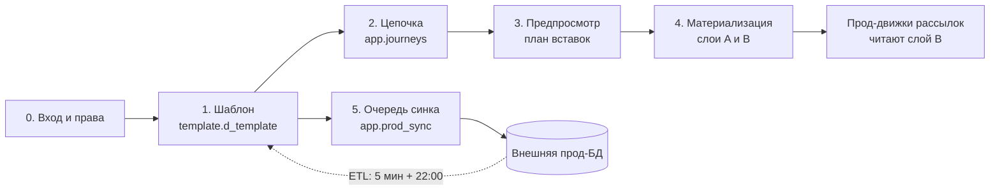

# Флоу системы

Сквозной путь одной коммуникации: **завёл шаблон → собрал цепочку → материализовал → уехало в прод**. Заметка связывающая: здесь только последовательность шагов и ссылки, детали каждого шага живут в своей заметке.

Если нужно начать с общей картины системы — [[Обзор архитектуры]]; со стека — [[Технологии]]; с индекса всех заметок — [[Home]].

## 0. Вход и права

Пользователь логинится своей корпоративной почтой (`POST /api/login`), панель ставит сессионную и remember-me куки. Дальше SPA спрашивает `GET /api/me` и `GET /api/env` и по ответу строит NAV и прячет кнопки.

Доступ — две вещи: **флаги роли** (админ / супер-админ) и **матрица прав роли по разделам** (`read / add / edit / delete`). С V29 секция заводится на каждый пункт меню, а не на группу, поэтому доступ выдаётся поштучно.

Подробно — [[Безопасность и RBAC]], интерфейс — [[Управление доступом и вход]], оболочка и NAV — [[Оболочка панели (shell)]], клиентская сторона проверок — [[Клиент API (api.js)]].

## 1. Завёл шаблон

Раздел «Мастер коммуникаций»: канал (`sms`/`push`/`email`/`cc` и новые `fa`/`vk`/`la`) → форма → «Сохранить». Имена (`communication_name`, `source`/`campaign_name`) собираются автоматически, код выдаёт система, «цепочка дней» создаётся одним батчем.

- серверная сторона — [[Шаблоны и мастер коммуникаций]];
- формы и формулы имён — [[Мастер коммуникаций (формы)]];
- где лежит строка: **единственное наше хранилище шаблонов — единый справочник `template.d_template`** (ядро колонками, канальные поля в `channel_props jsonb`), см. [[Справочники шаблонов]];
- эндпоинты — [[REST API]];
- каждая мутация уходит в журнал — [[Аудит и журналирование]].

Сразу после сохранения операция встаёт в очередь доставки в прод — это шаг 5.

## 2. Собрал цепочку

Раздел «Цепочки» (только для админов, на всех контурах) — конструктор блок-схем: стартовый узел (Income event для online, Time event для offline), Communication Alert со ссылкой на заведённый шаблон, вложенные Subflow.

- UX канвы — [[Flow Builder (цепочки)]];
- хранение схемы (jsonb-документ в `app.journeys`) и CRUD — [[Цепочки (Journeys)]].

Важно на этом шаге: **шаблон должен существовать** — иначе и клиент, и сервер блокируют сохранение и материализацию.

## 3. Предпросмотр

`POST /api/flow/preview` валидирует схему и возвращает **план вставок**: строки будущих процессных таблиц со значениями (FK показаны как `"(auto)"`). Значения в модалке редактируемы. Правила валидации и состав плана — [[Материализация (Flow)]].

## 4. Материализовал

`POST /api/flow/materialize` — одна транзакция:

1. сохраняется сама цепочка (нужен стабильный `journey_id`);
2. повторная валидация;
3. **слой A** — наша нормализованная модель события и его обвязка: [[Слой A (flow)]];
4. **слой B** — строки процессных таблиц, которые читают существующие движки рассылок: [[Слой B (процессные таблицы)]];
5. журнал соответствий `flow.t_materialization` даёт идемпотентность: повторный запуск сначала сносит прежние строки этой цепочки.

Механика целиком — [[Материализация (Flow)]]; как это ложится на схемы БД — [[Схема БД]].

## 5. Уехало в прод

Изменение шаблона не пишется в прод напрямую: оно встаёт в **outbox `app.prod_sync`**, откуда фоновый обработчик доставляет его во внешнюю прод-БД по отдельному соединению. Прод присваивает коды, панель подхватывает их обратно.

Порядок состояний записи очереди: `PENDING` → `SENDING` (запись занята, отправляем) → `OK`, при неудаче обратно в `PENDING`, после исчерпания попыток — `ERROR`. Промежуточное `SENDING` и раздельная фиксация доставки появились не для красоты: раньше отметка «доставлено» лежала в одной транзакции с переименованием локального кода, откат уносил обе — и шаблон уезжал в прод второй раз. Зависшие `SENDING` автоматически **не** переотправляются: снаружи не различить, доехала строка или нет, и решение остаётся за человеком.

В обратную сторону работает ETL: инкремент раз в 5 минут по `timestamp_upd` и полная сверка в 22:00. Отдельно от него живёт «Импортировать всё из прода» — сверка, которая перезаписывает **все** наши строки прод-версией и очередь при этом не смотрит.

Оба направления, расписания, ограничения и ручные инструменты — **[[Синхронизация с прод-БД]]** (единственная заметка про синк). Состояние очереди и типовые команды при разборе инцидента — [[Шпаргалка]].

## Смежные потоки

Эти подсистемы не входят в сквозной путь коммуникации, но живут в той же панели:

- **[[Планирование промо]]** и **[[АБ тесты]]** — общие таблицы команды (`app.promo_plan`, `app.ab_test`) с правкой по ячейке и проверкой версии строки; интерфейс у обеих один — [[Планирование промо и АБ тесты]];
- **[[Отчёты]]** — встраивание книг Tableau и «ЧЕК СМС траффик» (таблица на странице плюс выгрузка в Excel), интерфейс — [[Отчёты и ЧЕК СМС траффик]];
- **Scheme Builder → «Сущности»** — второй, независимый от шаблонов путь: в `/settings` рисуют модель (`app.schema_model`, реально созданные объекты помечаются в `app.schema_owned`), и из неё же строится CRM-раздел «Сущности» — подразделы, колонки списков и поля карточек. См. [[Страница настроек (settings)]] и [[Сущности]];
- **[[Панель отклонений]]** — аналитика выручки по дням, работает целиком в браузере и на сервер не ходит;
- **настроечная админка `/settings`** — реестр подключений к БД, «Диагностика» синка, три кнопки ETL, конфиг «приложение → разделы» ([[Конфигурация]], [[Таблицы приложения]]).

## Куда дальше

| Тема | Заметки |
|---|---|
| Архитектура | [[Обзор архитектуры]], [[Технологии]], [[Среды и деплой]] |
| Бэкенд | [[Обзор бэкенда]], [[Конфигурация]], [[Аудит и журналирование]] |
| Безопасность | [[Безопасность и RBAC]], [[Управление доступом и вход]] |
| Фронтенд | [[Обзор фронтенда]], [[Клиент API (api.js)]], [[Оболочка панели (shell)]], [[Мастер коммуникаций (формы)]], [[Flow Builder (цепочки)]] |
| База данных | [[Схема БД]], [[Таблицы приложения]], [[Справочники шаблонов]], [[Слой A (flow)]], [[Слой B (процессные таблицы)]] |
| API | [[REST API]] |
| Эксплуатация | [[Шпаргалка]], [[Среды и деплой]] |
